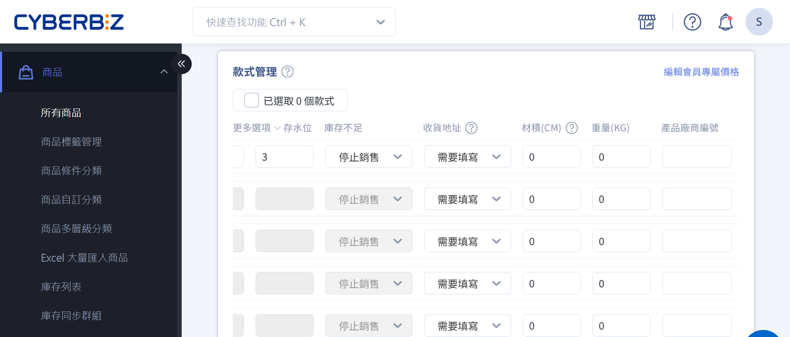
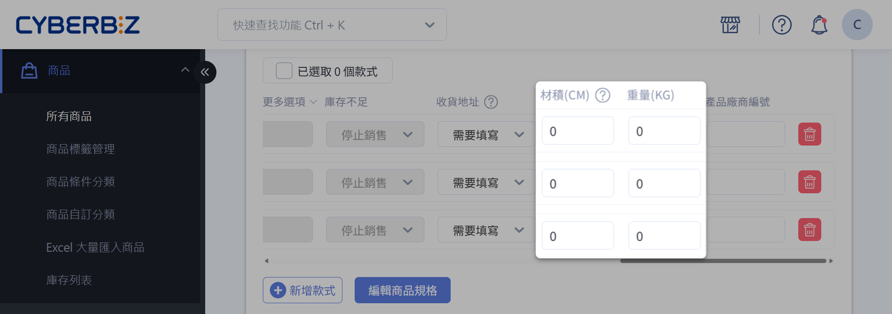

# 設定超商配送限制與物流排除

設定商品的材積與重量，讓系統自動判斷訂單是否符合超商物流（B2C／C2C）的配送限制。
{ .subtitle }

{ .hero-page }

---

## 超商物流限制規格

以下為超商物流的尺寸與重量限制參考表：

| 超商類型           | 尺寸限制                               | 重量限制             |
|------------------|----------------------------------------|----------------------|
| **B2C / C2C**    | 三邊總和 ≤ 105 cm，單邊最長 ≤ 45 cm (全家 B2C：三邊總和 ≤ 120 cm，最長邊 ≤ 50 cm)      | C2C：重量 ≤ 10 kg B2C：重量 ≤ 10 kg     |
| **全家冷凍 B2C / C2C** | 最長邊 ≤ 45 cm | S60[^1] 紙箱：重量 ≤ 5 kg S120[^2] 紙箱：重量 ≤ 10 kg |

> :lucide-triangle-alert: 超商物流的尺寸與重量限制可能隨業者政策調整，實際可配送規格請以各超商物流業者最新公告為準。

!!! tip "以規格條件排除配送選項"
	你可以透過調整商品的材積（長寬高總和）或重量，使其超過超商物流限制，系統便會自動將該商品排除於超商配送選項之外。瞭解 [如何設定指定商品無法使用超商物流](#設定指定商品無法使用超商物流)。

## 商品材積與重量設定

您可以為每個商品設定其材積與重量資訊，以利系統自動判斷是否符合超商配送條件。

1.  登入 CYBERBIZ 管理後台，前往 **商品 > 所有商品**。
2.  點擊欲設定的商品，進入商品編輯頁面。
3.  在 **款式管理** 中，找到商品的材積與重量欄位：
    -   於「材積」欄位輸入商品三邊（長、寬、高）總和（單位：公分）。
    -   於「重量」欄位輸入商品重量（單位：公斤）。
    
    > :lucide-info: 若材積或重量欄位未填寫，系統預設為 `0`，即視為符合所有配送條件。

4.  點擊 **儲存** 以套用變更。

!!! info "系統判斷邏輯"
    顧客進入訂單結帳頁時，系統將自動計算該訂單 *材積或重量總和* 是否符合超商物流配送條件。若超過超商限制，則訂單結帳頁不會顯示超商選項。
    
    | 條件 | 系統行為 | 結果 |
	|---|---|---|
	|商品材積 > 105 cm 或重量 > 10 kg|系統判定商品不符合超商配送條件|結帳頁面隱藏超商物流選項|
	|商品材積或重量未填寫|系統將其視為 0|商品仍可使用超商配送選項|

## 設定指定商品無法使用超商物流

若您希望特定商品無法使用超商物流，可透過以下方式手動設定：

1.  登入 CYBERBIZ 管理後台，前往 **商品 > 所有商品**。
2.  點擊欲設定的商品，進入商品編輯頁面。
3.  在 **款式管理** 區域中，設定以下任一條件：
    -   **材積欄位**：輸入 `106` 公分（超過超商材積上限 105 公分）。
    -   **重量欄位**：
        -   常溫商品輸入 `6` 公斤（超過超商重量上限 5 公斤）。
        -   冷藏冷凍商品輸入 `11` 公斤（超過全家冷凍 S120 重量上限 10 公斤）。
4.  點擊 **儲存**，完成設定。

!!! info "效果說明"
    當訂單包含指定商品，結帳頁會自動隱藏超商取貨選項，顧客無法透過超商物流下單。

## 情境範例

### 情境一：商品總材積超過限制

- 大倉鼠商品材積：30 cm/件
- 小豬豬商品材積：50 cm/件

??? quote "購買 1 個大倉鼠和 2 個小豬豬，這樣可以使用超取嗎？"
	商品總材積為 30 + (50 * 2) = 130 cm。由於總材積超過超商材積限制 105 cm，因此無法使用超商取貨付款/不付款。

### 情境二：商品總材積符合限制（含未填寫欄位）

- 紫水晶商品材積：55 cm/件
- 粉水晶商品材積：50 cm/件
- 綠水晶商品材積：留空（系統預設為 0 cm/件）

??? quote "購買 1 個紫水晶、1 個粉水晶以及 1 個綠水晶，是否可以使用超取呢？"
	商品總材積為 55 + 50 + 0 = 105 cm。由於總材積等於超商材積限制 105 cm，因此可以使用超商取貨付款/不付款。

## 常見問題

??? quote "如果商品材積或重量未填寫，系統會如何判斷？"
    若商品材積或重量欄位未填寫，系統將預設為 `0`，並視為符合所有配送條件。

??? quote "超商物流限制會隨時間變動嗎？"
    是的，超商物流規格可能隨時異動。請以各超商物流業者最新規定為主。

[^1]: 長 + 寬 + 高 = 60 cm

[^2]: 長 + 寬 + 高 = 120 cm