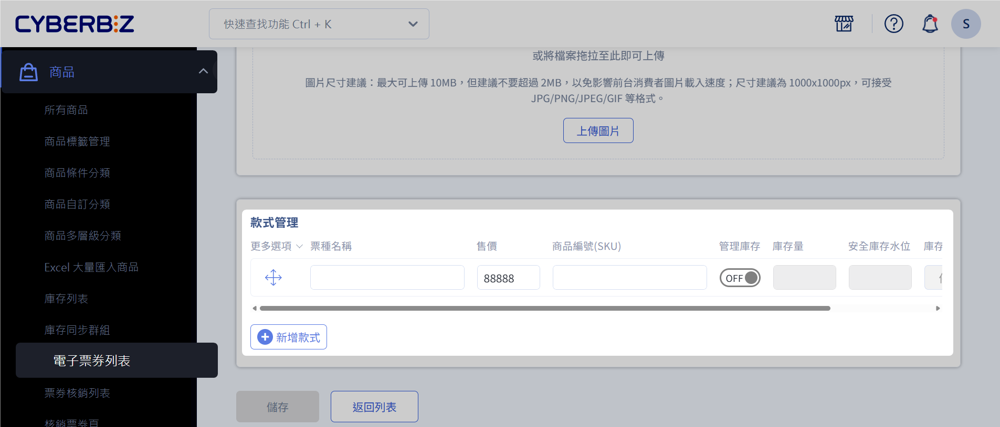
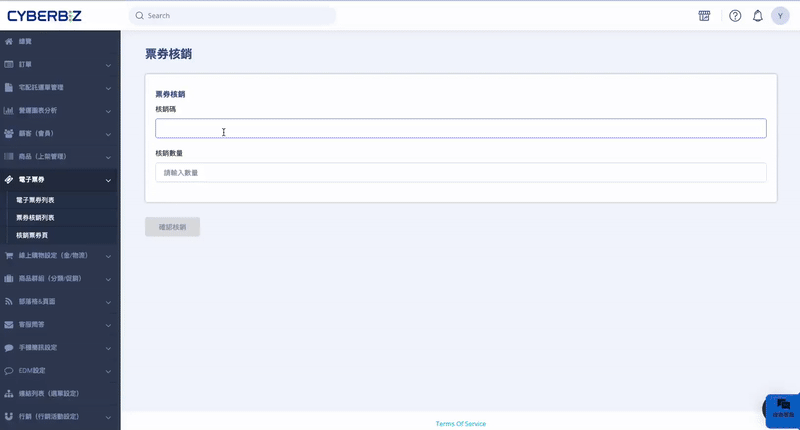
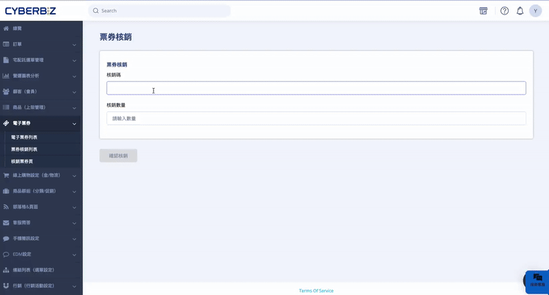
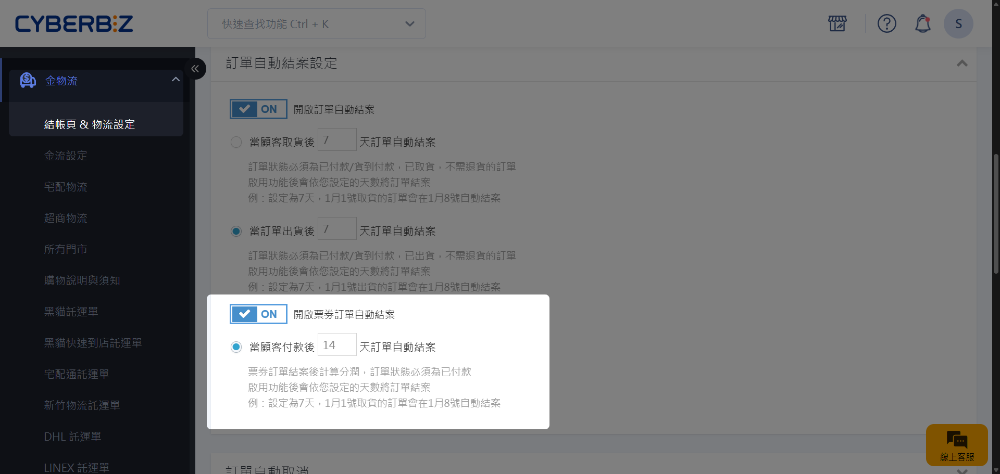

# 電子票券指南
建立、販售、核銷與管理電子票券商品，涵蓋從建檔、銷售、顧客使用到對帳與分潤設定的完整流程。
{ .subtitle }

[:lucide-lock:{ title="適用方案" }](../../resources/conventions#適用方案) | PLUS 企業  
[:lucide-toggle-right:{ title="適用功能" }](../../resources/conventions#適用功能) |  新版物流

!!! tip "應用場景"

	- 活動門票（展覽、演唱會、活動入場）
	- 商品兌換（實體商品 / 贈品）
	- 服務體驗（課程、體驗活動、預約兌換）
	- 聯名或推廣票券

## 使用須知

- 可加入 *限購群組*，限制每位消費者可購買張數  
- 僅支援 [*電子票券任選折扣*](電子票券優惠設定)  與 *分潤*，不可與其他優惠併用  
- 付款方式僅支援 *信用卡一次付清*

!!! quote "票券發行人"
	票券發行人為順立智慧股份有限公司，票券面額為實際售價（含優惠），已存入發行人於永豐銀行開立之「信託專戶」，專款專用，保障履約安全。

## 新增電子票券
建立電子票券商品。

1. 登入 CYBERBIZ 後台，前往 **商品 > 電子票券列表 > 新增票券**，進入 **新增票券** 頁面。
2. 依序填寫相關資訊：基本設定、票券圖片、款式管理。 

	

	!!! example "票種範例"
		- 活動票券：如「早鳥票」、「團體票」等，以區分不同票種。
		- 商品兌換券：如「灌籃高手兌換組」、「七龍珠兌換組」等，以分類不同的商品兌換模組。

3. 點擊 **儲存**，套用變更。

	!!! note "電子票券款式限制"
		按下 *儲存* 後，電子票券商品將無法像一般商品一樣編輯款式規格（如顏色、尺寸或自定義規格）。系統會自動預設一組名為 *票種名稱* 的款式規格。

4. 新增的電子票券會出現在 **電子票券列表** 頁面。

## 購買電子票券（顧客流程）

1. 顧客於前台選擇電子票券。
> 電子票券商品頁面會顯示票券注意事項，提醒顧客使用辦法。

	{ .screenshot }

2. 若購物車同時包含一般商品，系統將要求拆分結帳。

	{ .screenshot }

3. 勾選 **同意電子票券條款**。
> 消費者需勾選 *同意電子票券條款* 選項，才能進行結帳。（購物車內的 **配送時段** 可忽略）。

	{ .screenshot }

4. 完成結帳。

### 查看電子票券
消費者付款完成後，可在以下兩個地方查看電子票券 QR Code（核銷碼）。

- 我的帳戶：我的帳戶 > 電子票券訂單查詢
- Email：系統寄送 QR Code 至會員信箱

=== "電子票券訂單查詢"

	1. 網頁前台點選 **我的帳戶 > 電子票券訂單查詢**。    
	2. 點擊 **顯示票券 QR code**，即可獲得 QR Code。
	    
	

	
	- 
	- 
	
	

	
=== "電子票券確認信"

	!!! note "需設定會員電子郵件"
	    為確保電子票券能成功寄送至會員信箱，請先確認 *顧客註冊設定* 中的「電子郵件」已設為必填。若會員未提供 Email，系統將無法寄送 QR Code。
	
	1. 登入 CYBERBIZ 後台，前往 **管理中心 > 顧客註冊設定**。  
	2.  **電子郵件**：請勾選「必填」。若會員未填寫 Email，系統將無法寄送 QR Code。
	
	 { .screenshot }
	
	{ title="信箱畫面範例" }

## 核銷電子票券
提供多種核銷電子票券的方式，包括電腦輸入、手機掃碼、後台查詢。

> 電子票券分票的核銷請看如何[核銷分票後的核銷碼](#核銷分票後的核銷碼)。

=== "電腦輸入 QR Code"

	1.  登入 CYBERBIZ 管理後台，前往 **商品 > 核銷票券頁**。
	2. 將游標放在核銷碼欄位，使用掃碼槍掃描 QR Code，或手動輸入核銷碼。
	3. 輸入 **核銷數量**，點擊 **確認核銷**。
	4. 彈窗跳出，再次確認票券名稱、數量，確認無誤後點擊 **確認核銷**。
	5. 核銷成功。
	
	

=== "手機掃 QR Code"  

	1. 開啟手機相機，掃描 QR Code。
	2. 使用瀏覽器開啟網頁。
	3. 若尚未登入，將跳轉至登入頁面。
	4. 登入後，會跳轉至「核銷票券頁」，並自動帶入核銷碼。
	5. 輸入 **核銷數量**，點擊 **確認核銷**。
	6. 彈窗跳出，再次確認票券名稱、數量，確認無誤後點擊 **確認核銷**。
	7. 核銷成功。
	
	

=== "後台「票券核銷列表」"
	若消費者忘記攜帶 QR Code 或因突發狀況無法出示，可透過姓名或電話查詢核銷碼。
	
	1. 在 CYBERBIZ 管理後台，前往 **商品 > 票券核銷列表**。
	2. 在「選擇欲搜尋類別」中，可使用以下欄位篩選票券：
    > 票券名稱  
    > 核銷碼  
    > 訂單收件人姓名  
    > 訂單收件人電話  
    > 訂單編號  
	3. 篩選出票券後，點擊 **前往核銷**，進入 **核銷票券頁**，核銷碼將自動帶入。
	4. 輸入 **核銷數量**，點擊 **確認核銷**。
	5. 彈窗跳出，再次確認票券名稱、數量，確認無誤後點擊「確認核銷」。
	6. 核銷成功。
	
	{ .screenshot }
	
	

=== "後台「核銷票券頁」手動核銷"

	1. 登入 CYBERBIZ 管理後台，前往 **商品 > 核銷票券頁**。
	2. 手動輸入核銷碼，點選 **查看票券**，輸入 **核銷數量**，點擊 **確認核銷**。
	3. 核銷成功。
	
	{ .screenshot }

## 建立電子票券門市店員帳號
電子票券門市店員可以設定只有 *票券核銷列表* 與 *核銷票券頁* 這兩個頁面的權限。

{ .screenshot }

1. 登入 CYBERBIZ 管理後台，前往 **管理中心 > 網站權限 > 管理者列表**。
2. 點擊 **新增門市管理者**。

	{ .screenshot }
	
3. 在 **門市** 類型中選擇 **電子票券門市**。
4. 輸入門市店員的使用者資訊。
5. 點擊 **新增** 完成設定。

	{ .screenshot }
	
	!!! warning "權限限制說明"
	    - 電子票券門市店員的權限為系統預設，無法自行修改。
        > 嘗試變更權限並儲存時，系統將顯示提示：「門市用戶的權限無法修改」。
	    - *門市店員* 與 *電子票券門市店員* 為不同角色，請分別建立帳號（需使用不同帳號與密碼）。

> 更多電子票券門市權限相關設定，請看[設定電子票券門市權限](設定電子票券門市權限)

## 電子票券退款

!!! note "使用須知"
	- 電子票券退款需以一個電子票券代碼為單位進行，且一張訂單只能進行一次退票。
    > 假設一個電子票券代碼中，內含十個可核銷之電子票券數量，現已兌換三個，另有七個尚未兌換。則必須將尚未兌換的七個數量一次全部退票，不得分割為特定數量退票。
	- 票券若退款，票券手續費會[按比例](#對帳規則)退回。

1. 顧客通知退票。
> 若顧客欲退票，請引導其前往 **電子票券訂單查詢** 的 **詢問紀錄** 通知商家退票。

	{ .screenshot }

2. 商家確認退貨訊息。
> 商家可在訂單列表頁收到消費者的退貨訊息。

	{ .screenshot }

3. 確認退款情境。
> 退款前需確認訂單內的票券種類與核銷狀態，[單一種類票券](#訂單內僅含一種票券)與[多種票券種類](#訂單內含多種票券)有不同的退貨流程。

	

	
	- { title="一種票券種類" }
	- { title="多種票券種類" }
	
	

#### 訂單內僅含一種票券
=== "票券尚未核銷"
	若此票券尚未核銷，可直接走取消訂單流程。
	
	1. 在訂單列表中，找到並點擊欲取消的訂單，進入訂單明細頁面。
	2. 點擊 **取消訂單**，確認相關資訊無誤，點擊 **取消此訂單**。
	
		

		
		- { title="取消訂單" }
		- { title="取消此訂單" }
		
		

	
	3. 確認完成畫面
	
	{ .screenshot }

=== "票券已核銷"
	若此票券已核銷過，須走部分退款流程。（消費者當日付款，隔日才能操作部分退款）
	
	1. 在 CYBERBIZ 後台，前往 **訂單 > 所有訂單**，在訂單列表中勾選該訂單，點擊 **更多操作**，選擇 **退貨中**。
	
		{ .screenshot }
	
	2. 勾選該訂單，勾選該訂單，點擊 **更多操作**，選擇 **退貨審查**。
	
		{ .screenshot }
	
	3. 進入訂單頁，在部分退款選取票券商品，點擊 **確認退款**。
	
		{ .screenshot }
	
	4. 再次確認退款資訊，點擊 **確認退款**。
	
		{ .screenshot }
	    
#### 訂單內含多種票券
=== "票券皆尚未核銷"
	若訂單內的票券皆尚未核銷，且消費者想要全部退款，則可以走[取消訂單流程](#票券尚未核銷)。

=== "部分票券已核銷"
	若訂單內已有核銷過的票券，或者消費者想要退某幾種特定票券，則須走部分退款流程。
	
	1. 在 CYBERBIZ 後台，前往 **訂單 > 所有訂單**，在訂單列表中勾選該訂單，點擊 **退貨中**。
	
		{ .screenshot }
	
	2. 勾選此訂單，點擊 **退貨審查**。
	
		{ .screenshot }
	
	3. 進入訂單頁，在部分退款選取欲退票的票券商品，點擊 **確認退款**。
    > 若消費者只想退「Cyber 音樂祭 - 單日票」，則只需勾選該項目即可。
	
		{ .screenshot }
	
	4. 點擊 **確認**，完成退款。
    > 「Cyber 音樂祭 - 單日票」剩餘3張全數退款，QR Code 作廢。「皮卡丘體驗券 - 早鳥體驗」沒有退款，則可繼續照常使用。
	
	{ .screenshot }

## 電子票券分票（轉贈）
將同一張可多次核銷的票券拆分為多張獨立 QR Code，供他人使用。

!!! quote "什麼是分票？"
	當同一票種購買多份時，系統預設會產生單一 QR Code（核銷碼），可供多次核銷。若消費者有 *贈票* 的需求，可將此單一 QR Code 拆分為多個獨立票券。每張分出的票券皆會生成新的 QR Code，並可被單獨使用或轉贈他人。

!!! note "使用須知"

	-   分票操作不可回復（一個 QR Code 可以拆分為多個，但多個 QR Code 無法合併成一個）。
	-   分票後，原核銷碼即無法再使用。
	-   電子票券為不記名制，只要持有核銷碼，任何人皆可使用，請自行妥善保管。
	-   若需[退款](電子票券退款)，僅能由原購票人申請。請顧客勿隨意分票給他人，避免造成後續紛爭。

1. 登入前台會員，點選 **我的帳戶 > 電子票券訂單查詢**，按下 **分票** 按鈕。

	{ .screenshot }

2. 確認提示資訊，點擊 **確認分票**。

	{ .screenshot }

3. 分票後，QR Code 會被拆分成多個（可左右滑動查看其他 QR Code）。
> 分票前的核銷碼為 10 碼，分票後的核銷碼為 25 碼。

	{ .screenshot }
        
### 查看分票後的票券

1. 登入 CYBERBIZ 管理後台，前往 **商品 > 票券核銷列表**。
> 已分票的票券，核銷碼欄位會顯示 **查看** 按鈕。
2. 點擊 **查看** 後，會跳出彈窗顯示該票券所有核銷碼與其核銷狀態。

{ .screenshot }

### 核銷分票後的核銷碼
分票後，票券核銷列表頁將不會有該票券的 **前往核銷** 按鈕，請至 **核銷票券頁** 輸入核銷碼，進行核銷。

1. 登入 CYBERBIZ 管理後台，前往 **商品 > 核銷票券頁**。
2. 輸入核銷碼進行核銷。（票後的核銷碼為 25 碼，核銷數量將預設為 1 且不可編輯）。
3. 點擊「查看票券」後，點擊 **確認核銷**。

{ .screenshot }

## 電子票券對帳
電子票券的代收款項撥款時機、手續費退回規則，以及對帳單的查看位置。

### 對帳規則

- 代收款項撥款時機，電子票券的代收款項會在 **核銷時** 撥款。
> 某訂單在 10/5 成立且收到款項，訂單內含一種票券，數量 5 張，每張 200 元，訂單總金額為 1000 元。消費者在 10/22 核銷兩張票券，面額 400 元。則 10 月下半帳期會撥款兩張已核銷的票券，共 400 元。

- 票券若退款，票券手續費會 **按比例** 退回。
> 某訂單內含一種票券，數量 5 張，已核銷 2 張，剩下 3 張要退款，則會退回剩下 3 張的手續費。

### 對帳單位置

電子票券對帳單提供位置可參考附圖。

{ .screenshot }

## 票券分潤與自動結案設定
設定電子票券訂單自動結案並計算分潤。

!!! note "使用須知"

	-   即使票券尚未核銷，訂單仍會自動結案並計算分潤。
	-   訂單已結案後再進行退貨/取消訂單處理，不影響已成立的分潤。
	-   票券可搭配推薦人分潤，訂單結案時即計算分潤。

1. 登入 CYBERBIZ 後台，前往 **金物流 > 結帳頁&金物流設定 > 訂單相關設定 > 訂單自動結案設定**。
2. 啟用 **開啟票券訂單自動結案** :material-toggle-switch: 功能，開啟（ON）或關閉（OFF）。
3. 設定票券訂單 **當顧客付款後 N 天訂單自動結案**，讓票券訂單可以自動計算分潤。

## 延伸閱讀

- [電子票券優惠設定](電子票券優惠設定)
- [設定電子票券門市權限](設定電子票券門市權限)
- [為什麼電子票券是門好生意](https://www.cyberbiz.io/blog/%e9%9b%bb%e5%ad%90%e7%a5%a8%e5%88%b8/)