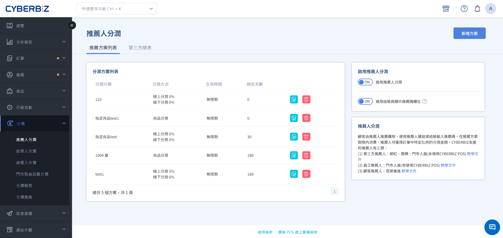

# 設定推薦人分潤方案
透過建立推薦人分潤方案，您可以針對不同合作對象（如網紅、會員或員工）設定專屬的業績抽成比例與消費者回饋。
{ .subtitle }

[:lucide-layers:{ title="適用產品" }](../../resources/conventions#適用產品) | EC / POS
[:lucide-tag:{ title="適用方案" }](../../resources/conventions#適用方案) | 進階 / 高手 / 所有PLUS / 企業
{ .doc-badge }

{ .hero-page }

!!! tip "應用情境"
	- **異業合作**：與部落客或 KOL 合作，提供專屬分潤連結並追蹤訂單成效。
	- **舊客帶新客**：鼓勵現有會員分享推薦碼給好友，達成「舊客帶新客」的紅利回饋。
	- **內部推廣**：為門市店員設定專屬推薦碼，將線上引流的業績精準歸屬於推廣人員。

## 使用須知

- **儲存限制**：分潤方案建立並儲存後，**「分潤比例」與「分潤方式」將無法修改**，若需調整比例，請建立新方案。
- **綁定天數**：推薦人分潤支援「綁定天數」設定。在設定天數內，若消費者使用同一裝置與瀏覽器再次購買，系統會自動帶入同一推薦碼。

## 操作流程

### 步驟 1：建立分潤方案與基本設定

1. 登入 CYBERBIZ 管理後台，前往 **分潤 > 推薦人分潤**。
2. 確保 **啟用分潤功能** 已切換為 `ON`。
3. 開啟 **啟用結帳頁顯示推薦碼欄位** 。
4. 點選右上角 **新增方案**。
5. 在 **基本設定** 區塊填寫以下資訊：
    - **分潤方案名稱**：設定管理用的名稱（如：2026網紅春季合作）。
    - **生效時間**：設定方案的起訖日期（留空表示立即生效且無期限）。
    - **啟用綁定天數**：設定推薦關係在消費者瀏覽器中的保留天數。
      > ON – 綁定顧客，表示該顧客再次下單也會分潤給此推薦碼的擁有者。 
        OFF -此推薦碼為一次性綁定，下單後即清除綁定。需要再次輸入推薦碼或點擊推薦碼網址，才會重新產生分潤。
    - **顧客推薦人可以使用自己的推薦碼**：依需求開啟或關閉。

!!! tip "分潤方案命名與管理"
    此處請設定 **方案名稱**，而非特定 **推薦人姓名**。您可以將相同分潤比例的規則整合為同一個方案，再將方案分派給對應的員工、第三方合作夥伴或顧客。

### 步驟 2：選擇分潤方式

=== "整筆訂單分潤"

    依訂單總額（扣除運費後）計算比例。

    1. **線上/線下分潤比例**：輸入推薦人可獲得的抽成百分比。

        !!! info "POS系統相容性整合"
            **線下分潤** 功能需搭配 CYBERBIZ POS 系統方可使用。
            
    { .screenshot }

=== "指定商品分潤"

    僅針對特定商品設定獨立的分潤比例。

    1. **商品分潤設定**：
          - **全部套用**：所有商品皆設定相同分潤百分比。
          - **逐筆輸入**：每個商品設定獨立分潤百分比。
    2. **選擇商品**：點選 **新增商品**。
          - 方案若選擇 **逐筆輸入** 的商家，請繼續填寫每個商品的分潤百分比。

    !!! info "功能適用須知"
        **指定商品分潤僅適用 EC 訂單，且僅限PLUS、企業版適用。**

    { .screenshot }

### 步驟 3：設定消費者與推薦人回饋

儲存基本設定後，跳轉至 **回饋設定** 頁籤，您可以決定雙向的回饋機制：

1. **結帳享優惠 (會員)**：使用推薦碼的消費者可享有的當次折扣。
2. **送優惠券 (會員)**：消費者達成門檻後，系統自動發送優惠券供下次使用。
3. **送紅利 (會員)**：消費者達成門檻後獲得紅利點數。
4. **送紅利 (顧客推薦人)**：消費者達成門檻後，推薦人可獲得紅利點數。

!!! info "發送紅利給推薦人規則"
    - **計算方式**：贈送之紅利點數依方案設定之分潤比例計算。例如分潤 5%、訂單金額 :lucide-dollar-sign:800 元，則贈送 40 點（:lucide-dollar-sign:800 × 5%）。
    - **小數處理**：計算結果若有小數點，將一律無條件捨去。
    - **查詢路徑**：推薦人可於前台會員中心查詢，點數名稱將標示為 `【訂單編號】分潤紅利`。
    - **退貨處理**：紅利僅於首次結案時發放；若發生退貨（含部分退貨），系統將全數收回該筆紅利。後續若訂單再次結案或退貨，皆不再進行補發或收回。

### 步驟 4：綁定推薦對象並取得代碼

根據您的合作對象，切換至對應的頁籤進行綁定。一個方案可以同時包含多種對象。

=== "第三方列表 (網紅/團媽)"

    適用於外部合作夥伴。

    === "單筆新增"
    
        1. 切換至 **第三方列表** 頁籤，點選 **新增推薦人**。
        2. 輸入 **推薦人名稱**，並可自訂專屬 **推薦碼**（若留空則系統隨機生成）。
        3. 點選 **儲存**。
        4. 點選列表旁的 **複製分享連結** 圖示，即可取得帶有推薦碼的短網址或 QR Code。

    === "批次匯入"

        1. 前往 **分潤 > 推薦人分潤**，點擊 **第三方總表** 頁籤。
        2. 點擊 **下載範例/匯入第三方推薦碼**，取得Excel範本。
        3. 資訊填寫完畢後，上傳檔案。

=== "顧客列表 (一般會員)"

    適用於激勵既有會員進行口碑分享。
  
    1. 切換至 **顧客列表** 頁籤，將 **啟用顧客推薦碼功能** 切換為 `ON`。
    2. 點選 **分派顧客推薦碼**，搜尋並勾選欲加入的會員。
    3. 點選 **加入方案**。
    4. 會員可在前台 **會員中心 > 我的帳戶** 頁面查看到自己的專屬推薦碼。
    5. 可指定為所有新會員套用指定方案。

=== "員工列表 (門市人員)"
    適用於已在系統中建立帳號的員工或 POS 店員。
    
    1. 切換至 **員工列表** 頁籤。
    2. 點選 **加入方案使用者**，依姓名、身分或店家篩選人員。
    3. 勾選後點選 **加入方案**。

!!! info "推薦碼與名稱設定規則"
    - **推薦碼格式**：支援至多 20 碼英數字（含 `-` 與 `_`），英文字母僅限 **大寫**。若未填寫，系統將自動隨機生成。
    - **方案綁定邏輯**：單一第三方推薦人可加入多個方案並擁有不同推薦碼；但在同一個方案中，該推薦人僅能擁有一組推薦碼。
    - **名稱管理注意事項**：
        - 系統允許設定重複的推薦人名稱（如多個「網紅 A」），建議商家透過明確標示（如「網紅 A-FB」、「網紅 A-IG」）以利辨識。
        - 推薦人名稱一經儲存即 **無法刪除**，請在設定時務必確認正確性。

## 常見問題

??? quote "為什麼消費者點擊了推薦連結，結帳頁卻沒出現推薦碼？"
    請檢查以下兩點：

    1. 是否已在方案設定中開啟 **啟用結帳頁顯示推薦碼欄位**。
    2. 若消費者之前曾點擊過其他人的連結，且在 **綁定天數** 內，則會保留第一位的推薦資訊。

??? quote "推薦人可以使用自己的推薦碼獲得分潤嗎？"
    這取決於您的設定。在方案的 **基本設定** 中，您可以透過 **顧客推薦人可以使用自己的推薦碼** 開關來控制此權限。

??? quote "**指定商品分潤** 支援線下 POS 訂單嗎？"
    目前 **指定商品分潤僅適用於線上官網 (EC) 訂單**。線下 POS 訂單僅能使用 **整筆訂單分潤** 模式。

