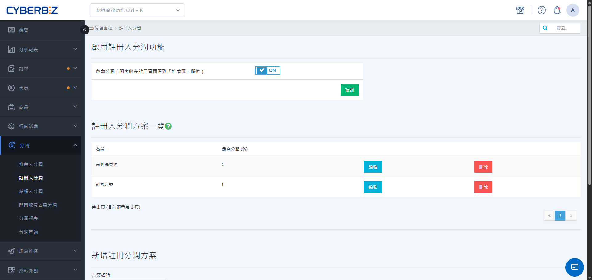

# 設定註冊人分潤方案
註冊人分潤採「永久綁定」機制。當顧客在註冊時填入特定的註冊人代碼，該顧客未來不論在官網或門市消費，系統皆會自動計算分潤給該代碼擁有者。
{ .subtitle }

[:lucide-layers:{ title="適用產品" }](../../resources/conventions#適用產品) | EC / POS
[:lucide-lock:{ title="適用方案" }](../../resources/conventions#適用方案) | 高手 / 所有PLUS / 企業
{ .doc-badge }

{ .hero-page }

!!! tip "應用情境"
	- **門市地推開發**：門市店員引導進店顧客註冊官網會員，並綁定店員代碼，確保該顧客日後回購的業績皆能歸屬於該店員。
	- **長期經銷合作**：與經銷夥伴合作，由夥伴開發的新會員將產生長期綁定關係，持續獲取開發獎勵。
	- **階段性激勵**：設定註冊後首月高抽成，後續月份遞減的比例，激勵推廣者在顧客註冊初期積極促成消費。

## 使用須知

- **永久綁定性**：註冊人代碼一經綁定即 **無法更改**，顧客未來所有的線上與線下訂單皆會與該註冊人關聯。
- **POS 限制**：若使用門市 POS 的 **快速註冊** 功能，目前暫不支援填寫註冊人代碼。
- **身分限制**：若要將人員設為註冊人，該人員必須具備 **網站管理者** 或 **門市店員** 身分。

## 操作流程

### 步驟 1：啟用功能與建立方案

1. 登入 CYBERBIZ 管理後台，前往 **分潤 > 註冊人分潤**。
2. 將 **啟用註冊人分潤功能** 切換為 `ON`。
3. 在下方輸入分潤方案名稱，並點選 **新增方案**。
4. 在 **註冊人分潤方案一覽** 列表中，點選欲編輯方案旁的 **編輯**。

{ .screenshot }

### 步驟 2：設定階層分潤比例

您可以分別針對 **線上官網** 與 **線下門市** 設定不同階段的分潤比例。

1. 在方案編輯頁面，點選 **新增項目**。
2. 填寫以下資訊：
    - **有效日數**：設定註冊後第幾天內適用此比例。
    - **分潤比例**：輸入對應的抽成百分比。
3. 若需設定多層級，可再次點選 **新增項目**。

    !!! example "範例設定"
        - 第一筆：有效日數 `30` 天，分潤比例 `5` %。
        - 第二筆：有效日數 `60` 天，分潤比例 `2` %。
        **效果**：顧客註冊後的第 0~30 天消費，註冊人抽 5%；第 31~60 天消費，註冊人抽 2%。
        
4. 設定完成後，點選頁面底部的 **儲存**。

!!! info "POS系統相容性整合"
    **線下分潤** 功能需搭配 CYBERBIZ POS 系統方可使用。

{ .screenshot }

### 步驟 3：分派註冊人與代碼

將分潤方案指派給特定的員工或門市，以生成專屬的註冊人代碼。

1. 前往 **分潤 > 註冊人分潤**，點選頁面下方的 **分派註冊分潤方案** 區塊。
2. 選擇欲分派的 **方案**。
3. 依據需求篩選 **身分**（如：店長、店員）或 **所屬店家**。
4. 勾選欲加入的人員，點選 **加入方案**。
    > 若未配合 POS 功能，需將人員設為 **網站管理者** 方可被選擇。

{ .screenshot }

## 常見問題

??? quote "顧客註冊後才補填代碼，還可以補做綁定嗎？"
    不可以。註冊人綁定必須在 **註冊當下** 填寫代碼才能生效。一旦帳號建立完成，系統不支援補填或更改註冊人資訊。

??? quote "線下門市消費如何計算註冊人分潤？"
    必須滿足兩個條件：

    1. 顧客已綁定註冊人。
    2. 商家有使用 CYBERBIZ POS 功能，且在方案中已設定 **線下方案** 的比例。

    當顧客在門市結帳時報電話號碼（辨識會員），系統會自動比對其綁定的註冊人並計算分潤。

??? quote "如果一個員工同時在多個註冊人方案中，推薦碼會是一樣的嗎？"
    員工在不同方案中可能會有不同的推薦代碼，但通常建議一個人員對應一個明確的方案，以避免業績統計混亂。

---

