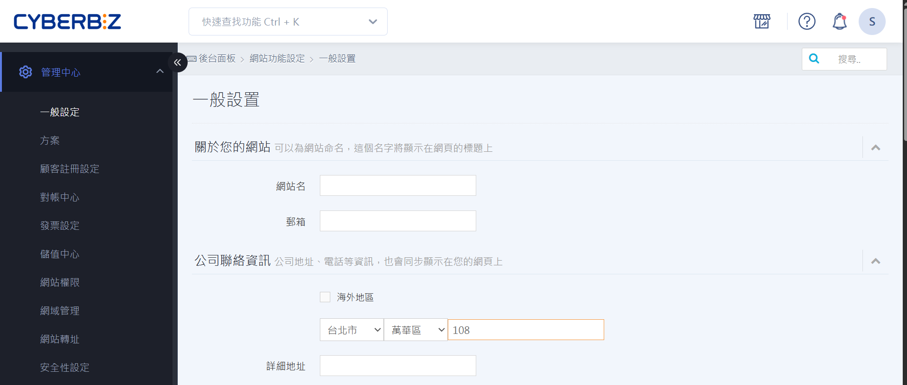

# 商店設定

 
 
<big>__全面掌握商店設定與運營管理__</big>  
設定商店基本資訊、付款金流、物流與會員互動，打造完整開店流程。  
 
[快速上手 :lucide-circle-arrow-right:](quickstart.md)

---

=== "基本資訊"

	

	
	-   :lucide-store: __商店資訊__
	    
	    ---
	    

	    
	    [設定商店名稱與品牌標誌](設定商店名稱與標誌.md)  
	    [管理商店聯絡資訊](管理商店聯絡資訊.md)  
	    [設定商店公告與營業時間](設定商店公告與營業時間.md)  
	    
	    

	
	-   :lucide-globe: __語言與幣別__
	    
	    ---
	    

	    
	    [設定商店語言](設定商店語言.md)  
	    [設定顯示幣別與匯率](設定幣別匯率.md)  
	    
	    

	
	-   :lucide-user-check: __會員設定__
	    
	    ---
	    

	    
	    [啟用會員系統](啟用會員系統.md)  
	    [設定會員等級與權益](設定會員等級.md)  
	    [會員註冊與登入設定](會員註冊登入.md)  
	    
	    

	-   :lucide-palette: __網站外觀__

	    ---

		Change the colors, fonts, language, icons, logo and more with a few lines
	
	    [:octicons-arrow-right-24: Customization](#)

	

=== "付款金流"

	

	
	-   :lucide-credit-card: __支付方式__
	    
	    ---
	    

	    
	    [設定信用卡與線上支付](設定信用卡與線上支付.md)  
	    [啟用貨到付款](設定貨到付款.md)  
	    [第三方支付串接](設定第三方支付.md)  
	    
	    

	
	-   :lucide-file-text: __收款管理__
	    
	    ---
	    

	    
	    [查看交易紀錄](查看交易紀錄.md)  
	    [設定退款規則](設定退款規則.md)  
	    [批次處理收款與退款](批次收款退款.md)  
	    
	    

	
	

=== "物流與配送"

	

	
	-   :lucide-truck: __配送設定__
	    
	    ---
	    

	    
	    [綁定宅配與超商物流](綁定宅配物流.md)  
	    [設定配送範圍與運費](設定配送範圍運費.md)  
	    [管理特殊物流規則](管理特殊物流.md)  
	    
	    

	
	-   :lucide-package-check: __出貨管理__
	    
	    ---
	    

	    
	    [批次出貨與打印運單](批次出貨.md)  
	    [庫存扣減與補貨提醒](庫存扣減補貨.md)  
	    
	    

	
	

=== "行銷與優惠"

	

	
	-   :lucide-tag: __優惠設定__
	    
	    ---
	    

	    
	    [設定折扣與促銷活動](設定折扣促銷.md)  
	    [會員專屬優惠](會員專屬優惠.md)  
	    [單品與分類折扣規則](折扣規則.md)  
	    
	    

	
	-   :lucide-bell: __通知設定__
	    
	    ---
	    

	    
	    [訂單通知設定](訂單通知.md)  
	    [會員通知與活動提醒](會員通知.md)  
	    
	    

	
	

=== "前台呈現"

	

	
	-   :lucide-layout: __網站外觀__
	    
	    ---
	    

	    
	    [設定首頁與導覽列](設定首頁與導覽列.md)  
	    [自訂頁面樣式與模板](自訂頁面樣式.md)  
	    
	    

	
	-   :lucide-search: __搜尋與分類__
	    
	    ---
	    

	    
	    [前台商品分類與搜尋設定](前台商品分類搜尋.md)  
	    [商品排除搜尋與排序規則](商品排除搜尋排序.md)  
	    
	    

	
	-   :lucide-thumbs-up: __顧客互動__
	    
	    ---
	    

	    
	    [啟用商品評論](啟用商品評論.md)  
	    [留言區與 reCAPTCHA 設定](留言區-recaptcha.md)  
	    
	    

	
	

=== "系統與權限"

	

	
	-   :lucide-key: __權限管理__
	    
	    ---
	    

	    
	    [設定管理員與員工權限](管理員員工權限.md)  
	    [控制後台操作權限](後台操作權限.md)  
	    
	    

	
	-   :lucide-shield-check: __安全設定__
	    
	    ---
	    

	    
	    [啟用雙重驗證](啟用雙重驗證.md)  
	    [系統登入安全規則](登入安全規則.md)  
	    
	    

	
	

