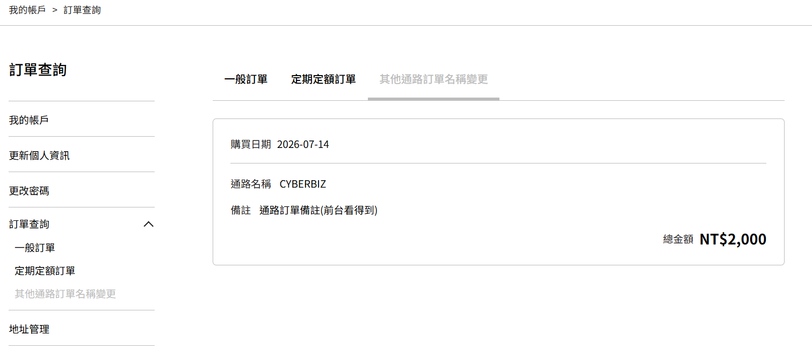
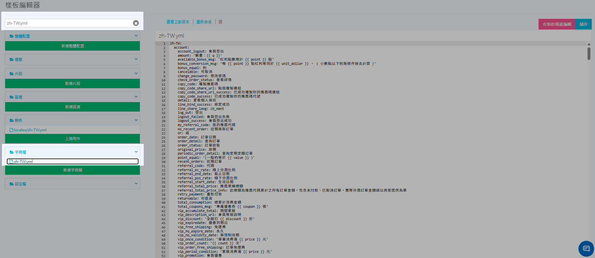
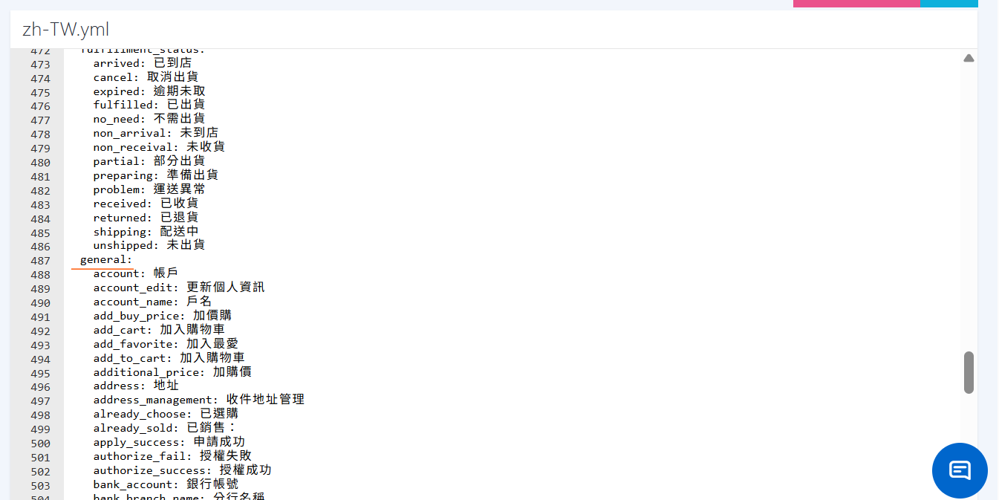
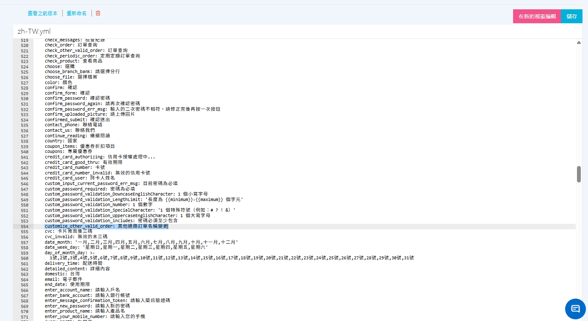

# 變更「其他通路有效訂單」前台顯示名稱

透過字典檔新增鍵值，自訂前台「其他通路有效訂單」的顯示名稱，讓用語更符合品牌或通路情境。
{ .subtitle }

[:lucide-tag:{ title="適用方案" }](../../../resources/conventions.md#適用方案) | 企業
{ .doc-badge }

{ .hero-page }

!!! tip "應用情境"
    - **統一對外用語**：將預設「其他通路有效訂單」改為「門市消費紀錄」、「線下消費」等商家慣用名稱。
    - **降低會員疑問**：前台文案與客服話術一致，減少會員對訂單來源的誤解。


## 使用須知

- **修改範圍**：僅變更會員於前台看到的名稱；後台會員頁的操作方式與金額累計規則維持不變。若需補登或管理其他通路訂單，請見[管理會員檔案：其他通路訂單](../../members/manage-member-profiles.md#2-其他通路訂單)。
- **編輯風險**：修改 `.yml` 屬進階操作，建議先備份或確認可[恢復樣板版本](restore-code-theme-editor.md)後再儲存。


## 操作流程

1. 登入 CYBERBIZ 管理後台，前往 **網站外觀 > 套版主題管理**。
2. 於目前版型點選 **選擇操作 > CSS/HTML 編輯器**。

    { .screenshot }

3. 在樣板編輯器搜尋欄輸入 **zh-TW.yml**，開啟該字典檔。

    { .screenshot }

4. 找到 **`general`** 區塊。

    { .screenshot }

5. 於該區塊新增下列鍵值，並將右側文字改為欲顯示的名稱：

    ```yaml
    customize_other_valid_order: 欲顯示的名稱
    ```

    !!! warning "填寫格式"
        結構為：`customize_other_valid_order`（不可改）`:`（半形冒號）` `（半形空格）`欲顯示的名稱`（可自訂）。

        - 正確：`customize_other_valid_order: 門市消費紀錄`
        - 錯誤：`customize_other_valid_order:門市消費紀錄`（缺空格）

    { .screenshot }

6. 點擊 **儲存**。前台會員查看其他通路訂單時，即可看到自訂名稱。

    { .screenshot }

!!! info "多語系商店"
    若商店另有其他語系字典檔（如 `en.yml`），請在對應語系檔的 `general` 區塊同樣新增 `customize_other_valid_order`，並填入該語系的顯示文字。


## 常見問題

??? quote "新增鍵值並儲存後，前台名稱沒有改變？"
    請確認：

    1. 商店版本適用 **其他通路有效訂單** 功能。
    2. 鍵名拼寫為 `customize_other_valid_order`（不可改動英文 key）。
    3. 鍵值位於 `general` 區塊，且 YAML 縮排、冒號後空格正確。
    4. 已儲存字典檔；必要時重新整理前台或清除快取後再查看。

??? quote "可以刪除鍵值恢復預設名稱嗎？"
    可以。自字典檔移除 `customize_other_valid_order` 該行並儲存後，前台會恢復系統預設名稱「其他通路有效訂單」。若儲存後版型異常，請使用[恢復樣板版本](restore-code-theme-editor.md)。


## 延伸閱讀

<div class="grid cards" markdown>

- :lucide-languages:{ .lg }   
  [__設定前台語系與文字自定義__](../site-settings/setup-storefront-language-text-customization.md)       
  透過字典檔與樣板編輯器，調整前台語系與系統預設文字。

- :lucide-code:{ .lg }     
  [__樣板編輯器操作全攻略__](theme-editor-complete-guide.md)  
  了解樣板編輯器基礎操作、特殊語法應用與注意事項。

</div>