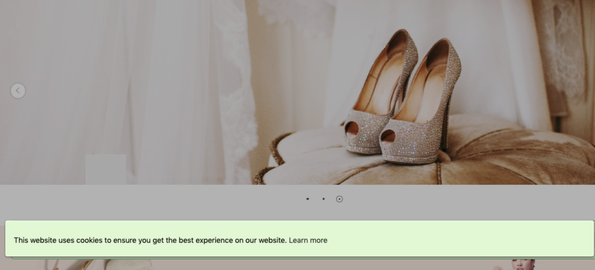

{ .hero-page }

## Cookie 提示彈窗說明 { #intro-cookie-consent }

為因應 **GDPR 隱私權規範** 與 **歐盟 Cookie 法** ，網站除了需提供隱私權政策頁面，也應在消費者進站時主動告知網站如何使用 Cookie，並取得同意。

CYBERBIZ 官網本身沒有內建的 Cookie 提示彈窗，作法是先透過第三方工具產生彈窗的程式碼，再貼入版型的「樣板編輯器(CSS/HTML編輯)」，即可讓彈窗顯示在前台。

!!! info "提示"
    本文僅說明基礎的貼入方式。彈窗的顯示位置、文字與樣式由第三方工具或您貼入的程式碼決定；若需要更進階的客製，建議洽詢具程式背景的人員。

---

## 使用前提與限制 { #prerequisites-cookie-consent }

開始前，請先確認下列兩項：

- [x] **支援程式碼編輯的版型**：本設定需編輯版型的 `theme.liquid` 檔案，請確認目前使用的是可編輯程式碼的版型；於「套版主題管理」中該主題的「選擇操作」選單裡，能看到 **「CSS/HTML編輯器」** 選項即代表支援。
- [x] **後台操作權限**：操作帳號需具備「外觀」相關的後台編輯權限，才能進入樣板編輯器。權限可由商店管理者於後台的權限設定中指派。

---

## 操作步驟 { #operate-cookie-consent }

整個流程分為兩個階段：先到第三方工具產生彈窗程式碼，再回到 CYBERBIZ 後台，把程式碼貼進版型檔案。

### 產生 Cookie 提示彈窗程式碼 { #operate-cookie-consent-generate }

1. **前往產生工具：** 使用第三方 Cookie 同意條產生工具，例如 [WebsitePolicies 的 Cookie consent banner 產生器](https://www.websitepolicies.com/create/cookie-consent-banner)。
2. **設定彈窗樣式：** 依需求設定彈窗的顯示位置、版面樣式、文字內容與顏色。
3. **複製程式碼：** 設定完成後展開程式碼欄位，複製整段程式碼備用。

!!! info "第三方工具官方教學"
    WebsitePolicies 提供了完整的 [Cookie consent banner 新增教學 :lucide-external-link:](https://www.websitepolicies.com/support/how-to-add-cookie-consent-banner-to-website)，可參考其官方文件瞭解各項設定細節。

---

### 將程式碼貼入版型 { #operate-cookie-consent-paste }

!!! warning "自行修改程式碼的責任歸屬"
    CYBERBIZ 公開版型程式碼供您自由調整，但不提供免費修改程式碼與相關教學的服務。經您自行修改的程式碼若造成前台問題，CYBERBIZ **不負維修責任**；如需協助客製，請洽線上客服諮詢。

1. **進入套版主題管理：** 前往後台左側選單「網站外觀」>「套版主題管理」。
2. **開啟 CSS/HTML 編輯器：** 在 **「發布主題」** 分頁中，於目前主題卡片點選 **「選擇操作」** 下拉選單，選擇 **「CSS/HTML編輯器」** 。
3. **同意使用條款：** 首次進入會跳出 **「關於樣板編輯器的使用」** 說明視窗，勾選 **「我已閱讀並同意上述事項」** 後點 **「我同意」** 即可進入編輯器[^disclaimer]。
4. **開啟主樣板檔：** 在左側 **「整體配置」** 清單中，點選 `theme.liquid` 檔案，右側會載入該檔的程式碼[^findfile]。
5. **貼上程式碼：** 找到 `</head>` 這一行，將第一步複製的程式碼貼在它的 **正上方** 。
6. **儲存並確認：** 點右上角 **「儲存」** 完成。回到官網前台重新整理，即會看到 Cookie 提示彈窗。

``` html title="theme.liquid" hl_lines="12"
  <!-- for footer --> 
  {{ 'css/footer.css' | cyberbiz_theme_asset_url | stylesheet_tag }}
  <!-- theme assets -->
  {{ 'css/main.css' | cyberbiz_theme_asset_url | stylesheet_tag }}
  <!-- for vendor -->
  {{ 'js/vendor.js' | cyberbiz_theme_asset_url | script_tag }}

  {{ content_for_header }}

  

  <script src="https://cdnapp.websitepolicies.net/widgets/cookies/rnxkuwlv.js" defer></script> <!-- (1)! -->
</head>
```

1.  貼入複製的 Cookie consent banner 程式碼。

!!! tip "使用「快速到貨」的商店"
    若您的商店有啟用「快速到貨」功能，該頁面使用獨立的版型檔。請在「整體配置」清單中另外開啟 `express_delivery.liquid`，以相同方式將程式碼貼在 `</head>` 正上方並儲存，Cookie 彈窗才會一併套用到快速到貨頁面。

[^disclaimer]: 說明視窗提醒：CYBERBIZ 公開版型程式碼供您自由調整，但不提供免費修改程式碼的服務；自行修改若造成問題，可用編輯器的版本控制功能還原。
[^findfile]: 檔案較多時，可用左上角的「找檔案？」欄位輸入關鍵字快速篩選。

---

## 重要規範與限制 { #specs-cookie-consent }

- **自行修改程式碼的責任歸屬**：CYBERBIZ 公開版型程式碼供您自由調整，但不提供免費修改程式碼與相關教學的服務。經您自行修改的程式碼若造成前台問題，CYBERBIZ 不負維修責任；如需協助客製，請洽線上客服諮詢。
- **切換版型或版本不會自動同步**：您自行貼入的 Cookie 彈窗程式碼只存在於「目前這個版型」。日後若切換到其他版型，或更新版型版本，先前的修改不會自動帶過去，需要在新版型重新貼上一次。
- **善用版本控制還原**：樣板編輯器內建版本控制功能。若修改後發現前台異常，可在編輯檔案時點選 **「查看之前版本」** ，選擇先前的版本還原，降低改壞版型的風險。

---

## 後續操作 { #next-steps-cookie-consent }

<div class="grid cards" markdown>

- :lucide-palette:{ .lg }  
  [__套用與更換網站主題__](../theme-and-layout/apply-and-switch-theme.md)  
  下載、切換與發布主題，管理官網整體外觀。

- :lucide-file-text:{ .lg }  
  [__商業揭露資訊設定__](../site-settings/business-disclosure.md)  
  設定隱私權政策等頁尾資訊，與 Cookie 提示相互搭配。

</div>

## 常見問題 { #faq-cookie-consent }

??? quote "貼上程式碼後，前台沒有出現彈窗"
    [](){ #faq-cookie-consent-not-showing }
    請依序確認：

    - 程式碼是否貼在 `</head>` 的 **正上方** ，且已點「儲存」。
    - 編輯的是否為 **目前發布中** 的主題(未發布的主題不會影響前台)。
    - 清除瀏覽器快取或改用無痕視窗重新整理，排除快取造成的顯示延遲。

??? quote "切換或更新版型後，彈窗消失了"
    [](){ #faq-cookie-consent-lost-after-switch }
    自行貼入的程式碼只保存在原本的版型，切換或更新版型時不會自動帶過去。請在新的版型中，重新開啟 `theme.liquid` 並再次貼上程式碼即可。

??? quote "找不到「CSS/HTML編輯器」選項，無法編輯程式碼"
    [](){ #faq-cookie-consent-no-editor }
    這通常代表目前使用的版型不支援程式碼編輯，或操作帳號沒有「外觀」編輯權限。請確認：

    - 主題的「選擇操作」選單中是否有 **「CSS/HTML編輯器」** 。
    - 操作帳號是否具備「外觀」相關的後台編輯權限，如無請洽商店管理者指派。

??? quote "想調整彈窗的文字或樣式"
    [](){ #faq-cookie-consent-edit-style }
    回到第三方工具重新設定並產生新的程式碼，再以相同步驟覆蓋原本貼入的內容；或直接於樣板編輯器中調整已貼入的程式碼。若需要更進階的互動或客製，建議洽詢具程式背景的人員或 CYBERBIZ 線上客服。

## 參考資料 { #reference-cookie-consent }

- [WebsitePolicies Cookie consent banner 產生器](https://www.websitepolicies.com/create/cookie-consent-banner)
