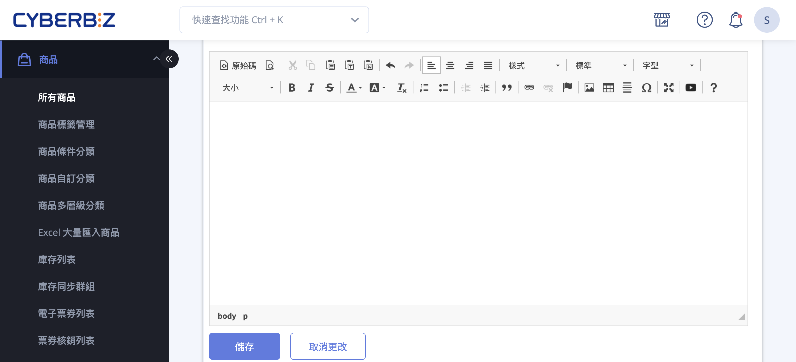
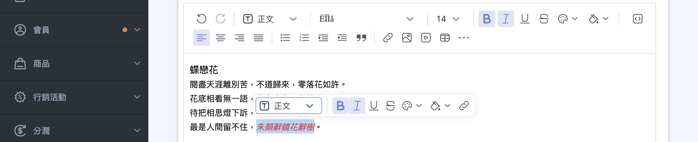
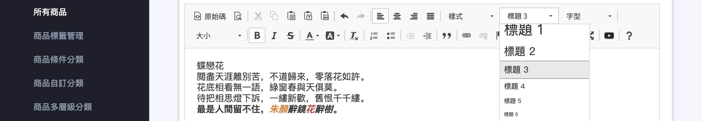
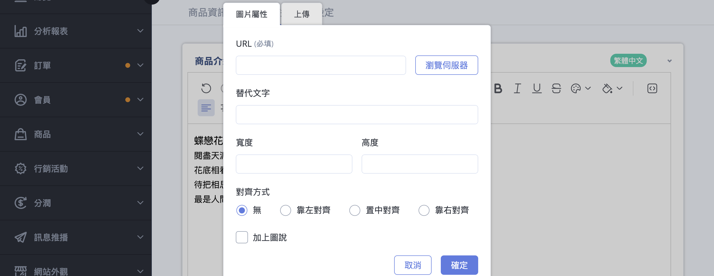
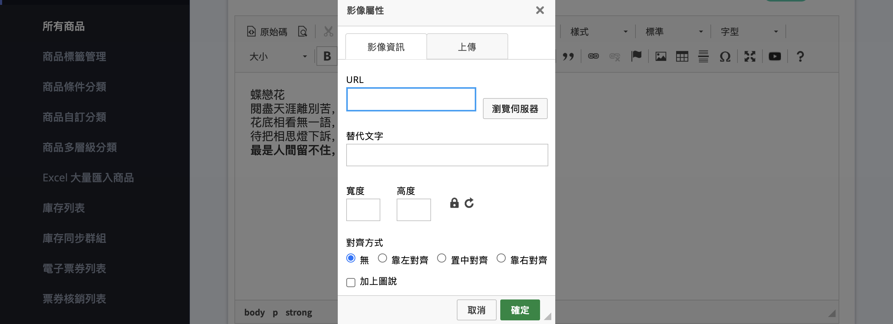
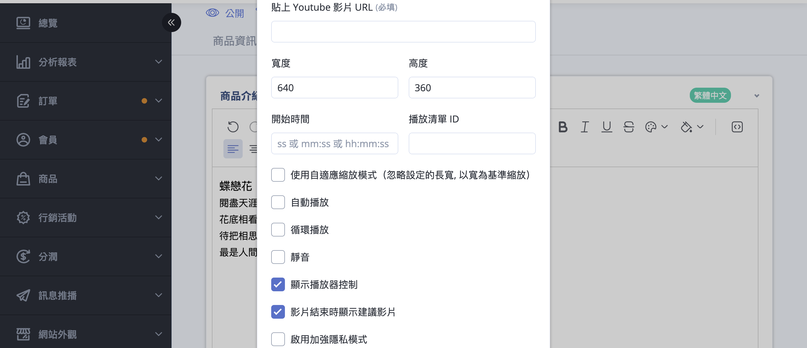
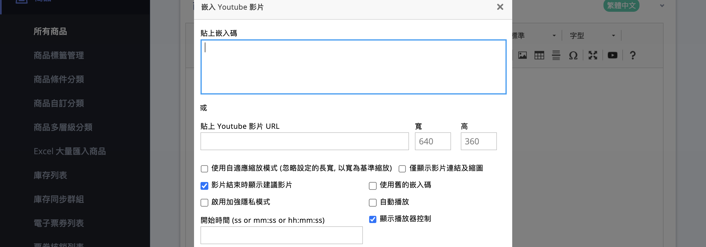
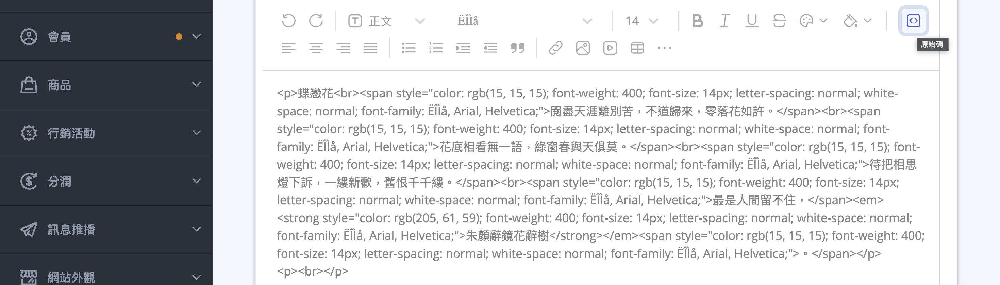
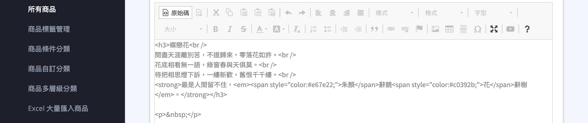
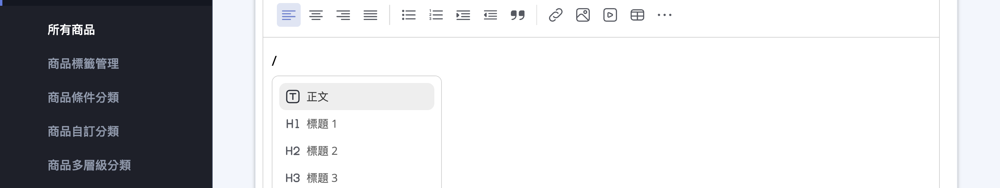

{ title="文字編輯器" .hero-page }

## 文字編輯器 { #intro-text-editor }

文字編輯器協助你在編輯「商品描述」「自訂頁面」「部落格文章」「商品分類說明」等內容時，快速建立結構化且易讀的圖文版面。
{ .subtitle }

CYBERBIZ 目前有 **新版文字編輯器** 與 **舊版文字編輯器** 兩種介面。兩者都能編輯文字、插入圖片與 YouTube 影片、切換原始碼檢視，差別主要在操作方式：新版支援「/」快捷選單與 Markdown 語法，舊版則是固定工具列。你的後台會依開通狀態自動顯示其中一種，本篇兩種版本的操作都會說明。

## 使用前提與限制 { #prerequisites-text-editor }

- [x] **適用範圍**：文字編輯器是共用元件，凡是有「內容描述」欄位的頁面（商品描述、自訂頁面、部落格、分類與標籤說明、組合商品說明等）都是同一套編輯器。
- [x] **版本開通**：新版文字編輯器為逐步開放的功能，尚未開通的商店會看到舊版編輯器。是否開通不影響既有內容，兩種版本編輯出來的成果都是同一份網頁內容。

!!! info "如何判斷我用的是哪一個版本"
    新版編輯器在內文輸入「/」會跳出快捷選單，且選取文字時會浮出工具列；舊版編輯器則是在內容區上方有一排固定的工具列按鈕。若需要切換版本，請洽 CYBERBIZ 客服。

---

## 操作步驟 { #operate-text-editor }

### 輸入與排版文字 { #operate-text-editor-format-text }

=== "新版文字編輯器"
    1. **直接輸入內容：** 在編輯區點一下即可開始打字。
    2. **調整段落樣式：** 透過上方工具列的段落選單，可將該段設定為「正文」「標題 1」至「標題 6」「項目符號清單」「編號清單」或「引用」。
    3. **快速調整選取文字：** 選取一段文字後會自動浮出工具列，可立即套用 **粗體** 、**斜體** 、**底線** 、**刪除線** 、文字顏色、背景顏色與 **連結** 。
    4. **調整對齊與縮排：** 工具列提供「靠左對齊」「置中對齊」「靠右對齊」「左右對齊」，以及「增加縮排」「減少縮排」。

    

=== "舊版文字編輯器"
    1. **直接輸入內容：** 在編輯區點一下即可開始打字。
    2. **套用段落格式：** 使用上方工具列的「格式」下拉選單套用標題或段落樣式，並可調整字型與字級。
    3. **套用文字樣式：** 選取文字後，點工具列的 **粗體** 、**斜體** 、**刪除線** 、文字顏色或背景顏色按鈕。
    4. **調整對齊、清單與縮排：** 工具列提供靠左／置中／靠右／左右對齊、編號清單、項目符號清單與縮排按鈕。

    

---

### 插入圖片 { #operate-text-editor-insert-image }

=== "新版文字編輯器"
    1. **定位插入點：** 把游標移到要放圖片的位置。
    2. **開啟圖片視窗：** 點工具列的 **圖片** 按鈕，或輸入「/」後選擇「圖片」。
    3. **選擇來源：** 在「圖片屬性」視窗切換到 **上傳** 分頁選擇本機檔案上傳；或在 **URL** 欄位貼上網路圖片連結；也可點 **瀏覽伺服器** 從過去上傳過的圖片中挑選。
    4. **填寫圖片資訊：** 視需要填入「替代文字」[^alt-new]、設定對齊方式，並可勾選「加上圖說」。
    5. **完成插入：** 點 **確定** 將圖片插入內容中。

    [^alt-new]: 「替代文字」（ALT）是當圖片無法顯示時呈現的文字描述，也能協助搜尋引擎理解圖片內容，有助於 SEO。

    

=== "舊版文字編輯器"
    1. **定位插入點：** 把游標移到要放圖片的位置。
    2. **開啟影像視窗：** 點工具列的影像按鈕；若要編輯已插入的圖片，可在圖片上按滑鼠右鍵選擇影像內容。
    3. **選擇來源：** 在影像視窗的上傳分頁選擇本機檔案上傳，或在網址欄位貼上圖片連結，亦可點瀏覽伺服器挑選既有圖片。
    4. **填寫替代文字：** 在「替代文字」（ALT）欄位輸入圖片描述[^alt-old]。
    5. **完成插入：** 確認後將圖片插入內容中。

    [^alt-old]: 「替代文字」（ALT）是當圖片無法顯示時呈現的文字描述，也能協助搜尋引擎理解圖片內容，有助於 SEO。

    

!!! tip "圖片排版建議"
    * 建議先完成文字內容編排，最後再插入圖片或影片，排版較穩定。
    * 製作長幅產品圖時，單張長圖（建議寬度 1000px、長度不限）可避免拼接縫隙；若採多張拼接，建議每張統一為 1000px × 1000px。
    * 圖片的詳細尺寸與容量規範請見[圖片規格對照表](../references/text-editor-toolbar.md#reference-text-editor-image-specs){ data-preview }。

---

### 插入 YouTube 影片 { #operate-text-editor-insert-video }

=== "新版文字編輯器"
    1. **定位插入點：** 把游標移到要放影片的位置。
    2. **開啟影片視窗：** 點工具列的 **YouTube 影片** 按鈕，或輸入「/」後選擇「YouTube 影片」。
    3. **貼上影片網址：** 在「貼上 Youtube 影片 URL」欄位貼入 YouTube 連結[^yturl-new]。
    4. **設定播放選項：** 視需要勾選自適應縮放、自動播放、循環播放、靜音等選項[^ytopts]。
    5. **完成插入：** 點 **確定** 將影片嵌入內容中。

    [^yturl-new]: 僅支援 YouTube 網址。若你有原始影片檔，請先上傳至 YouTube，再把連結貼進來。
    [^ytopts]: 依 YouTube 規範，影片需同時設定為「靜音」才能成功觸發「自動播放」。各選項說明請見[YouTube 影片設定對照表](../references/text-editor-toolbar.md#reference-text-editor-youtube-options){ data-preview }。

    

=== "舊版文字編輯器"
    1. **定位插入點：** 把游標移到要放影片的位置。
    2. **開啟影片視窗：** 點工具列的 YouTube 按鈕。
    3. **貼上影片網址：** 在欄位中貼入 YouTube 連結[^yturl-old]，並可設定寬高與相關播放選項。
    4. **完成插入：** 確認後將影片嵌入內容中。

    [^yturl-old]: 僅支援 YouTube 網址。若你有原始影片檔，請先上傳至 YouTube，再把連結貼進來。

    

---

### 切換原始碼（HTML）檢視 { #operate-text-editor-source-code }

當你需要進階排版，或要排除從外部貼上造成的跑版問題時，可切換到原始碼模式直接編輯 HTML。

=== "新版文字編輯器"
    1. 點工具列的 **原始碼** 按鈕，進入 HTML 編輯模式。
    2. 直接修改 HTML 內容。
    3. 再次點 **原始碼** 按鈕即可切回一般編輯模式。

    

=== "舊版文字編輯器"
    1. 點工具列最左側的 **原始碼** 按鈕，進入 HTML 編輯模式。
    2. 直接修改 HTML 內容；也可點 **預覽** 確認呈現效果。
    3. 再次點 **原始碼** 按鈕即可切回一般編輯模式。

    

!!! warning "HTML 會自動優化"
    儲存或切回一般模式時，編輯器會自動校閱並整理 HTML，以符合排版規範。這可能會讓部分自訂語法被自動調整或移除，建議調整後先確認最終呈現是否正確。

---

### 加快編輯效率 <small>新版專屬</small> { #operate-text-editor-shortcuts }

以下功能僅新版文字編輯器提供：

- **斜線指令（/）：** 在內文輸入「/」即可叫出快捷選單，快速插入標題、清單、表格、水平線、圖片、YouTube 影片、特殊符號或表情符號。完整清單見[斜線指令對照表](../references/text-editor-toolbar.md#reference-text-editor-slash-commands){ data-preview }。

    

- **Markdown 語法：** 輸入 `#` 加空格可建立標題、`-` 加空格可建立項目符號清單、`---` 可插入水平線。
- **懸浮工具列：** 選取文字後會自動浮出工具列，方便快速調整粗體、斜體、底線、顏色與連結。
- **建立錨點：** 可對段落或圖片建立錨點並複製錨點連結，貼到其他文字或圖片上即可在頁面內跳轉。

---

## 重要規範與限制 { #specs-text-editor }

- **貼上外部內容易跑版：** 請勿直接從其他網頁或 Word 複製後貼上（++ctrl+v++），這會帶入原網站的多餘語法。建議改用純文字貼上（++ctrl+shift+v++），貼入文字後再自行設定樣式、插入圖片。
- **圖片格式：** 支援 JPG、JPEG、PNG、GIF、TIFF、WebP。
- **圖片尺寸：** 單張圖片寬度上限 5000px、高度上限 7000px，超過將無法上傳[^imgsize]。上傳後系統會自動產生最寬 1280px 的版本以加速前台載入（GIF 維持原圖不壓縮）。
- **儲存空間：** 當方案的儲存空間已滿時無法再上傳圖片，需先清理空間或升級方案。
- **影片來源：** 影片一律使用 YouTube 連結嵌入，不提供影片檔直接上傳至編輯器。

[^imgsize]: 超過尺寸時系統會顯示「圖片最大寬度為 5000px，最大高度為 7000px。」。詳細規格見[圖片規格對照表](../references/text-editor-toolbar.md#reference-text-editor-image-specs){ data-preview }。

## 後續操作 { #next-steps-text-editor }

<div class="grid cards" markdown>

- :lucide-package:{ .lg }  
  [__建立與編輯商品__](../../products/create-and-manage/create-update-products.md){ title="新增與更新商品" }  
  在商品的描述區塊使用文字編輯器，完成商品圖文介紹。

- :lucide-palette:{ .lg }  
  [__套用與切換佈景主題__](../theme-and-layout/apply-and-switch-theme.md){ title="套用與更換網站主題" }  
  調整整體前台外觀，搭配編輯好的內容呈現完整賣場。

</div>

## 常見問題 { #faq-text-editor }

??? quote "圖片之間出現多餘的空白格"
    [](){ #faq-text-editor-image-blank-gap }
    通常是上傳時按到 ++enter++ 產生了多餘的段落標籤。請進入 **原始碼** 模式，刪除圖片之間多餘的 `&nbsp;` 或 `<p>` 標籤即可消除空白。

    ``` html title="原始碼範例"
    <p style="text-align:center"></p>
    <p></p>
    ```

??? quote "嵌入影片後，圖片或內容消失"
    [](){ #faq-text-editor-video-hides-content }
    可能是內容被影片的容器語法（例如 `<div>`）包住了。請進入 **原始碼** 模式，刪除影片前後多餘的語法，並確認文字以 `<p>` 標籤包覆。

??? quote "嵌入的影片無法隨螢幕縮放，手機版超出版面或顯示過小"
    [](){ #faq-text-editor-video-not-responsive }
    插入影片時請勾選「自適應縮放」選項，影片就會以寬度為基準自動縮放，於手機等不同裝置上維持比例。各選項說明見[YouTube 影片設定對照表](../references/text-editor-toolbar.md#reference-text-editor-youtube-options){ data-preview }。

??? quote "頁面跑版或編輯器內容預覽不到"
    [](){ #faq-text-editor-preview-broken }
    若是從其他網站複製內容，可能帶入了 `white-space: pre-wrap;` 之類的 CSS 語法。請進入 **原始碼** 模式，搜尋並刪除該段語法即可恢復正常。

## 參考資料 { #reference-text-editor }

- [斜線指令對照表](../references/text-editor-toolbar.md#reference-text-editor-slash-commands)
- [YouTube 影片設定對照表](../references/text-editor-toolbar.md#reference-text-editor-youtube-options)
- [圖片規格對照表](../references/text-editor-toolbar.md#reference-text-editor-image-specs)
