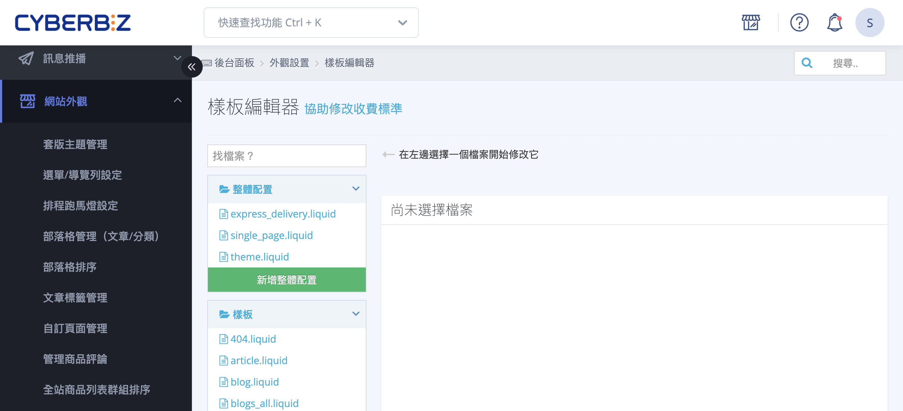

{ title="樣板編輯器操作全攻略" .hero-page }

## 樣版編輯器說明

**樣版編輯器**（或稱程式碼編輯器、CSS/HTML 編輯器）提供商家自行修改 HTML、CSS 與 JavaScript 的權限，以達成高度客製化的視覺與功能需求。

以下整理樣版編輯器的操作說明、常見特殊語法應用及重要注意事項：

## 樣版編輯器基礎操作

1. **進入路徑**：前往後台 **網站外觀 > 套版主題管理 > 選擇操作 > CSS/HTML 編輯器**。
2. **檔案搜尋**：進入編輯器後，可於搜尋欄輸入關鍵字（如 `theme`、`product`、`index`）快速查找對應的 `.liquid`、`.css` 或 `.js` 檔案。
3. **恢復機制**：編輯器內建 **查看之前版本** 功能，可回溯至先前版 本。
    - 建議每次大規模更動前先記錄當下的時間點以便日後對照。

{ title="樣板編輯器操作示範" }

## 通用與首頁特殊語法應用

透過簡單的代碼片段，即可調整網站的保護機制與互動行為。

- :lucide-shield-check:{ .lg }   
  [__網頁鎖右鍵功能__](../site-settings/setup-right-click-protection.md){ title="設定網頁鎖右鍵保護圖文版權" }       
  植入 `onContextMenu` 語法，停用滑鼠右鍵以保護圖文內容。

- :lucide-search:{ .lg }     
  [__網站標題修改__](../site-settings/setup-site-title-seo.md){ title="設定網站標題與 SEO" }    
  修改 `{{ page_title }}` 邏輯，精準定義 SERP 呈現資訊。

- :lucide-timer:{ .lg }  
  [__首頁輪播圖轉場速度__](../theme-and-layout/adjust-carousel-transition-duration.md){ title="調整首頁跑馬燈（輪播圖）的轉場停留時間" }    
  於 `_main_slider.liquid` 修改 `delay` 數值，自訂輪播圖轉場速度。

- :lucide-mouse-pointer-2:{ .lg }  
  [__選單自動下拉__](../navigation/setup-nav-menu-hover-expand.md){ title="設定導覽選單滑鼠移入自動展開" }     
  在 `main_nav.liquid` 嵌入 CSS，滑鼠移入自動展開次級選單。

- :lucide-filter-x:{ .lg }  
  [__搜尋排除特定關鍵字__](../../products/discoverability/exclude-keyword-products-search.md){ title="設定搜尋結果中排除特定關鍵字商品" }    
  利用 Liquid `without` 過濾器，排除特定關鍵字商品。

- :lucide-globe:{ .lg }  
  [__前台語系與文字呈現__](../site-settings/setup-storefront-language-text-customization.md){ title="設定前台語系與文字自定義" }  
  自訂全站顯示文字與多國語系字典檔 (i18n)。

- :lucide-message-square:{ .lg }  
  [__多元客服管道串接__](../customer-interaction/setup-customer-service-widget.md){ title="設置網站客服視窗" }  
  埋設 GetButton 代碼或啟動 FBE 2.0，建立即時通訊入口。

- :lucide-map-pin:{ .lg }  
  [__客服中心資訊調整__](../customer-interaction/setup-edit-customer-service-info.md){ title="設定與修改客服中心資訊" }  
  在 `contact.liquid` 修改標題文字，同步更新地址、電話與地圖嵌入碼。

## 商品頁進階修改

針對商品呈現與媒體播放進行微調，優化消費者的購物導引。

- :lucide-image-off:{ .lg }  
  [__鎖定圖片放大功能__](../theme-and-layout/disable-product-image-zoom.md){ title="關閉商品圖片放大預覽功能" }    
  於 `product.liquid` 註解化 JS 腳本，關閉圖片放大功能。
    
- :lucide-play-circle:{ .lg }  
  [__影片自動播放設定__](../../marketing/one-page-store/one-page-store-youtube-autoplay.md){ title="設定一頁式商店 YouTube 影片自動播放與起始秒數" }     
  配置 YouTube `autoplay` 與 `mute` 參數，實現自動靜音播放。
    
- :lucide-type:{ .lg }  
  [__商品標語與簡述樣式__](../../products/create-and-manage/edit-product-slogan-and-description.md){ title="編輯商品簡述與商品標語" }     
  透過 `theme_main.css` 定義專屬類別，客製標語與簡述排版。
    
- :lucide-shuffle:{ .lg }   
  [__優先填寫收件人__](../checkout-and-shopping-flow/priority-recipient-info-checkout.md){ title="修改結帳流程為優先填寫收件人資訊" }       
  於 `js/main.js` 啟用 `exchangeShippingAndPurchaserLocation`，收件人欄位優先顯示。

- :lucide-component:{ .lg }     
  [__訂單成立/付款完成頁客製化__](../../integrations/line/marketing/line-friend-link-order-payment-pages.md){ title="設定訂單成立頁與付款完成頁顯示 LINE 加入好友連結" }    
  利用 `order_done_extra_content.liquid` 在訂單完成頁插入 LINE 連結或廣告。

<!-- - :lucide-variable:{ .lg }  
  [__隱藏「店長改價」字樣__](../../pos/frontend/pos-manager-price-override.md){ title="使用「店長改價」在 POS 前台調整單品價格" }    
  在 `customers/order.liquid` 將「店長改價」替換為「商品改價」。
-->

## 重要注意事項

- **版型限制**：
    - **預設版型**：開放完整 HTML/CSS/JS 語法客製。
    - **拖拉版型**：僅支援 **少數** 後台 CSS/HTML 編輯器功能，部分程式碼修改可能不生效。
- **責任歸屬**：CYBERBIZ 提供開放的程式碼編輯權限，但 **官方不提供現有文件外的修改指導、語法教學或代碼撰寫服務**。
- **風險自負**：商家自行修改程式碼若導致版面跑版或功能異常，需自行承擔後果；發生異常時應優先使用恢復機制還原檔案。
- **變數保護**：修改 Email 或簡訊樣板時，切勿更改 `{{ }}` 或 `%{ }}` 內的系統參數（如 `{{shop_name}}`），以免導致系統無法抓取資料而發信失敗。

## 常見問題

??? quote "修改了 CSS 語法但前台樣式沒有變動，該如何排查？" 
	這通常是由於 **CSS 優先權（Specificity）** 或 **瀏覽器快取** 引起： 
	
	1. **檢查快取**：請嘗試以「無痕模式」開啟網頁，或按下 `Ctrl + F5`（Windows）/ `Cmd + Shift + R`（Mac）強制重新載入。 
	2. **提升優先權**：確認是否有其他全域樣式覆蓋了您的設定。您可以在語法中暫時加入 `!important` 測試是否生效，或使用開發者工具（F12）檢查該元素的樣式來源。 
	3. **檔案位置**：確認修改的是 `theme_main.css` 或當前主題正在使用的 CSS 檔案。

??? quote "為什麼在搜尋欄找不到我想修改的頁面檔案？" 
	CYBERBIZ 的樣板架構由多個檔案組成： 
	
	1. **局部檔案（Snippets）**：首頁與商品頁的特定區塊通常被拆分為「局部檔案」（如 `_product_item.liquid`），檔名多以底線 `_` 開頭。 
	2. **佈局檔案（Layout）**：若要修改全站通用的內容（如 `<head>` 資訊），請直接找 `theme.liquid`。 
	3. **關鍵字定位**：若不確定檔案名稱，建議在瀏覽器前台使用「檢視網頁原始碼」，搜尋該區塊的特定 `class` 名稱，再回到編輯器搜尋該字串。

??? quote "Liquid 語法錯誤導致前台出現程式碼字串，而非預期功能？" 
	這代表 Liquid 標籤未正確閉合或邏輯衝突： 
	
	- **檢查閉合**：確認所有的 `` 都有對應的 ``，且 `{{ }}` 雙大括號沒有遺漏。 
	- **語法環境**：確認該變數在當前頁面是否可用。例如在 `index.liquid`（首頁）直接呼叫 `{{ product.price }}` 是無效的，必須配合 `for` 迴圈抓取商品資料。

??? quote "如果不小心將檔案刪除或覆蓋，還能救回嗎？" 
	可以。編輯器內建 **「查看之前版本」** 功能。 
	
	- 進入該檔案編輯介面，點選右上方的版本紀錄。 
	- 系統會條列出歷次儲存的時間點。 
	- 點選欲還原的時間點並按下「恢復此版本」即可。 
	
	!!! warning "若檔案被徹底刪除（Delete File），則無法透過此功能還原，建議在刪檔前務必進行本地備份。"
