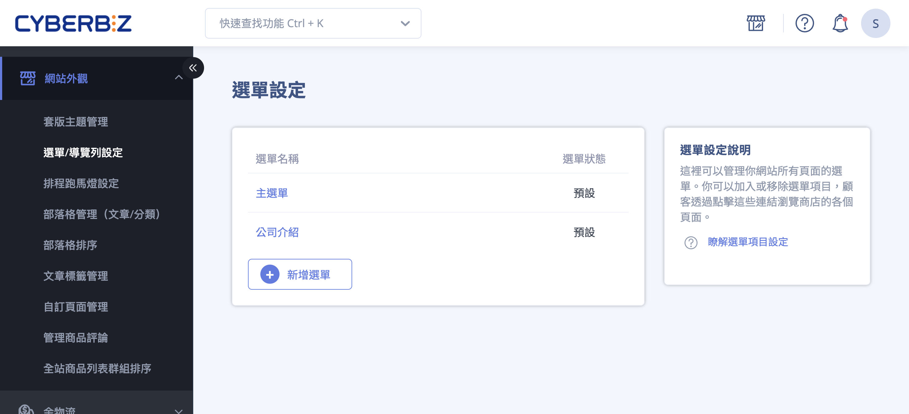{ title="選單與導覽列設定" .hero-page }

## 選單與導覽列說明

**選單與導覽列設定** 可分為兩大部分：

1. [**選單內容設定**](#選單內容設定-連結列表)：管理網站的選單項目與層級結構。
2. [**選單外觀呈現**](#導覽列外觀設定-navbar)：控制選單在網站前台的顯示方式與風格。
    
此設定可協助商家建立清晰、直觀的網站導航，提升使用者操作體驗。

!!! tip "技巧"
    建議先完成 **選單內容設定**，再調整 **外觀呈現**，可確保導航結構與顯示效果一致。
	
## 選單內容設定 <small>連結列表</small>

商家需先在後台設定選單包含哪些項目及層級，設定完成後才能套用至網站外觀。

1. **設定路徑：** 前往 **網站外觀 > 選單/導覽列設定 > 選單設定**。
2. **編輯選單：** 系統預設有「主選單」與「頁腳」兩組選單，商家可點選名稱進入編輯。

    !!! info "多國語系商店請見 [多國語系選單設定](#多國語系選單設定)，逐語系編輯選單項目名稱。"
	
3. **新增項目：** 進入選單編輯頁面後，點擊「新增連結」可加入多種導覽項目，包括：

	- **商品分類：** 包含自訂分類、條件分類及多層級分類。
	- **行銷活動：** 如紅配綠組合優惠、任選折扣、紅利商城等。
	- **內容頁面：** 指定單一商品、自訂頁面、部落格主題或文章。
	- **功能連結：** 查詢頁面、聯絡店家、首頁或外部連結。

	{ title="新增選單項目" }

4. **層級與排序：** 項目建立後，可透過 **滑鼠拖拉** 調整順序，將項目向右縮排即可建立次級選單， **最多支援三層結構**。

	{ title="選單排序與層級" }
	
5. **前台畫面：** 點擊右上角 **前往商店** 圖示可以前往前台檢視設定成果。

	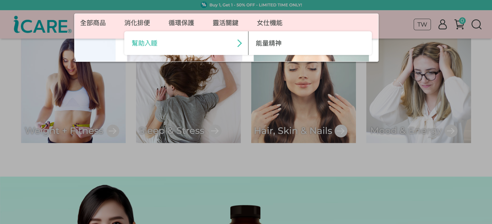{ title="選單前台顯示" }

## 導覽列外觀設定 <small>Navbar</small>

根據商家使用的版型（[拖拉版型](#拖拉版型設定)或[預設版型](#預設版型設定)），外觀設定路徑與功能略有不同。

{ title="導覽列-前台" }

### 拖拉版型設定

!!! path "**路徑：** **網站外觀/套版主題管理/網站設定 > 導覽列**。"

拖拉版型的導覽列編輯器由上而下分為 8 個設定區塊：

#### 網站 Logo

- **電腦版／平板版／手機版圖片：** 可分別上傳三種裝置的 Logo。建議 **不超過 1MB、寬不限、高 100px**，支援 JPG／PNG／JPEG／GIF。

    !!! tip "若僅上傳電腦版，系統會自動同步顯示於平板與手機版。"

- **電腦版 LOGO 高度：** 可輸入 **20px–300px** 之間的數值，調整 Logo 在電腦版的顯示高度。
- **平板版、手機版選單 LOGO 位置：** 可選擇 **置左**（預設）或 **置中**。
- **圖片替代文字（Alt）：** 輸入 Logo 的說明文字以優化 SEO。

{ title="導覽列-網站logo" }

---


#### 頂部導覽列設定

> 此區塊需開通 **四層選單** 相關方案／外掛才會出現。

位於主導覽列上方的細長公告列，可放一段公告文字與一組連結選單：

- **啟用頂部導覽列：** 開啟後才會顯示此區塊。
- **公告內容：** 顯示於頂部的文字。
- **連結選單：** 挑選一組已建立的選單，顯示於頂部導覽列。

---


#### 導覽列樣式

- **電腦版導覽列樣式：** 三選一
    - **預設：** 網站 Logo 與選單換排、置中顯示（Logo 在上、選單在下）。
    - **併排置左：** Logo 與選單併排，整體靠左。
    - **併排置中：** Logo 與選單併排，整體置中。
- **背景透明：** 勾選後導覽列背景透明（常搭配滿版主視覺使用）。

{ title="導覽列-導覽列樣式" }

---

#### 導覽列字體


> 此區塊需開通 **字體大小設定** 相關方案／外掛才會出現。


可分別調整 **電腦版** 與 **平板/手機版** 的字體縮放比例，標題與內文各自獨立：

- **標題字體大小／內文字體大小：** 可選 **80%／90%／100%（預設）／110%／120%**。

{ title="導覽列-導覽列字體" }

---

#### 主要導覽列選單設定

- **電腦版選單：** 挑選要顯示在電腦版導覽列的選單。需先於[選單內容設定](#選單內容設定-連結列表)建立好選單項目。
- **電腦版選單樣式：**
    - **次選單不同步展開（三維選單，預設）：** 第二、三層選單分開顯示。
    - **次選單同步展開（二維選單）：** 第二、三層選單同步一起展開。

    
    - **四層選單：** 需開通四層選單方案／外掛才會出現。
    

- **平板版、手機版選單：** 挑選要顯示在行動裝置側邊選單的選單。
- **非電腦版選單預設展開：** 勾選後，平板／手機的側邊選單預設為展開狀態。

{ title="導覽列-主要導覽列選單設定" }

---

#### 搜尋欄位設定

- **顯示搜尋欄：** 控制導覽列是否出現搜尋欄（預設開啟）。

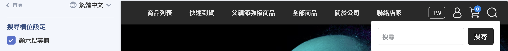{ title="導覽列-顯示搜尋欄" }

---

#### 置頂公告

顯示於網站最上方的公告橫幅，可設定為圖片或文字，並支援上下架時間與倒數計時。

- **僅顯示於首頁：** 勾選後公告只在首頁出現。
- **公告類型：** 選擇 **圖片公告** 或 **文字公告**。
    - **圖片公告：** 分別上傳電腦版（建議寬 1920px）、平板版（960px）、手機版（480px）圖片，並可填寫圖片替代文字。
    - **文字公告：** 輸入公告內容，並設定 **字級、文字顏色、背景顏色**。

    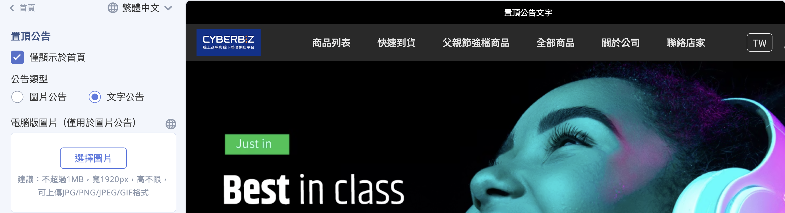{ title="導覽列-置頂公告-類型" }

- **公告連結／在新分頁開啟：** 為公告加上點擊連結，可選擇是否於新分頁開啟。
- **上架時間／下架時間：** 設定公告自動顯示與隱藏的時間。
- **顯示時間倒數：** 開啟後於公告顯示倒數計時，並可自訂 **倒數文字顏色** 與 **倒數背景顏色**。

    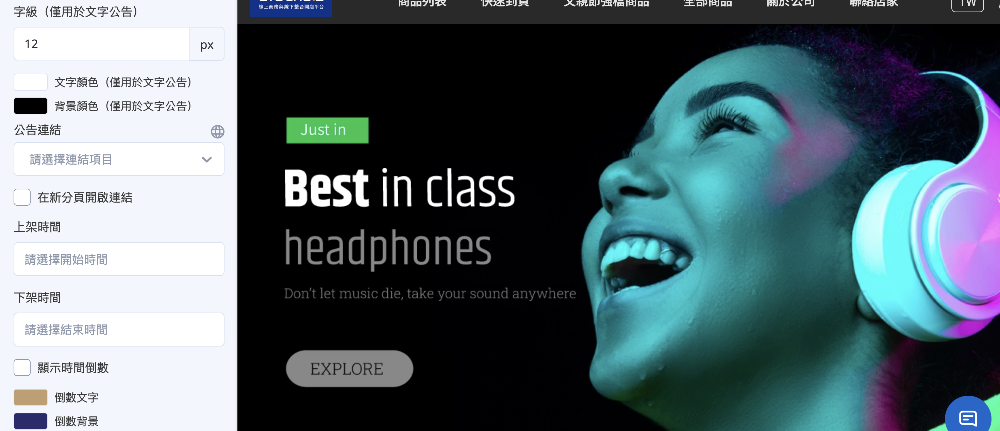{ title="導覽列-置頂公告-細節設定" }

---

### 預設版型設定

- **路徑：** **網站外觀 > 套版主題管理 > 網站設定 > 導覽列**。

- **Logo 設定：** 上傳一般 Logo 與手機側邊選單專用的 Logo。

- **選單模式：** 可根據需求選擇 **「二維選單」或「三維選單」** 模式。

- **其他設定：** 可控制是否顯示搜尋欄位及「全部商品」`collections/all` 頁面的商品列表樣式。

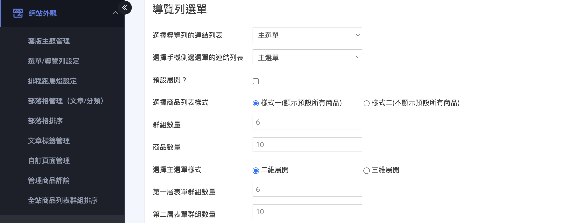{ title="導覽列選單-預設版型" }

## 頁腳選單與外觀設定 <small>Footer</small>

頁腳設定可決定網站最下方顯示哪些內容與排列方式，包含選單、聯絡資訊、自訂文字與社群媒體圖示。此設定適用於 **拖拉版型**，於 **套版主題管理** 中進行。

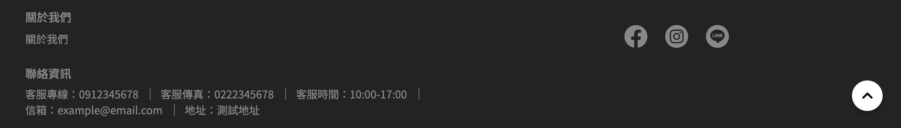{ title="頁腳前台顯示" }

### 頁腳內容

頁腳最多可新增 **4 個內容區塊**，每個區塊可獨立設定。新增與編輯方式如下：

1. **進入頁腳設定：** 登入管理後台，前往 **網站外觀 > 套版主題管理 > 網站設定**，於左側點擊 **頁腳** 進入編輯頁面。
2. **新增區塊：** 點擊 **新增區塊**，可加入「選單」、「聯絡資訊」、「自訂文字」三種內容類型。
3. **編輯區塊內容：** 點擊區塊名稱進入該區塊的設定頁面進行調整(三種區塊的設定內容見下方說明)。

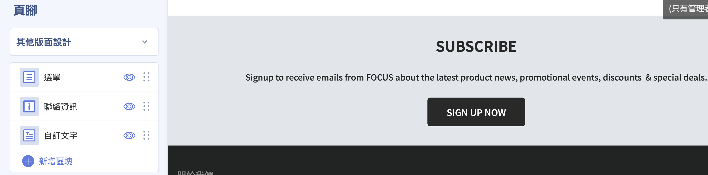{ title="新增頁腳區塊" }

---

### 頁腳選單 <small>導覽列</small>

!!! info "在設定頁腳的「選單」區塊前，請先完成 [**選單內容設定**](#選單內容設定-連結列表)，否則頁腳選單將沒有可選擇的內容。"

頁腳的「選單」區塊負責 **挑選要顯示哪一組選單**，選單本身的項目與層級則在 **選單內容設定** 建立。兩者分工如下：

1. **建立選單內容：** 先於 **網站外觀 > 選單/導覽列設定 > 選單設定** 建立好選單與其項目、層級。
2. **新增選單區塊：** 於頁腳設定頁面點擊 **新增區塊 > 選單**，再點擊該區塊進入設定頁面。
3. **設定區塊標題：** 於 **標題** 欄位輸入此區塊在前台顯示的名稱(預設為「關於我們」)。
4. **選擇要顯示的選單：** 於 **選擇選單** 下拉選單中，挑選步驟 1 已建立的選單，該組選單的項目即會顯示於頁腳。

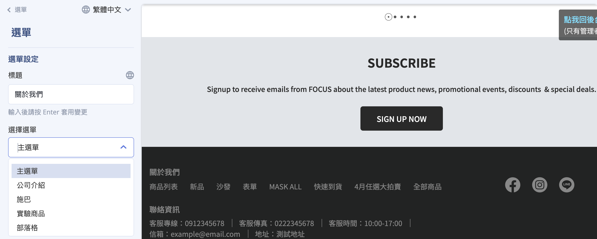{ title="頁尾-選單導覽列" }

!!! info "選單項目請至「選單設定」編輯"
    頁腳選單的項目內容(各連結名稱、層級)無法在此區塊內直接編輯。若要新增或修改選單項目，請回到 **網站外觀 > 選單/導覽列設定 > 選單設定** 調整，頁腳會自動同步顯示更新後的內容。

---

### 聯絡資訊與自訂文字

除了選單，頁腳區塊還可加入聯絡資訊與自訂文字：

- **聯絡資訊：** 顯示店家聯絡方式。可自訂標題(預設為「聯絡資訊」)，並逐項勾選是否顯示
**聯絡電話、傳真號碼、營業時間、信箱、聯絡地址、統一編號**，每個欄位皆有獨立的顯示開關與輸入框。

- **自訂文字：** 輸入自訂說明文字或版權資訊。可設定標題與內文，內文支援文字排版編輯。

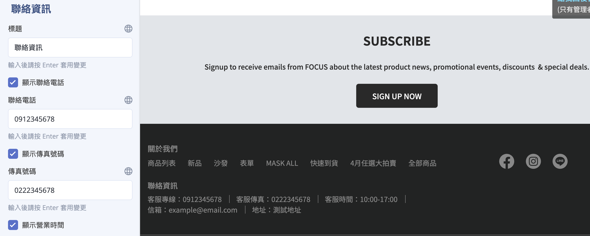{ title="頁尾-聯絡資訊" }

---

### 調整選單排列樣式

點選展開 **其他版面設定**，在 **選單設定** 區塊中，可調整選單區塊的排列方向：

- **上下排列：** 選單列表由上至下排列顯示(預設值)。

- **左右排列：** 選單列表由左至右排列顯示。

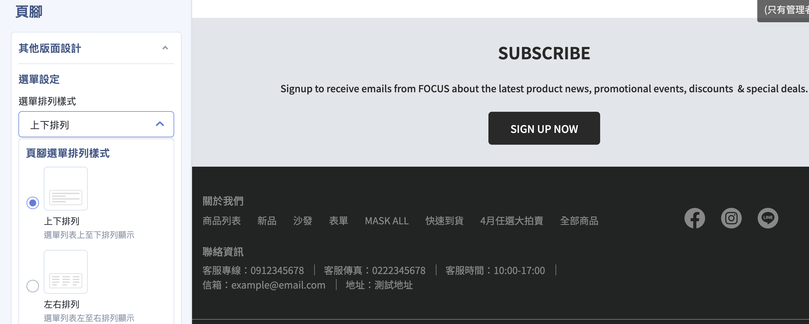{ title="頁腳-選單排列樣式" }

---

### 社群媒體

點選展開 **其他版面設定**，在 **社群媒體設定** 區塊中，可設定 Facebook 粉專區塊與各社群圖示連結：

- **顯示 FB 粉專區塊：** 開啟後可於頁腳嵌入 Facebook 粉絲專頁插件(預設為開啟)。

    !!! warning "設定須知與限制"
        * 先決條件：須先完成 [Facebook 新版商業擴充套件 (FBE)](../../integrations/fb/mbe/setup-fbe-authorization.md){ title="設定 FBE 帳號授權與資產連結" } 設定，方可正常顯示。
        * 裝置限制：此區塊僅支援 **電腦版** 顯示，平板與手機版不支援。
        * 關閉此設定僅是不顯示嵌入式粉專內容，不影響 Facebook 串接與像素追蹤。

- **顯示 Icon：** 可逐一勾選要在頁腳顯示的社群圖示，並於對應欄位輸入網址，包含 Facebook、Instagram、LINE、YouTube。

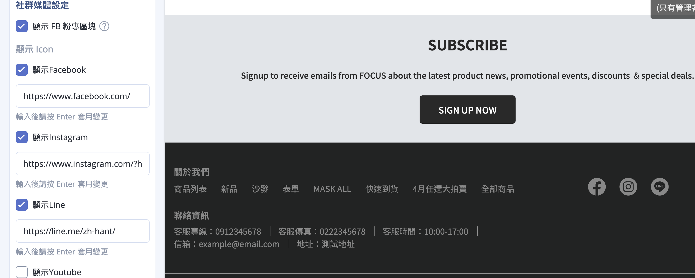{ title="頁腳-社群媒體" }

## 多國語系選單設定

若已開通多國語系功能， **主選單** 與 **頁腳選單** 的項目名稱都在此處逐語系編輯。兩者做法相同，差別只在選的是哪一組選單。系統不會自動翻譯，各語系需分別填寫。

**操作步驟：**

1. 前往 **網站外觀 > 選單/導覽列設定**，點選要編輯的選單(主選單或頁腳)。
2. 點選 :lucide-globe: 切換至目標語言。

    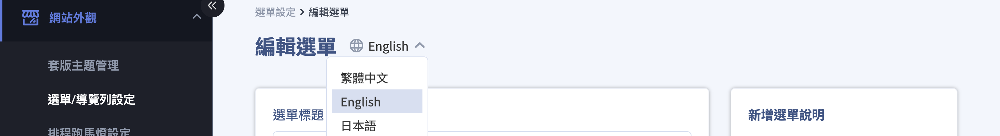{ title="切換語系" }

3. 逐項點「編輯」修改選單項目名稱，輸入後按確認。

    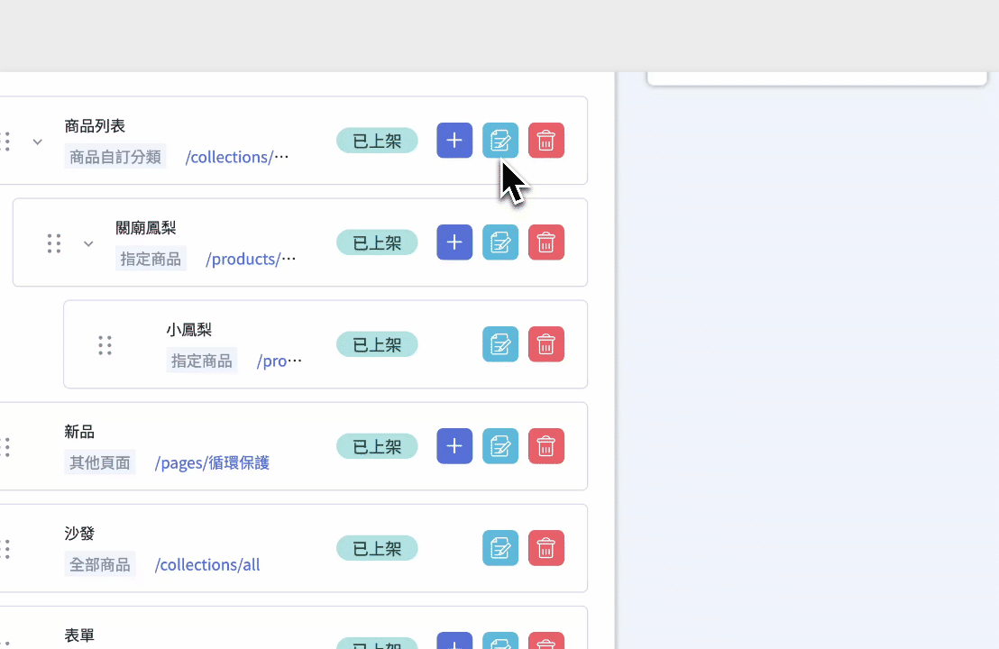{ title="輸入語系內容" }

4. 改完後 **儲存選單**，前台即會依瀏覽語言顯示對應文字。

=== "主選單範例"

    | 繁中 | 英文 |
    |------|------|
    | 首頁 | Home |
    | 關於我們 | About Us |
    | 商品列表 | Products |
    | 客服中心 | Contact Us |

    { title="導覽列選單-多國語系-前台" }

=== "頁腳選單範例"

    | 繁中 | 英文 |
    |------|------|
    | 查詢 | Search |
    | 關於我們 | About Us |
    | 服務條例 | Terms & Conditions |

    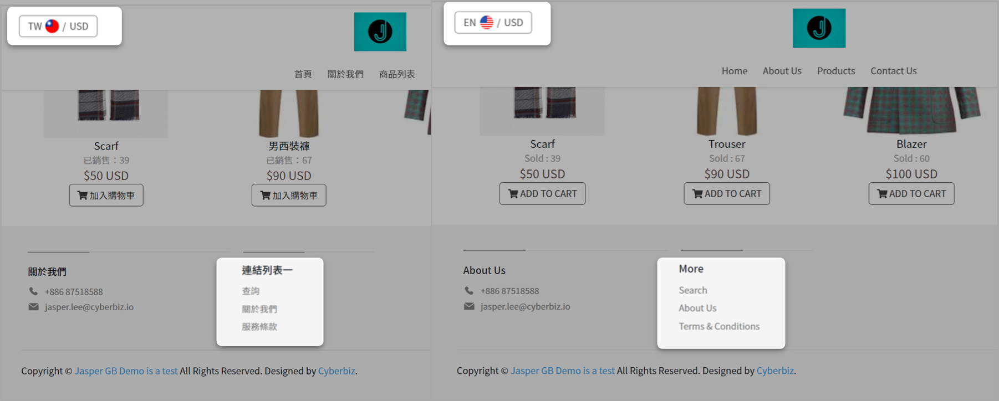{ title="頁腳選單-多國語系-前台" }

    !!! info "「頁腳選單」≠ 套版主題管理的頁腳區塊"
        此處的「頁腳」是一組 **選單連結列表**。它在前台的呈現，要再到 [頁腳的選單區塊](#頁腳選單-導覽列) 用「選單」區塊挑選顯示。本段只負責 **選單項目的多語系用字**。

<!---->
<!-- ## 頁腳選單與外觀設定 <small>Footer</small> -->
<!---->
<!-- 設定網站頁腳顯示內容與版面配置，包含選單、聯絡資訊、自訂文字與社群媒體圖示。 -->
<!---->
<!--  -->
<!---->
<!-- > 在設定頁腳前，請先完成 [**選單內容設定**](#選單內容設定-連結列表)，否則頁腳中的選單將無法正常顯示。 -->
<!---->
<!-- ### 設定頁腳內容 -->
<!---->
<!---->
<!-- 1. 登入管理後台，前往 **網站外觀 > 套版主題管理 > 網站設定**。 -->
<!-- 2. 在左側選單中，點擊 **頁腳** 進入編輯頁面。 -->
<!---->
<!-- 3. 設定頁腳顯示內容：於頁腳設定區塊中，可新增 （點擊 **新增區塊** ）以下內容類型： -->
<!---->
<!-- 	- **選單**：顯示已建立的導覽選單 -->
<!---->
<!-- 	- **聯絡資訊**：顯示電話、地址、Email 等資訊 -->
<!---->
<!-- 	- **自訂文字**：輸入自訂說明文字或版權資訊 -->
<!---->
<!-- 4. 點擊區塊名稱可進入對應編輯頁面。 -->
<!---->
<!-- 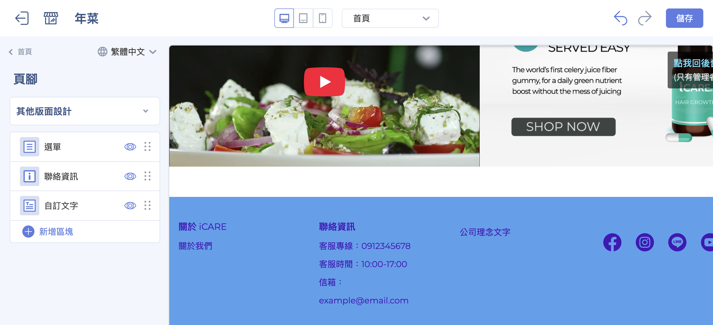 -->
<!---->
<!-- ### 調整頁腳版面配置 -->
<!---->
<!-- 點選展開 **其他版面設定** 可以進一步設定選單排列樣式以及社群媒體圖示連結。 -->
<!---->
<!-- - **設定排列樣式：** 可選擇頁腳內容以 **上下排列** 或 **左右排列** 方式呈現。 -->
<!---->
<!-- - **設定社群媒體圖示：** 可於頁腳中加入社群媒體連結圖示，點選對應欄位輸入連結即可顯示。 -->
<!---->
<!--     - 顯示 FB 粉專區塊：勾選後即可於頁腳嵌入 Facebook 粉絲專頁插件。 -->
<!---->
<!--         !!! warning "設定須知與限制" -->
<!--             * 先決條件：須先完成 [Facebook 商業擴充套件 (FBE)]() 設定，方可正常顯示。 -->
<!--             * 裝置限制：此區塊僅支援 電腦版 (Desktop) 顯示，平板與手機版不支援。 -->
<!---->
<!--     - Facebook -->
<!--     - Instagram -->
<!--     - LINE -->
<!--     - YouTube -->
<!---->
<!-- 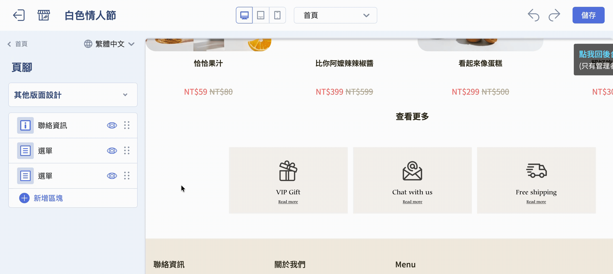 -->
<!---->
<!-- ## 後續步驟 -->
<!---->
<!-- 
 -->
<!---->
<!-- - :lucide-chevron-down:{ .lg }      -->
<!--   [__選單滑鼠移入自動展開__](setup-nav-menu-hover-expand.md){ title="設定導覽選單滑鼠移入自動展開" }   -->
<!--   設定導覽選單在滑鼠移入時自動展開次級選單。 -->
<!---->
<!-- - :lucide-list-ordered:{ .lg }   -->
<!--   [__商品群組列表排序__](../theme-and-layout/設定首頁商品群組排序.md)   -->
<!--   「全站商品列表群組排序」設定會影響首頁及全店商品頁側邊欄中群組的排列順序。 -->
<!---->
<!-- - :lucide-shopping-bag:{ .lg }   -->
<!--   [__一頁式商店__](#)   -->
<!--   新增一頁式商店時會套用當時的語言與選單設定，若後續官網選單有異動，已建立的一頁式商店需視情況重新調整。 -->
<!---->
<!-- 
 -->
<!---->

## 常見問題

??? quote "為什麼我新增的選單項目沒有顯示在前台？"
    通常是因為該選單尚未套用至網站外觀，或尚未儲存設定。請確認：
    
    - 已在「選單設定」中儲存變更  
    - 該選單已於「導覽列」或「頁腳」外觀設定中被選取使用  
    - 已清除瀏覽器快取或重新整理前台頁面  

??? quote "選單最多可以建立幾層？"
    目前系統最多支援 **三層選單結構** （主選單 → 次選單 → 第三層選單），超過第三層的項目將無法正確顯示於前台。

??? quote "可以針對不同語系設定不同的選單內容嗎？"
    可以。若有開啟多國語系功能，需點選語系切換圖示，分別編輯各語系的選單名稱與連結內容，系統不會自動同步翻譯。詳見 [多國語系選單設定](#多國語系選單設定)

??? quote "為什麼手機版 Logo 顯示比例怪怪的？"
    通常是因為上傳圖片尺寸比例不一致。建議：
    
    - 桌機、平板、手機分別上傳對應比例的圖片  
    - 使用透明背景 PNG 或 SVG 格式，避免被裁切  

??? quote "為什麼頁腳選單是空的？"
    頁腳中的「選單區塊」本身不包含內容，必須先在「選單設定」中建立選單，再於頁腳區塊中指定要顯示哪一組選單。

??? quote "可以在頁腳放外部連結或社群按鈕嗎？"
    可以。可透過 **網站外觀 > 套版主題管理 > 網站設定 > 頁腳 > 其他版面設定 > 社群媒體設定** 進行相關設定。 

??? quote "調整選單順序會影響 SEO 嗎？"
    會間接影響。選單結構會影響：
    
    - 內部連結層級（Internal Linking）  
    - 搜尋引擎對網站結構的理解  
    - 使用者行為路徑（點擊深度）  
    
    建議將高價值頁面（主分類、活動頁）放在第一層選單。

??? quote "修改選單後，一頁式商店會自動更新嗎？"
    不會。一頁式商店會套用建立當下的選單狀態，後續官網選單異動需手動回到該一頁式商店重新調整。

??? quote "我不想要我的商品，在上方系統預設「全部商品」內展開，我想要自己架設分類，並且建立成層級，但商品不要展開"
    系統預設的「全部商品」`collections/all`，規格是會呈現後台所有的商品群組、選單預設可以看到商品、且內容無法調整。因此，如果不想要這樣顯示方式，建議您把此選項刪掉即可。後續透過自行先建立[商品自訂分類](../../products/categories-and-tags/custom-collections.md){ title="設定商品自訂分類群組" }/[商品條件分類](../../products/categories-and-tags/smart-collections.md){ title="設定商品條件分類群組" }後，再到導覽列內新增並建立層級。
