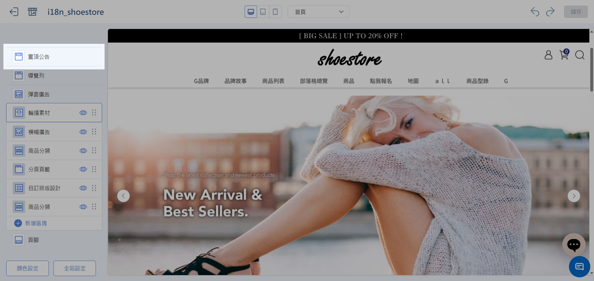
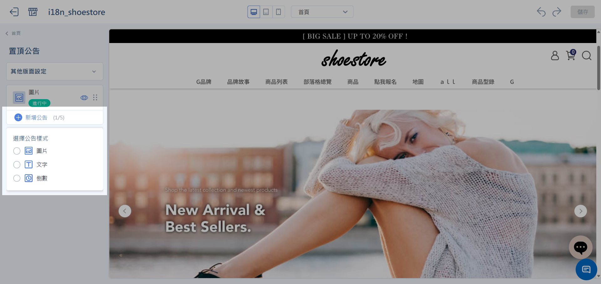
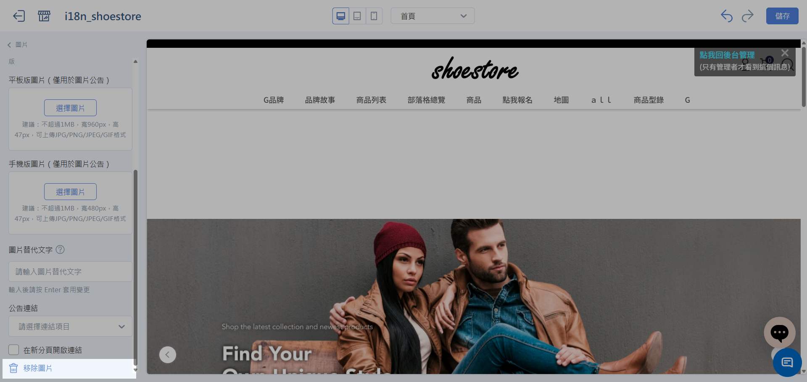

# 設定置頂公告
在商店頁面最上方顯示行銷訊息。類型涵蓋文字、圖片與倒數計時，並可排程自動上下架。
{ .subtitle }

[:lucide-tag:{ title="適用方案" }](../../../resources/conventions#適用方案) | 全方案
{ .doc-badge }

!!! tip "功能改版過渡說明"
    **置頂公告** 已改為獨立設定頁，不再內嵌於導覽列。**此功能正陸續開放中**。請依後台畫面選擇對應教學：

    - 若側邊欄已有 **置頂公告**：依本頁教學操作（新版）。
    - 若尚無此選單：請先至導覽列 [設定原版置頂公告](setup-menus-navigation.md#置頂公告)，待站台開放新版後再改用本頁。

## 使用須知

- **公告上限**：最多可建立 **5 組** 公告。
- **顯示條件**：僅 **公開** 且狀態為 **進行中** 的公告會顯示於前台。
- **過期保留**：超過結束時間後，公告會自動隱藏，設定仍保留在列表中。

## 公告類型

=== "圖片公告"
    
    { .screenshot }

=== "文字公告"

    { .screenshot }

=== "倒數計時公告"

    { .screenshot }
    

## 新增公告

### 步驟 1：進入置頂公告列表

1. 登入 CYBERBIZ 管理後台，前往 **網站外觀 > 套版主題管理**，點擊 **網站設定**。
2. 於側邊欄選擇 **置頂公告**。

    { .screenshot }

3. 點擊 **新增公告**，選擇公告類型。

    { .screenshot }

### 步驟 2：設定排程發佈

每組公告皆可設定 **上架時間** 與 **下架時間**，系統依目前時間自動判定狀態。

{ .screenshot }

| 狀態 | 判定條件 | 前台顯示 |
| :--- | :--- | :--- |
| **排程中** | 目前時間 ＜ 開始時間 | 尚未顯示 |
| **進行中** | 開始時間 ≤ 目前時間 ≤ 結束時間 | 正常顯示 |
| **已結束** | 目前時間 ＞ 結束時間 | 自動隱藏 |

!!! example "雙 11 檔期排程範例"
    可預先設定兩組公告，系統將依時間自動切換，無需人工操作：

    - **公告 A「雙 11 即將開始」**：11/01 00:00 ～ 11/10 23:59
    - **公告 B「全館活動開跑」**：11/11 00:00 ～ 11/11 23:59

    11/11 零點時，系統自動隱藏公告 A，並切換顯示公告 B。

### 步驟 3：編輯公告內容

=== "圖片公告"

    1. **圖片上傳**：分別上傳 **電腦版／平板版／手機版** 三種尺寸圖片（建議規格請參考上傳介面說明）。
    2. **替代文字**：填寫 Alt Text，提升 SEO 與無障礙體驗。
    3. **公告連結**：由下拉選單選擇店內頁面（首頁、商品頁、活動頁等），或輸入外部 URL。

    { .screenshot }

=== "文字公告"

    1. **公告內容** ：輸入文字訊息。
    2. **字級**：設定字級（px）。
    3. **顏色**：選擇文字顏色與背景顏色。
    4. **公告連結**：由下拉選單選擇店內頁面（首頁、商品頁、活動頁等），或輸入外部 URL。

    { .screenshot }

=== "倒數計時公告"

    1. **公告文字**：輸入倒數期間顯示的文字。
    2. **顏色**：選擇文字顏色與背景顏色。

    { .screenshot }

## 選擇顯示模式

於列表頁設定多組公告的呈現方式：

=== "輪播"

    每次僅顯示一條公告，依設定秒數自動切換。

    - 可選擇 **上下** 或 **左右** 輪播方向
    - 可自訂輪播秒數
    

=== "全展開"

    所有啟用中的公告由上而下依序堆疊，同時顯示於頁面頂端。

{ .screenshot }

## 管理公告列表

在列表中可執行以下操作：

- **排序** :lucide-grip-vertical:：拖曳調整公告的前台顯示順序。
- **公開開關** :lucide-eye:：切換各組公告的公開／不公開狀態。
- **查看狀態標籤**：每組公告標示「進行中」、「排程中」或「已結束」。

{ .screenshot }

點擊指定公告，可於側邊欄底部刪除公告：

- **刪除** :lucide-trash-2:：移除不再需要的公告。

{ .screenshot }

## 常見問題

??? quote "最多可以設定幾組公告？"
    上限為 **5 組**。

??? quote "過期的公告會怎麼處理？"
    超過結束時間後會自動隱藏，不會顯示於前台；設定仍保留在列表中，可之後再調整時間重新啟用。

??? quote "輪播的切換速度可以調整嗎？"
    可以。選擇 **輪播** 顯示模式後，可自行設定輪播秒數。

