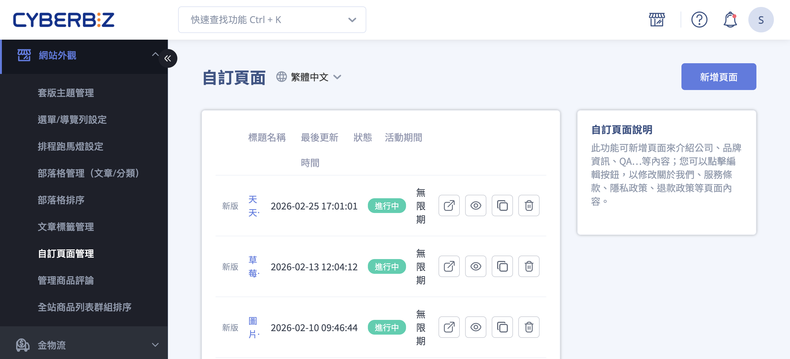{ .hero-page }

## 自訂頁面介紹 { #intro-custom-pages }

**自訂頁面管理** 讓您在商品與分類頁之外，自行建立獨立的內容網頁，常用於放置公司簡介、品牌故事、常見問答，或是服務條款、隱私權政策、退換貨政策等說明性與法律性內容。

每個自訂頁面都有專屬網址(格式為 `您的網域/pages/網址後綴`)，您可以自行決定要不要公開，並把網址放進選單、會員頁或其他頁面供顧客點閱。

## 頁面功能總覽 { #overview-custom-pages }

自訂頁面依您店家所使用的佈景主題，分為兩種編輯型態，兩者在列表上的管理動作(前往、公開/不公開、複製、刪除)相同，差別只在「編輯內容」的方式：

| 頁面型態 | 列表標示 | 內容編輯方式 | 排程功能 |
| :-- | :-- | :-- | :-- |
| 新版(拖拉式) | 標示「新版」 | 進入佈景主題編輯器，以拖拉式「區塊」設計版面 | 支援，於編輯器內設定上架/下架時間 |
| 一般(文字) | 無標示 | 進入編輯頁，於「內容描述」分頁用文字編輯器撰寫 | 不支援，固定為無限期 |

!!! info "提示"
    您不需要自行選擇型態，系統會依目前佈景主題自動決定。在列表中標示 **「新版」** 的頁面即為拖拉式頁面；點擊頁面標題時，系統會自動帶您進入對應的編輯畫面。

---

## 操作步驟 { #operate-custom-pages }

以下依常見情境分別說明。所有操作皆從後台「網站外觀」>「自訂頁面管理」進入。

### 新增自訂頁面 { #operate-custom-pages-create }

1. **進入自訂頁面管理：** 前往後台「網站外觀」>「自訂頁面管理」。
2. **新增頁面：** 點擊頁面右上角的 **「新增頁面」** 按鈕。
3. **命名頁面：** 在彈出視窗的「頁面名稱」欄位輸入名稱(此名稱主要供您於後台辨識)，點擊建立。
4. **開始編輯：** 建立後即可點擊該頁面標題進入編輯，依您的頁面型態進行內容設計(見 [編輯頁面內容](#operate-custom-pages-edit))。

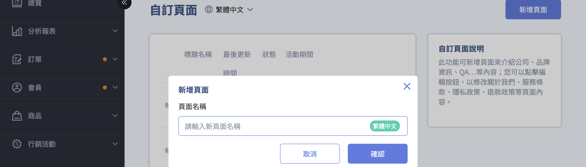

---

### 編輯頁面內容 { #operate-custom-pages-edit }

點擊列表中的頁面標題即可進入編輯。請依您頁面的型態參考對應分頁：

=== "新版(拖拉式)頁面"
    列表中標示 **「新版」** 的頁面，點擊標題後會進入 **佈景主題編輯器**，以「區塊」方式組合版面。

    1. **新增區塊：** 在編輯器中點擊 **「新增區塊」**，從清單選擇要加入的區塊(例如輪播素材、圖文介紹、折疊內容、自訂 HTML 等)。可用區塊請見 [自訂頁面可用區塊對照表](../references/custom-pages-blocks.md#reference-custom-pages-blocks){ data-preview }。
    2. **編輯區塊內容：** 點擊已加入的區塊，於右側設定面板填入圖片、文字、連結等內容。
    3. **調整順序：** 透過拖拉調整各區塊的上下順序，排出理想的版面。
    4. **設定排程(選填)：** 於編輯器的「檔期設定」設定頁面的上架時間與下架時間；未設定則視為無限期顯示。
    5. **儲存與發布：** 完成後儲存內容，並確認頁面狀態為「公開」，顧客才看得到。

    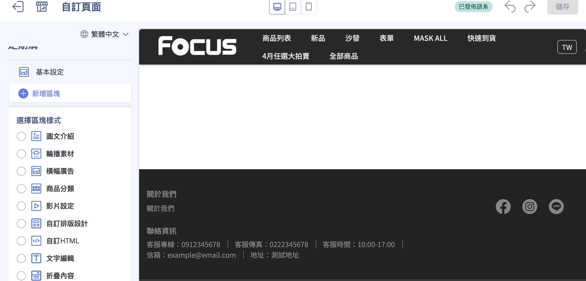

    !!! note "註釋"
        拖拉式區塊的詳細操作與各區塊應用範例，請參考 [拖拉版型網站設定](../theme-and-layout/theme-editor.md){ title="拖拉版型網站設定" } 。

=== "一般(文字)頁面"
    未標示「新版」的頁面，點擊標題後會進入編輯頁，上方有「基本設定」與「內容描述」兩個分頁。

    **基本設定分頁**

    1. **自訂頁面名稱(必填)：** 輸入頁面名稱。
    2. **自訂頁面網址(必填)：** 輸入網址後綴，系統會自動加上前綴 `您的網域/pages/`，組成完整網址。
    3. **SEO 設定：** 填寫「網頁標題」、「網頁描述」、「網頁關鍵字」，有助於提升頁面在搜尋引擎的能見度。
    4. 點擊 **「儲存」** 完成設定。

    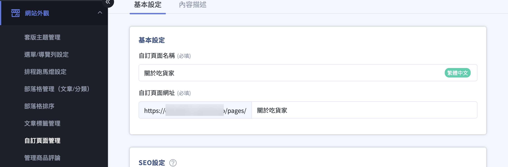

    **內容描述分頁**

    1. 切換到「內容描述」分頁，於文字編輯器撰寫頁面內容。
    2. 編輯器支援粗體、標題、項目清單、連結、圖片、影片、表格等格式，並可切換到 **「原始碼」** 直接編輯 HTML。
    3. 點擊 **「儲存」** 完成；若要放棄尚未儲存的修改，點擊 **「取消更改」** 還原為上次儲存的內容。

    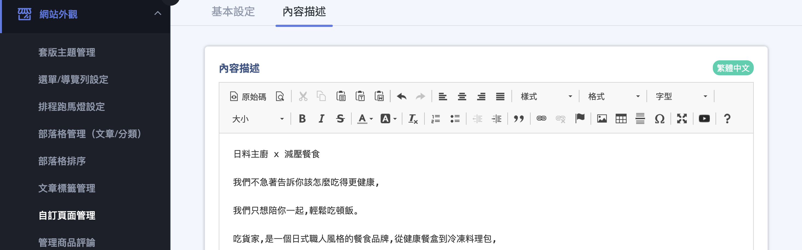

---

### 發布或下架頁面 { #operate-custom-pages-publish }

頁面建立後預設不一定公開，您可以隨時切換顯示狀態：

1. **於列表切換：** 在自訂頁面列表中，點擊該頁面的顯示狀態圖示，即可在「公開」與「不公開」之間切換。
2. **於編輯頁切換：** 進入頁面編輯後，點擊上方的 **:lucide-eye:「公開」/「不公開」** 也可切換。
3. **確認前台顯示：** 點擊 **:lucide-external-link:「前往該頁面」** 可於新分頁開啟前台實際頁面，確認顯示結果。

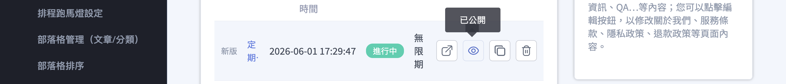

!!! warning "注意"
    將頁面設為「公開」只是讓該網址可被開啟，並不會自動把連結放上官網選單。若要讓顧客在前台找到入口，還需到選單/導覽列加入連結(見 [後續操作](#next-steps-custom-pages)。

---

### 複製頁面 { #operate-custom-pages-duplicate }

當您要製作版面相近的頁面時，可直接複製既有頁面再修改：

1. 在列表中找到要複製的頁面，點擊 **「複製」** 圖示。
2. 系統會建立一個內容相同的新頁面。
3. 點擊新頁面標題進入編輯，修改名稱、網址與內容後儲存即可。

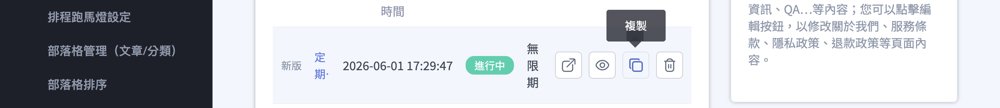

---

### 刪除頁面 { #operate-custom-pages-delete }

1. 在列表中找到要刪除的頁面，點擊 **「刪除」** 圖示。
2. 系統會跳出確認視窗，顯示「確定要刪除「頁面名稱」嗎？」並提醒 **「刪除後無法復原」**。
3. 確認後該頁面即被永久刪除。

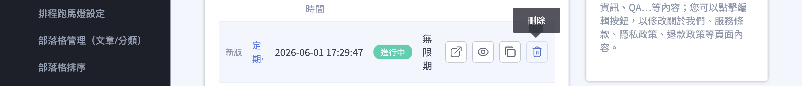

!!! warning "注意"
    自訂頁面一旦刪除即 **無法復原**，刪除前請確認該頁面已無使用，或先複製備份內容。

---

### 編輯多語系內容 { #operate-custom-pages-multilang }

若您的店家有開通多國語系，可為同一個頁面填寫各語言的內容：

1. **先儲存目前變更：** 切換語言前請先儲存目前編輯中的內容，否則系統會提示「編輯多國語言前，請先儲存變更中的內容」。
2. **切換語言：** 點擊頁面上的 **:lucide-globe: 語言** 圖示，選擇要編輯的語言。
3. **輸入該語言內容：** 在對應語言下填寫頁面名稱、網址與內容後儲存。各語言的內容會獨立保存。

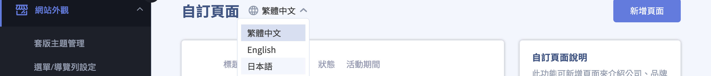

---

## 重要規範與限制 { #specs-custom-pages }

- **頁面型態由佈景主題決定：** 新版(拖拉式)頁面以區塊設計，於佈景主題編輯器編輯；一般(文字)頁面以文字編輯器撰寫內容。您無法自行切換型態。
- **刪除無法復原：** 刪除自訂頁面後內容不會保留，請謹慎操作。
- **排程僅新版頁面支援：** 上架/下架時間的排程功能僅適用於新版(拖拉式)頁面；一般文字頁面固定為無限期顯示。
- **網址前綴固定：** 自訂頁面網址固定為 `您的網域/pages/網址後綴`，您只能自訂後綴部分。
- **公開不等於上架到選單：** 頁面設為公開後仍需另外加入選單/導覽列，顧客才能在前台找到入口。

---

## 後續操作 { #next-steps-custom-pages }

- :lucide-menu:{ .lg }  
  [__設定選單/導覽列__](../navigation/setup-menus-navigation.md)  
  頁面建立後不會自動出現在前台，需到「選單/導覽列設定」將頁面網址加入頁頭或頁腳選單。

- :lucide-layout-dashboard:{ .lg }  
  [__拖拉版型網站設定__](../theme-and-layout/theme-editor.md){ title="拖拉版型網站設定" }  
  了解新版拖拉式頁面各區塊的詳細設定與應用範例。

- :lucide-globe:{ .lg }  
  [__多國語言設定__](../../website-management/setup-multi-language-and-multi-currency.md)     
  開通多國語系後，可為自訂頁面填寫各語言的對應內容。

- :lucide-square-code:{ .lg }  
  [__嵌入 Google 表單__](embed-google-form-custom-page.md)  
  透過「自訂 HTML」區塊嵌入表單，適合用於預約、諮詢、保固登記。

---

## 常見問題 { #faq-custom-pages }

??? quote "為什麼頁面儲存後，在官網前台找不到連結？"
    { #faq-custom-pages-not-shown-in-nav }
    自訂頁面儲存並設為公開後，只是讓該頁面網址可以被開啟， **不會自動顯示** 在官網的選單上。

    請前往「網站外觀」>「選單/導覽列設定」，把該頁面加入您的頁頭選單或頁腳選單，顧客才能在前台看到入口。

??? quote "頁面網址(後綴)可以使用中文嗎？"
    { #faq-custom-pages-slug-language }
    技術上可以，但 **強烈建議使用英文或數字**(例如 `about-us`)。

    - 英文網址在社群分享(如 Line、Facebook)時不會變成冗長亂碼。
    - 對 Google 搜尋引擎(SEO)更友善。

??? quote "為什麼有些頁面點進去是拖拉式區塊，有些卻是文字編輯器？"
    { #faq-custom-pages-version-difference }
    這取決於您店家目前使用的佈景主題。

    - 列表中標示 **「新版」** 的頁面為拖拉式頁面，點擊後進入佈景主題編輯器以區塊設計。
    - 未標示的頁面為一般文字頁面，點擊後進入編輯頁，於「內容描述」分頁以文字編輯器撰寫。

??? quote "如何設定頁面的上架與下架時間？"
    { #faq-custom-pages-schedule }
    排程功能僅適用於 **新版(拖拉式)** 頁面。請點擊該頁面進入佈景主題編輯器，於「檔期設定」設定上架時間與下架時間；未設定即視為無限期顯示。一般文字頁面沒有排程功能，狀態固定為「無限期」。

??? quote "刪除頁面後可以救回來嗎？"
    { #faq-custom-pages-delete-irreversible }
    無法救回。自訂頁面刪除後內容 **無法復原**，建議刪除前先複製或另存內容備份。

??? quote "在文字編輯器調整了顏色或樣式，前台看起來卻不一樣？"
    { #faq-custom-pages-paste-format }
    這通常是因為直接從 Word 或其他網頁貼上文字，帶入了隱形的樣式碼。

    建議先以純文字方式重新貼上，清除原有格式後，再用編輯器工具列重新設定樣式。必要時可切換到「原始碼」檢查並移除多餘語法。

??? quote "切換語言時，為什麼一直提示要先儲存？"
    { #faq-custom-pages-multilang-save }
    為避免遺失尚未儲存的修改，系統要求您 **先儲存目前語言的變更**，再切換到其他語言編輯。請先點擊「儲存」，再切換語言繼續編輯。

??? quote "如何讓特定的自訂頁面只給會員看？"
    { #faq-custom-pages-member-only }
    自訂頁面本身不具備鎖定權限的功能。若您希望該內容僅供會員參考（如 VIP 專屬優惠詳情），建議不要將連結放在官網導覽列，而是將網址填入 **會員 > 會員等級設定 > 會員等級說明連結**，這樣只有登入會員帳戶的消費者才會看到連結。

??? quote "頁面上的圖片顯示太慢或模糊，該如何優化？"
    { #faq-custom-pages-image-optimize }

    - **解析度**：請確保圖片寬度符合區塊需求。
    - **檔案大小**：單張圖片建議控制在 **500KB 以內**。您可以使用 TinyPNG 等工具壓縮後再上傳，以確保消費者開啟網頁的速度。

---

## 參考資料 { #reference-custom-pages }

- [自訂頁面可用區塊對照表](../references/custom-pages-blocks.md)

<!---->
<!-- --- -->
<!---->
<!-- 建立、設定與管理自訂頁面，包含基本設定、區塊設計與前台顯示方式。 -->
<!-- { .subtitle } -->
<!---->
<!-- ## 自訂頁面管理說明 -->
<!---->
<!-- **自訂頁面管理** 功能讓商家能彈性調整網頁內容與區塊架構，常用於建立公司簡介、品牌故事、QA 問答，或是修改服務條款、隱私政策、退換貨政策等法律頁面。 -->
<!---->
<!-- 以下為自訂頁面管理的詳細操作說明與教學： -->
<!---->
<!-- ## 設定路徑與新增頁面 -->
<!---->
<!-- !!! warning "版本限制" -->
<!-- 	2023 年以前的舊商家可能同時保有新、舊版頁面，但須注意 **舊版頁面一旦刪除便無法復原** （若仍想使用舊版僅能編輯）。 -->
<!---->
<!-- 1. **進入後台路徑**：登入 CYBERBIZ 管理後台，前往 **網站外觀 > 自訂頁面管理**。 -->
<!-- 2. **新增頁面**：點擊頁面右上角的 **新增頁面** 按鈕，並為頁面取名（此名稱主要供後台管理識別）。 -->
<!-- 3. **基本設定**： -->
<!--     - **更改網站網址 (Slug)**：您可以自訂該頁面的 URL 網址後綴。 -->
<!--     - **設定排程**：選擇「不指定排程時間」或設定特定的「開始/結束時間」。 -->
<!--     - **設定頁面 SEO**：編輯 **Meta Tag** （網頁標題、描述、關鍵字），有助於提升網頁在搜尋引擎中的排名。 -->
<!---->
<!-- 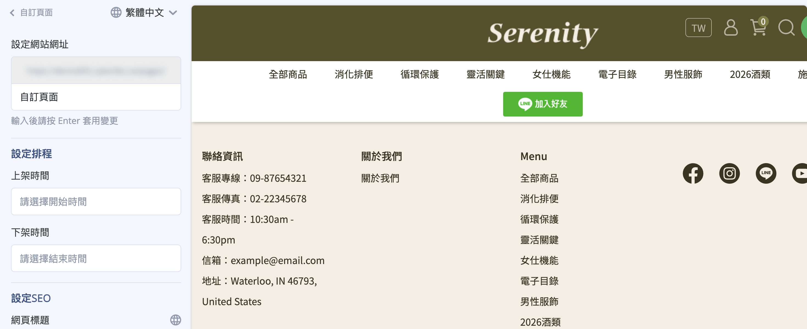 -->
<!---->
<!-- ## 頁面區塊設計 -->
<!---->
<!-- 進入頁面編輯後，您可以透過 **新增區塊** 加入不同的設計模組，打造豐富的版面： -->
<!---->
<!-- - **多媒體與廣告**：包含 **輪播素材**、 **橫幅廣告**、 **圖文介紹** 與 **影片設定**。 -->
<!-- - **商品展示**：可加入 **商品分類** 櫥窗或 **主打商品** 區塊。 -->
<!-- - **文字內容**： -->
<!--     - **文字編輯**：適合撰寫詳細的文章內容。 -->
<!--     - **折疊內容**：常用於設計官網 **FAQ** 或購物須知，點擊後才展開內文。 -->
<!---->
<!-- 	!!! warning "使用「文字編輯」區塊時，若從外部（如 Word 或其他網頁）複製內容，務必使用 **純文字貼上** 按鈕，避免帶入異常語法導致頁面跑版。" -->
<!---->
<!-- - **進階客製化**： -->
<!--     - **自訂 HTML**：可自行編寫語法或貼入外部程式碼，例如 [**嵌入 Google 表單**](embed-google-form-custom-page.md){ title="在自訂頁面中嵌入 Google 表單" }  （用於預約、諮詢、保固登記）或 **互動遊戲**。 -->
<!--     - **自訂排版設計**：可自由調整不同素材的螢幕占比與排列順序。 -->
<!---->
<!-- !!! info "瞭解 [各個區塊的詳細應用與範例](../theme-and-layout/theme-editor.md){ title="使用拖拉版型設計網站版面與首頁區塊" } 。" -->
<!---->
<!-- 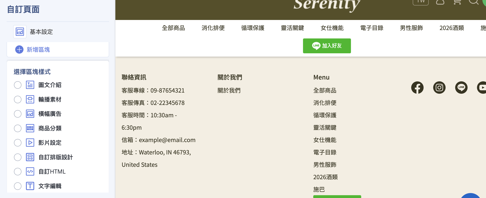 -->
<!---->
<!-- --- -->
<!---->
<!-- ## 後續操作 -->
<!---->
<!-- 
 -->
<!---->
<!-- - :lucide-menu:{ .lg }    -->
<!--   [__導覽列/頁腳__]()      -->
<!--   建立好的頁面需前往「 **選單/導覽列設定** 」綁定連結，消費者才能在前台看到。 -->
<!---->
<!-- - :lucide-crown:{ .lg }      -->
<!--   [__VIP 等級說明__]()   -->
<!--   可將自訂頁面連結至「VIP 設定」中的「 **會員等級說明連結** 」，讓會員在個人帳戶頁面查看等級優惠。 -->
<!---->
<!-- - :lucide-globe:{ .lg }   -->
<!--   [__多國語言設定__]()   -->
<!--   若商店有開通多國語系，可在編輯頁面找到 **:lucide-globe: 圖示**，切換語系後輸入對應語言的頁面內容。 -->
<!---->
<!-- - :lucide-file-code:{ .lg }   -->
<!-- [__在自訂頁面中嵌入 Google 表單__](embed-google-form-custom-page.md){ title="在自訂頁面中嵌入 Google 表單" }   -->
<!--   可利用「自訂 HTML」區塊嵌入 Google 表單，並手動將嵌入代碼中的 `width` 屬性修改為 `100%`，以確保表單能自動適應手機與電腦螢幕寬度。 -->
<!---->
<!-- 
 -->
<!---->
<!-- ## 常見問題 -->
<!---->
<!-- ??? quote "為什麼我儲存了頁面，但在官網前台找不到連結？"  -->
<!-- 	自訂頁面儲存後 **不會自動顯示** 在官網導覽列。 請前往 **網站外觀 > 選單/導覽列設定**，將該頁面新增至您的「頁頭選單」或「頁腳選單」中。 -->
<!---->
<!-- ??? quote "自訂頁面的網址 (Slug) 可以使用中文嗎？"  -->
<!-- 	技術上可以，但 **強烈建議使用英文或數字** （例如 `about-us`）。 英文網址在社群分享（如 Line、Facebook）時不會變成冗長的亂碼，且對 Google 搜尋引擎 (SEO) 更友善。 -->
<!---->
<!-- ??? quote "為什麼我在「文字編輯」區塊調整了顏色，但在前台看起來不一樣？"  -->
<!-- 	這通常是因為您直接從 Word 或其他網頁貼上文字，帶入了隱形的樣式代碼。 -->
<!---->
<!-- 	**解決方案**：請點擊編輯器中的「清除格式」圖示，或使用「純文字貼上」按鈕重新輸入文字後，再透過後台工具列進行調色。 -->
<!---->
<!-- ??? quote "如何讓特定的自訂頁面「只給會員看」？"  -->
<!-- 	自訂頁面本身不具備鎖定權限的功能。 若您希望該內容僅供會員參考（如：VIP 專屬優惠詳情），建議不要將連結放在官網導覽列，而是將網址填入 **會員 > 會員等級設定 > 會員等級說明連結**，這樣只有登入會員帳戶的消費者才會看到連結。 -->
<!---->
<!-- ??? quote "頁面上的圖片顯示太慢或模糊，該如何優化？"  -->
<!---->
<!-- 	- **解析度**：請確保圖片寬度符合區塊需求。 -->
<!-- 	- **檔案大小**：單張圖片建議控制在 **500KB 以內**。您可以使用 TinyPNG 等工具壓縮後再上傳，以確保消費者開啟網頁的速度。 -->
