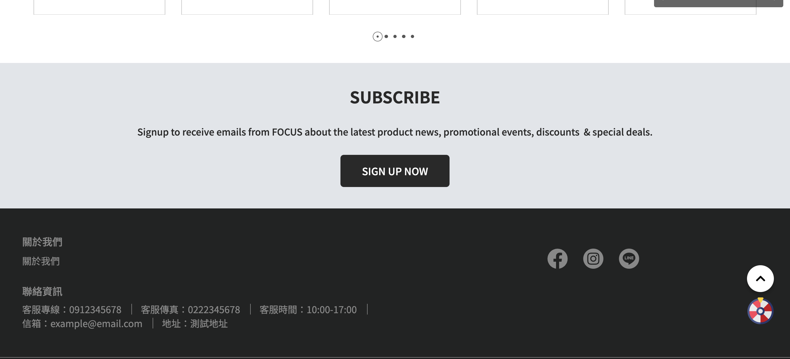
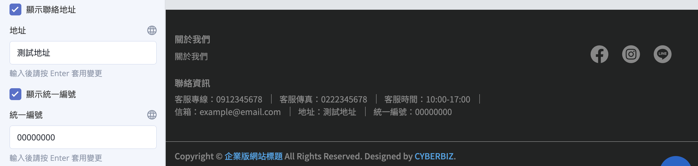
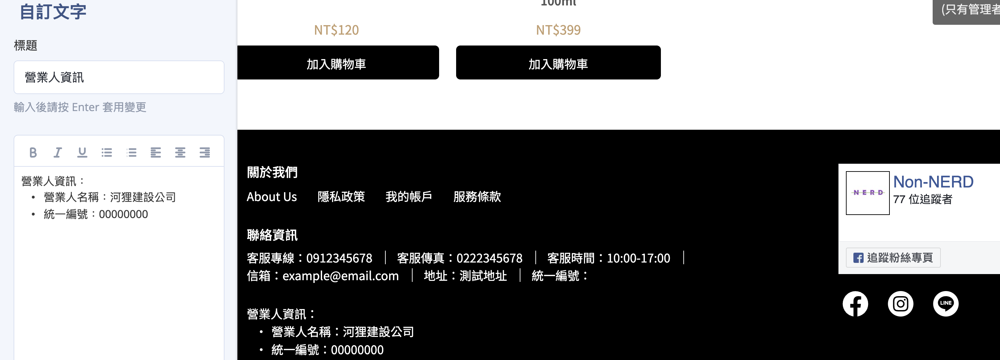
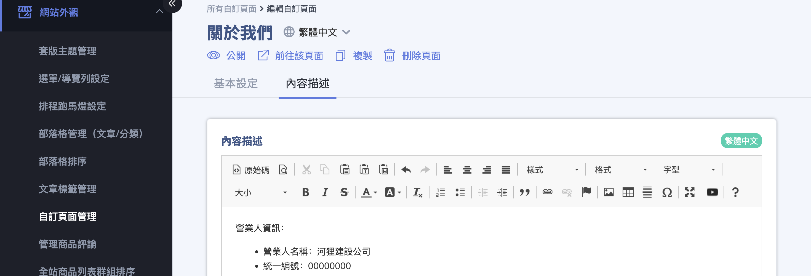
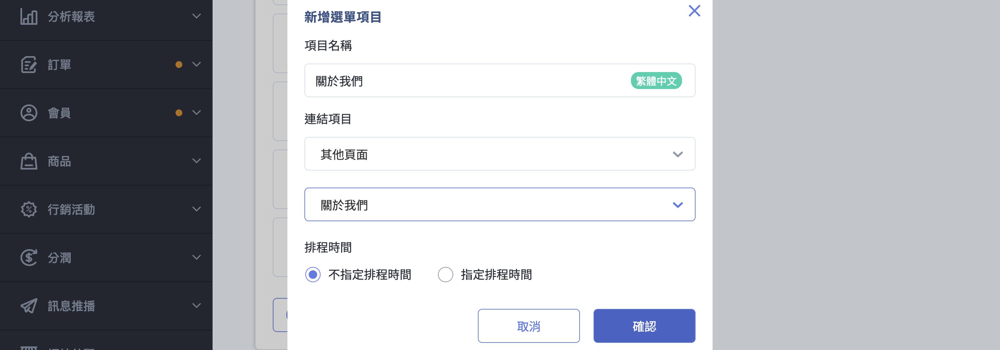
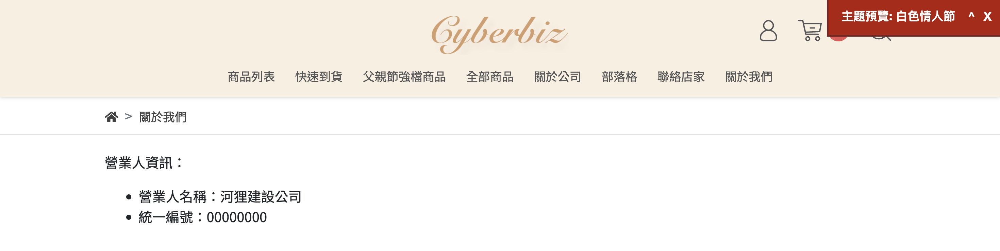

{ .hero-page }

## 營業人資訊揭露說明 { #intro-business-disclosure }

為配合財政部自民國 112 年 1 月 1 日起實施的規定，營業人透過網路販售商品或服務時，必須於網頁明顯處揭露「營業人名稱」及「統一編號」，供消費者辨識。

在 CYBERBIZ 中，完成這項揭露分為兩個層次：

- **後台公司資料**：在「一般設定」填入公司全稱、統一編號等基本資料，作為系統與前台顯示的資料來源。
- **前台明顯揭露**：在官網明顯處揭露營業人名稱與統一編號，讓消費者清楚看見，符合「明顯處」的要求。。

!!! info "提示"
    後台「一般設定」的統一編號與頁腳「聯絡資訊」的統一編號是兩個獨立欄位，兩處都建議填寫。詳見 [重要規範與限制](#specs-business-disclosure)。

## 使用前提與限制 { #prerequisites-business-disclosure }

開始設定前，請先確認下列項目：

- [x] **後台管理權限**：需具備「一般設定」與「網站外觀」的後台操作權限。
- [x] **已套用主題**：頁腳揭露需在官網主題上設定，請先確認已套用並發布一個官網主題。

!!! plan "方案 / 開通條件"
    - 「一般設定」的公司資料填寫，以及頁腳「聯絡資訊」的揭露設定，**所有方案皆可使用**，無需額外開通。
    - 若要使用 **拖拉版型** 的視覺化編輯器來調整頁腳，需先將官網發布主題設為「拖拉版型」(已包含於絕大多數付費方案)。使用「預設版型」的商家則於「網站設定」中設定，同樣可完成揭露。

## 操作步驟 { #operate-business-disclosure }

揭露作業分為兩個情境，建議依序完成。

### 填寫公司基本資料 { #operate-business-disclosure-company-info }

先在後台填妥公司資料，作為系統與前台顯示的來源。

1. **進入一般設定：** 前往後台路徑「網站功能設定」>「一般設定」。
2. **填寫網站名稱：** 在「關於您的網站」區塊，於「網站名」填入您的品牌或公司名稱，此名稱會顯示在網頁標題上。
3. **填寫公司聯絡資訊：** 在「公司聯絡資訊」區塊，依序填入「公司全稱」「統一編號」「電話」與「詳細地址」[^a]。
4. **儲存設定：** 確認資料無誤後，點選頁面下方的儲存按鈕。

[^a]: 「公司聯絡資訊」區塊上方註明「公司地址、電話等資訊，也會同步顯示在您的網頁上」，因此這裡填寫的資料會作為前台顯示的依據。

- :lucide-settings:{ .lg }
  [__設定網站基本資訊__](../../website-management/setup-store-basic-info.md#operate-general-preferences-company-info){ title="設定網站基本資訊" }

---

### 於官網揭露名稱與統一編號 { #operate-business-disclosure-footer }

為符合「明顯處」要求，建議將營業人名稱與統一編號設置於官網頁腳，讓消費者在每一頁最下方都看得到。頁腳的「聯絡資訊」區塊提供獨立的「顯示統一編號」開關與「統一編號」欄位，其餘可顯示欄位整理於 [頁腳聯絡資訊欄位對照表](../references/business-disclosure-footer-fields.md#footer-contact-fields){ data-preview }。

=== "拖拉版型"

    1. **進入主題編輯器：** 前往「網站外觀」>「套版主題管理」，於發布中的拖拉版型主題點選進入編輯。
    2. **開啟頁腳聯絡資訊：** 在編輯器中點選頁面最下方的「頁腳」，找到「聯絡資訊」設定區塊。
    3. **開啟並填入統一編號：** 勾選「顯示統一編號」，並在「統一編號」欄位填入您的統編。
    4. **補齊其他聯絡方式：** 一併確認「地址」「聯絡電話」等欄位已填寫並開啟顯示。
    5. **儲存並發布：** 儲存後，資訊即顯示於官網最下方的頁腳。

    

    ??? tip "在頁腳一併顯示營業人名稱"

        頁腳「聯絡資訊」區塊只有統一編號，沒有公司名稱欄位。若要在頁腳一併揭露完整的營業人名稱，請於頁腳新增一個「自訂文字」區塊：

        1. 在頁腳編輯區點選新增「自訂文字」區塊。
        2. 於「標題」或文字內容輸入您的營業人名稱(公司全稱)。
        3. 儲存後，名稱即與統一編號一同顯示於頁腳，揭露資訊更完整。

        

=== "預設版型"

    預設版型的頁腳沒有「顯示統一編號」開關。揭露方式是建立一個獨立頁面放置揭露內容，再將該頁面加入網站導覽列：

    1. **建立揭露頁面：** 前往「網站外觀 > 自訂頁面管理」，點選「新增頁面」，輸入頁面名稱(例如「關於我們」[^b])，並在內容填入營業人名稱、統一編號與聯絡資訊。

        

    [^b]: 若已有相關頁面(如「關於我們」)，可於自訂頁面管理點選進入編輯，補上營業人名稱與統一編號即可。

    2. **加入導覽列：** 至「網站外觀 > 選單/導覽列設定 > 主選單」，點擊「新增連結」。輸入連結名稱，連結項目選擇「自訂頁面」並選取先前建立的頁面。將此頁面加入導覽列後，顧客即可從前台點選查看。

        

    3. **確認前台顯示：** 儲存後，顧客即可從前台導覽列(例如「關於我們」)進入頁面，查看揭露的營業人名稱與統一編號。

        

---

## 重要規範與限制 { #specs-business-disclosure }

- **兩處統一編號各自獨立：** 後台「一般設定」的統一編號供系統作業使用(例如電子發票)，前台頁腳「聯絡資訊」的統一編號則是顯示給消費者看的揭露文字，兩者不會互相帶入，請務必兩處都填寫。
- **頁腳需手動開啟顯示：** 即使填了統一編號，仍需勾選頁腳的「顯示統一編號」，前台才會顯示。
- **資訊一致性：** 若您有申請第三方金流或服務，後台填寫的網站名稱／公司名稱建議與申請表單一致，並於頁腳附上完整聯絡方式(電話、地址、Email)，以利審核。
- **僅自有官網的揭露原則：** 若您僅使用 CYBERBIZ 建立自有販售官網，於網站內清楚揭露營業人名稱與統一編號即可，無須比照在第三方平台販售時的額外帳號資訊要求。
- **日本站特別要求：** 若經營日本站，須另依[日本《特定商取引法》](jp-legal-compliance-page.md)建立專屬頁面，揭露販售業者名稱、負責人、所在地與聯絡方式，並將該頁面連結放入頁腳。

---

## 後續操作 { #next-steps-business-disclosure }

- :lucide-palette:{ .lg }  
  [__套用與更換網站主題__](../theme-and-layout/apply-and-switch-theme.md)  
  更換或切換官網版型，調整整體視覺風格。

- :lucide-cookie:{ .lg }  
  [__設定 Cookie 提示彈窗__](../code-customization/setup-cookie-consent-banner.md){ title="設定 Cookie 提示彈窗" }  
  透過第三方工具產生 Cookie 同意彈窗，與隱私權政策頁面互相搭配。

---

## 常見問題 { #faq-business-disclosure }

??? quote "統一編號填了，前台頁腳卻沒有顯示？"
    { #faq-business-disclosure-not-shown }
    頁腳的統一編號需要另外開啟顯示。請至官網主題的頁腳「聯絡資訊」設定，確認已勾選「顯示統一編號」，並在「統一編號」欄位填入統編後儲存。

    - 請確認您修改的是目前「發布中」的主題，而非未發布的主題。
    - 修改後記得儲存(拖拉版型需再發布)，前台才會更新。

??? quote "一般設定填的統一編號，和頁腳的統一編號是同一個嗎？"
    { #faq-business-disclosure-two-fields }
    不是。這是兩個獨立欄位：

    - 「一般設定」的統一編號供系統作業使用，例如開立電子發票。
    - 頁腳「聯絡資訊」的統一編號是顯示給消費者看的揭露文字。

    兩處不會互相帶入，建議都填寫，以同時滿足系統作業與法規揭露需求。

??? quote "營業人名稱要填哪一個欄位？"
    { #faq-business-disclosure-merchant-name }
    後台「一般設定」的「公司全稱」即為您的營業人(公司)正式名稱；「網站名」則是顯示於網頁標題的品牌名稱。建議於頁腳一併呈現公司全稱，與統一編號並列，作為對外揭露的營業人名稱。

---

## 參考資料 { #reference-business-disclosure }

- [頁腳聯絡資訊欄位對照表](../references/business-disclosure-footer-fields.md)

