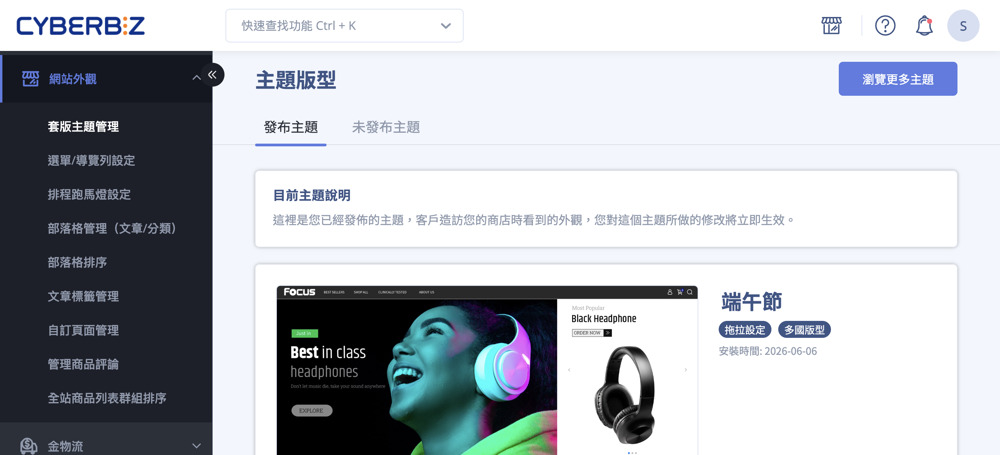
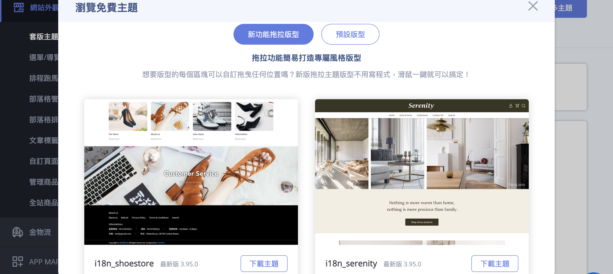
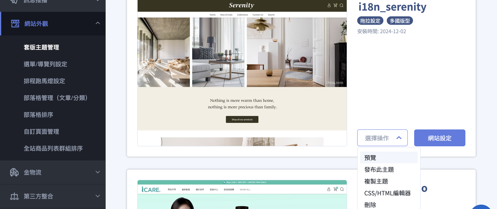
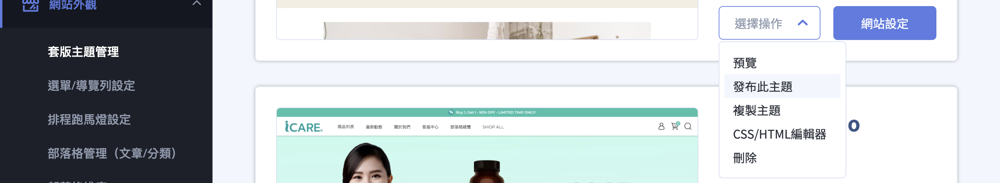
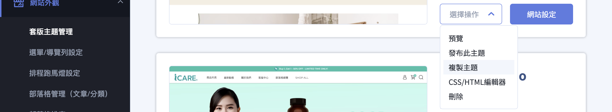

{ .hero-page }

## 套版主體管理說明 { #intro-theme }

「套版主題管理」是您管理官網外觀的中心。您可以同時擁有多個主題，並依需求隨時切換目前對外顯示的版型。頁面以兩個分頁管理主題：

- **發布主題**：目前正式對外、顧客實際看到的版型，對它的修改會立即生效。
- **未發布主題**：已下載但尚未上線的版型，可在這裡先行編輯與預覽，確認無誤後再發布。

系統提供兩大類版型供您選擇，完整差異整理於 [主題類型對照表](../references/theme-types.md){ data-preview }：

- **拖拉版型**：無需撰寫程式碼，透過滑鼠點選與拖曳即可自訂各區塊的位置與版面，並支援最新的前台功能。
- **預設版型**：開放 HTML、CSS、JS 語法做深度客製，適合具備技術背景、需要高度自訂的商家。

!!! info "提示"
    系統已不再更新「預設版型」。若您想使用最新的前台功能，建議改用「拖拉版型」。

---

## 頁面功能總覽 { #overview-theme }

進入頁面後，您會看到上方兩個分頁與右上角的入口按鈕：

| 區塊／入口 | 用途 |
| :-- | :-- |
| 發布主題（分頁） | 顯示目前正式上線、顧客看到的主題，這裡的修改會立即生效 |
| 未發布主題（分頁） | 管理已下載但尚未上線的主題，可編輯、預覽、複製或刪除 |
| 瀏覽更多主題（按鈕） | 開啟主題庫，瀏覽並下載免費主題 |

每個主題卡片上會顯示主題名稱、安裝時間，以及版型標籤(例如「拖拉設定」或「多國版型」)，方便您辨識不同版本。

---

## 使用前提與限制 { #prerequisites-theme }

開始下載與更換主題前，請留意以下兩點：

- [x] **方案內主題數量上限**：每間商店可安裝的主題數量有上限，實際數量依您目前的方案而定。達上限時系統會顯示「主題數已達上限」，需先刪除未使用的主題才能再下載新主題。
- [x] **多國語言網站**：若您經營多國語言官網(例如北美站、日本站)，請於主題庫中選擇標有「多國版型」標籤的主題，以確保前台語言切換功能正常運作。

---

## 操作步驟 { #operate-theme }

以下依常見情境分段說明，您可以依需求跳到對應段落。

### 下載新主題 { #operate-theme-download }

1. 在「套版主題管理」頁面右上角，點選 **「瀏覽更多主題」**。
2. 系統開啟主題庫，上方可切換 **「新功能拖拉版型」** 與 **「預設版型」** 兩類版型[^a]。
3. 瀏覽主題並找到喜歡的版型，點選該主題卡片上的 **「下載主題」**。
4. 下載完成後系統顯示「安裝成功」，並自動將您帶往 **「未發布主題」** 分頁。此時新主題 **尚未上線**，需要再手動發布才會生效。

[^a]: 切換到「預設版型」分類時，系統會提醒此類版型已停止更新，建議改用拖拉版型；多國語言商店的主題庫內容會依商店所在地區自動調整。

!!! note "註釋"
    下載主題只是把版型加入您的「未發布主題」，不會影響目前對外的官網。您可以放心先下載、慢慢編輯，確認後再發布。

---

### 編輯尚未上線的主題 { #operate-theme-edit }

在「未發布主題」分頁，每個主題卡片都有「選擇操作」下拉選單與「網站設定」按鈕：

1. **調整版面與內容**：點選 **「網站設定」**，進入該主題的設定畫面調整版面、文字與圖片[^b]。
2. **深度客製**：於「選擇操作」選單選擇 **「CSS/HTML編輯器」**，可編輯該主題的 HTML、CSS 等程式碼。
3. **預覽效果**：於「選擇操作」選單選擇 **「預覽」**，系統會另開分頁，以該主題實際呈現您的官網。
4. **重新命名**：直接點選主題名稱即可修改，方便您辨識不同版本。

[^b]: 拖拉版型會進入拖拉式編輯器；預設版型則進入網站設定頁。

---

### 發布主題上線 { #operate-theme-publish }

1. 切換到 **「未發布主題」** 分頁，找到要上線的主題。
2. 在該主題的 **「選擇操作」** 選單中，選擇 **「發布此主題」**。
3. 系統彈出確認視窗，說明此操作會替換您目前的主題，並把原主題移至「未發布主題」保留。確認後點選 **「確認並發布」**。
4. 發布完成後顯示「主題發布成功」，系統將您帶回 **「發布主題」** 分頁，新主題即正式對外生效。

!!! tip "技巧"
    發布前建議先用「預覽」確認版面。各主題設定互相獨立，新主題會以它自己的設定呈現，不會沿用前一個主題的設定。

---

### 複製主題 { #operate-theme-duplicate }

1. 在主題的 **「選擇操作」** 選單選擇 **「複製主題」**。
2. 系統開始在背景複製，過程中顯示「複製主題進行中」，完成後顯示「複製主題成功」。
3. 複製出的主題會以「複製＋原名稱」出現在「未發布主題」，可獨立編輯，不影響原主題[^c]。

[^c]: 若已達方案的主題數量上限或商店容量不足，系統會分別提示「主題數已達上限」或「容量不足」，此時需先刪除未使用的主題。

---

### 刪除主題 { #operate-theme-delete }

1. 切換到 **「未發布主題」** 分頁(發布中的主題無法刪除)。
2. 在要刪除的主題 **「選擇操作」** 選單中選擇 **「刪除」**。
3. 系統彈出確認視窗，確認後該主題即被移除，並顯示「主題刪除成功」。

---

## 重要規範與限制 { #specs-theme }

### 各主題的設定互相獨立 { #specs-theme-independent-settings }

每個主題都各自保存自己的「網站設定」與「CSS/HTML編輯器」內容。切換到另一個主題時，不會把目前主題的設定帶過去；新下載的主題會以它自己的預設外觀呈現。

---

### 發布是「替換」而非「刪除」 { #specs-theme-publish-replace }

發布一個未發布主題時，原本發布中的主題會被移到「未發布主題」分頁，其設定完整保留。日後您可以再把它發布回來，不會遺失先前的客製內容。

---

### 發布中的主題無法直接刪除 { #specs-theme-delete-rule }

「發布主題」分頁中的主題不提供刪除選項。如需移除，請先發布另一個主題，待目標主題移到「未發布主題」後，再從「選擇操作」選單刪除。

---

### 預設版型已停止更新 { #specs-theme-default-deprecated }

預設版型不再推出新功能與更新。新開店或改版時，建議優先選擇拖拉版型，以使用最新的前台功能。

---

## 後續操作 { #next-steps-theme }

- :lucide-layout-template:{ .lg }  
  [__使用拖拉式編輯器__](theme-editor.md){ title="使用拖拉版型編輯器調整網站版面" }  
  以拖拉方式調整拖拉版型的各區塊版面與內容。

- :lucide-code:{ .lg }  
  [__CSS/HTML 編輯器__](../code-customization/theme-editor-complete-guide.md){ title="樣板編輯器操作全攻略" }  
  撰寫程式碼，對主題進行深度視覺客製。

- :lucide-languages:{ .lg }  
  [__多國語系設定__](../site-settings/setup-storefront-language-text-customization.md){ title="設定前台語系與文字自定義" }  
  搭配多國版型，設定不同語言的前台呈現。

- :lucide-cookie:{ .lg }  
  [__設定 Cookie 提示彈窗__](../code-customization/setup-cookie-consent-banner.md){ title="設定 Cookie 提示彈窗" }  
  透過 CSS/HTML 編輯器貼入 Cookie 同意彈窗程式碼，符合 GDPR 規範。

---

## 常見問題 { #faq-theme }

??? quote "下載主題後，為什麼官網外觀沒有改變？"
    { #faq-theme-download-not-live }
    下載只是把主題加入「未發布主題」，不會自動上線。請到「未發布主題」分頁，於該主題的「選擇操作」選單選擇「發布此主題」並確認，新主題才會正式生效。

??? quote "更換主題後，原本的設定還在嗎？"
    { #faq-theme-settings-kept }
    在。發布新主題時，原本發布中的主題會被移到「未發布主題」並完整保留設定，您隨時可以把它再發布回來。需留意每個主題的設定互相獨立，新主題會以它自己的預設外觀呈現，不會自動沿用舊主題的客製內容。

??? quote "為什麼找不到刪除主題的選項？"
    { #faq-theme-cannot-delete }
    發布中的主題無法刪除。請先發布另一個主題，待目標主題移到「未發布主題」後，再從「選擇操作」選單刪除。

??? quote "想下載新主題卻出現「主題數已達上限」？"
    { #faq-theme-limit-reached }
    每間商店可安裝的主題數量有上限，實際數量依您的方案而定。請先到「未發布主題」刪除不再使用的主題，再重新下載。

??? quote "多國語言網站要選哪一種主題？"
    { #faq-theme-multi-language }
    請選擇主題卡片上標有「多國版型」標籤的版型，以確保前台語言切換功能正常運作。

---

## 參考資料 { #reference-theme }

- [主題類型對照表](../references/theme-types.md)
