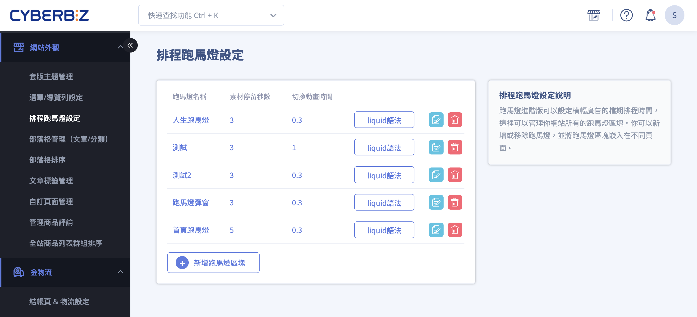
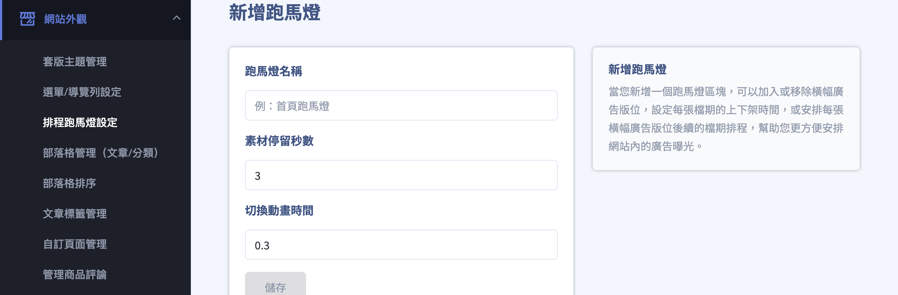
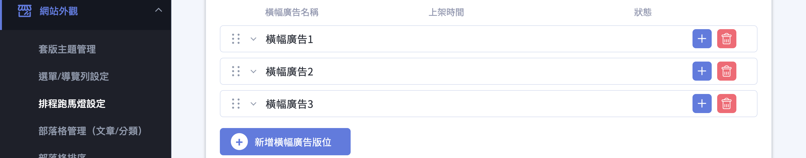
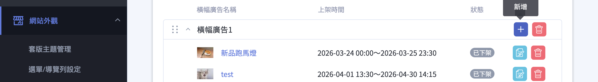
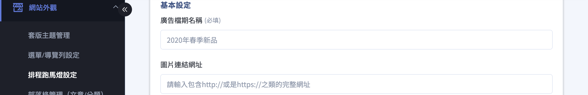
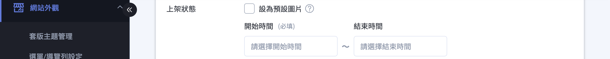
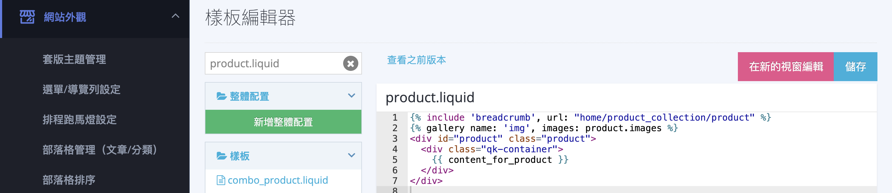

{ .hero-page }

## 排程跑馬燈說明  { #intro-scheduled-carousel }

排程跑馬燈採「區塊 > 版位 > 檔期」三層結構：先建立一個跑馬燈區塊，在區塊中放入多個輪播版位，再為每個版位安排不同時間的廣告檔期，最後把區塊嵌入想顯示的頁面。

!!! info "提示"
    排程跑馬燈為所有方案皆可使用的功能，無須額外開通。它與一般首頁內建跑馬燈不同之處在於：排程跑馬燈可針對每張廣告設定上下架的檔期時間。

## 頁面結構總覽 { #overview-scheduled-carousel }

| 層級 | 名稱 | 說明 | 數量上限 |
| :-- | :-- | :-- | :-- |
| 第一層 | 跑馬燈區塊 | 一組可嵌入頁面的輪播廣告，有自己的名稱與輪播秒數。 | 每個商店最多 10 個 |
| 第二層 | 橫幅廣告版位 | 區塊中的一個輪播位置，可在其中排入多個不同檔期的圖片。 | 每個區塊最多 10 組 |
| 第三層 | 廣告檔期 | 版位中的單一張廣告，可設定圖片、連結與上下架時間。 | 無數量上限 |


??? info-clean "結構示意圖"
    ``` mermaid
    graph TD
        B1["跑馬燈區塊<br/>(可嵌入頁面)"]

        B1 --> S1>橫幅廣告版位 1]
        B1 --> S2>橫幅廣告版位 2]
        B1 --> Sn>…最多 10 組版位]

        S2 --> C1(["廣告檔期：預設圖片<br/>(常駐，每版位限 1 張)"])
        S2 --> C2(["廣告檔期：排程 A<br/>(設定上下架時間)"])
        S2 --> C3(["廣告檔期：排程 B<br/>(時間不可與 A 重疊)"])
        S2 --> Cn(["…檔期數量無上限"])
    ```
## 操作步驟 { #operate-scheduled-carousel }

### 建立跑馬燈區塊 { #operate-scheduled-carousel-create-block }

1. **進入設定頁：** 於後台點選「網站外觀」>「排程跑馬燈設定」，進入跑馬燈管理頁面。
2. **新增區塊：** 點選 **「新增跑馬燈區塊」** 。
3. **填寫基本設定後儲存：** 設定下列欄位，完成後點選 **「儲存」** 。
    * **跑馬燈名稱** ：僅供內部辨識(例：首頁跑馬燈)，不會顯示於前台，且名稱不可重複。
    * **素材停留秒數** ：每張圖片停留的秒數(例：3 秒)。
    * **切換動畫時間** ：圖片切換時的動畫長度(例：1.5 秒)。



---

### 新增橫幅廣告版位 { #operate-scheduled-carousel-add-slot }

1. **新增版位：** 在跑馬燈區塊設定頁(點擊跑馬燈名稱進入)中，點選 **「新增橫幅廣告版位」** 加入一個版位，每個區塊最多可新增 10 組版位[^slots]。
2. **理解版位用途：** 每個版位代表前台輪播中的「一個輪播位置」，可在其中安排多張不同檔期的廣告，系統會依排程時間自動換檔上下架。

[^slots]: 超過 10 組時，系統會出現「橫幅廣告不能超過10組」的提示。



---

### 新增廣告檔期與排程 { #operate-scheduled-carousel-add-schedule }

在每個橫幅廣告版位中，可設定具體的廣告內容與上架時間：

1. **新增檔期：** 在版位中點選新增，進入 **「新增廣告檔期」** 頁面。

    

2. **填寫基本資訊：**
    * **廣告檔期名稱** (例：2020年春季新品)。
    * **圖片連結網址** ：顧客點擊圖片後要導向的網址，須填寫完整網址(包含 `http://` 或 `https://`)。

    

3. **設定上架方式：** 以下兩種擇一。

    * 勾選 **「設為預設圖片」** ：作為常駐圖片，不需設定時間[^default]。
    * 不勾選：於 **「上架狀態」** 設定 **「開始時間」** 與 **「結束時間」** 進行排程，同一版位內排程檔期的時間不可重疊[^overlap]。

    

4. **上傳圖片：** 於 **「圖片設定」** 分別上傳電腦版、平板版、手機版圖片(至少須上傳電腦版)，每張不超過 1MB，支援 JPG、PNG、JPEG、GIF 格式。

    

5. **儲存：** 點選 **「儲存」** 完成設定；點選 **「返回列表」** 回到區塊設定頁。

設定完成後，版位中每張檔期會依目前時間顯示「預設、已上架、未上架、已下架」等狀態，詳見 [廣告檔期狀態對照表](../references/scheduled-carousel-statuses.md#reference-scheduled-carousel-statuses){ data-preview }。

[^default]: 每個版位只能設定一張預設圖片。預設圖片是常駐廣告，當該版位沒有其他正在上架的排程檔期時就會顯示。若要更換，需回到原本的預設檔期取消勾選「設為預設圖片」，或直接替換該檔期的圖片。
[^overlap]: 若設定的時間與版位內既有檔期重疊，系統會提示「當前設定時間與『◯◯』上下架時段重疊，請選擇其他時段」，需改選其他不重疊的時段。


---

### 將跑馬燈顯示在前台 { #operate-scheduled-carousel-display }

跑馬燈區塊建立後，還需要嵌入頁面才會顯示。請依您使用的版型選擇對應方式：

=== "拖拉版型：首頁顯示"
    1. 進入「網站外觀」>「套版主題管理」>「網站設定」>「自訂排版設計」。
    2. 點選「新增區塊」，加入 **「排程跑馬燈」** 區塊。

        

    3. 在 **「跑馬燈名稱」** 欄位選擇先前建立好的跑馬燈區塊，儲存後即會顯示於首頁。(右方可預覽效果)
    4. 點選建立好的跑馬燈，可進入編輯頁設定 **「版面螢幕佔比」** 等版面細項。

        

=== "拖拉版型：彈窗顯示"
    1. 於「網站設定」中新增 **「彈窗廣告」** 。
    2. 區塊類型選擇 **「排程跑馬燈」** ，並指定要顯示的跑馬燈區塊。
    3. 儲存後，跑馬燈會以彈窗形式顯示在前台。

    

=== "一般版型：貼上 Liquid 語法"
    1. 於排程跑馬燈設定頁，點選該跑馬燈的 **「liquid語法」** 並複製。

        

    2. 進入「網站外觀」>「套版主題管理」>「CSS/HTML編輯器」。

        

    3. 將語法貼到想顯示的頁面檔案中，例如首頁 `index.liquid`、商品頁 `product.liquid`。

        ``` html hl_lines="8" title="product.liquid"
        
        
        <div id="product" class="product">
          <div class="qk-container">
            {{ content_for_product }}
          </div>
        </div>
         <!-- (1)! -->
        ```

        1.  複製的跑馬燈 liquid 程式碼。此功能放置位置並無特殊規定，請商家自行放置適合您網站的位置。

        ??? info "可用的頁面範本一覽"
            | 檔案 | 適用頁面 |
            | :-- | :-- |
            | `index.liquid` | 首頁 |
            | `product.liquid` | 商品頁 |
            | `collection.liquid` | 自訂群組頁 |
            | `category.liquid` | 多層級分類頁 |
            | `blog.liquid` | 部落格頁面 |
            | `article.liquid` | 部落格文章頁面 |

---

## 重要規範與限制 { #specs-scheduled-carousel }

!!! note "數量上限"
    * 每個商店最多可建立 **10** 個跑馬燈區塊。
    * 每個跑馬燈區塊最多可新增 **10** 組橫幅廣告版位。
    * 每組版位的廣告檔期數量沒有上限。

!!! note "排程與圖片規範"
    * 同一版位內，「排程檔期」的上下架時間不可彼此重疊；「預設圖片」則不受時間限制，且每個版位只能有一張。
    * 每張圖片不超過 **1MB** ，支援 JPG、PNG、JPEG、GIF 格式，且至少須上傳電腦版圖片。
    * 建議圖片尺寸：電腦版 1440x800px、平板版 960x760px、手機版 480x370px。
    * 跑馬燈名稱不可重複。

---

## 後續操作 { #next-steps-scheduled-carousel }

<div class="grid cards" markdown>

- :lucide-layout-dashboard:{ .lg }  
  [__自訂排版設計（拖拉版型）__](setup-theme-page-settings.md#section-custom-blocks)  
  將排程跑馬燈加入首頁版面，調整顯示位置。

<!--
- :lucide-megaphone:{ .lg }  
  [__彈窗廣告__](popup-ads.md)  
  以彈窗形式在所有頁面顯示跑馬燈。

- :lucide-code:{ .lg }  
  [__套版主題管理__](theme-editor.md)  
  於 CSS/HTML 編輯器貼上 Liquid 語法嵌入跑馬燈。
-->

</div>

---

## 常見問題 { #faq-scheduled-carousel }

??? quote "跑馬燈設定好了，前台卻沒有顯示？"
    [](){ #faq-scheduled-carousel-not-showing }
    建立跑馬燈區塊後，還需要把它嵌入頁面才會顯示。請依版型完成嵌入：

    - 拖拉版型：於「自訂排版設計」新增「排程跑馬燈」區塊並選擇該跑馬燈。
    - 拖拉版型彈窗：於「彈窗廣告」選擇「排程跑馬燈」。
    - 一般版型：複製「liquid語法」貼到主題檔案中。

    詳細步驟請見 [將跑馬燈顯示在前台](#operate-scheduled-carousel-display)。

??? quote "設定排程時，系統提示時段重疊無法儲存？"
    [](){ #faq-scheduled-carousel-overlap }
    同一個版位內，非預設的廣告檔期上下架時間不可彼此重疊。請調整開始或結束時間，避開與其他檔期重疊的時段；若想讓某張圖片不受時間限制常駐顯示，可改用「設為預設圖片」。

??? quote "預設圖片是什麼？要怎麼更換？"
    [](){ #faq-scheduled-carousel-default-image }
    預設圖片是版位的常駐廣告，當該版位沒有其他正在上架的排程檔期時就會顯示。每個版位只能有一張預設圖片。若要更換，需回到原本的預設檔期取消勾選「設為預設圖片」，或直接替換該檔期的圖片。

??? quote "圖片無法上傳？"
    [](){ #faq-scheduled-carousel-image-upload }
    請確認圖片符合下列規範：

    - 檔案大小不超過 1MB。
    - 格式為 JPG、PNG、JPEG 或 GIF。
    - 每個檔期至少需上傳電腦版圖片，平板版與手機版可視需求補上。

??? quote "怎麼調整圖片輪播的速度？"
    [](){ #faq-scheduled-carousel-speed }
    在跑馬燈區塊設定中調整兩個欄位：「素材停留秒數」控制每張圖片停留的時間，「切換動畫時間」控制圖片切換時的動畫長度。

??? quote "跑馬燈出現破版／跑版該如何修正？"
    [](){ #faq-scheduled-carousel-layout-break }
    可能是因為版型較舊，所以您的版型沒有跑馬燈的樣式語法，這時只要到「CSS/HTML編輯器」>「theme.liquid」的 `<head>` 區塊內加上 `{{ content_for_header }}` 即可。

---

## 參考資料 { #reference-scheduled-carousel }

- [廣告檔期狀態對照表](../references/scheduled-carousel-statuses.md)

