---
acoiv:
apis:
search:
  exclude: false
title: 全站共用設定
description: 設定拖拉版型的全站共用設定，包含彈窗廣告、顏色、品牌識別、SEO、商品顯示行為與動態標籤。
created:
last_modified: 2026-07-22 16:23
lang: zh-TW
permalink: "https://help.cyberbiz.io/ec/website-appearance/theme-and-layout/setup-global-theme-settings/"
type: guide
author: Jase
reviewers: []
notes: []
ga_views: 0
feedback: 0
products:
  - EC
modules:
  - 網站外觀
sites:
  - TW
audiences:
  - merchant
difficulty: intermediate
tnb: trunk
plans:
  - 企業
  - 專業
  - 專業PLUS
  - 進階
  - 進階PLUS
  - 高手
  - 高手PLUS
cyb_extensions: []
intents:
  - 設定全站共用設定
  - 自訂官網外觀
  - 管理商品顯示行為
  - 設定彈窗廣告
  - 優化網站SEO
features:
  - 全站共用設定
  - 彈窗廣告
  - 導覽列與頁腳
  - 顏色設定
  - SEO設定
  - 商品顯示設定
  - 動態標籤
  - 品牌識別
prerequisites:
  - 已使用拖拉版型
  - 後台管理員權限
related: []
tags:
  - 拖拉版型
  - 全站共用設定
  - 彈窗廣告
  - 顏色設定
  - SEO
  - 商品顯示
  - 動態標籤
devices:
  - desktop
  - tablet
  - mobile
ui_components: []
paths:
  - 網站外觀 > 套版主題管理
layouts:
  - draggable
wp_url: []
icon: lucide/settings-2
hide:
comments: false
---

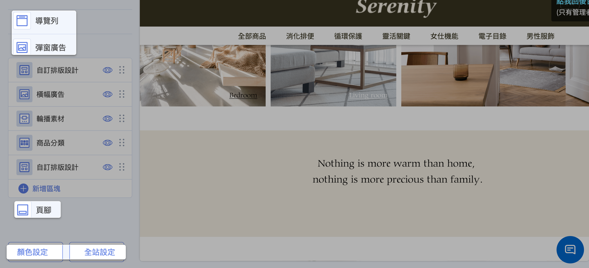{ .hero-page }

## 全站共用設定說明 { #intro-global-settings }

全站共用設定不屬於單一頁面，而是套用到 **整個官網**。在拖拉版型編輯器左側面板下方，可直接點選導覽列、彈窗廣告、頁腳、顏色設定與全站設定，無需先點擊某個名為「全站共用設定」的按鈕。

全站共用設定位於拖拉版型編輯器中，請先參閱 [拖拉版型網站設定](theme-editor.md){ title="拖拉版型網站設定" } 了解如何進入編輯器。

## 使用前提與限制 { #prerequisites-global-settings }

開始之前，請先確認以下條件：

- [x] **已進入拖拉版型編輯器：** 需先開啟拖拉版型編輯器，請見 [進入拖拉版型編輯器](theme-editor.md#operate-theme-editor-enter){ title="進入拖拉版型編輯器" }。
- [x] **已使用拖拉版型：** 只有標示「拖拉設定」的版型才適用本文的設定。

!!! plan "方案顯示差異"
    部分設定(如顏色設定)在 POS 獨賣方案不會顯示；實際項目依您的方案與已開通功能而定。

---

## 操作步驟 { #operate-global-settings }

### 導覽列與頁腳 { #navbar-footer }

導覽列與頁腳的設定較完整，另有專文說明：

- :lucide-menu:{ .lg }  
  [__導覽列__](../navigation/setup-menus-navigation.md){ title="設定選單與導覽列" }  
  可設定選單排列樣式（預設／併排置左／併排置右）、背景是否透明，以及次選單是否同步展開。

- :lucide-arrow-down-to-line:{ .lg }  
  [__頁腳__](../navigation/setup-menus-navigation.md#頁腳內容){ title="設定選單與導覽列" }  
  提供「上下」或「左右」排序樣式，並可開啟社群媒體圖示的顯示與連結。

---

### 彈窗廣告 { #popup }

彈窗廣告會在顧客進站時自動跳出。在全站共用設定中可選擇以下內容形式，並設定顯示條件：

1. 在編輯器左側面板下方，點選「彈窗廣告」。
2. 選擇彈窗內容形式：

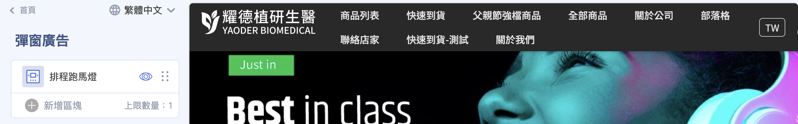

=== "圖片彈窗"

    1. 上傳電腦版、平板版與手機版圖片（電腦版為必填；平板與手機版未上傳時自動沿用電腦版圖片）。
    2. 設定 **縮圖大小**（小／中／大），控制彈窗縮小後的小圖示尺寸。未上傳時預設使用電腦版圖片。
    3. 設定 **圖片連結**，點擊彈窗後前往指定頁面或網址。
    4. 若希望顧客在不離開官網的情況下開啟連結，勾選「在新分頁開啟連結」。

    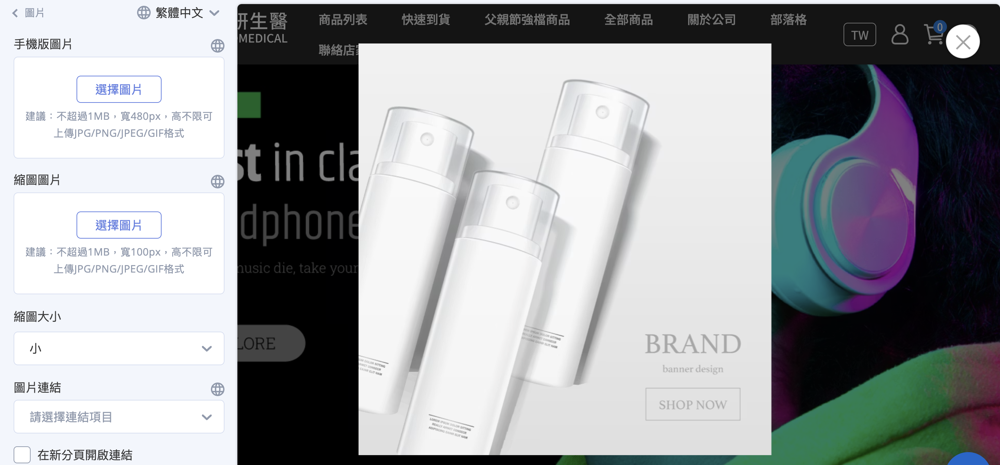

    ??? note "彈窗的顯示與收合行為"
        圖片彈窗沒有「顯示頻率」欄位，顯示邏輯由系統自動處理：進站時自動展開，顧客縮小後會記憶 **24 小時** 不再自動彈出；購物車／結帳頁則不會顯示彈窗。

        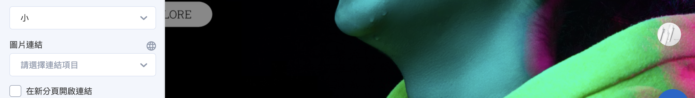

=== "影片彈窗"

    1. 貼入 YouTube 影片連結。
    2. 按 ++enter++ 套用變更。

    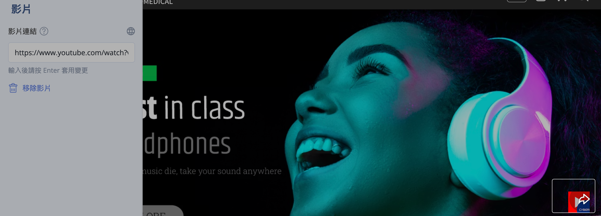

=== "互動遊戲"

    1. 從下拉選單選擇已建立的「輪盤遊戲」或「紅包抽獎」。
    2. 前往 [互動遊戲設定指南](../../marketing/other-tools/interactive-games.md){ title="互動遊戲 (EC)" } 建立輪盤遊戲或紅包抽獎活動。

    !!! info "參與限制"
        此功能為官網會員專屬，需登入才可參與。

    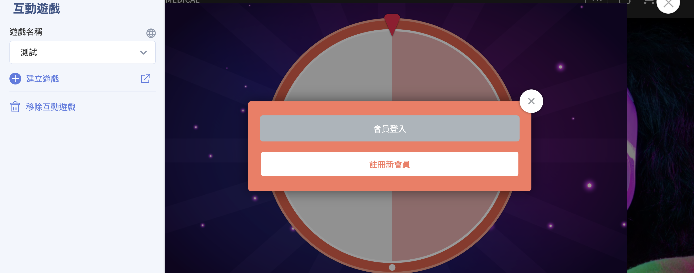

=== "排程跑馬燈"

    1. 從「跑馬燈進階設定」群組中選擇要載入的跑馬燈內容。
    2. 前往 [排程跑馬燈設定指南](configure-scheduled-carousels.md){ title="建立與管理排程跑馬燈" } 設定廣告檔期的上下架時間。

    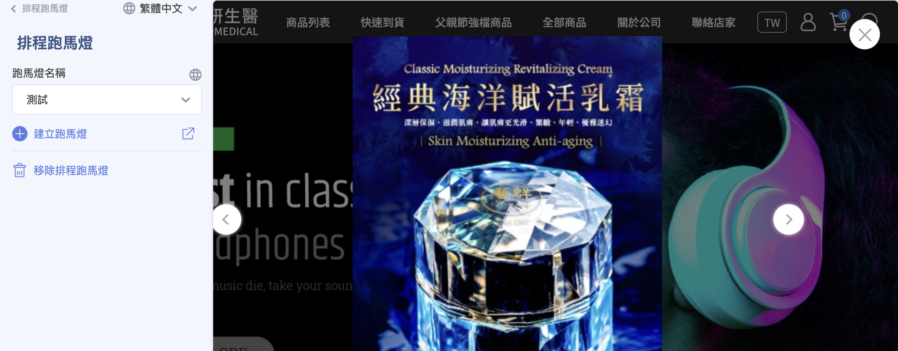

---

### 顏色設定 { #color }

針對全站的基礎視覺元素進行定義：

1. 在編輯器左側面板下方，點選「顏色設定」。
2. 選取 **主色調**，變更全站的主色。
3. 選取 **強調色**，系統會自動套用於多個動態 UI 元素（詳見下方說明）。
4. 調整 **全站字體顏色**。

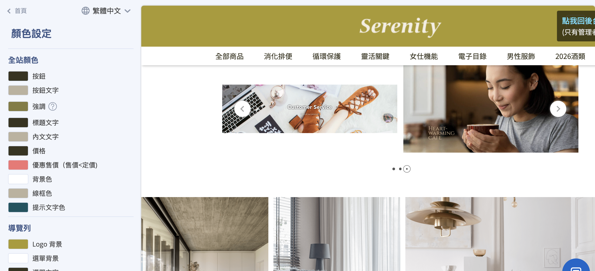

??? info "強調色的應用範圍"
    當商家在顏色設定中選定「強調色」後，系統會自動將該顏色應用於：

    - **商品標籤(Labels)：** 包含系統自動顯示的 **定期定額**、 **特價**、 **缺貨** 標籤，以及商家自定義的 **5 組標籤**。
    - **開賣時間倒數：** 若商品設定為尚未上架，前台商品頁或群組列表顯示的 **倒數時間底色** 會自動套用強調色。
    - **排序邏輯：** 標籤顏色會依特定順序(定期定額 > 特價 > 缺貨 > 自定義標籤)由左至右排列，並統一套用該色系。

??? note "特定區塊的個別顏色設定"
    除了全站統一的顏色設定外，某些功能區塊允許更細緻的顏色自訂：

    - **[置頂公告](../navigation/setup-menus-navigation.md#置頂公告){ title="設定選單與導覽列" }：** 可分別設定置頂公告欄位的 **圖片連結底色** 及 **時間倒數的文字與背景顏色**。
    - **[折疊內容](setup-theme-page-settings.md#section-collapsible){ title="各頁面設定指南" }：** 用於 FAQ 或購物須知的區塊，可個別設定該區塊的顯示顏色。
    - **[圖文介紹](setup-theme-page-settings.md#section-graphic-intro){ title="各頁面設定指南" }：** 此區塊內的 **按鈕顏色** 可依需求自訂。

---

### 全站設定 { #shop-setting }

集中控管官網的基礎視覺識別、搜尋引擎優化(SEO)、全域商品顯示行為以及網站安全防護等核心設定。

#### 視覺識別與品牌資產 { #brand }

1. 在「全站設定」中，設定 **網站圖示**：
    - 上傳 **Favicon**，作為瀏覽器分頁標籤上的小圖示。

        

    - 上傳 **OG Image**（轉貼連結預設圖片），設定網站連結分享至 Facebook 或 LINE 時顯示的預設縮圖。[查看設定教學](../site-settings/setup-og-image.md){ title="設定轉貼連結縮圖 OG Image" }
    
        

2. 選擇 **導覽列圖示** 樣式（系統預設 3 種樣式），或上傳自定義圖示檔案。

    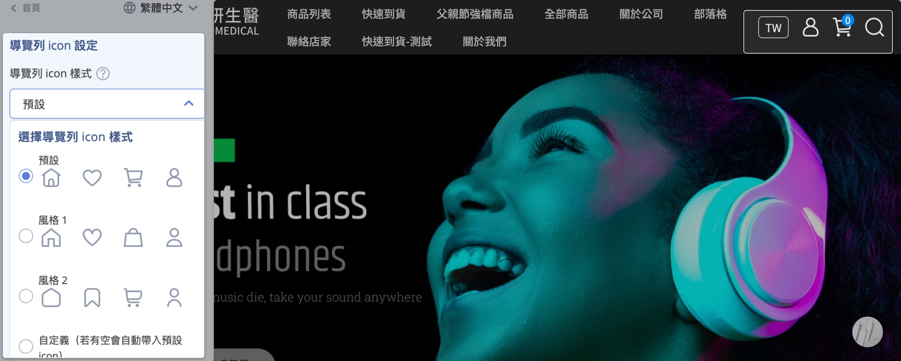

    ??? info "一頁式商店限制"
        自訂導覽列圖示僅支援 **2025 年 7 月後** 建立的一頁式商店。

3. 在「字型設定」中選擇全站網頁的字體樣式。

    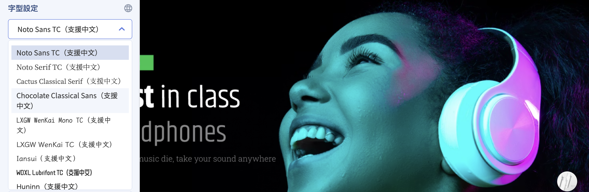

---

#### 網站 SEO 與安全保護 { #seo-security }

1. 在「全站設定」中，填寫網站的 **標題**、 **簡述** 與 **關鍵字**，優化搜尋引擎對網站的收錄與排名。若標題欄位留空，系統會預設以商店名稱作為標題。[查看設定教學](../site-settings/setup-site-title-seo.md){ title="設定網站標題與 SEO" }

    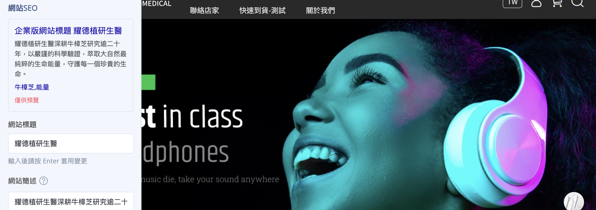

2. 若需保護原創內容，勾選 **「網頁鎖右鍵」**，禁止使用者透過點擊滑鼠右鍵下載圖片或複製文字。[查看設定教學](../site-settings/setup-right-click-protection.md){ title="設定網頁鎖右鍵保護圖文版權" }

    

---

#### 全域商品顯示行為 { #shop-product-display }

!!! plan "功能限制"
    部分功能需特定方案方可使用，已標示於各項目標題。

此區設定會 **套用到全站所有商品列表與商品頁**（首頁商品區塊、商品群組頁、多層級分類、搜尋頁、商品詳情頁等），統一商品卡片與價格的呈現方式，不需逐一設定每件商品。相關設定請分別參閱：[基本顯示選項](#product-display-basic)、[版面與樣式設定](#product-display-layout)、[圖片與懸停效果](#product-display-image-effects)。

##### 基本顯示選項 { #product-display-basic }

依需求啟用以下項目：

- **顯示商品標語：** 在商品圖／名稱下方顯示商品特色或促銷標語。[查看設定教學](../../products/create-and-manage/edit-product-slogan-and-description.md){ title="編輯商品簡述與商品標語" }

    

- **顯示商品色票小圖 `企業版`：** 在商品群組頁與多層級分類頁顯示款式顏色小圖。[查看設定教學](../../products/create-and-manage/product-swatches-variant-images-drag-drop.md){ title="設定商品色票與款式圖片-拖拉版型" }

    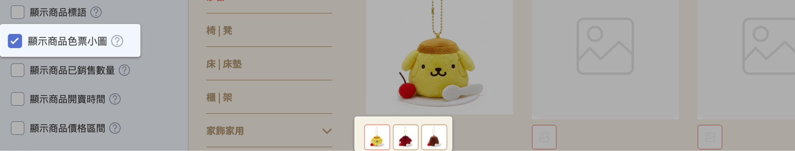

- **顯示已銷售數量：** 在商品名稱下方顯示累計銷售數量，營造熱銷感。

    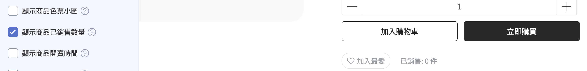

- **顯示定期定額活動標籤 `企業版`[^1]：** 商品綁定定期定額活動時，於商品上顯示活動標籤。
- **顯示商品開賣時間 `PLUS版 / 企業版`：** 商品已設定上架時間但尚未開賣時，前台顯示開賣倒數（紅利商城頁除外）。

    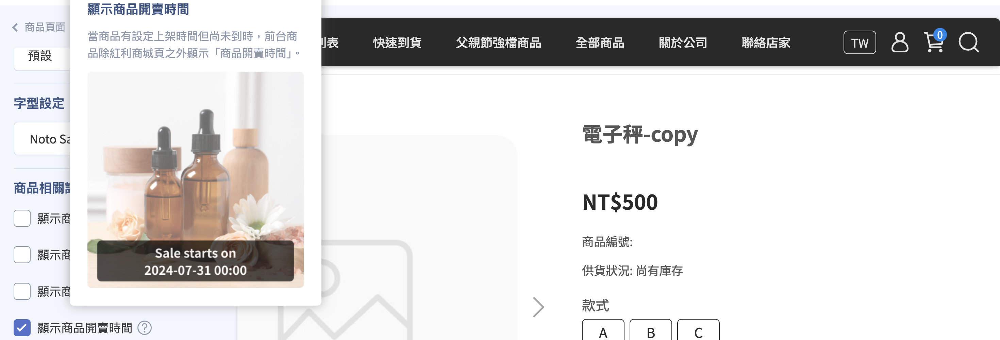

- **顯示商品價格區間 `PLUS版 / 企業版`：** 多款式不同價時，以「最低～最高」區間顯示售價並隱藏定價；未開啟則顯示最低售價＋定價。

    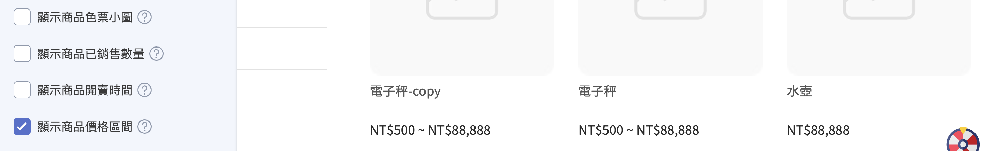

    !!! warning "注意"
        已開啟「預設點選第一個款式」的商品頁、商品彈窗、首頁主打商品不適用。

---

##### 版面與樣式設定 { #product-display-layout }

- 選擇 **文字排列** 對齊方式（置左／置中／置右，預設置左）。

    === "置左"
        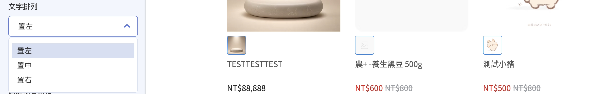
    === "置中"
        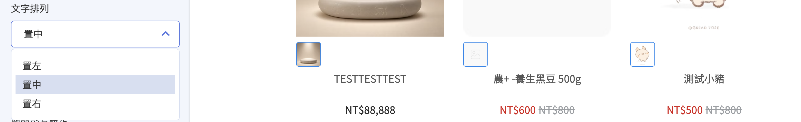
    === "置右"
        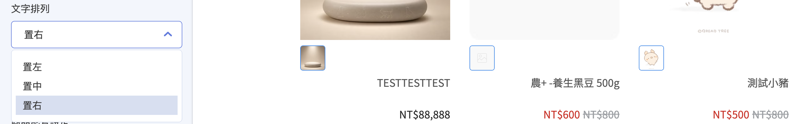

- 選擇 **款式選單** 樣式（下拉式／按鈕式，預設按鈕式）。

    === "按鈕式"
        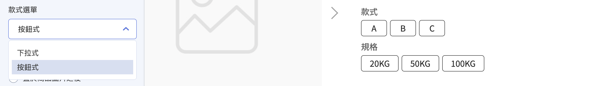{ title="商品款式選單-按鈕式" }
    === "下拉式"
        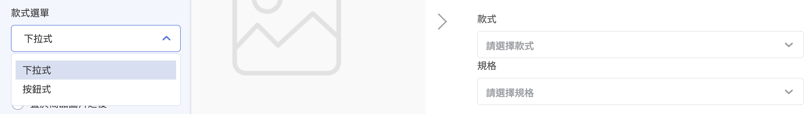{ title="商品款式選單-下拉式" }

- 設定 **商品影片** 置於商品圖片之前或之後 `PLUS版 / 企業版`。[查看設定教學](../../products/create-and-manage/setup-product-videos.md){ title="設定商品影片" }

    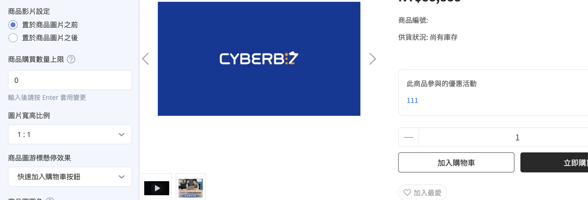

- 設定 **商品購買數量上限**，每個款式可加入購物車的數量上限（留空或填 0 表示無上限）。

    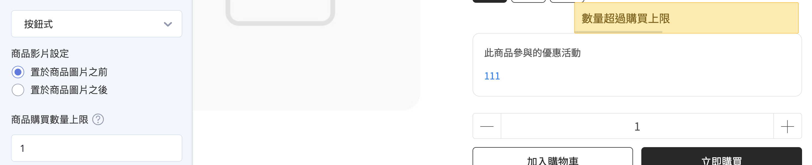

- 上傳 **折扣貼紙**（非 PLUS版 / 企業版），當任一款式售價低於定價時，自動顯示於商品圖左上角。

    

---

##### 圖片與懸停效果 { #product-display-image-effects }

- 選擇 **圖片寬高比例**（1:1／3:4，預設 1:1）。

    === "1:1"
        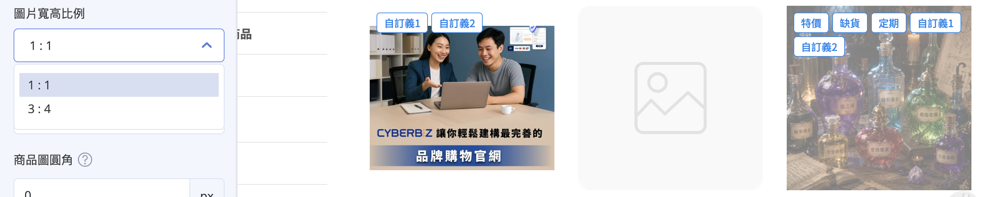

    === "3:4"
        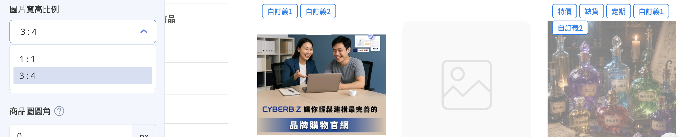

- 選擇 **商品圖游標懸停效果**：

    === "快速加入購物車按鈕"
        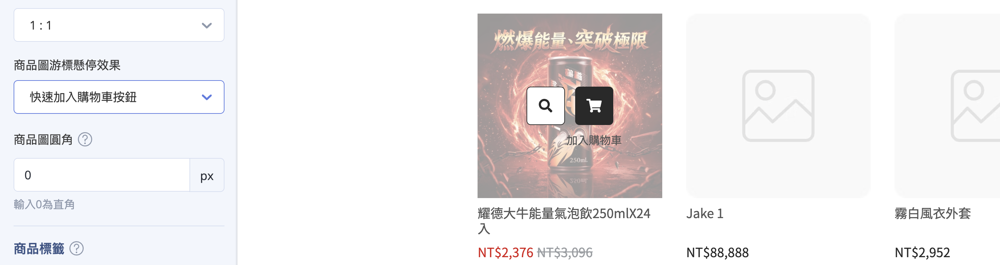{ title="商品圖懸停效果-加入購物車按鈕" }
    === "圖片切換"
        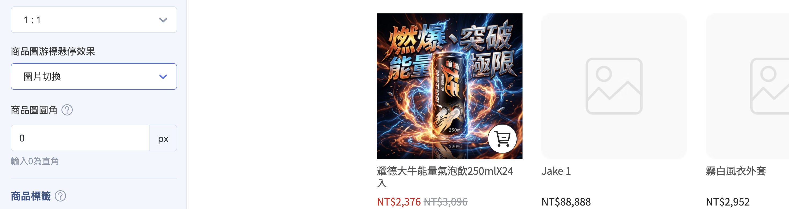{ title="商品圖懸停效果-圖片切換" }
    === "陰影‧邊框強調"
        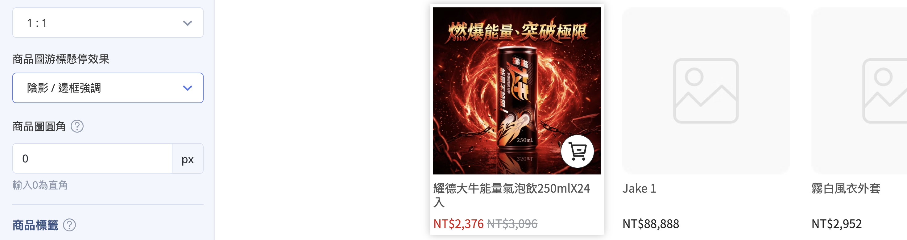{ title="商品圖懸停效果-陰影邊框" }
    === "放大效果"
        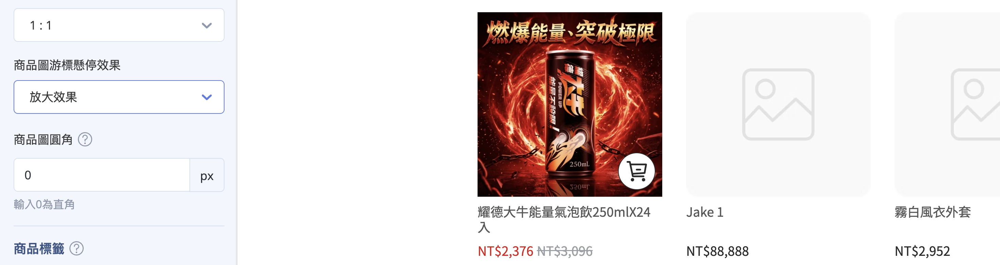{ title="商品圖懸停效果-放大效果" }

- 設定 **商品圖圓角**，建議設定區間為 0 ~ 20px。

    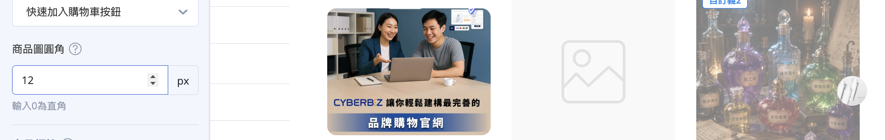

[^1]: 且未使用「商品標籤」功能時。

---

#### 動態標籤設定 <small>商品標籤</small> { #product-labels }

!!! plan "開通條件與方案限制"
    - **商品標籤功能：** 需開通「商品標籤」功能（依方案開通狀況為準）。
    - **定期定額標籤：** 需開通定期定額功能（企業版）。
    - **自定義標籤：** 企業版。

商品標籤會依條件 **自動** 標示於商品圖上，不需逐一手動設定。

1. 在「全站設定」中點擊 **「商品標籤列表」** 進入設定頁。

    

2. 依需求[啟用](theme-editor.md#operate-theme-editor-visibility){ title="拖拉版型網站設定" }各類標籤：

    - **特價標籤：** 商品售價低於定價時自動顯示。
    - **缺貨標籤：** 商品庫存為 0 且設為停止銷售時自動顯示。
    - **定期定額標籤：** 商品被加入定期定額活動時自動顯示。
    - **自定義標籤（每商品限 5 組[^2]）：** 各綁定一個後台「商品標籤」，套用該標籤的商品即自動顯示。[查看設定教學](../../products/categories-and-tags/manage-product-tags.md){ title="管理商品標籤" }

    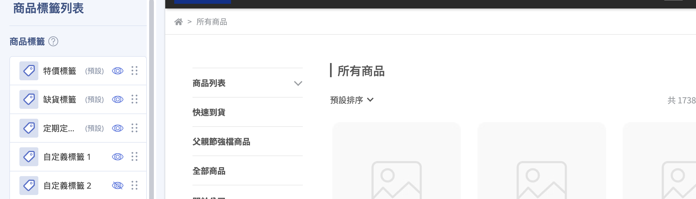

3. 點擊標籤列表中的相關項目，可進入設定頁面為每個標籤選擇 **呈現方式**：

    - **文字：** 自行輸入要顯示的標籤文字。
    - **圖片：** 上傳標籤圖片，並選擇圖片標籤大小（**大／小**）。
    - **折扣折數：** 僅「特價標籤」提供，依售價與定價自動以折數呈現。

    === "文字"
        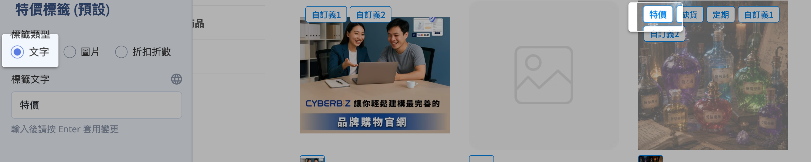

    === "圖片"
        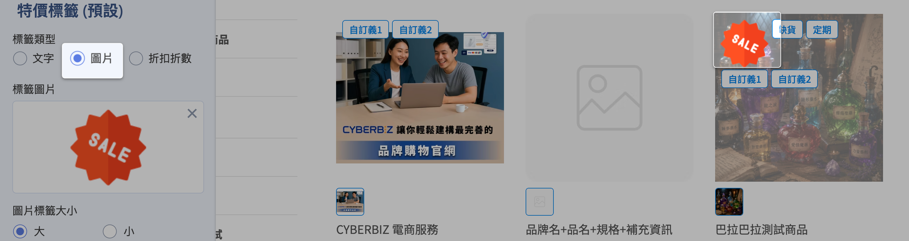

    === "折扣折數"
        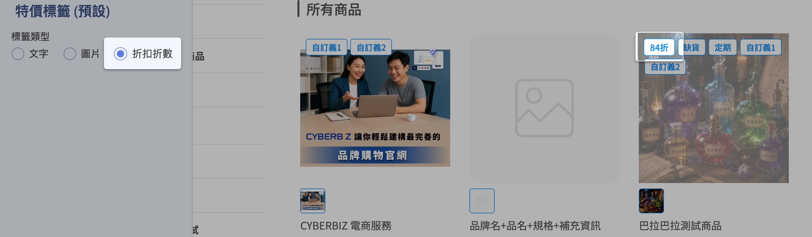

!!! info "標籤底色預設套用「[顏色設定](#color)」中的強調色；多個標籤同時成立時會依系統固定順序並列。"

[^2]: 超出 5 組時，前台依排序僅顯示前 5 組，第 6 組起不予顯示。此上限僅計算自定義標籤，系統預設標籤（特價、缺貨、定期定額）不在此限；商品可同時顯示兩者。例如：商品同時符合 3 個系統預設標籤與 6 個自定義標籤時，前台顯示 3 個預設標籤 + 前 5 個自定義標籤，共 8 個。

---

## 後續操作 { #next-steps-global-settings }

- :lucide-palette:{ .lg }   
  [__拖拉版型網站設定__](theme-editor.md){ title="拖拉版型網站設定" }     
  了解如何進入拖拉版型編輯器進行網站設定

- :lucide-menu:{ .lg }   
  [__設定選單與導覽列__](../navigation/setup-menus-navigation.md){ title="設定選單與導覽列" }     
  設定選單排列樣式與頁腳顯示

- :lucide-gamepad-2:{ .lg }   
  [__互動遊戲 (EC)__](../../marketing/other-tools/interactive-games.md){ title="互動遊戲 (EC)" }     
  建立輪盤遊戲或紅包抽獎活動

- :lucide-images:{ .lg }   
  [__建立與管理排程跑馬燈__](configure-scheduled-carousels.md){ title="建立與管理排程跑馬燈" }     
  設定廣告檔期的上下架時間

## 參考資料 { #reference-global-settings }

- [可新增區塊類型對照表](../references/theme-editor-sections.md)
