---
acoiv:
apis:
search:
title: setup-theme-page-settings
description: 依頁面類型說明拖拉版型的各項設定，包含首頁區塊、商品頁面、部落格、客服頁等。
created:
last_modified: 2026-07-22T15:20:48+08:00
lang: zh-TW
permalink: https://help.cyberbiz.io/ec/website-appearance/theme-and-layout/setup-theme-page-settings
type: tutorial
status:
version:
author: Jase
reviewers: []
notes: []
ga_views: 0
feedback: 0
products:
  - EC
modules:
  - 網站外觀
sites:
  - TW
audiences:
  - admin
difficulty: intermediate
tnb: trunk
plans:
  - 企業
  - 專業
  - 專業PLUS
  - 進階
  - 進階PLUS
  - 高手
  - 高手PLUS
cyb_extensions: []
intents:
  - 設定各頁面顯示
  - 新增首頁區塊
  - 編輯商品頁面
  - 設定部落格頁面
  - 設定客服頁
  - 管理404頁面
  - 設定快速到貨頁
  - 設定搜尋頁面
features:
  - 頁面區塊編輯
  - 商品頁面設定
  - 部落格頁面設定
  - 客服與404頁設定
  - 快速到貨
  - 搜尋頁設定
  - 響應式設計
prerequisites:
  - 已使用拖拉版型
  - 後台管理員權限
  - 商品多層級分類架構 (設定)
  - 客服功能開通 (商品評論)
  - 門市設定 (快速到貨)
related: []
tags:
  - 拖拉版型
  - 首頁區塊
  - 商品頁面
  - 部落格
  - 客服頁
  - 404頁面
  - 快速到貨
  - 搜尋頁
devices:
  - desktop
  - tablet
  - mobile
ui_components: []
paths:
  - 網站外觀 > 套版主題管理
layouts:
  - 拖拉版型
wp_url: []
icon: lucide/panel-top
hide:
comments: false
---

## 各頁面設定說明 { #page-settings }

拖拉版型透過上方工具列的 **頁面下拉選單** 切換不同頁面。除了首頁、自訂頁面、單頁式頁面以「新增區塊」的方式自由組合外，其餘頁面的版面由系統固定，僅提供各自的設定項目。

各頁面設定需在拖拉版型編輯器中進行，請先參閱 [拖拉版型網站設定](theme-editor.md){ title="拖拉版型網站設定" } 了解如何進入編輯器。

!!! note "註釋"
    下拉選單實際出現的頁面，會依您安裝的版型與已開通的功能而不同，請以編輯器內顯示的為準。

!!! example "適用情境"
    | 情境 | 適用區塊 |
    |:-----|:---------|
    | 在首頁放 FAQ 或常見問題 | [折疊內容](#section-collapsible) |
    | 建立購物須知、退換貨說明 | [折疊內容](#section-collapsible) |
    | 展示商品使用步驟或注意事項 | [折疊內容](#section-collapsible) |
    | 首頁放活動入口大圖 | [橫幅廣告](#section-banner) |
    | 嵌入 YouTube 影片 | [影片設定](#section-video) |
    | 顯示商品列表 | [商品分類](#section-collection-blocks) |

## 使用前提與限制 { #prerequisites-page-settings }

開始之前，請先確認以下條件：

- [x] **已進入拖拉版型編輯器：** 需先開啟拖拉版型編輯器，請見 [進入拖拉版型編輯器](theme-editor.md#operate-theme-editor-enter){ title="進入拖拉版型編輯器" }。
- [x] **已使用拖拉版型：** 只有標示「拖拉設定」的版型才適用本文的設定。
- [x] **部分頁面需先完成前置設定：** 例如多層級分類、客服功能開通、門市設定等，請依各頁面章節的說明確認。

!!! plan "方案顯示差異"
     實際可編輯的頁面與區塊依您的方案與已開通功能而定。

## 操作步驟

依所需頁面類型快速跳轉：[首頁](#homepage)、[商品頁面](#product)、[商品群組頁面](#collection)、[商品多層級分類](#category)、[部落格頁](#blog)、[部落格文章頁](#article)、[客服頁](#contact)、[404 頁](#not-found)、[快速到貨頁](#express-delivery)、[搜尋頁](#search)。

### 首頁 { #homepage }

首頁可新增以下 13 種區塊。多數區塊的設定面板會提供一個 **其他版面設定** 展開面板，裡面除了各區塊的特有項目外，都包含一組共通的 **版面邊距**（單位 px），以下各區塊章節 **列出其特有設定**。

??? info "版面邊距設定"

    | 設定 | 說明 | 常見預設 |
    |------|------|----------|
    | 電腦版-版面左右外邊距 | **設 0px 即滿版**（貼齊左右螢幕邊緣） | 0 |
    | 電腦版-版面底部外邊距 | 與下方區塊的距離，設 0px 則兩區塊相連無間距 | 50 |
    | 手機版-版面左右外邊距 | 同上，套用於平板／手機 | 0 |
    | 手機版-版面底部外邊距 | 同上，套用於平板／手機 | 24 或 50 |

    ??? note-clean "特例"
        - **主打商品** 預設邊距較大（電腦左右 80px、手機左右 16px）。
        - **折疊內容** 用的是 **內邊距（padding）** 而非外邊距，且多一組上下內邊距。
        - **應用程式、CMS** 這類區塊沒有版面邊距設定。

通用操作方式：

1. 在頁面下拉選單中選擇「首頁」，可參考[切換編輯頁面與預覽](theme-editor.md#operate-theme-editor-preview){ title="切換編輯頁面與預覽" data-preview }了解預覽方式。
2. 在左側區塊列表點擊「新增區塊」，選擇要新增的區塊類型。
3. 點選區塊，在右側面板中編輯其內容與設定。
4. 完成後點擊「儲存」保存變更。

---

#### 輪播素材 { #section-main-slider }

可放入多張輪播「素材」的主視覺區塊。

1. 新增「輪播素材」區塊。
2. 在設定面板點擊 **其他版面設定**，展開後設定 **區塊層級** 屬性：

    - **圖片停留秒數**：每輪停留幾秒後切下一輪（預設 3 秒）。
    - **圖片切換速度**：切換動畫的速度，數值越大切換越慢（預設 0.3 秒）。

    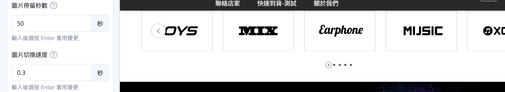{ title="輪播素材-共通設定" }

    === "電腦版"

        - 版面左右外邊距（預設 0px，**設 0 即滿版**）、版面底部外邊距（預設 50px）。
        - **圖片數量**：每輪並排張數，**電腦版可選 1～8**（預設 1）。
        - **圖片間距**：張與張之間的距離（預設 12px，需 2 張以上才作用）。

        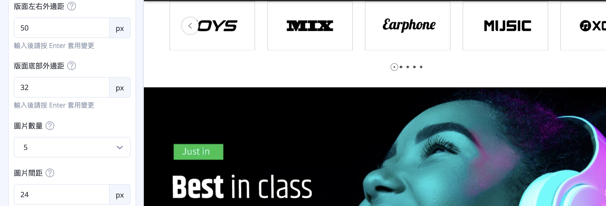{ title="電腦版-版面邊距" }

    === "平板版、手機版"

        - 版面左右外邊距（預設 0px）、版面底部外邊距（預設 50px）。
        - **圖片數量**：**手機版僅可選 1～3**（預設 1）。
        - **圖片間距**：預設 8px。

        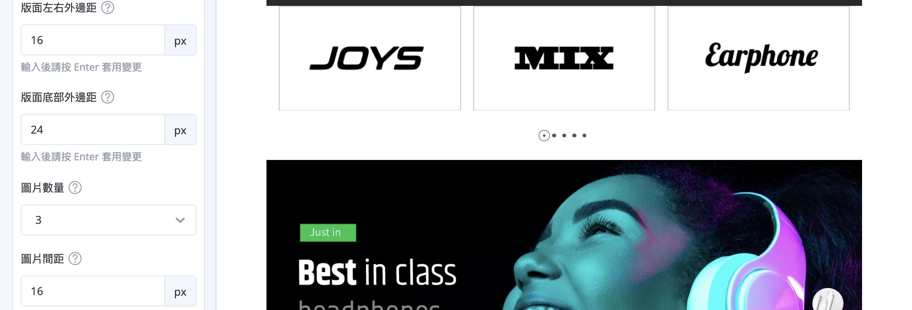{ title="手機／平板-版面邊距" }

3. 為 **每張素材** 設定圖片：

    - 上傳 **電腦版（建議寬 1920px）／平板版（960px）／手機版（480px）** 圖片，單張不超過 1MB，支援 JPG／PNG／JPEG／GIF。

        === "電腦版"

            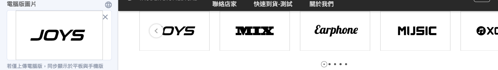{ title="電腦版-上傳圖片" }
 
        === "平板版"

            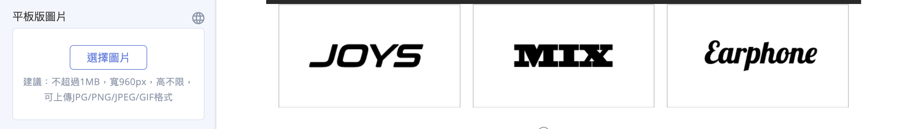{ title="平板版-上傳圖片" }

        === "手機版"

            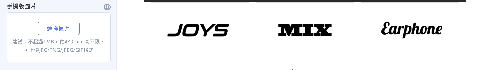{ title="手機版-上傳圖片" }

    - **僅上傳電腦版時，平板與手機會自動沿用同一張。**
    - 設定 **圖片連結**（可勾選「在新分頁開啟連結」）與 **圖片替代文字（alt）**（有助 SEO）。

        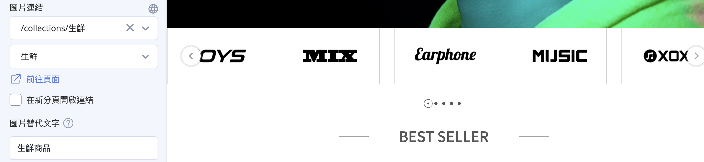{ title="輪播素材-圖片連結" }

        ??? info "圖片連結可連往哪裡"
            **圖片連結** 為下拉選單，先選目的地類型再指定目標：商店首頁、全部商品、指定商品、商品群組（自訂／條件分類、任選折扣）、部落格、其它頁面、查詢頁面、客服表單，或選 **外部連結** 貼上站外網址。

            !!! warning-clean "使用前提"
                商品多層級分類、紅配綠組合優惠活動、紅利商城等選項，需先開通對應功能才會出現在下拉選單中。

4. 設定 **素材文字**（同樣是每張素材各自設定）：

    - **內容位置**：控制標題／內文／按鈕在圖片上的對齊方式，可選 **置左（預設）／置中／置右**。

        === "置左"

            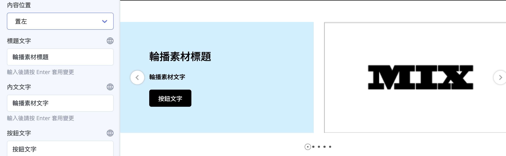{ title="輪播素材內容位置-置左" }

        === "置中"

            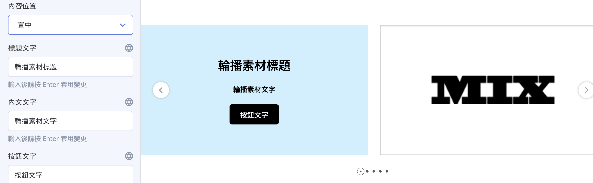{ title="輪播素材內容位置-置中" }

        === "置右"

            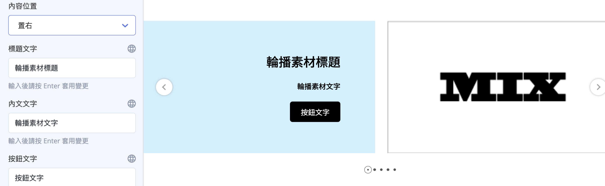{ title="輪播素材內容位置-置右" }

    - **文字內容**：依序填入 **標題文字、內文文字、按鈕文字**（皆為選填，留空則該元素不顯示）。
    - **按鈕連結**：為 **連結欄位**，可勾選 **在新分頁開啟連結**。

        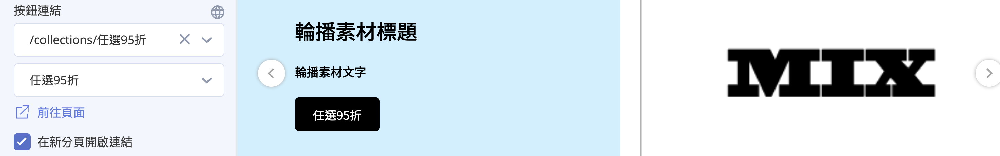{ title="輪播素材-按鈕連結" }

        ??? info "按鈕連結可連往哪裡"
            按鈕連結為下拉選單，先選目的地類型再指定目標：商店首頁、全部商品、指定商品、商品群組（自訂／條件分類、任選折扣）、部落格、其它頁面、查詢頁面、客服表單，或選 **外部連結** 貼上站外網址。

            !!! warning "使用前提"
                商品多層級分類、紅配綠組合優惠活動、紅利商城等選項，需先開通對應功能才會出現在下拉選單中。

    - **文字顏色**：分別設定四個元素的顏色（點色塊選色）。

        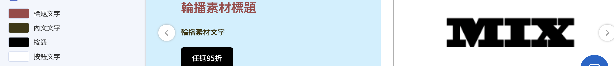{ title="輪播素材-文字顏色" }

---

#### 橫幅廣告 <small>活動入口大圖</small> { #section-banner }

單張橫幅圖片，常用於活動入口。 

1. 新增「橫幅廣告」區塊。 
2. 上傳 **電腦版（建議寬 1920px）／平板版（960px）／手機版（480px）** 圖片，單張不超過 1MB，支援 JPG／PNG／JPEG／GIF。**僅上傳電腦版時，平板與手機會自動沿用同一張。** 

    === "電腦版"

        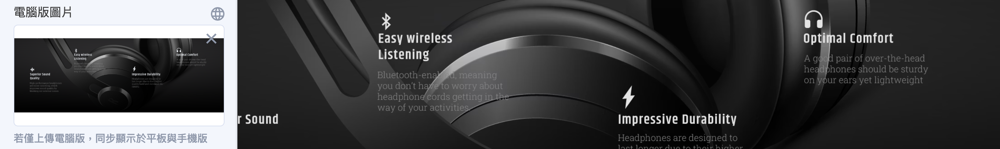{ title="電腦版-上傳圖片" }

    === "平板版"

        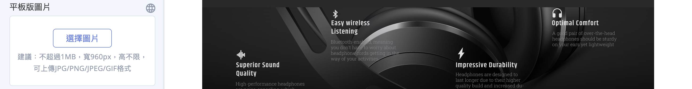{ title="平板版-上傳圖片" }

    === "手機版"

        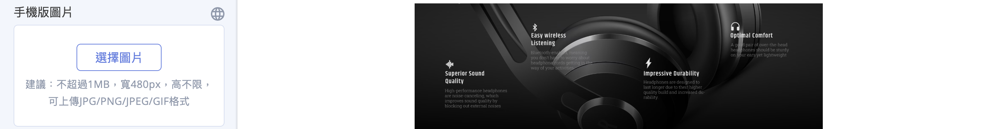{ title="手機版-上傳圖片" }

3. 設定 **圖片連結**（可勾選「在新分頁開啟連結」）與 **圖片替代文字（alt text）**。 

    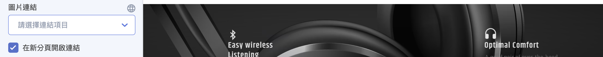 

    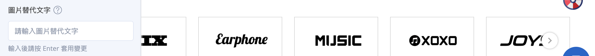 

4. 可勾選 **顯示按鈕**，開啟後設定 **按鈕位置**(中上、置中、中下)、**按鈕文字**，以及按鈕的 **底色／文字色**。 

    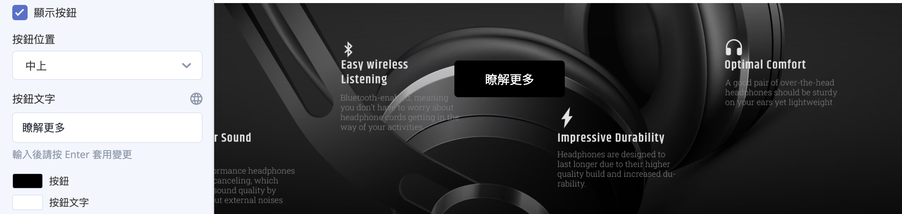 

5. 調整版面邊距（電腦左右／底部、手機左右／底部；**手機版底部外邊距預設 24px**）。 

    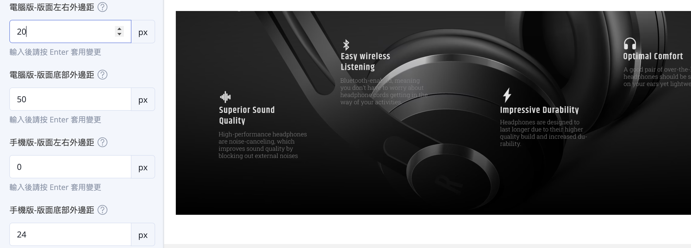{ title="橫幅廣告-版面邊距"}

---

#### 商品分類 <small>商品列表展示</small> { #section-collection-blocks }

從指定商品分類帶入商品的列表區塊。 

1. 新增「商品分類」區塊。 
2. 填寫 **標題**，點擊 **選擇商品分類** 挑選要顯示的分類。 
3. 設定 **商品數量上限**（每次顯示的商品數，預設 12）與 **商品展開** 方式。 

    === "左右滑動"

         

    === "往下展開"

        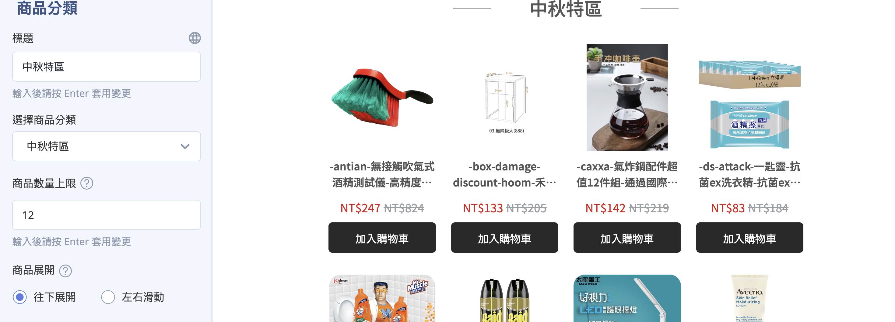 

4. 調整 **版面設定**： 

    - **商品欄數**：電腦版 **2～6 欄**（預設 4）、手機版 **1～3 欄**（預設 2）。 
    - **商品排列**：置左／置中／置右。 
    - **文字排列**：置左／置中／置右（預設置中）。 

    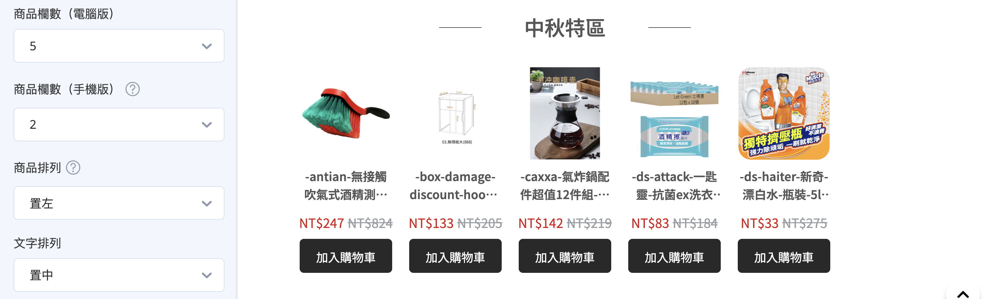 

5. 選擇 **樣式設定**： 

    - **電腦版商品分類樣式**：預設(商品圖) / 顯示部分內容(商品圖、名稱、價格) / 全顯示(商品圖、名稱、價格、購買按鈕)。

        === "預設"

            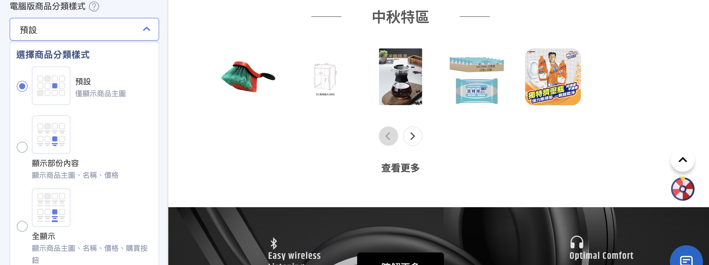 

        === "顯示部分內容"

            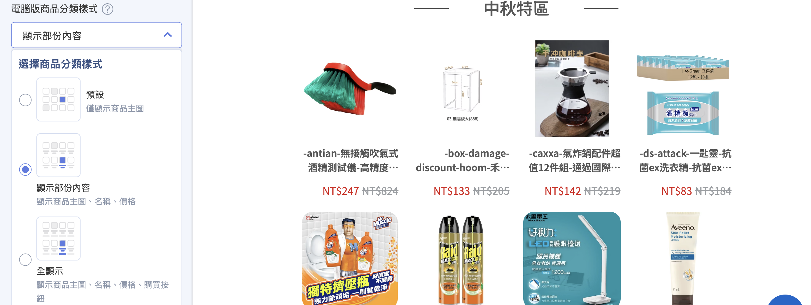 

        === "全顯示"

            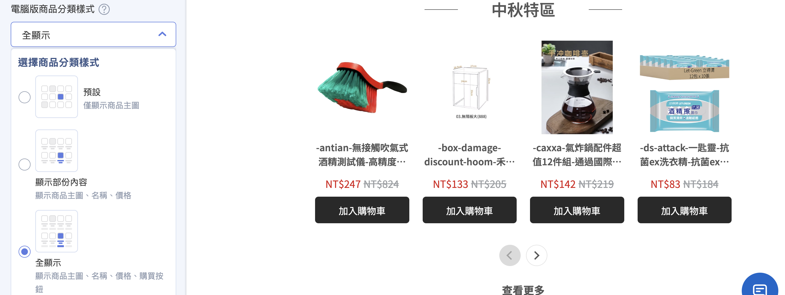 

    - **商品圖游標懸停效果**：快速加入購物車按鈕、圖片切換、陰影／邊框強調、放大效果。

        === "快速加入購物車按鈕"

            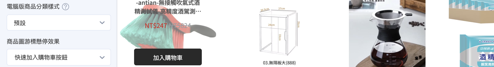{ title="快速加入購物車按鈕" }

            !!! info "提示"
                若「電腦版商品分類樣式」選擇「全顯示」，已直接顯示購買按鈕，此懸停效果將不會產生作用。

        === "圖片切換"
            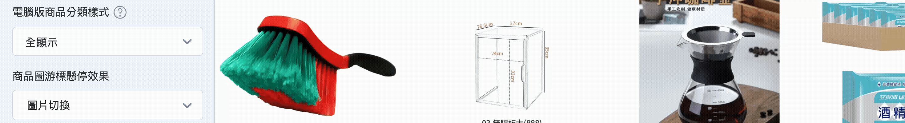{ title="圖片切換" }

        === "陰影/邊框強調"
            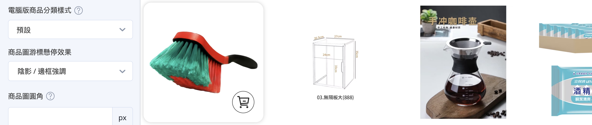{ title="陰影/邊框強調" }

        === "放大效果"
            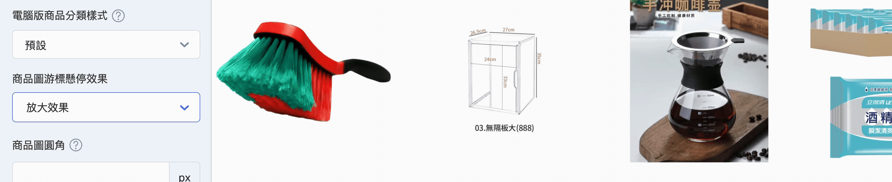{ title="放大效果" }

    - **商品圖圓角**（預設 15px）。

        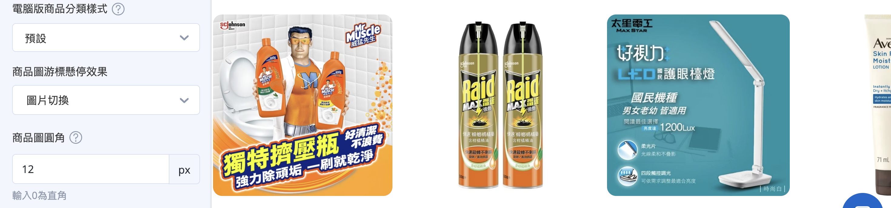{ title="商品圖圓角設定" }

---

#### 影片設定 <small>YouTube 嵌入</small> { #section-video }

嵌入單支影片。 

1. 新增「影片設定」區塊。 
2. 填寫 **標題** 與 **影片連結**。 

    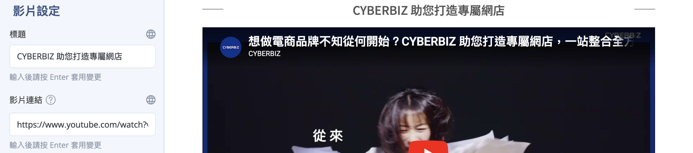{ title="影片標題與連結" }

    !!! info "僅支援 YouTube 影片"
        請貼上完整影片連結，例：https://www.youtube.com/watch?

3. 設定播放行為（皆為是／否）： 

    - **自動播放**（預設關閉）：訪客瀏覽至頁面影片區塊時影片將自動播放。因瀏覽器限制，開啟自動播放時影片將自動轉為靜音播放。
    - **隱藏外框**（預設關閉）：當影片開啟自動播放，且啟用隱藏外框，該 YouTube 無法暫停影片
    - **重複播放**（**預設開啟**）。 

    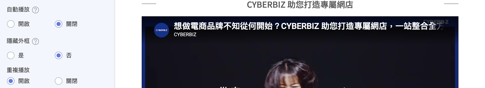{ title="影片播放行為設定" }

4. 調整電腦／手機版面邊距（此區塊四組邊距預設皆為 0）。

    { title="影片版面邊距設定" }

---

#### 分頁頁籤 { #section-blog-tabs }

以頁籤呈現多個部落格的文章。

1. 新增「分頁頁籤」區塊。
2. 在 **其他版面設定** 中填寫標題、調整版型邊距、設定文章欄數。

    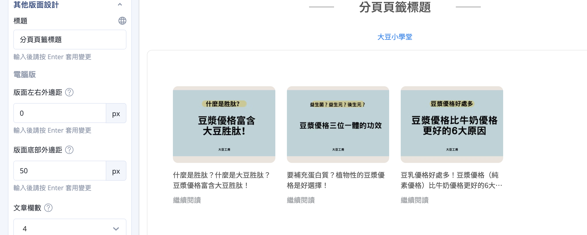

3. 在 **部落格** 小區塊中，各別選擇要顯示的部落格。

    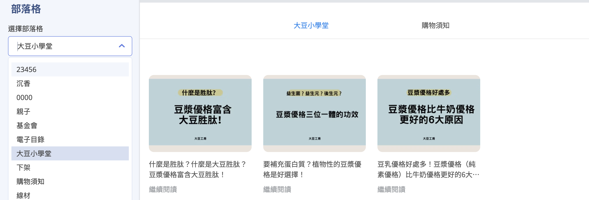

---

#### 自訂排版設計 { #section-custom-blocks } 

自由組合多種小區塊的彈性版面。 

1. 新增「自訂排版設計」區塊。 
2. 在 **其他版面設定** 設定版面： 

    - 電腦版／手機版的 **版面邊距**。 
    - **區塊間距**：小區塊之間的距離，電腦版與手機版可各自設定（預設 10px）。 
    - **手機版排版**：控制小區塊在手機上的排列方式。 

3. 點擊 **新增小區塊**，選擇要加入的元件類型。**每一種小區塊都可設定「版面螢幕占比」** 來控制寬度： 

    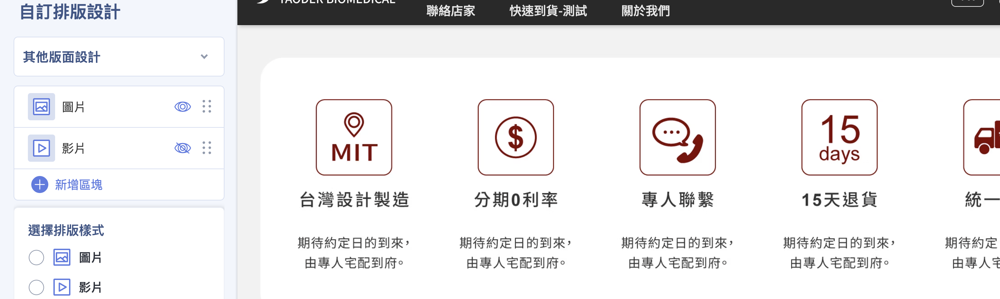{ title="新增小區塊" }

    === "圖片" 

        1. 上傳電腦／平板／手機版圖片（僅傳電腦版時自動沿用）。 
        2. 填寫 **圖片標題、圖片說明（進階文字）、圖片連結（可新分頁開啟）、圖片替代文字**。 
        3. 設定 **版面螢幕占比**。 

         

    === "影片" 

        1. 貼入 **影片連結**。 
        2. 設定 **自動播放／隱藏外框／重複播放**（重複播放預設開啟）。 
        3. 設定 **版面螢幕占比**。 

        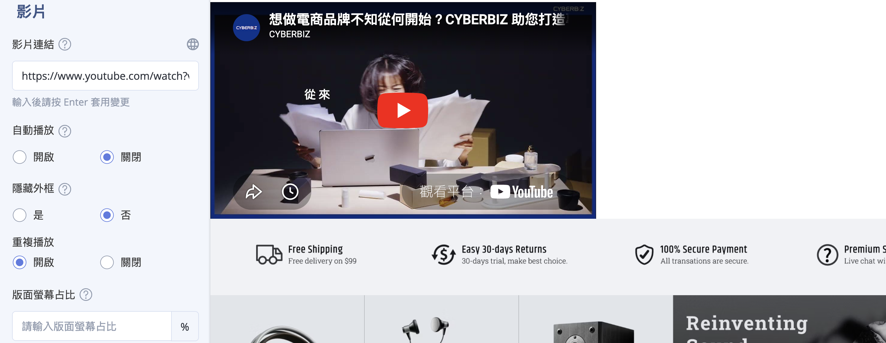 

    === "排程跑馬燈" 

        1. 載入預先製作好的 **跑馬燈群組**。 
        2. 設定 **版面螢幕占比**。 
        3. 詳見 [排程跑馬燈設定指南](configure-scheduled-carousels.md){ title="建立與管理排程跑馬燈" }。 

        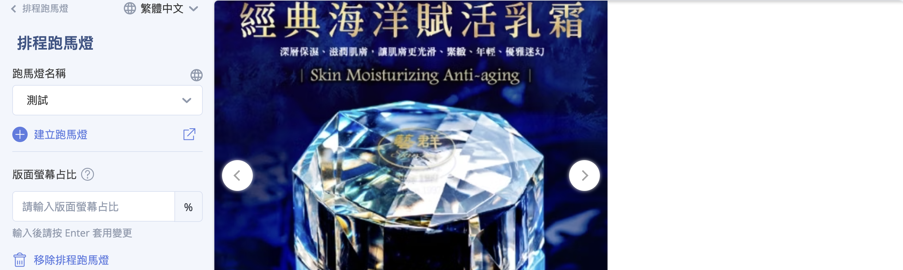 

    === "自訂 HTML" 

        1. 點擊「編輯」進入 HTML 編輯頁面。 
        2. 貼入自訂 HTML／CSS 程式碼。 
        3. 設定 **版面螢幕占比**。 

        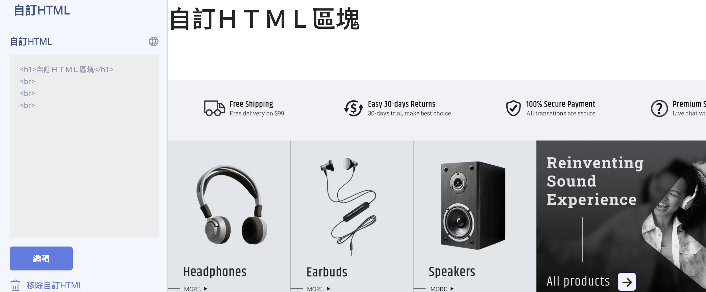 

    === "商品" 

        1. 點擊「選擇商品」找出商品（僅能選單一商品）。 

            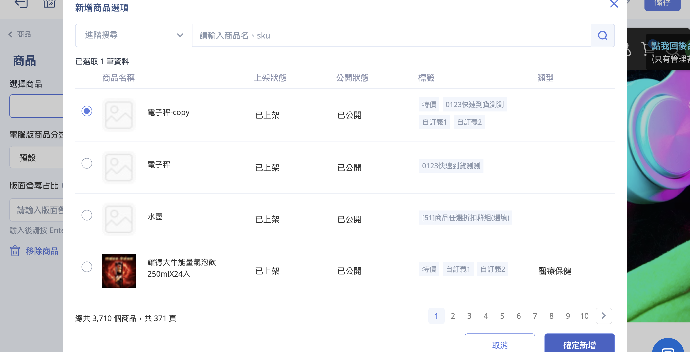 

        2. 設定 **電腦版商品分類樣式** 及 **版面螢幕占比**。 

            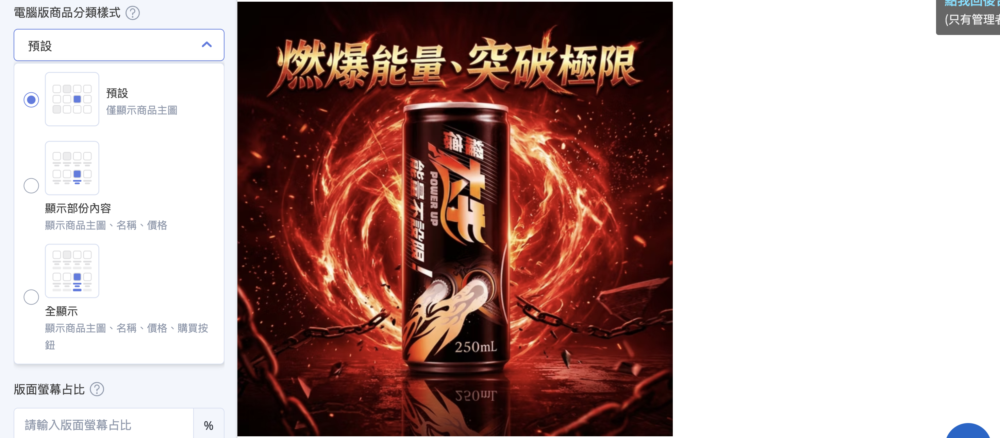 

    !!! tip "設計模組的版面比例" 
        透過「**版面螢幕占比**」控制每個小區塊的寬度，讓多個小區塊在同一橫列並排。每列總占比上限 100%，超過即自動換行。 

<!---->
<!-- #### 自訂排版設計 { #section-custom-blocks } -->
<!---->
<!-- 自由組合多種小區塊的彈性版面，可設定區塊間距與手機版排版。 -->
<!---->
<!-- 1. 新增「自訂排版設計」區塊。 -->
<!-- 2. 點擊 **新增小區塊**，選擇要加入的元件類型： -->
<!---->
<!--     { title="新增小區塊" } -->
<!---->
<!-- === "圖片" -->
<!---->
<!--     1. 上傳電腦／平板／手機版圖片。 -->
<!--     2. 填寫標題、圖片說明、連結、替代文字。 -->
<!--     3. 設定 **版面螢幕占比**（控制該區塊在橫列的寬度比例）。 -->
<!---->
<!--      -->
<!---->
<!-- === "影片" -->
<!---->
<!--     1. 貼入影片連結。 -->
<!--     2. 設定自動播放／隱藏外框／重複播放。 -->
<!--     3. 設定 **版面螢幕占比**。 -->
<!---->
<!--      -->
<!---->
<!-- === "排程跑馬燈" -->
<!---->
<!--     1. 載入預先製作好的跑馬燈群組。 -->
<!--     2. 設定 **版面螢幕占比**。 -->
<!--     3. 詳見 [排程跑馬燈設定指南](configure-scheduled-carousels.md){ title="建立與管理排程跑馬燈" }。 -->
<!---->
<!--      -->
<!---->
<!-- === "自訂 HTML" -->
<!---->
<!--     1. 點擊「編輯」進入 HTML 編輯頁面。 -->
<!--     2. 貼入自訂 HTML／CSS 程式碼。 -->
<!--     3. 設定 **版面螢幕占比**。 -->
<!---->
<!--      -->
<!---->
<!-- === "商品" -->
<!---->
<!--     1. 點擊「選擇商品」，使用進階篩選或關鍵字找出商品，點擊「確認新增」。僅能選擇單一商品。 -->
<!--     2. 設定電腦版商品分類樣式及 **版面螢幕占比**。 -->
<!---->
<!--      -->
<!---->
<!--      -->
<!---->
<!-- !!! tip "設計模組的版面比例" -->
<!--     您可以透過設定「**版面螢幕占比**」來控制每個區塊在畫面中的寬度，讓多個區塊能在同一橫列中並排顯示。 -->
<!---->
<!--     **排列邏輯說明：** -->
<!---->
<!--     - 區塊會由左至右依序排列。 -->
<!--     - 每一橫列的總占比上限為 100%。當區塊並排的占比超過 100%，系統會自動換行，將超出區塊及後續區塊顯示於下一列，以此類推。 -->
<!---->
<!--     ??? example "常見排版範例" -->
<!--         === "三欄式結構" -->
<!--             建立 3 個區塊，每個區塊占比設為 33%，三者加總不超過 100% 即可並排。 -->
<!---->
<!--             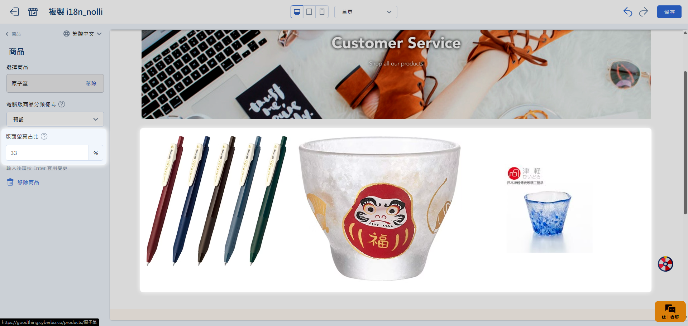 -->
<!---->
<!--         === "雙欄式結構" -->
<!--             建立 2 個區塊，可設定為 60% + 40%、50% + 50% 等加總為 100% 的組合。 -->
<!---->
<!--             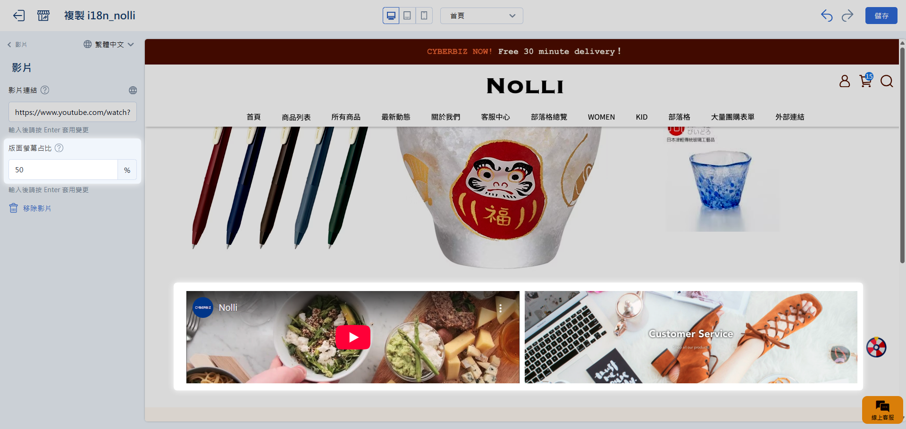 -->
<!---->
<!--         === "單欄式結構" -->
<!--             如僅有一個區塊需滿版呈現，可設為 100%。 -->
<!---->
<!--             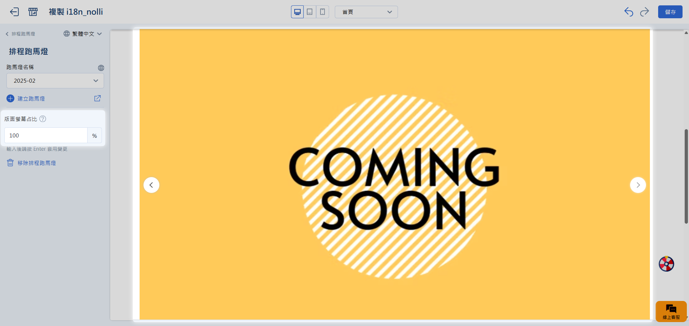 -->

---

#### 圖文介紹 { #section-graphic-intro }

圖片搭配文字與按鈕的介紹區塊。

1. 新增「圖文介紹」區塊。
2. 點擊 **其他版面設計**，設定以下項目：

    - **文字排版**：選擇文字對齊方式（靠左／置中／靠右）。
    - **文字**：設定文字顏色（點色塊選色）。
    - **背景**：設定區塊背景顏色。

    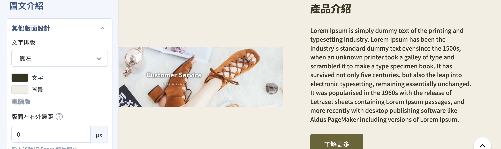

    === "電腦版"

        - **版面左右外邊距**：設 0px 即滿版，輸入後按 Enter 套用。
        - **版面底部外邊距**：與下方區塊的距離。

        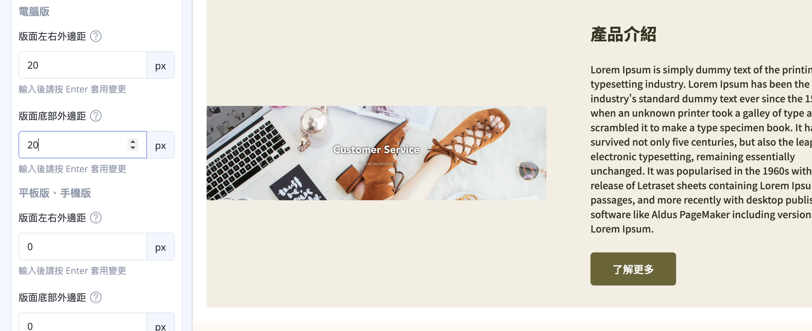

    === "平板版、手機版"

        - **版面左右外邊距**：同電腦版。
        - **版面底部外邊距**：同電腦版。

        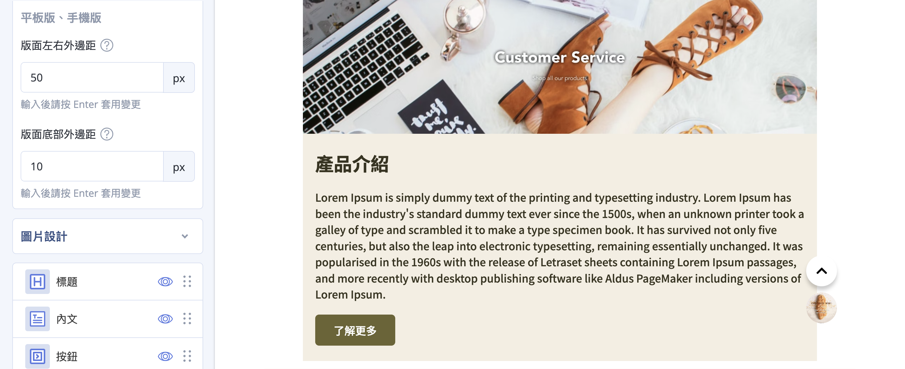

3. 點擊 **圖片設計**，上傳電腦版（建議寬 1920px）／平板版（960px）／手機版（480px）圖片。**僅上傳電腦版時，平板與手機會自動沿用同一張。**

    - **圖片位置**：選擇圖片置於區塊的左側或右側。
    - **圖片替代文字**：輸入圖片描述（有助 SEO），輸入後按 Enter 套用。
    - **電腦版版面占比**：控制圖片在區塊中的寬度比例。

      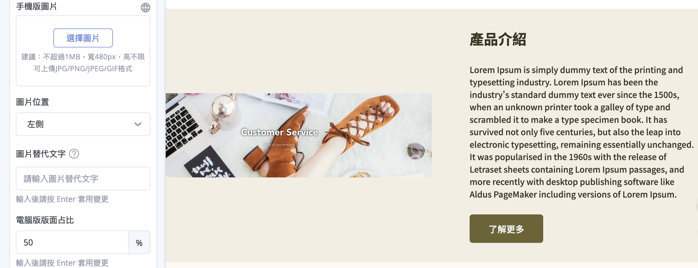

4. 在 **小區塊** 中編輯標題（可設字級）、內文（可設字級）、按鈕（文字、底色／文字色、連結）。

    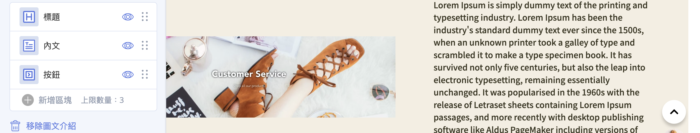

    === "標題"

        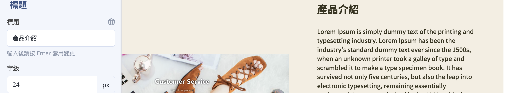

    === "內文"

        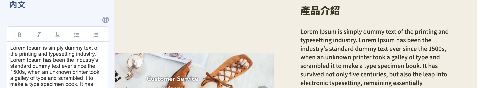

    === "按鈕"

        - **按鈕文字**：輸入按鈕顯示文字（預設「了解更多」），輸入後按 Enter 套用。可點擊色塊設定按鈕 **底色** 與 **文字色**。
        - **按鈕連結**：下拉選單選擇連結目標，可勾選 **在新分頁開啟連結**。

        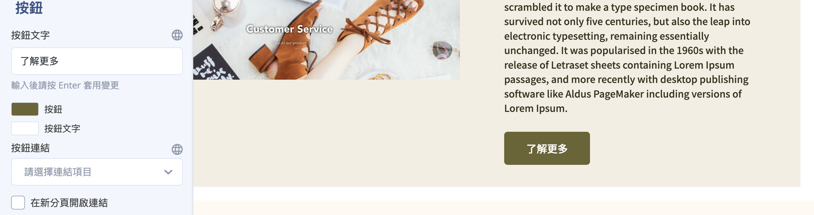

        ??? info "按鈕連結可連往哪裡"
            按鈕連結為下拉選單，先選目的地類型再指定目標：商店首頁、全部商品、指定商品、商品群組（自訂／條件分類、任選折扣）、部落格、其它頁面、查詢頁面、客服表單，或選 **外部連結** 貼上站外網址。

            !!! warning "使用前提"
                商品多層級分類、紅配綠組合優惠活動、紅利商城等選項，需先開通對應功能才會出現在下拉選單中。

---

#### 自訂 HTML { #section-custom-html }

直接貼入 HTML 程式碼，適合放第三方語法或自訂內容。

1. 新增「自訂 HTML」區塊。
2. 點擊「編輯」，在 HTML 編輯器中貼入程式碼。

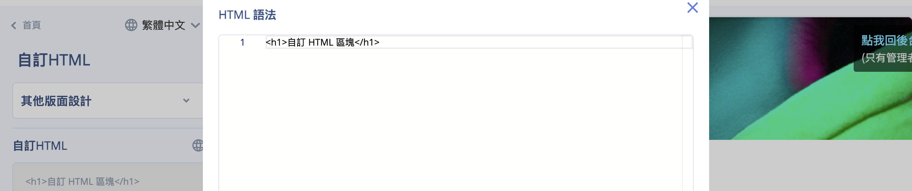

---

#### 應用程式 { #section-app }

放入已安裝的應用程式元件。

1. 新增「應用程式」區塊。
2. 點擊 **選擇套件**，選取已安裝的應用程式。

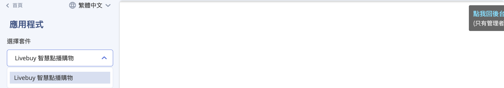

---

#### 文字編輯 { #section-text }

純文字編輯區塊，提供進階文字編輯器。

1. 新增「文字編輯」區塊。
2. 在進階文字編輯器中輸入內容，可使用標題、樣式、連結等功能。

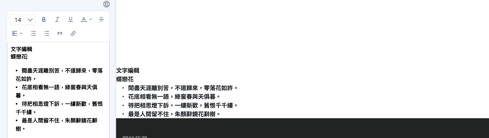

---

<!-- #### CMS `方案限定` { #section-cms } -->
<!---->
<!-- 進階自訂區塊，提供 HTML／CSS／JS／Import 程式碼編輯器，並可帶入指定商品分類與商品數量上限。 -->
<!---->
<!-- 1. 新增「CMS」區塊（需開通 CMS 功能）。 -->
<!-- 2. 在程式碼編輯器中編寫或貼入 HTML／CSS／JS 程式碼。 -->
<!-- 3. 設定要帶入的商品分類與商品數量上限。 -->

---

#### 主打商品 { #section-flagship }

聚焦呈現單一商品並提供購買操作。

1. 新增「主打商品」區塊。
2. 點擊 **其他版面設計**，調整版面邊距。

    === "電腦版"

        - **版面左右外邊距**：設 0px 即滿版，輸入後按 Enter 套用。
        - **版面底部外邊距**：與下方區塊的距離。

        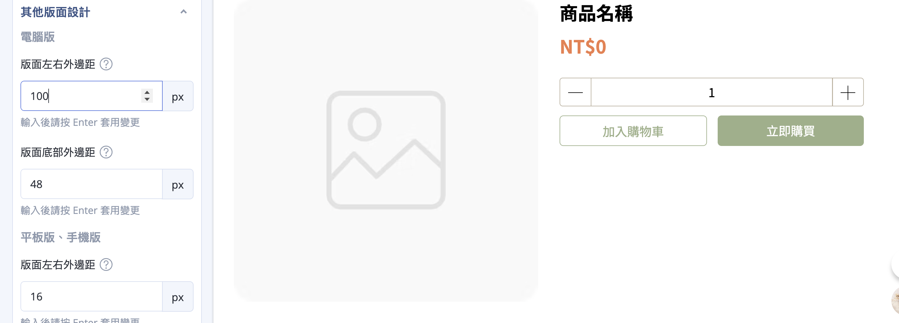

    === "平板版、手機版"

        - **版面左右外邊距**：同電腦版。
        - **版面底部外邊距**：同電腦版。

        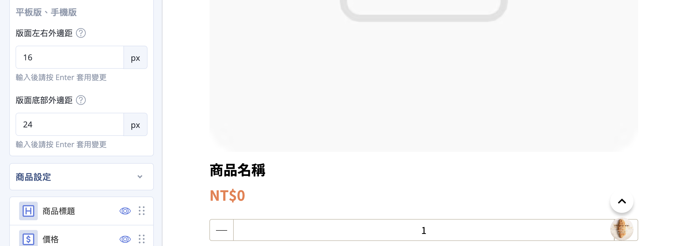

3. 點擊 **商品設定** 下拉選單，設定以下項目：

    - **選擇商品**：點擊 **新增商品** 挑選要顯示的商品。
    - **商品圖片位置**：選擇圖片置於左側或右側。

    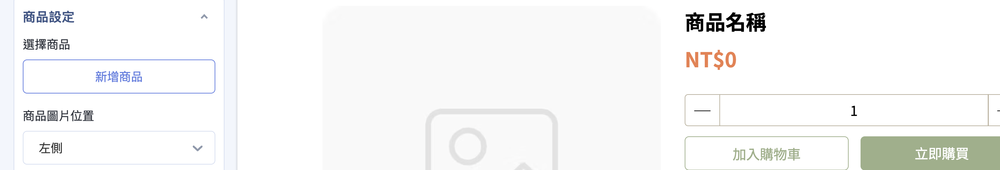

4. 在 **小區塊** 中設定商品標題（字級、可帶商品連結）、文字、購買按鈕、價格、款式選單、數量選擇器。

    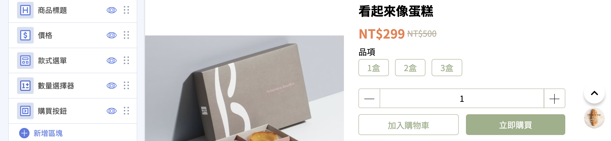

    === "商品標題"

        - **字級**：設定標題字級大小（預設 24px）。
        - **帶入商品連結**：勾選後標題將連結至商品頁面（預設開啟）。
        - **新分頁開啟商品連結**：勾選後在新分頁開啟（預設開啟）。

        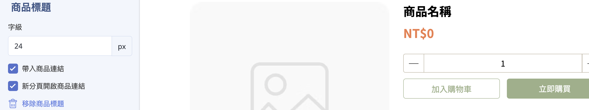

    === "價格"

        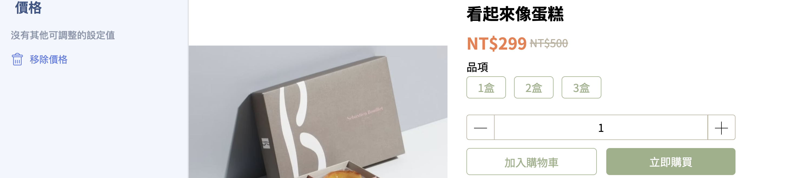

    === "款式選單"

        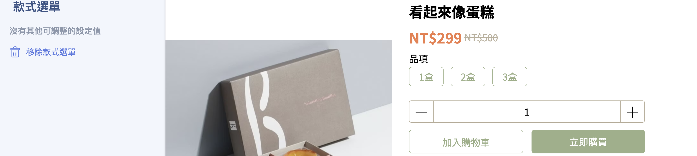

    === "數量選擇器"

        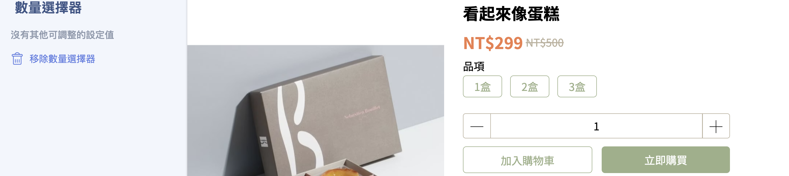

    === "購買按鈕"

        - **顯示立即購買按鈕**：勾選後顯示購買按鈕（預設開啟）。

        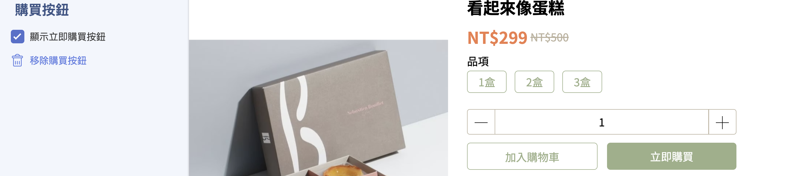

---

#### 折疊內容 <small>FAQ / 購物須知</small> { #section-collapsible }

可展開／收合的內容區塊，是建立 **FAQ 常見問題**、購物須知、退換貨說明等功能的主要工具。

1. 新增「折疊內容」區塊。
2. 點擊 **其他版面設計**，設定以下項目：

    - **標題**：輸入區塊標題（預設「折疊內容」），輸入後按 Enter 套用。
    - **顏色**：點擊色塊設定背景、項目底色、項目外框、文字與圖示顏色。

    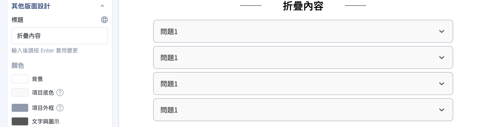

    === "電腦版"

        - **版面左右內邊距**：輸入後按 Enter 套用（預設 160px）。
        - **版面上下內邊距**：同上（預設 48px）。
        - **版面底部外邊距**：與下方區塊的距離（預設 30px）。

        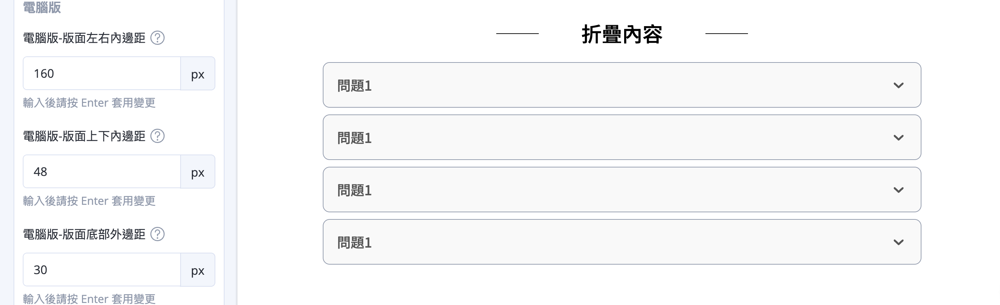

    === "平板版、手機版"

        - **版面左右內邊距**：輸入後按 Enter 套用（預設 16px）。
        - **版面上下內邊距**：同上（預設 24px）。
        - **版面底部外邊距**：與下方區塊的距離（預設 10px）。

        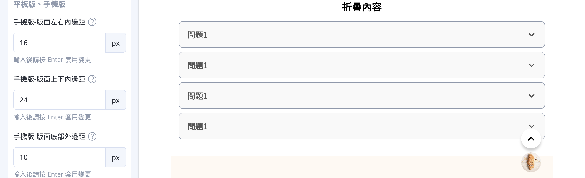

3. 在 **折疊項目** 小區塊中，編輯項目標題、標題圖示、內容（進階文字編輯器）。

    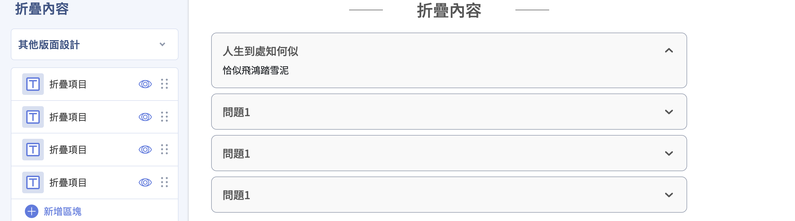

---

### 商品頁面 { #product }

商品頁面主要由四個功能區塊組成，可依需求開啟或調整排序。

在頁面下拉選單選擇「商品頁面」，即可進行以下設定：

=== "基本設定"

    主要控管商品在前台呈現的庫存狀態、價格標籤顯示邏輯以及購買行為。

    - 設定是否 **顯示商品價格(SKU)**。

        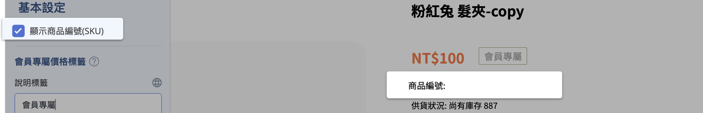

    - 啟用 **會員專屬價格標籤**：商品設定會員專屬價格時，未登入會員或訪客瀏覽時會在價格旁顯示此標籤。啟用後可設定以下項目：

        - **說明標籤**：輸入標籤顯示文字，輸入後按 Enter 套用。
        - **說明標籤連結**：輸入網址後按 Enter 套用，點擊標籤可跳轉至指定頁面。

        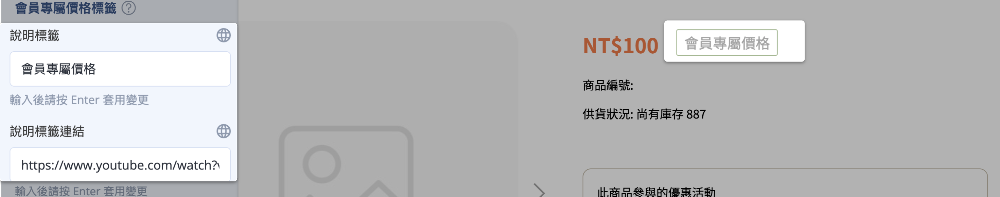

    - 勾選 **商品價格標籤**：可顯示「優惠售價」或「建議售價」文字。

        === "優惠售價"

            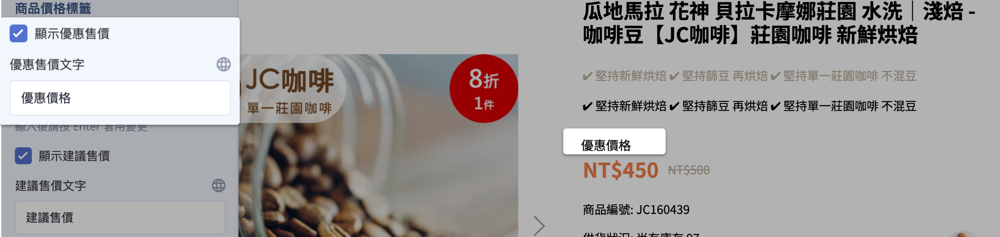

        === "建議售價"

            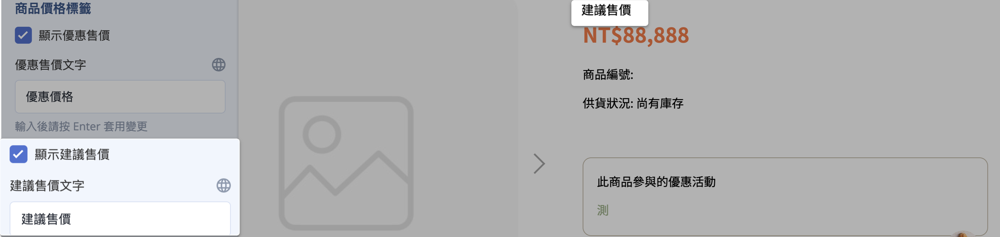

    - **商品款式設定**：

        - 勾選 **預設點選商品款式第一個**。

            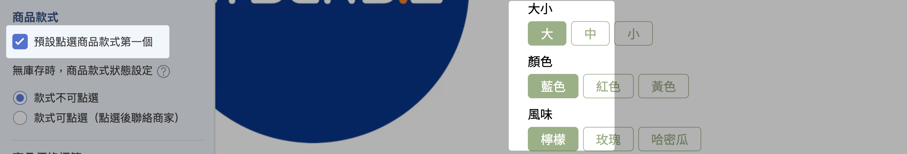

        - 無庫存時樣式行為：

            === "款式不可點選"

                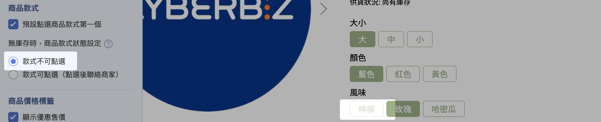

            === "款式可點選"

                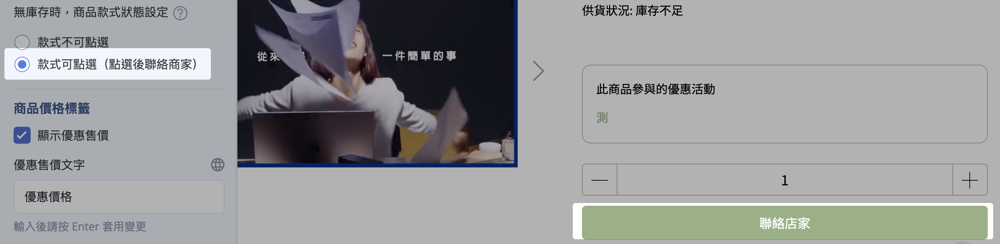

    - **其他設定**：

        - **顯示商品廠商**：勾選後在前台顯示商品廠商名稱。

            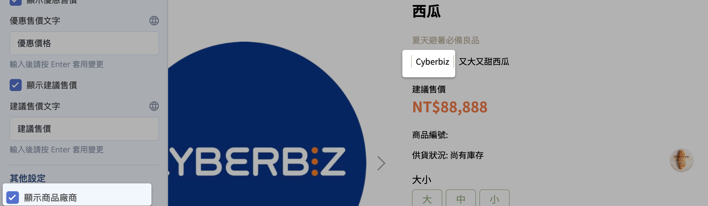

        - **顯示優惠活動區**：勾選後顯示優惠活動區塊。

            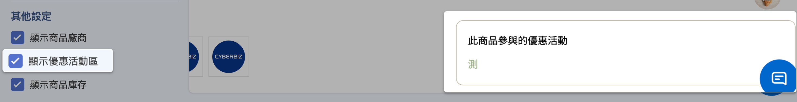

        - **顯示商品庫存**：勾選後在前台顯示商品庫存數量。

            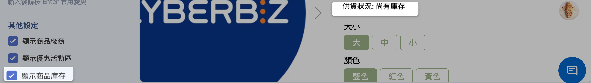

=== "商品介紹"

    設定商品介紹區塊的標題名稱，並決定是否在前台顯示該欄位。

    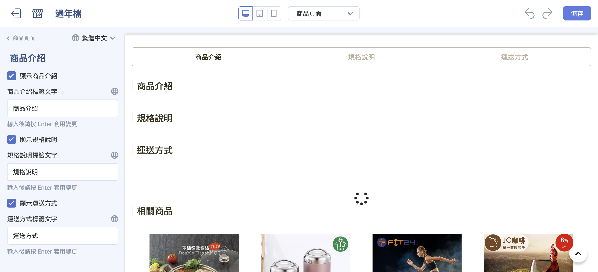

=== "商品評論"

    此功能需先洽客服申請開通。開通後可設定是否需審核留言、隱藏部分姓名，並可搭配 Google reCAPTCHA 防止機器人攻擊。

    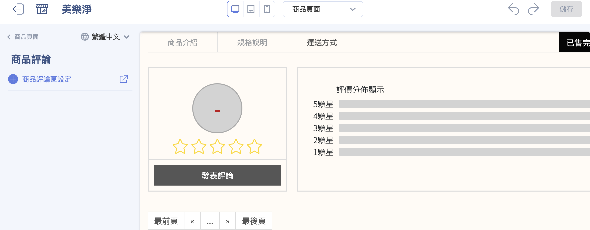

    

    - :lucide-message-square:{ .lg } [__管理商品評論__](../../products/engagement/manage-product-reviews.md){ title="管理商品評論" }

    - :lucide-shield-check:{ .lg } [__啟用留言區 reCAPTCHA__](../customer-interaction/enable-comment-recaptcha.md){ title="啟用留言區 reCAPTCHA" }

    

=== "相關商品"
    { #相關商品 }

    選擇顯示「商品群組其他商品」(同分類隨機顯示)或「自訂關聯群組商品」。

    - **顯示同商品群組其他商品**：隨機顯示此商品所屬商品群組的其他品項。
    - **顯示自訂關聯群組商品**：排序顯示此商品於商品頁設定之相關群組品項（[商品關聯群組](../../products/create-and-manage/create-update-products.md#operate-product-edit-settings){ title="設定商品關聯群組" }）。
    - **相關商品標籤文字**：輸入標籤顯示文字，輸入後按 Enter 套用。
    - **選擇商品數量上限**：設定顯示的商品數量。

    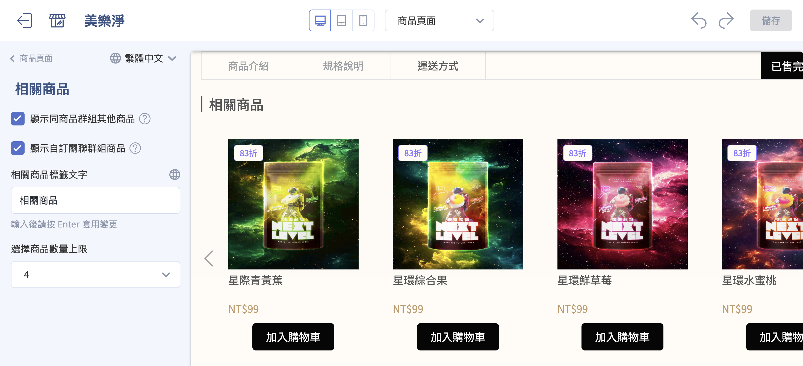

---

### 商品群組頁面 { #collection }

針對群組頁面，可指定要套用哪一組導覽選單（需先在 [選單／導覽列設定](../navigation/setup-menus-navigation.md){ title="設定選單與導覽列" } 完成設置）。

1. 在頁面下拉選單選擇「商品群組頁面」，點擊 **商品分類設定** 進入設定頁面。

    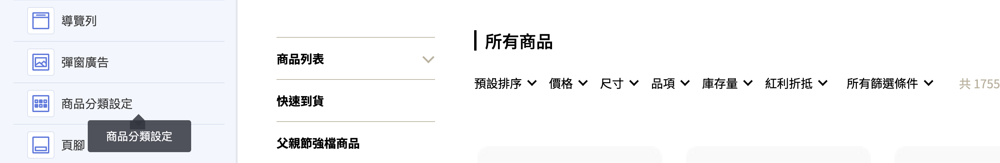{ title="商品群組頁面-進入設定" }

2. 設定以下項目：

    === "左側選單"

        - **左側選單連結**：下拉選單選擇要顯示的選單，或選擇「不顯示選單」隱藏左側選單。需先在 [選單／導覽列設定](../navigation/setup-menus-navigation.md){ title="設定選單與導覽列" } 完成設置。

            === "有主選單"

                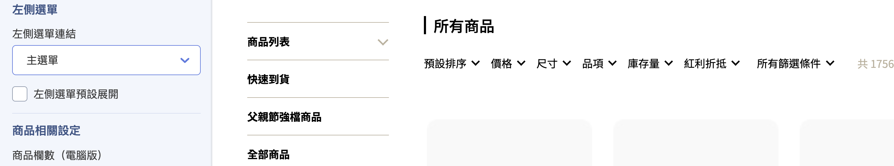{ title="商品群組頁面-有主選單" }

            === "無主選單"

                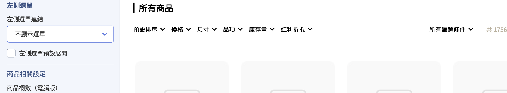{ title="商品群組頁面-無主選單" }

        - **左側選單預設展開**：設定左側選單是否預設展開。

    === "商品相關設定"

        - **商品欄數（電腦版）**：選擇每排顯示的商品數量（下拉選單）。
        - **商品數量上限**：設定每頁顯示的商品數量。
        - **更多商品顯示方式**：選擇分頁或無限滾動。

        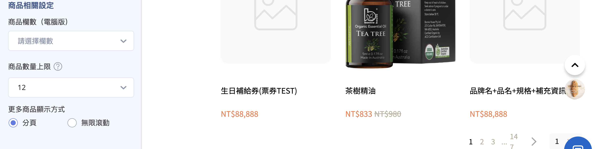{ title="商品群組頁面-商品相關設定" }

---

### 商品多層級分類 { #category }

針對多層級分類頁面的呈現方式進行微調。需先 [建立商品多層級分類架構](../../products/categories-and-tags/multi-level-category-setup.md){ title="設定商品多層級分類" }。

1. 在頁面下拉選單選擇「商品多層級分類」，點擊 **商品多層級分類設定** 進入設定頁面。

    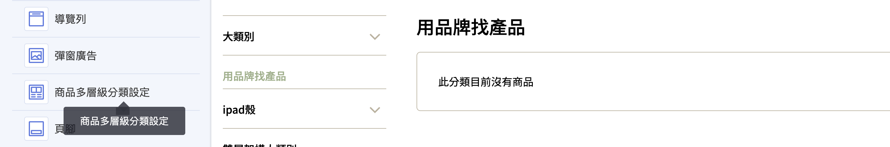{ title="商品多層級分類-進入設定" }

2. 設定以下項目：

    - **左側商品分類選單預設展開**：設定左側選單是否預設展開。
    - **商品分類區塊數量上限**：設定顯示的商品分類區塊數量。
    - **商品跑馬燈商品數量上限**：設定跑馬燈輪播顯示的商品數量。
    - **商品數量上限**：設定每頁顯示的商品數量。

    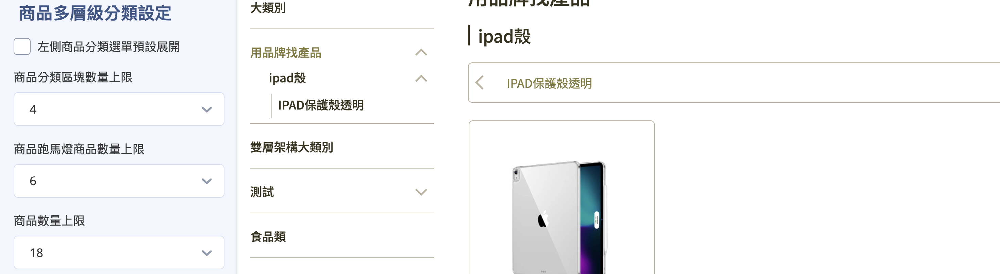

---

### 部落格頁 { #blog }

用於呈現多篇文章的摘要列表。

1. 在頁面下拉選單選擇「部落格頁」，點擊 **部落格設定** 進入設定頁面。

    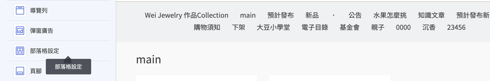

2. 設定以下項目：

    - **每頁文章數量**：設定每頁顯示的文章數量。
    - **顯示精選文章**：勾選後，在部落格列表頁底部顯示特定精選文章。
    - **精選文章群組**：選擇要顯示哪一個部落格群組作為精選內容。

    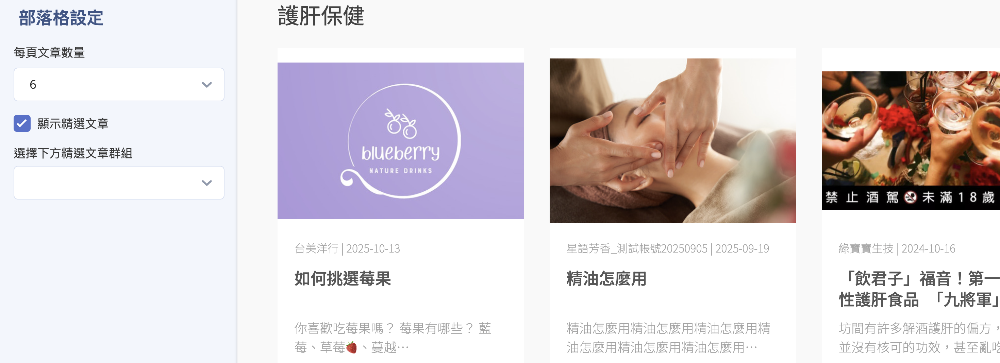

---

### 部落格文章頁 { #article }

用於顯示單篇完整文章的詳細內容。

1. 在頁面下拉選單選擇「部落格文章頁」，點擊 **部落格文章設定** 進入設定頁面。

    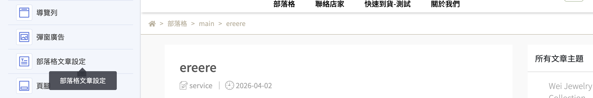

2. 設定以下項目：

    - **顯示右側選單**：勾選後，在文章右側顯示選單區塊。
    - **文章標籤區標題**：設定文章標籤區塊的顯示標題文字，系統會自動抓取該文章所屬群組內的所有文章標籤並在此區塊呈現。
    - **精選文章數量上限**：設定精選文章的顯示數量上限。

    

---

### 客服頁 <small>聯絡我們表單</small> { #contact }

客服頁面在前台主要以「聯絡我們」表單形式呈現，供訪客留言諮詢。

1. 在頁面下拉選單選擇「客服頁」。
2. 建議在 [**頁腳(Footer)**](../navigation/setup-menus-navigation.md#頁腳內容){ title="設定頁腳內容" } 區塊同步設定完整的公司電話、地址與 Email，增加品牌信任感。
3. 如需防止機器人攻擊，可 [啟用留言區 reCAPTCHA](../customer-interaction/enable-comment-recaptcha.md){ title="啟用留言區 reCAPTCHA" }。

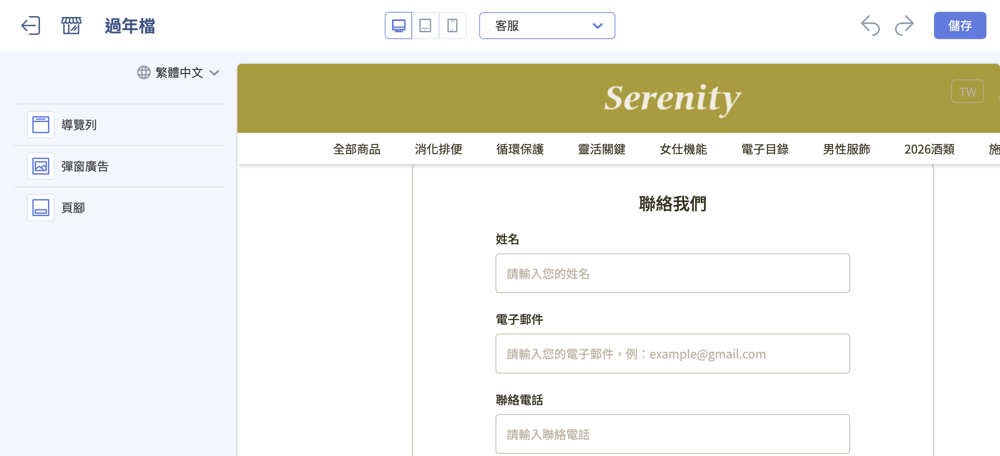

---

### 404 頁 <small>失效連結提示</small> { #not-found }

當消費者訪問到失效連結時的顯示畫面，可自訂視覺以緩解負面體驗。

1. 在頁面下拉選單選擇「404 頁」。
2. 上傳自訂圖片，建議設計符合品牌風格或有趣的引導圖。
3. 設定 **標題** 與 **返回首頁按鈕文字**。

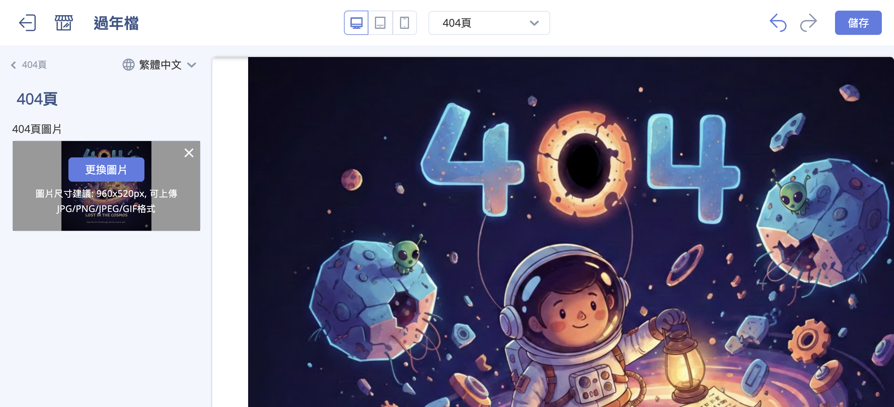

---

### 快速到貨頁 { #express-delivery }

用於自訂快速到貨專區的視覺與醒目入口。

1. 在頁面下拉選單選擇「快速到貨頁」，點擊 **快速到貨設定** 進入設定頁面。

    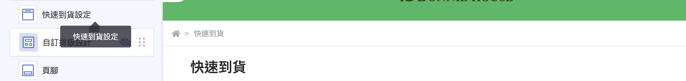

2. 設定以下項目：

    **導覽列設定**

    - **顯示無庫存商品**：勾選後，無庫存商品也會顯示於快速到貨專區。
    - **顯示快速到貨按鈕**：勾選後，系統會在官網全站導覽列上方顯示明顯的專區入口。
    - **快速到貨文字**：自訂快速到貨按鈕顯示文字。輸入後請按 Enter 套用變更。

    **Icon 設定**

    - **選擇圖片**：建議不超過 1MB，寬 80px，高 80px，可上傳 JPG/PNG/JPEG/GIF 格式。
    - **Logo 背景**：設定導覽列背景、快速到貨按鈕的背景顏色，幫助消費者區分一般專區與快速到貨專區。
    - **圖示**：點擊色塊可改變導覽列中圖示以及快速到貨文字的顏色。

    

---

### 搜尋頁 <small>站內搜尋結果</small> { #search }

1. 在頁面下拉選單選擇「搜尋頁」。
2. 指定搜尋頁面左側要套用的 **選單**（需先 [建立選單](../navigation/setup-menus-navigation.md){ title="設定選單與導覽列" }）。
3. 搜尋結果中的商品會同步套用「[全站共用設定](setup-global-theme-settings.md#shop-product-display){ title="全站共用設定" }」中的顯示規範（價格區間、商品標語、已銷售數量等）。
4. 搜尋結果頁支援顯示定期定額、特價、缺貨以及自定義標籤。

??? info "搜尋範圍與邏輯說明"
    - **搜尋範圍：** 不只查詢「商品名稱」，亦涵蓋 **商品群組名稱、商品廠商與商品介紹**。
    - **分詞邏輯：** 商品標題支援分詞搜尋，需完全符合分詞才會被搜到。例如以「空格」或「-」會將標題切分為單詞：標題為「ER-1410」時搜「1410」可找到；標題為「ER1410」時搜「1410」則找不到。
    - **排除搜尋：** 若部分商品不希望出現在搜尋頁，可於商品編輯頁的「基本設定」中關閉「商品搜尋功能」，該商品將無法在站內搜尋框、所有商品列表及外部 Google 搜尋中被檢索。

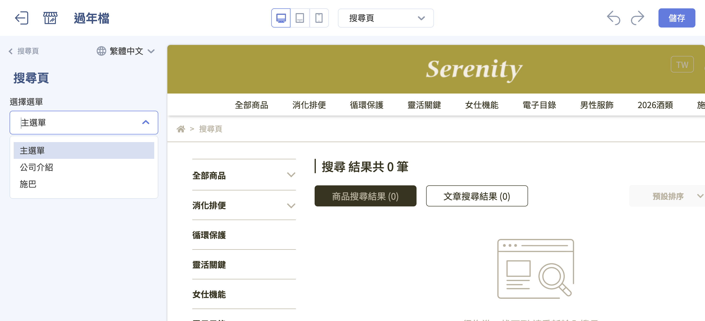

---

## 後續操作 { #next-steps-page-settings }

- :lucide-palette:{ .lg }   
  [__拖拉版型網站設定__](theme-editor.md){ title="拖拉版型網站設定" }     
  了解如何進入拖拉版型編輯器進行網站設定

- :lucide-settings-2:{ .lg }   
  [__全站共用設定__](setup-global-theme-settings.md){ title="全站共用設定" }     
  設定彈窗廣告、顏色、品牌識別、SEO、商品顯示行為與動態標籤

## 參考資料 { #reference-page-settings }

- [可新增區塊類型對照表](../references/theme-editor-sections.md)
- [可拖拉編輯的頁面對照表](../references/theme-editor-pages.md)

 --- 
 <!---->
 <!-- #### 圖文介紹 { #section-graphic-intro }  -->
 <!---->
 <!-- 圖片搭配文字與按鈕的介紹區塊。  -->
 <!---->
 <!-- 1. 新增「圖文介紹」區塊。  -->
 <!-- 2. 設定 **文字排版**（靠左／置中／靠右）、**文字色** 與 **背景色**。  -->
 <!-- 3. 上傳電腦／平板／手機版圖片，選擇 **圖片位置**（左側／右側）與 **電腦版版面占比**（預設 50%）。  -->
 <!-- 4. 在 **小區塊** 中編輯：  -->
 <!---->
 <!--     - **標題**：文字內容（預設「產品介紹」），可設 **字級**（預設 24px）。  -->
 <!--     - **內文**：進階文字編輯器，可設 **字級**（預設 14px）。  -->
 <!--     - **按鈕**：按鈕文字（預設「了解更多」）、按鈕底色／文字色、按鈕連結（可新分頁開啟）。  -->
 <!---->
 <!-- 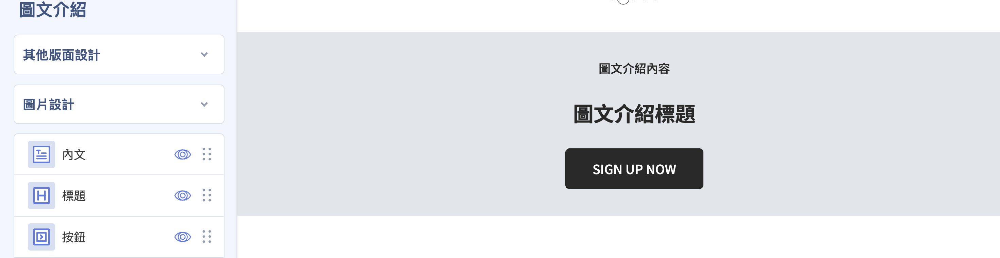  -->
 <!---->
 <!-- ---  -->
 <!---->
 <!-- #### 自訂 HTML { #section-custom-html }  -->
 <!---->
 <!-- 直接貼入 HTML 程式碼，適合放第三方語法或自訂內容。  -->
 <!---->
 <!-- 1. 新增「自訂 HTML」區塊。  -->
 <!-- 2. 點擊「編輯」，在 HTML 程式碼編輯器中貼入程式碼。  -->
 <!-- 3. 在 **其他版面設定** 調整電腦／手機版面邊距（此區塊四組邊距預設皆為 0）。  -->
 <!---->
 <!--   -->
 <!---->
 <!-- ---  -->
 <!---->
 <!-- #### 應用程式 { #section-app }  -->
 <!---->
 <!-- 放入已安裝的應用程式元件。  -->
 <!---->
 <!-- 1. 新增「應用程式」區塊。  -->
 <!-- 2. 點擊 **選擇套件**，選取已安裝的應用程式（此區塊僅此一項設定，無版面邊距）。  -->
 <!---->
 <!--   -->
 <!---->
 <!-- ---  -->
 <!---->
 <!-- #### 文字編輯 { #section-text }  -->
 <!---->
 <!-- 純文字編輯區塊，提供進階文字編輯器。  -->
 <!---->
 <!-- 1. 新增「文字編輯」區塊。  -->
 <!-- 2. 在進階文字編輯器中輸入內容，可使用標題、樣式、連結等功能。  -->
 <!-- 3. 在 **其他版面設定** 調整電腦／手機版面邊距（四組邊距預設皆為 0）。  -->
 <!---->
 <!--   -->
 <!---->
 <!-- ---  -->
 <!---->
 <!-- #### CMS `方案限定` { #section-cms }  -->
 <!---->
 <!-- 進階自訂區塊，提供程式碼編輯器並可帶入指定商品分類。  -->
 <!---->
 <!-- 1. 新增「CMS」區塊（需開通 CMS 功能）。  -->
 <!-- 2. 在程式碼編輯器中編寫，實際提供 **4 格**：**Root（HTML）／CSS／JS／Import**。  -->
 <!-- 3. 設定要帶入的 **商品分類** 與 **商品數量上限**。  -->
 <!---->
 <!-- ---  -->
 <!---->
 <!-- #### 主打商品 { #section-flagship }  -->
 <!---->
 <!-- 聚焦呈現單一商品並提供購買操作。  -->
 <!---->
 <!-- 1. 新增「主打商品」區塊。  -->
 <!-- 2. 點擊 **選擇商品** 挑選要顯示的商品，並選擇 **商品圖片位置**（左側／右側）。  -->
 <!-- 3. 在 **小區塊** 中設定：  -->
 <!---->
 <!--     - **商品標題**：可設 **字級**（預設 24px），並可勾選「**帶入商品連結**」「**在新分頁開啟商品連結**」（皆預設開啟）。  -->
 <!--     - **文字**：進階文字編輯器，可設字級（預設 14px）。  -->
 <!--     - **購買按鈕**：可勾選「**顯示立即購買按鈕**」（預設開啟）。  -->
 <!--     - **價格／款式選單／數量選擇器**：為固定顯示的小區塊，無其他可調整設定。  -->
 <!---->
 <!-- 4. 此區塊 **版面邊距預設較大**（電腦左右 80px／底部 50px、手機左右 16px／底部 24px）。  -->
 <!---->
 <!-- 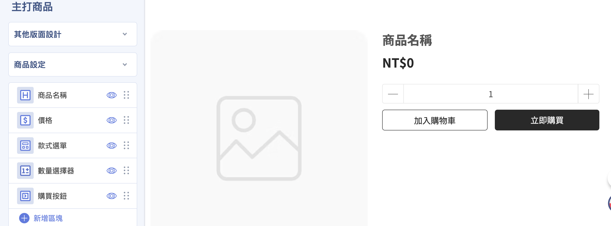  -->
 <!---->
 <!-- ---  -->
 <!---->
 <!-- #### 折疊內容 { #section-collapsible }  -->
 <!---->
 <!-- 可展開／收合的內容區塊，適合 FAQ 或購物須知。  -->
 <!---->
 <!-- 1. 新增「折疊內容」區塊。  -->
 <!-- 2. 填寫 **標題**（預設「折疊內容」）。  -->
 <!-- 3. 設定 **顏色**：背景、項目底色、項目外框、文字與圖示（共 4 色）。  -->
 <!-- 4. 設定 **邊距**（此區塊用 **內邊距 padding**，非外邊距）：  -->
 <!---->
 <!--     - 電腦版：左右內邊距（預設 160px）、上下內邊距（預設 48px）、底部外邊距（預設 30px）。  -->
 <!--     - 手機版：左右內邊距（預設 16px）、上下內邊距（預設 24px）、底部外邊距（預設 10px）。  -->
 <!---->
 <!-- 5. 在 **折疊項目** 小區塊中，編輯 **項目標題**、**標題圖示**（無／問號／圖釘／打勾／電燈泡，共 5 種）、**內容**（進階文字編輯器）。  -->
 <!---->
 <!--   -->
