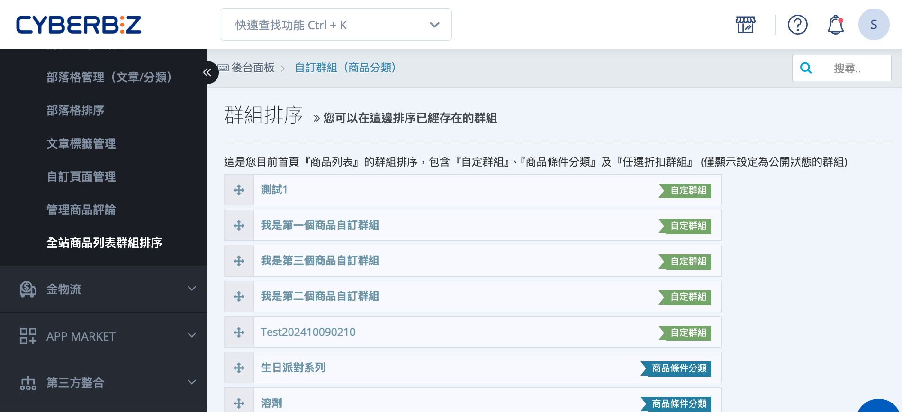
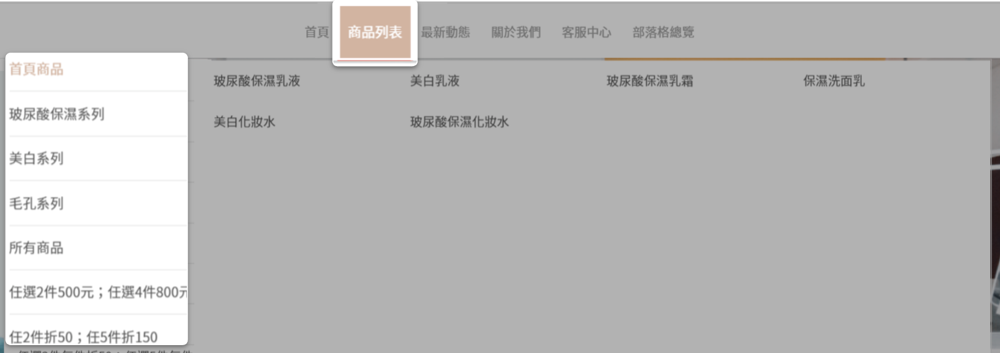
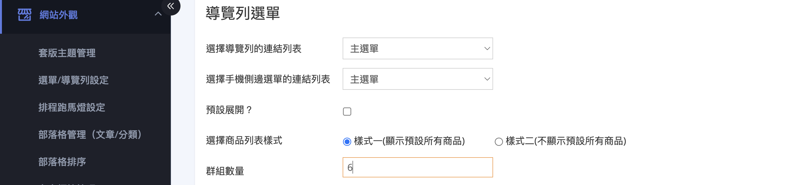

{ .hero-page }

## 首頁商品群組排序介紹

「全站商品列表群組排序」可以決定顧客在前台首頁「商品列表」區塊看到群組時，哪一個群組排在最前面、哪一個排在後面。把主打活動或熱門分類往前移，就能讓顧客一進首頁就先看到您想優先曝光的商品群組。

!!! info "提示"
    這個頁面排的是「群組之間的順序」，不是群組裡面商品的順序。群組內的商品要怎麼排，請到各群組的編輯頁面設定。兩者的差異請見 [群組排序與群組內商品排序的差異][faq-collection-order-vs-product-order]。

---

## 使用前提與限制 { #prerequisites-collection-order }

- [x] **至少有一個公開群組**：排序清單只會列出設定為「公開」狀態的群組，隱藏中的群組不會出現在這裡。
- [x] **群組類型**：可排序的群組包含「[自定群組](../../products/categories-and-tags/custom-collections.md){ title="設定商品自訂分類群組" }」、「[商品條件分類](../../products/categorization/設定商品條件分類群組.md)」與「[任選折扣群組](../../marketing/任選折扣.md){ title="任選折扣" }」三種，詳見 [群組類型對照表](../../products/references/collection-group-types.md#reference-collection-order-group-types){ title="商品群組類型對照表" data-preview }。

---

## 操作步驟 { #operate-collection-order }

1. **進入排序頁面：** 前往後台路徑：「網站外觀」>「全站商品列表群組排序」。
2. **確認群組清單：** 頁面會列出目前所有「公開狀態」的群組，每個群組右側標有類型標籤(自定群組、商品條件分類、任選折扣群組)，方便您辨識。
3. **拖曳調整順序：** 按住群組左側的拖曳圖示，將該群組上下拖曳到想要的位置；越上方的群組，在前台越優先顯示。
4. **自動儲存：** 放開滑鼠後，系統會自動記錄新的順序，不需要再按任何儲存按鈕。
5. **確認前台呈現：** 前往前台首頁的「商品列表」區塊，確認群組的顯示順序已與後台一致。

!!! tip "技巧"
    若想把某個群組從清單中移除(不顯示在前台)，不需要在這裡操作，[改到該群組的編輯頁將狀態設為「隱藏」](../../products/categories-and-tags/custom-collections.md#operate-custom-collections-publish){ title="設定商品自訂分類群組" }即可，隱藏後它就會自動從這份排序清單消失。

---

## 前台顯示說明

前台首頁的「商品列表」將依照群組列表頁面設定的排序順序，依序顯示商品群組。

---

## 設定列表顯示群組數量

您可設定首頁「商品列表」中，最多顯示幾個商品群組。

1. 登入 CYBERBIZ 管理後台，前往  **網站外觀 > 套版主題管理 > 導覽列 Navbar > 導覽列選單**。
2. 調整 **群組數量** 欄位。
    
    - **範例**：若群組數量設定為 `4`，即使目前有 `8` 個群組設為公開，首頁仍僅顯示前 `4` 個群組。

 

## 重要規範與限制 { #specs-collection-order }

- 排序結果套用在前台首頁的「商品列表」區塊，影響顧客瀏覽群組的先後順序。
- 只有「公開」狀態的群組會列入排序清單；隱藏中的群組不會顯示，也不會出現在前台。
- 此頁僅調整「群組與群組之間」的順序；群組「內部商品」的排序需在各群組編輯頁另行設定。

---

## 後續操作 { #next-steps-collection-order }

- :lucide-layout-grid:{ .lg }  
  [__管理商品群組__](../../products/index.md){ title="商品管理" }  
  新增、編輯或隱藏自定群組、商品條件分類與任選折扣群組。

- :lucide-arrow-down-up:{ .lg }  
  [__設定群組內商品排序__](../../products/index.md){ title="商品管理" }  
  調整單一群組裡商品的顯示順序(手動排序、依價格、依暢銷等)。

---

## 常見問題 { #faq-collection-order }

??? quote "為什麼有些群組沒有出現在排序清單裡?"
    { #faq-collection-order-missing-group }
    排序清單只會列出設定為「公開」狀態的群組。若某個群組沒有出現，通常是因為它目前是「隱藏」狀態。

    請到該群組的編輯頁，將狀態改為「公開」，它就會出現在排序清單中。

??? quote "這裡的排序和群組內的商品排序有什麼不同?"
    { #faq-collection-order-vs-product-order }
    兩者排的對象不同：

    - **全站商品列表群組排序**(本頁)：排的是「群組與群組之間」的先後順序。
    - **群組內商品排序**：排的是「單一群組裡面，各個商品」的顯示順序，需到各群組的編輯頁設定。

??? quote "拖曳調整後需要按儲存嗎?"
    { #faq-collection-order-auto-save }
    不需要。當您拖曳群組並放開滑鼠後，系統就會自動記錄新的順序。若前台沒有立即更新，請重新整理前台頁面再確認。

??? quote "排序會套用到哪裡?"
    { #faq-collection-order-where-applied }
    套用在前台首頁的「商品列表」區塊。顧客進入首頁瀏覽該區塊時，群組就會依照您在這裡設定的順序由上而下顯示。

