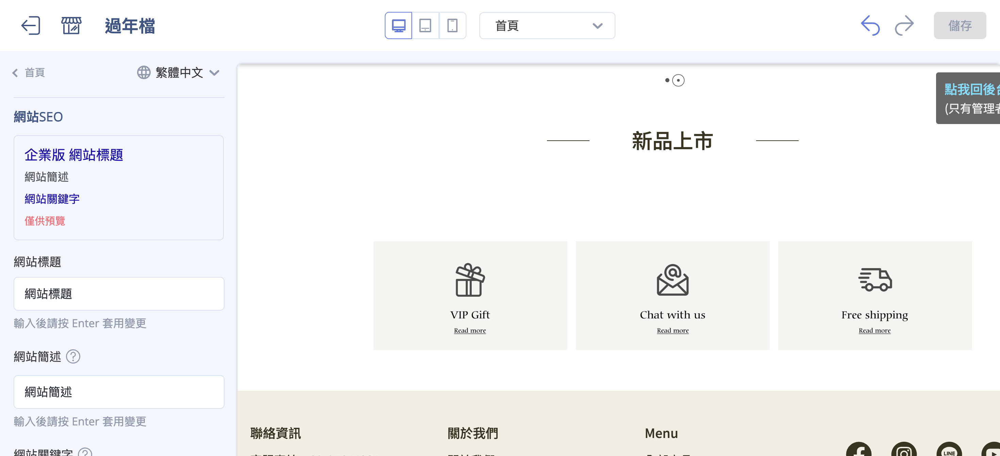
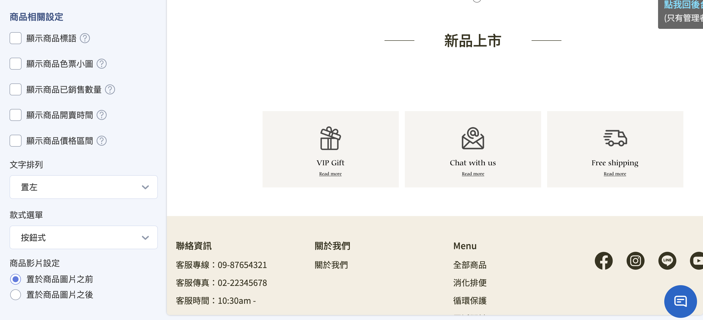
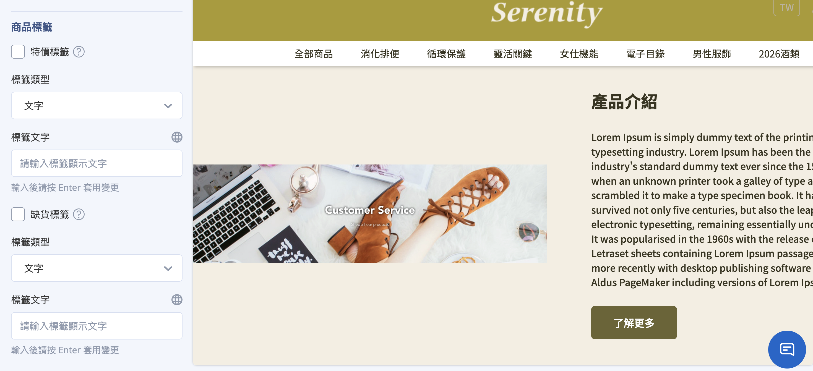

{ .hero-page }

全站共用設定不屬於單一頁面,而是套用到 **整個官網**。在拖拉版型編輯器左側面板下方,可進入導覽列、彈窗廣告、頁腳、顏色設定與全站設定。

!!! note "註釋"
    部分設定(如顏色設定)在 POS-only 方案不會顯示;實際項目依您的方案與已開通功能而定。

---

## 導覽列與頁腳 { #navbar-footer }

導覽列與頁腳的設定較完整,另有專文說明:

- **導覽列:** 可設定選單排列樣式(預設／併排置左／併排置右)、背景是否透明,以及次選單是否同步展開。瞭解 [如何設定選單與導覽列](../navigation/setup-menus-navigation.md){ title="設定選單與導覽列" }。
- **頁腳:** 提供「上下」或「左右」排序樣式,並可開啟 **社群媒體圖示** 的顯示](../navigation/setup-menus-navigation.md#設定頁腳內容)導覽列.md#設定頁腳內容){ title="設定選單與導覽列" }。

---

## 彈窗廣告 { #popup }

商家可依行銷目的,選擇以下幾種彈窗內容形式:

- **圖片彈窗:** 可分別上傳電腦版、平板版與手機版圖片(電腦版為必填),並設定圖片點擊後導向的網址。
- **影片彈窗:** 目前支援嵌入 **YouTube 影片** 連結進行展示。
- **互動遊戲:** 可將後台設定好的「輪盤遊戲」或「紅包抽獎」放入彈窗,增加趣味性並發放紅利或優惠券(此功能為官網會員專屬,需登入才可參與)。
- **排程跑馬燈:** 可在彈窗內載入預先製作好的跑馬燈內容,達成自動化更新廣告圖的需求。

---

## 顏色設定 { #color }

針對全站的基礎視覺元素進行定義:

- **主色調與文字顏色:** 一鍵變更全站的主色調顏色及全站字體顏色。
- **強調色:** 最重要的設定之一,會自動套用於系統多個動態 UI 元素。

??? note "強調色的應用範圍"
    當商家在顏色設定中選定「強調色」後,系統會自動將該顏色應用於:

    - **商品標籤(Labels):** 包含系統自動顯示的 **定期定額**、**特價**、**缺貨** 標籤,以及商家自定義的 **5 組標籤**。
    - **開賣時間倒數:** 若商品設定為尚未上架,前台商品頁或群組列表顯示的 **倒數時間底色** 會自動套用強調色。
    - **排序邏輯:** 標籤顏色會依特定順序(定期定額 > 特價 > 缺貨 > 自定義標籤)由左至右排列,並統一套用該色系。

??? note "特定區塊的個別顏色設定"
    除了全站統一的顏色設定外,某些功能區塊允許更細緻的顏色自訂:

    - **置頂公告:** 可分別設定置頂公告欄位的 **圖片連結底色** 及 **時間倒數的文字與背景顏色**。
    - **折疊內容:** 用於 FAQ 或購物須知的區塊,可個別設定該區塊的顯示顏色。
    - **圖文介紹:** 此區塊內的 **按鈕顏色** 可依需求自訂。

---

## 全站設定 { #shop-setting }

集中控管官網的基礎視覺識別、搜尋引擎優化(SEO)、全域商品顯示行為以及網站安全防護等核心設定。

### 視覺識別與品牌資產 { #brand }

- **網站圖示設定:**
    - **Favicon:** 設定顯示於瀏覽器分頁標籤上的小圖示。
    - **OG Image(轉貼連結預設圖片):** 設定網站連結分享至 Facebook 或 LINE 時顯示的預設縮圖。
- **導覽列圖示:** 系統預設 3 種樣式,商家亦可上傳自定義圖示檔案。
- **字型設定:** 調整全站網頁所套用的字體樣式。

### 網站 SEO 與安全保護 { #seo-security }

- **SEO 設定:** 可定義網站的 **標題**、**簡述** 與 **關鍵字**,優化搜尋引擎對網站的收錄與排名。若標題欄位留空,系統會預設以商店名稱作為標題。
- **網頁鎖右鍵:** 勾選可禁止使用者透過點擊滑鼠右鍵自行下載圖片或複製文字,保護原創內容。

### 全域商品顯示行為 { #shop-product-display }

統一設定商品在各列表頁與詳細頁的呈現方式:

- **商品標語:** 商品特色或促銷標語。
- **商品色票小圖:** 可開啟在官網前台顯示商品顏色款式小圖。
- **銷售數量:** 可開啟顯示商品的 **已銷售數量**。
- **開賣時間:** 針對設定為尚未上架的商品,可開啟顯示商品的 **開賣倒數時間**。
- **價格區間:** 可勾選顯示商品 **價格區間**,開啟後前台會自動隱藏原有的 **定價** 標籤。
- **商品款式選單:** 設定前台商品款式顯示方式為下拉選單或按鈕。
- **商品影片設定:** 若商品有設定影片,可指定影片顯示在圖片彈窗的第一格或最後一格。
- **商品購買數量上限:** 設定每個款式商品可被加入購物車的上限。
- **商品圖游標懸停效果:** 設定游標移到商品圖片上方的效果,包括顯示加入購物車按鈕、圖片切換、陰影/邊框強調、放大效果。
- **折扣貼紙:** 當任一款式售價低於定價時,會在商品圖片左上方顯示折扣貼紙。

!!! info "適用方案限制"
    - 商品色票小圖與開賣時間為 **企業** 方案專屬功能。
    - 商品影片僅適用 **PLUS / 企業** 方案。
    - 折扣貼紙僅適用 **非 PLUS / 企業** 方案。

### 動態標籤設定(商品標籤) { #product-labels }

系統會根據特定條件自動為商品附上標籤,並依固定的優先順序由左至右排列:

- **定期定額標籤:** 商品綁定定期定額活動時顯示。
- **特價標籤:** 當商品售價低於定價時顯示。
- **缺貨標籤:** 商品庫存為 0 且設定為停止銷售時顯示。
- **自定義標籤:** 商家可設定最多 **5 組** 自定義標籤(支援文字或圖片類型),並透過與後台商品標籤關聯來觸發顯示。

> 備註:這些標籤的底色通常套用「顏色設定」中的「強調色」。

!!! info "適用方案限制"
    - 商品標籤功能僅適用 **高手 PLUS 與 企業** 方案。
    - 自定義標籤僅適用 **企業** 方案。

---

## 參考資料 { #reference }

- [拖拉版型網站設定](theme-editor.md)
- [各頁面設定](theme-editor.md#各頁面設定)
- [可新增區塊類型對照表](references/theme-edi](../navigation/setup-menus-navigation.md)](../navigation/設定選單與導覽列.md)

