{ .hero-page }

## 拖拉版型介紹 { #intro-theme-editor }

「拖拉版型」是 CYBERBIZ 新一代的版型，前台頁面由一個個 **區塊** 組成。每個區塊代表頁面上的一段內容，例如主視覺輪播、圖文介紹、商品列表等。在拖拉版型編輯器中，您可以：

- **新增、移除區塊：** 自由增減頁面上的內容段落。
- **拖曳排序：** 用滑鼠上下拖動，調整區塊在頁面上的先後順序。
- **編輯內容：** 點選區塊後，於右側填入文字、上傳圖片、設定連結與選擇商品。
- **即時預覽：** 中間畫面同步顯示修改後的樣子，並可切換電腦、平板、手機檢視。
- **發布上線：** 確認無誤後一鍵發布，將版型套用到前台官網。

整個編輯器分為三大區域： **左側區塊列表、中間即時預覽、左側區塊設定**，所有操作都圍繞這三個區域進行。

## 頁面功能總覽 { #overview-theme-editor }

| 區域 | 位置 | 用途 |
| :-- | :-- | :-- |
| 上方工具列 | 編輯器最上方 | 切換編輯頁面、預覽裝置、復原/重做、預覽前台、儲存、發布 |
| 區塊列表 | 左側面板 | 列出目前頁面的所有區塊，可新增、拖曳排序、顯示/隱藏、點選進入編輯 |
| 即時預覽 | 中間畫面 | 同步顯示前台實際效果，可切換電腦/平板/手機 |
| 區塊設定 | 左側面板 | 點選區塊後展開，編輯該區塊的文字、圖片、連結、商品等內容 |

=== ":lucide-wrench: 上方工具列"

	

=== ":lucide-panel-left: 區塊列表"

	

	左側面板列出目前頁面的所有區塊：

	- :lucide-eye: 點擊切換區塊顯示或隱藏。
	- :lucide-grip-vertical: 按住拖曳可調整區塊排序。
	- :lucide-circle-plus: 點擊新增區塊。

=== ":lucide-panel-left-open: 即時預覽"

	

	中間畫面同步顯示前台實際效果，可切換電腦/平板/手機檢視不同裝置的呈現。

=== ":lucide-panel-left: 區塊設定"

	

	左側面板在點選區塊後展開，提供該區塊的設定選項：

	- **文字**：輸入標題、說明文字。
	- **圖片**：上傳或貼入圖片 URL。
	- **連結**：設定點擊後前往的頁面或網址。
	- **商品**：挑選要呈現在區塊中的商品。

## 使用前提與限制 { #prerequisites-theme-editor }

開始之前，請先確認以下條件，這會影響您能不能使用拖拉編輯器，以及哪些頁面可以編輯：

- [x] **版型須為「拖拉版型」：** 只有標示 **「拖拉設定」** 的版型才能使用本文的拖拉編輯器。舊的「預設版型」走另一套網站設定流程，不在本文範圍。
- [x] **可拖拉的頁面有限：** 目前支援拖拉編輯的頁面為首頁、商品頁面與自訂頁面等，並非每個頁面都能拖拉。完整清單請見 [可拖拉編輯的頁面](../references/theme-editor-pages.md#theme-editor-pages){ title="可拖拉編輯的頁面對照表" data-preview }。
- [x] **部分區塊需加值功能：** 多數區塊所有拖拉版型皆可使用，少數區塊(如商品評論、門市據點列表)需另外開通對應加值功能才會出現，請見 [可新增區塊類型](../references/theme-editor-sections.md#theme-editor-sections){ title="可新增區塊類型對照表" data-preview }。

---

## 操作步驟 { #operate-theme-editor }

以下依日常使用情境，從進入編輯器到發布上線，逐一說明。

### 進入拖拉版型編輯器 { #operate-theme-editor-enter }

1. **開啟主題版型頁面：** 進入後台的 **「網站外觀/套版主題管理 > 主題版型」** 頁面，這裡列出您商店已安裝的所有版型。
2. **找到拖拉版型：** 在版型卡片上確認是否標示 **「拖拉設定」**，這代表它是支援拖拉編輯的版型。
3. **進入編輯器：** 點擊該版型卡片上的 **「網站設定」** 按鈕，即進入拖拉版型編輯器[^default-theme]。

[^default-theme]: 若版型未標示「拖拉設定」(即舊的預設版型)，點擊「網站設定」會進入舊版的網站設定頁，而非本文說明的拖拉編輯器。

---

### 新增區塊 { #operate-theme-editor-add-section }

1. **點擊新增：** 在左側區塊列表下方，點擊 **「新增區塊」**。
2. **選擇區塊類型：** 在彈出的清單中選擇想要的區塊樣式[^section-names]，例如輪播圖、圖文、商品列表等。
3. **確定新增：** 點擊 **「確定新增」**，新區塊會加入頁面，並出現在左側列表中，接著即可點選它進行內容編輯。

!!! note "註釋"
    「新增區塊」只會出現在支援拖拉的頁面(首頁、商品頁面、自訂頁面等)。若您切換到不支援拖拉的頁面，就不會看到新增區塊的選項。

[^section-names]: 清單中實際可選的區塊與其名稱，會依您所安裝的拖拉版型而有所不同，請以編輯器內顯示的為準。

---

### 編輯區塊內容 { #operate-theme-editor-edit-settings }

1. **點選區塊：** 在左側列表點擊任一區塊，面板會展開該區塊的設定選項。
2. **填寫內容：** 依區塊類型填入對應內容，常見的設定包含：
    * **文字：** 直接輸入標題、說明文字，輸入後請按 ++enter++ 套用變更。
    * **圖片：** 點擊 **「選擇圖片」** 或 **「上傳圖片」** 上傳檔案，也可選擇 **「貼上圖片URL」** 填入外部圖片網址。
    * **連結：** 設定點擊區塊後要前往的頁面或網址。
    * **商品：** 透過 **「選擇商品」** 挑選要呈現在區塊中的商品。
3. **編輯內含小區塊：** 部分區塊(如輪播圖)底下還有多個小區塊，可逐一點入分別設定。

!!! tip "技巧"
    修改後請留意中間的即時預覽畫面，確認內容呈現符合預期。文字類欄位記得按下 ++enter++ 或 ++tab++ 才會套用變更。

---

### 調整區塊順序 { #operate-theme-editor-reorder }

1. **找到拖曳把手：** 在左側區塊列表中，每個可調整的區塊都有一個拖曳圖示 :lucide-grip-vertical: (移動把手)。
2. **上下拖動：** 按住拖曳把手，將區塊往上或往下拖動到想要的位置後放開，前台頁面的呈現順序就會跟著改變。

!!! note "註釋"
    部分固定區塊(例如頁首選單、頁尾)無法拖曳調整位置，這類區塊不會顯示拖曳把手。

---

### 顯示或隱藏區塊 { #operate-theme-editor-visibility }

每個區塊都可以暫時隱藏，而不必刪除：

1. **點擊眼睛圖示：** 在左側列表中，點擊區塊上的眼睛圖示 :lucide-eye: 即可切換 **顯示** 或 **隱藏**。
2. **確認效果：** 被隱藏的區塊不會出現在前台，但您先前的設定內容會完整保留，日後重新顯示即可恢復。

---

### 移除區塊 { #operate-theme-editor-remove }

1. **進入區塊設定：** 點選欲刪除的區塊，展開設定面板。
2. **點擊移除：** 點擊 **「移除」:lucide-trash-2:**，該區塊即會從頁面中刪除。

!!! info "提示"
    移除是直接刪除整個區塊與其內容，若只是暫時不想顯示，建議改用 [顯示或隱藏區塊](#operate-theme-editor-visibility) 較為保險。

---

### 切換編輯頁面與預覽 { #operate-theme-editor-preview }

1. **切換編輯頁面：** 透過上方工具列的頁面下拉選單，切換目前要編輯與預覽的頁面(例如首頁、商品頁面)。

    

2. **切換預覽裝置：** 點擊上方的 **電腦 / 平板 / 手機** 圖示，預覽畫面會依該裝置寬度調整，方便檢查 RWD 呈現。
3. **預覽前台實際效果：** 點擊 **「預覽」** 會另開新分頁，以前台實際樣貌呈現目前的編輯結果。

    
    
---

### 切換語系編輯 { #operate-theme-editor-language }

若您的商店已開通多國語系(語系數量大於 1)，上方工具列會出現 **語系切換**：

1. **選擇語系：** 在工具列點選要編輯的語系。
2. **分別設定內容：** 切換後，編輯與預覽的是該語系版本的版型，您可為每個語系分別設定文字與圖片。

!!! note "註釋"
    只有當商店啟用多種語系時才會看到語系切換；單一語系的商店不會顯示此選項。詳見 [設定前台多國語言與多幣別](../../website-management/setup-multi-language-and-multi-currency.md)。

---

### 復原、重做與儲存 { #operate-theme-editor-save }

1. **復原 / 重做：** 編輯過程中若要回到上一步，點上方的 **「上一動作」** :lucide-undo-2: 圖示；要還原則點 **「下一動作」** :lucide-redo-2:。
2. **儲存變更：** 完成編輯後，點擊右上角的 **「儲存」** 保存。

!!! info "儲存後會不會立刻生效？"
    這取決於您正在編輯的是哪一個版型：

    * **編輯「已發布」的版型：** 儲存後修改會 **立即反映在前台官網**。
    * **編輯「未發布」的版型：** 儲存只會保存草稿，不會影響前台，需完成下一步的 **發布** 才會套用上線。

---

### 發布主題 { #operate-theme-editor-publish }

當您編輯的是未發布的版型，完成後需發布才會套用到前台：

1. **點擊發布：** 在編輯器上方點擊 **「發布」**。
2. **確認替換：** 系統會跳出提示「此操作將替換您當前主題，並將它移至未發佈的主題中⋯」，確認後點擊 **「確認並發布」**。
3. **完成上線：** 此版型即成為前台正式版型，顧客造訪商店時就會看到新的版面。

!!! note "註釋"
    同一時間只會有一個「已發布」版型。發布新版型後，原本的版型會自動移到「未發布主題」中保留，您隨時可以再切換回去。

---

## 全站共用設定

全站共用設定不屬於單一頁面，而是套用到 **整個官網**。在拖拉版型編輯器左側面板下方，可進入導覽列、彈窗廣告、頁腳、顏色設定與全站設定。

!!! note "註釋"
    部分設定(如顏色設定)在 POS 獨賣方案不會顯示；實際項目依您的方案與已開通功能而定。

---

### 導覽列與頁腳 { #navbar-footer }

導覽列與頁腳的設定較完整，另有專文說明：

- :lucide-menu:{ .lg }  
  [__導覽列__](../navigation/setup-menus-navigation.md){ title="設定選單與導覽列" }  
  可設定選單排列樣式（預設／併排置左／併排置右）、背景是否透明，以及次選單是否同步展開。

- :lucide-arrow-down-to-line:{ .lg }  
  [__頁腳__](../navigation/setup-menus-navigation.md#頁腳內容){ title="設定選單與導覽列" }  
  提供「上下」或「左右」排序樣式，並可開啟社群媒體圖示的顯示與連結。

<!---->
<!-- 導覽列與頁腳的設定較完整，另有專文說明： -->
<!---->
<!-- - **導覽列：** 可設定選單排列樣式(預設／併排置左／併排置右)、背景是否透](../navigation/setup-menus-navigation.md)](../navigation/setup-menus-navigation.md){ title="設定選單與導覽列" }。 -->
<!-- - **頁腳：** 提供「上下」或](../navigation/setup-menus-navigation.md#頁腳內容)[如何設定頁腳](../navigation/setup-menus-navigation.md#頁腳內容){ title="設定選單與導覽列" }。 -->

---

### 彈窗廣告 { #popup }

彈窗廣告會在顧客進站時自動跳出。在全站共用設定中可選擇以下內容形式，並設定顯示條件：

=== "圖片彈窗"

    - **圖片上傳：** 分別上傳電腦版、平板版與手機版圖片。電腦版為必填；未上傳時自動沿用電腦版圖片。
    - **縮圖大小：** 設定彈窗縮小後的小圖示與大小（小／中／大）。未上傳時預設使用電腦版圖片。
    - **圖片連結：** 設定點擊彈窗圖片後要前往的頁面或網址。
    - **在新分頁開啟連結：** 勾選後，點擊彈窗圖片會以新分頁開啟連結，顧客不離開目前的官網頁面。

    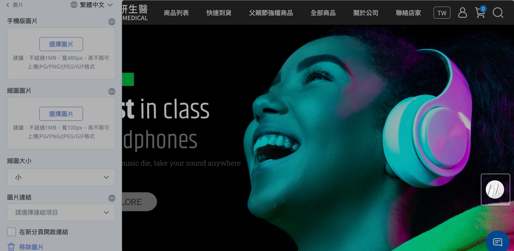

    !!! note "彈窗的顯示與收合行為"
        圖片彈窗沒有「顯示頻率」欄位，顯示邏輯由系統自動處理：進站時自動展開，顧客縮小後會記憶 **24 小時** 不再自動彈出；購物車／結帳頁則不會顯示彈窗。

=== "影片彈窗"

    - **影片連結：** 目前支援嵌入 YouTube 影片連結。

    

=== "互動遊戲"

    - **選擇遊戲：** 放入後台已設定好的「輪盤遊戲」或「紅包抽獎」。
    - **獎勵發放：** 可發放紅利或優惠券。
    - **參與限制：** 此功能為官網會員專屬，需登入才可參與。
    - **設定路徑：** 前往 [互動遊戲設定指南](../../marketing/other-tools/interactive-games.md){ title="互動遊戲 (EC)" } 建立輪盤遊戲或紅包抽獎活動。

    

=== "排程跑馬燈"

    - **選擇跑馬燈：** 從預先製作好的「跑馬燈進階設定」群組載入內容。
    - **用途：** 達成自動化更新廣告圖的需求。
    - **排程：** 前往 [排程跑馬燈設定指南](configure-scheduled-carousels.md){ title="建立與管理排程跑馬燈" } 設定廣告檔期的上下架時間。

    

---

### 顏色設定 { #color }

針對全站的基礎視覺元素進行定義：

- **主色調與文字顏色：** 一鍵變更全站的主色調顏色及全站字體顏色。
- **強調色：** 最重要的設定之一，會自動套用於系統多個動態 UI 元素。

??? note "強調色的應用範圍"
    當商家在顏色設定中選定「強調色」後，系統會自動將該顏色應用於：

    - **商品標籤(Labels)：** 包含系統自動顯示的 **定期定額**、 **特價**、 **缺貨** 標籤，以及商家自定義的 **5 組標籤**。
    - **開賣時間倒數：** 若商品設定為尚未上架，前台商品頁或群組列表顯示的 **倒數時間底色** 會自動套用強調色。
    - **排序邏輯：** 標籤顏色會依特定順序(定期定額 > 特價 > 缺貨 > 自定義標籤)由左至右排列，並統一套用該色系。

??? note "特定區塊的個別顏色設定"
    除了全站統一的顏色設定外，某些功能區塊允許更細緻的顏色自訂：

    - **置頂公告：** 可分別設定置頂公告欄位的 **圖片連結底色** 及 **時間倒數的文字與背景顏色**。
    - **折疊內容：** 用於 FAQ 或購物須知的區塊，可個別設定該區塊的顯示顏色。
    - **圖文介紹：** 此區塊內的 **按鈕顏色** 可依需求自訂。

---

### 全站設定 { #shop-setting }

集中控管官網的基礎視覺識別、搜尋引擎優化(SEO)、全域商品顯示行為以及網站安全防護等核心設定。

#### 視覺識別與品牌資產 { #brand }

- **網站圖示設定：**
    - **Favicon:** 設定顯示於瀏覽器分頁標籤上的小圖示。
    - **OG Image(轉貼連結預設圖片)：** 設定網站連結分享至 Facebook 或 LINE 時顯示的預設縮圖。[查看設定教學](../site-settings/setup-og-image.md){ title="設定轉貼連結縮圖 OG Image" }
- **導覽列圖示：** 系統預設 3 種樣式，商家亦可上傳自定義圖示檔案。

    !!! info "一頁式商店限制"
        自訂導覽列圖示僅支援 **2025 年 7 月後** 建立的一頁式商店。

- **字型設定：** 調整全站網頁所套用的字體樣式。

---

#### 網站 SEO 與安全保護 { #seo-security }

- **SEO 設定：** 可定義網站的 **標題**、 **簡述** 與 **關鍵字**，優化搜尋引擎對網站的收錄與排名。若標題欄位留空，系統會預設以商店名稱作為標題。[查看設定教學](../site-settings/setup-site-title-seo.md){ title="設定網站標題與 SEO" }
- **網頁鎖右鍵：** 勾選可禁止使用者透過點擊滑鼠右鍵自行下載圖片或複製文字，保護原創內容。[查看設定教學](../site-settings/setup-right-click-protection.md){ title="設定網頁鎖右鍵保護圖文版權" }

---

#### 全域商品顯示行為 { #shop-product-display }

此區設定會 **套用到全站所有商品列表與商品頁**（首頁商品區塊、商品群組頁、多層級分類、搜尋頁、商品詳情頁等），統一商品卡片與價格的呈現方式，不需逐一設定每件商品。以下依後台設定面板由上到下的順序說明：

!!! plan "功能限制"
    部分功能需特定方案方可使用，已標示於各項目標題。

- **顯示商品標語：** 在商品圖／名稱下方顯示商品特色或促銷標語，同步套用於首頁商品區塊、分類頁、商品頁、任選折扣、紅配綠與搜尋頁。[查看設定教學](../../products/create-and-manage/edit-product-slogan-and-description.md){ title="編輯商品簡述與商品標語" }
- **顯示商品色票小圖 `企業版`：** 在商品群組頁與多層級分類頁顯示款式顏色小圖，讓顧客先看到可選色系。[查看設定教學](../../products/create-and-manage/product-swatches-variant-images-drag-drop.md){ title="設定商品色票與款式圖片" }
- **顯示已銷售數量：** 在商品名稱下方顯示累計銷售數量，營造熱銷感。

    

- **顯示定期定額活動標籤 `企業版`[^1]：** 商品綁定定期定額活動時，於商品上顯示活動標籤。
- **顯示商品開賣時間 `PLUS版 / 企業版`：** 商品已設定上架時間但尚未開賣時，前台顯示開賣倒數（紅利商城頁除外）。

    

- **顯示商品價格區間：** 多款式不同價時，以「最低～最高」區間顯示售價並隱藏定價；未開啟則顯示最低售價＋定價。
    - 注意：已開啟「預設點選第一個款式」的商品頁、商品彈窗、首頁主打商品不適用。

    

---

- **文字排列：** 商品卡片文字（名稱、價格等）的對齊方式，可選 **置左／置中／置右**（預設置左）。
- **款式選單：** 商品頁款式選擇器樣式，可選 **下拉式／按鈕式**（預設按鈕式）。

    === "按鈕式"
        { title="商品款式選單-按鈕式" }
    === "下拉式"
        { title="商品款式選單-下拉式" }

- **商品影片設定 `PLUS版 / 企業版`：** 商品有影片時，將影片 **置於商品圖片之前或之後**（即圖片輪播的第一張或最後一張，預設之前）。[查看設定教學](../../products/create-and-manage/setup-product-videos.md){ title="設定商品影片" }
- **商品購買數量上限：** 每個款式可加入購物車的數量上限，留空或填 0 表示無上限。
- **折扣貼紙 `非 PLUS版 / 企業版`：** 上傳一張貼紙圖（建議 100×100px），當任一款式售價低於定價時，自動顯示於商品圖左上角。

    

- **圖片寬高比例：** 商品列表圖片比例，可選 **1:1／3:4**（預設 1:1）。
- **商品圖游標懸停效果：** 滑鼠移到商品圖時的效果，可選 **快速加入購物車按鈕／圖片切換／陰影‧邊框強調／放大效果**（預設快速加入購物車按鈕）。

    === "快速加入購物車按鈕"
        { title="商品圖懸停效果-加入購物車按鈕" }
    === "圖片切換"
        { title="商品圖懸停效果-圖片切換" }
    === "陰影‧邊框強調"
        { title="商品圖懸停效果-陰影邊框" }
    === "放大效果"
        { title="商品圖懸停效果-放大效果" }

[^1]: 且未使用「商品標籤」功能時。

---

#### 動態標籤設定 <small>商品標籤</small> { #product-labels }

=== "一般、專業 PLUS、進階 PLUS"

    - **顯示定期定額活動標籤**：當商品綁定定期定額活動，則自動顯示。
    - **折扣貼紙(特價標籤)**：當商品任一款式售價小於定價，則自動顯示。若勾起 **顯示定期定額活動標籤**，則不套用此處設定。
    - **圖片寬長比例**：請依照您上傳的商品圖片來選擇呈現比例。(若有商品上下留有空白，建議可先更換呈現比例)

    

=== "高手 PLUS、企業"

    商品標籤會依條件 **自動** 標示於商品圖上，不需逐一手動設定。於「全站設定」中點擊 **「商品標籤列表」** 進入設定頁，即可設定下列標籤（面板由上到下依序排列），每類皆可獨立啟用並選擇呈現方式。

    

    ---

    **標籤種類與觸發條件**

    - **特價標籤：** 商品售價低於定價時自動顯示。
    - **缺貨標籤：** 商品庫存為 0 且設為停止銷售時自動顯示。
    - **定期定額標籤：** 商品被加入定期定額活動時自動顯示。
    - **自定義標籤（每商品限 5 組[^1]）：** 各綁定一個後台「商品標籤」，套用該標籤的商品即自動顯示。全商店最多可建立 30 組。瞭解 [如何為商品指定後台標籤](../../products/categories-and-tags/manage-product-tags.md#從編輯頁設定商品標籤)。

    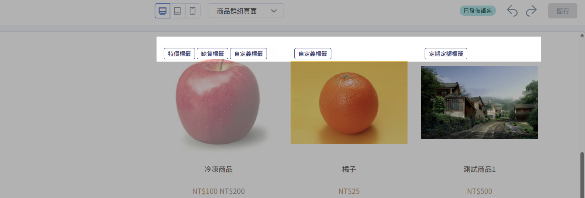

    !!! plan "方案限制"
        | 標籤種類 | 高手 PLUS | 企業 |
        | ------- | --------- | ---- |
        | **特價標籤** | ✓ | ✓ |
        | **缺貨標籤** | ✓ | ✓ |
        | **定期定額標籤** | ✓ | ✓ | 
        | **自定義標籤** | ✕ | ✓ |

    [^1]: 超出 5 組時，前台依排序僅顯示前 5 組，第 6 組起不予顯示。此上限僅計算自定義標籤，系統預設標籤（特價、缺貨、定期定額）不在此限；商品可同時顯示兩者。例如：商品同時符合 3 個系統預設標籤與 6 個自定義標籤時，前台顯示 3 個預設標籤 + 前 5 個自定義標籤，共 8 個。

    **調整前台顯示順序**

    於商品標籤列表，長按並拖曳列表左側 ⁝⁝ 圖示即可調整排序；此處的排列順序將直接同步為前台標籤的顯示順序。

    

---

**呈現方式 <small>每個標籤可獨立設定</small>**

- **文字：** 自行輸入要顯示的標籤文字。
- **圖片：** 上傳標籤圖片，並選擇圖片標籤大小（**大／小**）。
- **折扣折數：** 僅「特價標籤」提供，依售價與定價自動以折數呈現。

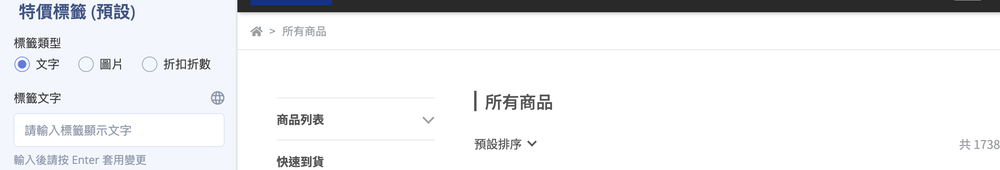

!!! info "標籤底色預設套用「[顏色設定](#color)」中的強調色；多個標籤同時成立時會依系統固定順序並列。"

## 各頁面設定

拖拉版型透過上方工具列的 **頁面下拉選單** 切換不同頁面。除了首頁、自訂頁面、單頁式頁面以「[新增區塊](../references/theme-editor-sections.md)」的方式自由組合外，其餘頁面的版面由系統固定，僅提供以下各自的設定項目。

!!! note "註釋"
    下拉選單實際出現的頁面，會依您安裝的版型與已開通的功能而不同，請以編輯器內顯示的為準。

### 首頁 { #homepage }

首頁可新增以下 13 種區塊（順序同編輯器「新增區塊」清單）。多數區塊皆提供 **版面邊距** 設定（電腦／手機版的左右外邊距、底部外邊距），以下各區塊僅列出其特有設定。

#### 輪播素材 { #section-main-slider }

可放入多張輪播「素材」的主視覺區塊。

- **區塊層級：** 圖片停留秒數、切換速度；電腦／手機版可各自設定圖片數量與間距。
- **每張素材：** 電腦／平板／手機版圖片、圖片連結（可新分頁開啟）、圖片替代文字（alt）。
- **素材文字：** 可選內容位置，並填入標題、內文、按鈕文字與連結，及標題／內文／按鈕的顏色。

=== "區塊層級"
    點開「其他版面設計」進行詳細設定：

    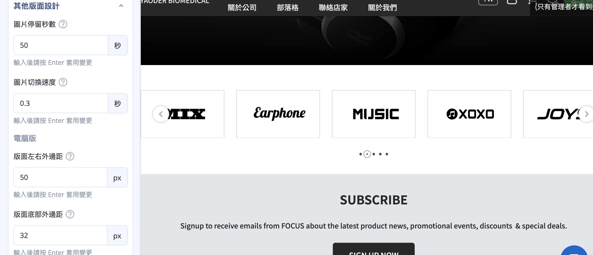

=== "每張素材"
    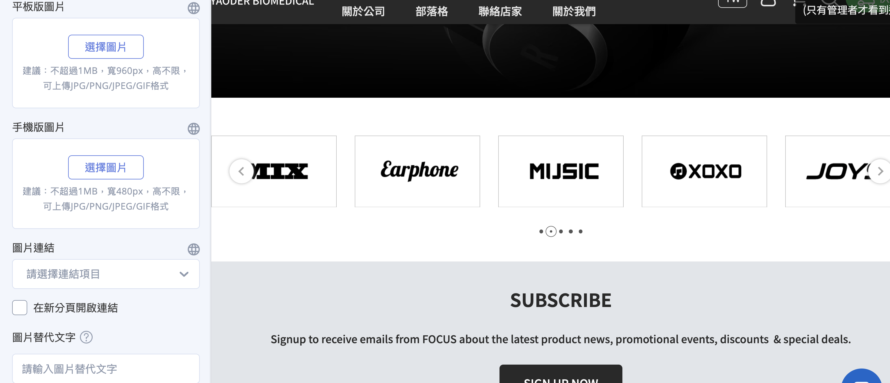

=== "素材文字"
    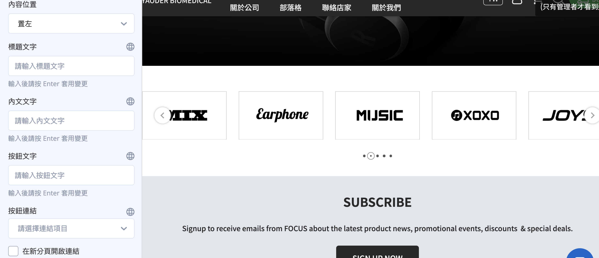

---

#### 橫幅廣告 { #section-banner }

單張橫幅圖片，常用於活動入口。

- 電腦／平板／手機版圖片、圖片連結（可新分頁開啟）、圖片替代文字。
- 可開啟 **顯示按鈕**，設定按鈕位置、文字與底色／文字色。

=== "圖片設定"
    分別上傳電腦／平板／手機版圖片。

    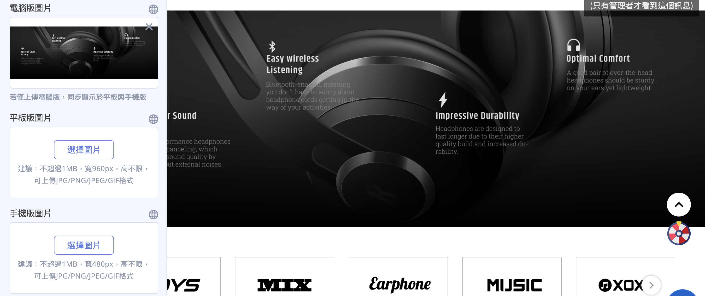

=== "圖片連結"
    設定點擊圖片後前往的頁面或網址，可開啟新分頁。

    

=== "圖片替代文字"
    設定圖片替代文字（alt），有助於 SEO 與無障礙瀏覽。

    

=== "顯示按鈕"
    可開啟 **顯示按鈕**，設定按鈕位置、文字與底色／文字色。

    

---

#### 商品分類 { #section-collection-blocks }

從指定商品分類帶入商品的列表區塊。

- 標題、**選擇商品分類**、商品數量上限、商品展開方式。
- 電腦／手機版商品欄數、商品排列、文字排列。
- 電腦版商品分類樣式、商品圖游標懸停效果、商品圖圓角。

=== "基本設定"
    標題、**選擇商品分類**、商品數量上限、商品展開方式。

    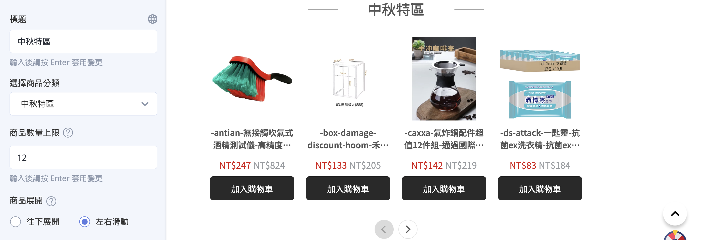

=== "版面設定"
    電腦／手機版商品欄數、商品排列、文字排列。

    

=== "樣式設定"

    電腦版商品分類樣式。

    

    商品圖游標懸停效果、商品圖圓角。

    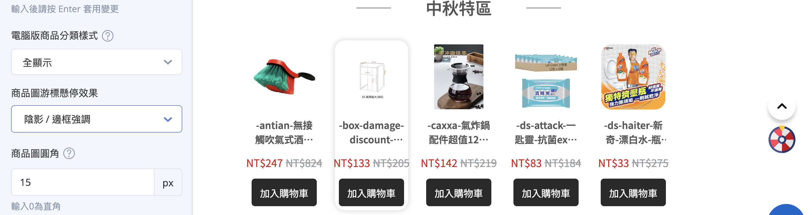

---

#### 影片設定 { #section-video }

嵌入單支影片。

- 標題、影片連結。
- 自動播放、隱藏外框、重複播放。

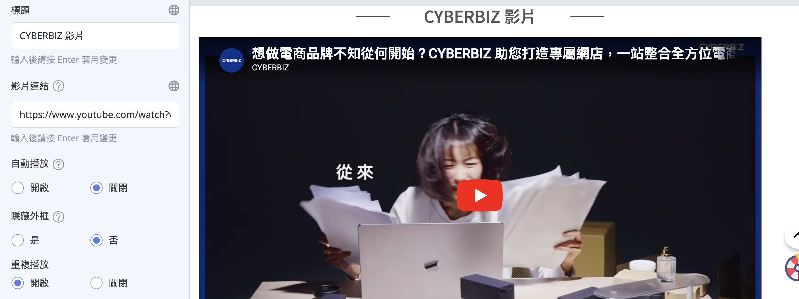

---

#### 分頁頁籤 { #section-blog-tabs }

以頁籤呈現多個部落格的文章。

- **其他版面設定：** 標題、文章欄數。
- **小區塊「部落格」：** 各別選擇要顯示的部落格。

=== "其他版面設定"
    標題、文章欄數。

    

=== "部落格選擇"
    各別選擇要顯示的部落格。

    

---

#### 自訂排版設計 { #section-custom-blocks }

自由組合多種小區塊的彈性版面，可設定區塊間距與手機版排版。支援的小區塊：

- **圖片：** 電腦／平板／手機圖、標題、圖片說明、連結、替代文字、版面螢幕占比。
- **影片：** 影片連結、自動播放／隱藏外框／重複播放、版面占比。
- **排程跑馬燈：** 載入跑馬燈、版面占比。
- **自訂 HTML：** 自由貼入 HTML。
- **商品：** 選擇商品、電腦版分類樣式、版面占比。

=== "圖片"
    電腦／平板／手機圖、標題、圖片說明、連結、替代文字、版面螢幕占比。

    

=== "影片"
    影片連結、自動播放／隱藏外框／重複播放、版面占比。

    

=== "排程跑馬燈"
    載入跑馬燈、版面占比。詳見 [排程跑馬燈設定指南](configure-scheduled-carousels.md){ title="建立與管理排程跑馬燈" }。

    

=== "自訂 HTML"
    自由貼入 HTML。點擊「編輯」進入 HTML 編輯頁面。

    

=== "商品"

    **選擇商品：** 點擊「選擇商品」後，使用進階篩選跟關鍵字篩選出欲加入的商品，並點擊「確認新增」。僅能選擇單一商品，若想顯示多個商品，請建立多個商品區塊。

    

    **分類樣式與版面占比：** 設定電腦版商品分類的外觀樣式，以及該區塊在頁面上的螢幕占比。

    

!!! tip "設計模組的版面比例"
    您可以透過設定「**版面螢幕占比**」來控制每個區塊在畫面中的寬度，讓多個區塊能在同一橫列中並排顯示。

    **排列邏輯說明：**

    - 區塊會由左至右依序排列。
    - 每一橫列的總占比上限為 100%。當區塊並排的占比超過 100%，系統會自動換行，將超出區塊及後續區塊顯示於下一列，以此類推。

    ??? example "常見排版範例"
        === "三欄式結構"
            建立 3 個區塊，每個區塊占比設為 33%，三者加總不超過 100% 即可並排。

            

        === "雙欄式結構"
            建立 2 個區塊，可設定為 60% + 40%、50% + 50% 等加總為 100% 的組合。

            

        === "單欄式結構"
            如僅有一個區塊需滿版呈現，可設為 100%。

            

---

#### 圖文介紹 { #section-graphic-intro }

圖片搭配文字與按鈕的介紹區塊。

- 文字排版、文字色／背景色、圖片（電腦／平板／手機）、圖片位置、電腦版版面占比。
- **小區塊：** 標題（可設字級）、內文（可設字級）、按鈕（文字、底色／文字色、連結）。

---

#### 自訂 HTML { #section-custom-html }

直接貼入 HTML 程式碼，適合放第三方語法或自訂內容。

---

#### 應用程式 { #section-app }

放入已安裝的應用程式元件（**選擇套件**）。

---

#### 文字編輯 { #section-text }

純文字編輯區塊，提供進階文字編輯器（標題、樣式、連結等）。

---

#### CMS `加值` { #section-cms }

進階自訂區塊，提供 HTML／CSS／JS／Import 程式碼編輯器，並可帶入指定商品分類與商品數量上限。需開通 CMS 加值功能。

---

#### 主打商品 { #section-flagship }

聚焦呈現單一商品並提供購買操作。

- 選擇商品、商品圖片位置。
- **小區塊：** 商品標題（字級、可帶商品連結）、文字、購買按鈕（顯示立即購買）、價格、款式選單、數量選擇器。

---

#### 折疊內容 { #section-collapsible }

可展開／收合的內容區塊，適合 FAQ 或購物須知。

- 標題、背景／容器／邊框／文字顏色、內外邊距。
- **小區塊「折疊項目」：** 項目標題、標題圖示、內容（進階文字編輯器）。

---

### 商品頁面 { #product }

商品頁面主要由四個功能區塊組成，可依需求開啟或調整排序。

=== "基本設定"

    主要控管商品在前台呈現的庫存狀態、價格標籤顯示邏輯以及購買行為。

    - **顯示商品價格(SKU)：** 選擇是否顯示商品編號 SKU。
    - **會員專屬價格標籤：** 商品設定會員專屬價格時，未登入會員或訪客瀏覽時會在價格旁顯示此標籤。
    - **商品價格標籤：** 可勾選顯示「優惠售價」或「建議售價」。勾選優惠售價時，當定價大於售價會顯示優惠售價文字。
    - **多款式價格：** 當商品款式售價不同時，顯示價格區間(如 TWD 40 ~ TWD 100)。
    - **無庫存狀態：** 設定商品缺貨時，款式按鈕為「不可點選」或「可點選(顯示聯絡店家)」。
    - **顯示優惠活動區：** 勾選後顯示該商品相關的優惠活動。

  	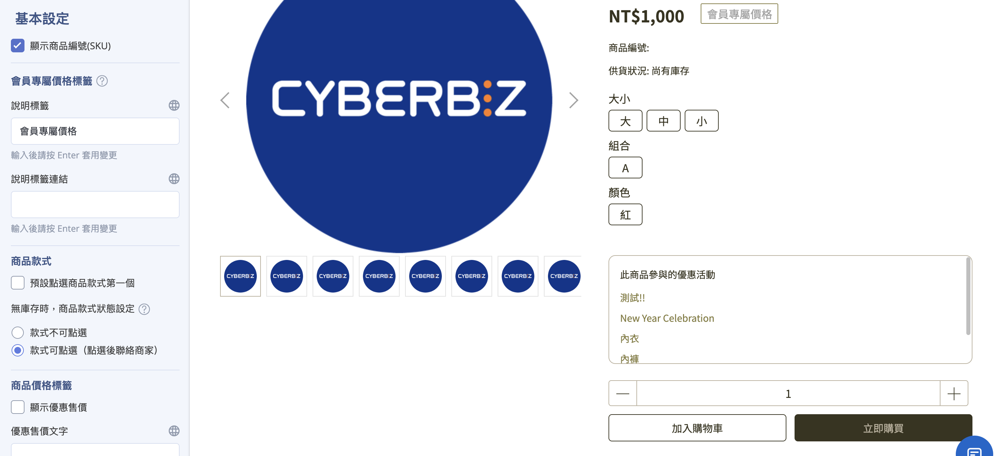

=== "商品介紹"

    設定商品介紹區塊的標題名稱，並決定是否在前台顯示該欄位。

    

=== "商品評論"

    此功能需先洽客服申請開通。開通後可設定是否需審核留言、隱藏部分姓名，並可搭配 Google reCAPTCHA 防止機器人攻擊。

    - [如何管理商品評論](../../products/engagement/manage-product-reviews.md){ title="管理商品評論" }
    - [如何啟用 reCAPTCHA](../customer-interaction/enable-comment-recaptcha.md){ title="啟用留言區 reCAPTCHA" }

    

=== "相關商品"

    可選擇顯示「商品群組其他商品」(同分類隨機顯示)或「自訂關聯群組商品」。

    

---

### 商品群組頁面 { #collection }

針對群組頁面，可指定要套用哪一組導覽選單(需先在 [選單／導覽列設定](../navigation/setup-menus-navigation.md){ title="設定選單與導覽列" } 完成設置)。

- **商品欄數：** 商品每排顯示的數量。
- **商品數量上限：** 設定每頁顯示的商品數量。
- **更多商品顯示方式：** 設定顯示更多商品的呈現方式 —— 分頁跳轉或向下無限滾動。

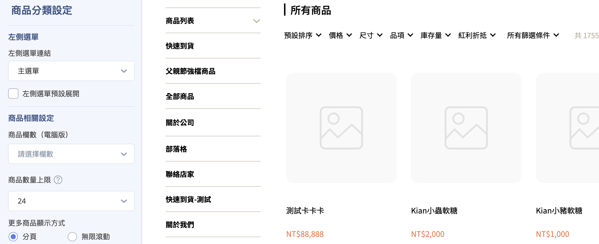

---

### 商品多層級分類 { #category }

!!! info "需先 [建立商品多層級分類架構](../../products/categories-and-tags/multi-level-category-setup.md){ title="設定商品多層級分類" }。"

針對多層級分類頁面的呈現方式進行微調。

---

### 部落格頁 { #blog }

用於呈現多篇文章的摘要列表。

- **每頁文章數量：** 自訂每頁要顯示的文章總數。
- **顯示精選文章：** 勾選後，系統會在部落格列表頁底部顯示特定的「精選文章」，適合提高熱門文章曝光。
- **精選文章群組：** 開啟精選文章後，進一步選擇要顯示哪一個部落格群組的文章作為精選內容。

---

### 部落格文章頁 { #article }

用於顯示單篇完整文章的詳細內容。

- **文章標籤區標題：** 系統會自動抓取該文章所屬群組內的所有「文章標籤」並在此區塊呈現。

---

### 客服頁 { #contact }

客服頁面在前台主要以「聯絡我們」表單形式呈現，供訪客留言諮詢。

- **問題類型設定：** 自訂「聯絡我們」表單中的下拉式問題選單。設定路徑為後台 **會員 > 客服問題分類**。
- **聯絡資訊設置：** 除表單外，建議在 **頁腳(Footer)** 區塊同步設定完整的公司電話、地址與 Email，增加品牌信任感。

!!! tip "安全驗證"
    針對顧客留言的客服頁面，拖拉版型支援 [啟用留言區 reCAPTCHA](../customer-interaction/enable-comment-recaptcha.md){ title="啟用留言區 reCAPTCHA" }，以防止機器人攻擊或垃圾訊息。

---

### 404 頁 { #not-found }

當消費者訪問到失效連結(如活動結束、商品下架或網址錯誤)時的顯示畫面，可自訂視覺以緩解負面體驗。

- **更換圖片：** 自行上傳並更換 404 頁面的圖片，建議設計符合品牌風格或有趣的引導圖。
- **標題：** 設定 404 頁面的標題文字。
- **返回首頁：** 設定返回首頁按鈕的文字。

---

### 快速到貨頁 { #express-delivery }

用於自訂快速到貨專區的視覺與醒目入口。

- **Logo 背景：** 設定導覽列顏色(Logo 背景)，幫助消費者區分一般專區與快速到貨專區。
- **顯示快速到貨按鈕：** 勾選後，系統會在官網全站導覽列上方顯示明顯的專區入口，引導消費者點擊。

---

### 搜尋頁 { #search }

- **選擇選單：** 指定搜尋頁面左側要套用的選單連結列表(需先 [建立選單](../navigation/setup-menus-navigation.md){ title="設定選單與導覽列" })。
- **商品顯示資訊：** 搜尋結果中的商品會同步套用「[全站共用設定](#shop-product-display){ title="全站共用設定" }」中的顯示規範，包含價格區間、商品標語以及已銷售數量。
- **標籤顯示：** 搜尋結果頁支援顯示定期定額、特價、缺貨以及自定義標籤。

??? info "搜尋範圍與邏輯說明"
    - **搜尋範圍：** 不只查詢「商品名稱」，亦涵蓋 **商品群組名稱、商品廠商與商品介紹**。
    - **分詞邏輯：** 商品標題支援分詞搜尋，需完全符合分詞才會被搜到。例如以「空格」或「-」會將標題切分為單詞：標題為「ER-1410」時搜「1410」可找到；標題為「ER1410」時搜「1410」則找不到。
    - **排除搜尋：** 若部分商品不希望出現在搜尋頁，可於商品編輯頁的「基本設定」中關閉「商品搜尋功能」，該商品將無法在站內搜尋框、所有商品列表及外部 Google 搜尋中被檢索。

---

## 參考資料 { #reference }

- [拖拉版型網站設定](theme-editor.md)
- [全站共用設定](#全站共用設定)
- [可新增區塊類型對照表](../references/theme-editor-sections.md)
- [可拖拉編輯的頁面對照表](../references/theme-editor-pages.md)

## 重要規範與限制 { #specs-theme-editor }

- **拖拉版型才能拖拉編輯：** 只有標示「拖拉設定」的版型適用本文的編輯器，預設版型請改用舊版網站設定。
- **可編輯頁面有限：** 僅首頁、商品頁面、自訂頁面等支援拖拉，商品群組頁、部落格頁、搜尋頁等不可拖拉編輯，完整清單見 [可拖拉編輯的頁面](../references/theme-editor-pages.md){ title="可拖拉編輯的頁面對照表" data-preview }。
- **部分區塊需加值功能：** 少數區塊需開通對應加值功能才會出現在新增清單中，詳見 [可新增區塊類型](../references/theme-editor-sections.md){ title="可新增區塊類型對照表" data-preview }。
- **部分區塊有數量上限：** 某些區塊或其內含的小區塊有數量上限，達到上限後就無法再新增。
- **檔期設定(選配)：** 部分版型支援為區塊設定上架與下架時間，讓區塊只在指定期間顯示於前台，此功能需另外開通。

---

## 後續操作 { #next-steps-theme-editor }

- :lucide-package:{ .lg }  
  [__新增商品__](../../products/create-and-manage/create-update-products.md){ title="新增與更新商品" }  
  先建立好商品，首頁的商品列表、主打商品等區塊才有商品可呈現。

- :lucide-layout-list:{ .lg }  
  [__可新增區塊類型__](../references/theme-editor-sections.md)  
  查看各種區塊的用途與開通條件，規劃頁面內容。

- :lucide-file-text:{ .lg }  
  [__可拖拉編輯的頁面__](../references/theme-editor-pages.md)  
  了解哪些頁面支援拖拉編輯。

---

## 常見問題 { #faq-theme-editor }

??? quote "找不到「新增區塊」按鈕，或無法拖曳區塊"
    { #faq-theme-editor-no-drag }
    可能原因有兩個：

    - 您使用的版型不是「拖拉版型」。請回到主題版型頁，確認版型卡片上有標示 **「拖拉設定」**。
    - 目前所在的頁面不支援拖拉。只有首頁、商品頁面、自訂頁面等可拖拉，請見 [可拖拉編輯的頁面](../references/theme-editor-pages.md){ title="可拖拉編輯的頁面對照表" data-preview }。

??? quote "修改並儲存後，前台看起來沒有變化"
    { #faq-theme-editor-no-effect }
    請依序確認：

    - 您編輯的若是 **未發布** 的版型，需完成 **「發布」** 才會套用到前台。
    - 您編輯的若是 **已發布** 的版型，請確認已點擊 **「儲存」**。
    - 仍未更新時，可嘗試清除瀏覽器快取或重新整理前台頁面。

??? quote "想要的區塊在新增清單中找不到"
    { #faq-theme-editor-missing-section }
    可新增的區塊會依您安裝的版型而不同，且少數區塊(如商品評論、門市據點列表)需開通對應加值功能才會出現。詳見 [可新增區塊類型](../references/theme-editor-sections.md){ title="可新增區塊類型對照表" data-preview }，或聯繫業務窗口確認開通狀態。

??? quote "隱藏區塊和移除區塊有什麼差別？"
    { #faq-theme-editor-hide-vs-remove }
    兩者結果在前台都是不顯示該區塊，差別在於：

    - **隱藏：** 區塊與其設定內容都會保留，日後可隨時重新顯示。
    - **移除：** 直接刪除整個區塊，內容不會保留。

    若只是暫時不想顯示，建議用隱藏。

??? quote "更換或發布版型，會影響我的商品或訂單資料嗎？"
    { #faq-theme-editor-data-safe }
    不會。版型只影響前台官網的 **外觀與版面**，不會更動商品、訂單、會員等營運資料。發布新版型後，舊版型也會保留在「未發布主題」中，可隨時切換回去。

---

## 參考資料 { #reference-theme-editor }

- [可拖拉編輯的頁面對照表](../references/theme-editor-pages.md)
- [可新增區塊類型對照表](../references/theme-editor-sections.md)

