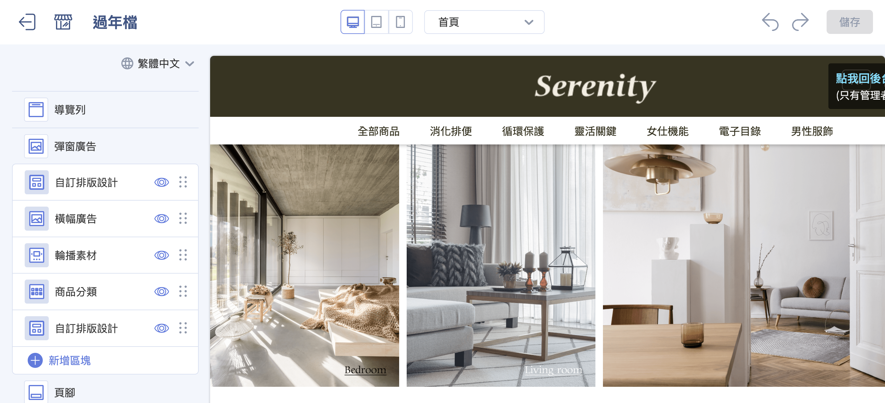{ .hero-page }

## 拖拉版型介紹 { #intro-theme-editor }

「拖拉版型」是 CYBERBIZ 新一代的版型，前台頁面由一個個 **區塊** 組成。每個區塊代表頁面上的一段內容，例如主視覺輪播、圖文介紹、商品列表等。在拖拉版型編輯器中，您可以：

- **新增、移除區塊：** 自由增減頁面上的內容段落。
- **拖曳排序：** 用滑鼠上下拖動，調整區塊在頁面上的先後順序。
- **編輯內容：** 點選區塊後，於右側填入文字、上傳圖片、設定連結與選擇商品。
- **即時預覽：** 中間畫面同步顯示修改後的樣子，並可切換電腦、平板、手機檢視。
- **發布上線：** 確認無誤後一鍵發布，將版型套用到前台官網。

整個編輯器分為三大區域： **左側區塊列表、中間即時預覽、左側區塊設定**，所有操作都圍繞這三個區域進行。

## 頁面功能總覽 { #overview-theme-editor }

| 區域 | 位置 | 用途 |
| :-- | :-- | :-- |
| 上方工具列 | 編輯器最上方 | 切換編輯頁面、預覽裝置、復原/重做、預覽前台、儲存、發布 |
| 區塊列表 | 左側面板 | 列出目前頁面的所有區塊，可新增、拖曳排序、顯示/隱藏、點選進入編輯 |
| 即時預覽 | 中間畫面 | 同步顯示前台實際效果，可切換電腦/平板/手機 |
| 區塊設定 | 左側面板 | 點選區塊後展開，編輯該區塊的文字、圖片、連結、商品等內容 |

=== ":lucide-wrench: 上方工具列"

	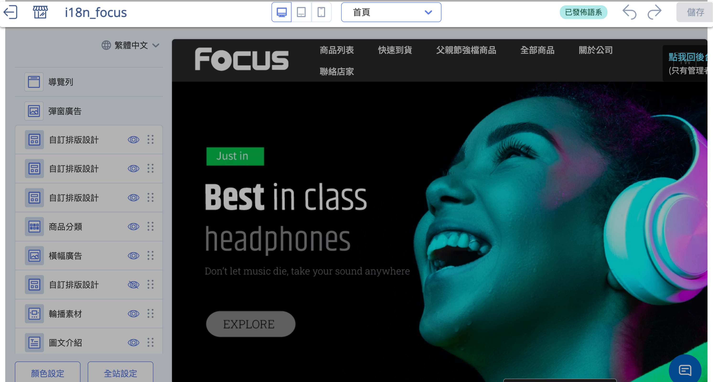

=== ":lucide-panel-left: 區塊列表"

	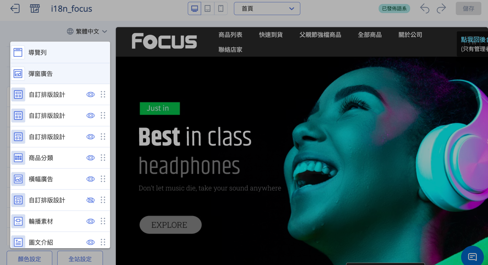

	左側面板列出目前頁面的所有區塊：

	- :lucide-eye: 點擊切換區塊顯示或隱藏。
	- :lucide-grip-vertical: 按住拖曳可調整區塊排序。
	- :lucide-circle-plus: 點擊新增區塊。

=== ":lucide-panel-left-open: 即時預覽"

	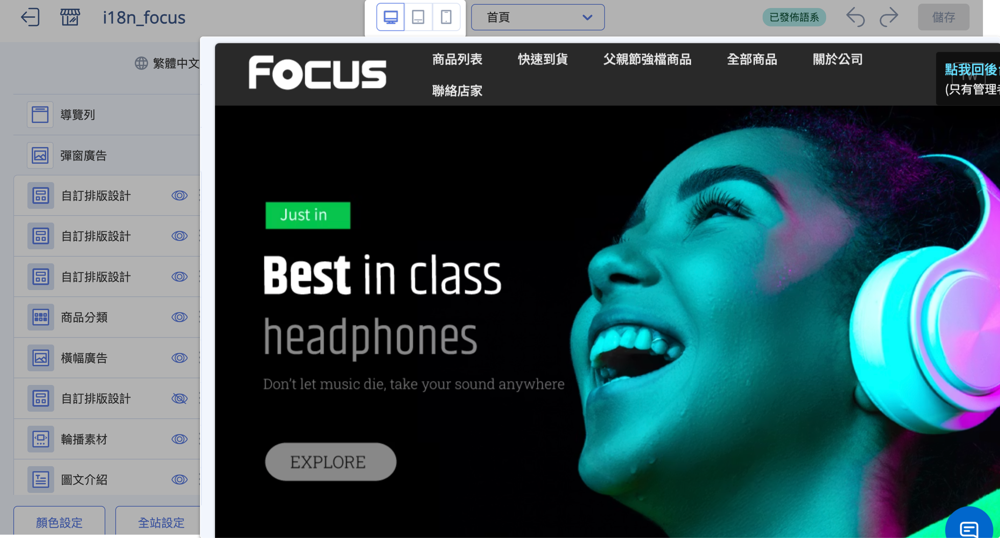

	中間畫面同步顯示前台實際效果，可切換電腦/平板/手機檢視不同裝置的呈現。

=== ":lucide-panel-left: 區塊設定"

	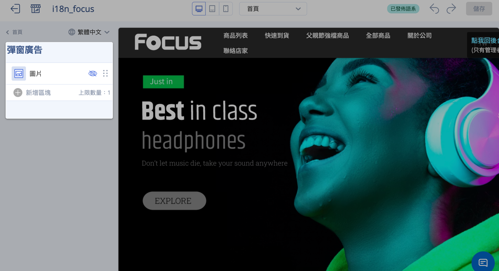

	左側面板在點選區塊後展開，提供該區塊的設定選項：

	- **文字**：輸入標題、說明文字。
	- **圖片**：上傳或貼入圖片 URL。
	- **連結**：設定點擊後前往的頁面或網址。
	- **商品**：挑選要呈現在區塊中的商品。

## 使用前提與限制 { #prerequisites-theme-editor }

開始之前，請先確認以下條件，這會影響您能不能使用拖拉編輯器，以及哪些頁面可以編輯：

- [x] **版型須為「拖拉版型」：** 只有標示 **「拖拉設定」** 的版型才能使用本文的拖拉編輯器。舊的「預設版型」走另一套網站設定流程，不在本文範圍。
- [x] **可拖拉的頁面有限：** 目前支援拖拉編輯的頁面為首頁、商品頁面與自訂頁面等，並非每個頁面都能拖拉。完整清單請見 [可拖拉編輯的頁面](../references/theme-editor-pages.md#theme-editor-pages){ title="可拖拉編輯的頁面對照表" data-preview }。
- [x] **部分區塊需開通功能：** 多數區塊所有拖拉版型皆可使用，少數區塊(如商品評論、門市據點列表)需方案有開通對應功能才會出現，請見 [可新增區塊類型](../references/theme-editor-sections.md#theme-editor-sections){ title="可新增區塊類型對照表" data-preview }。

---

## 操作步驟 { #operate-theme-editor }

以下依日常使用情境，從進入編輯器到發布上線，逐一說明。

### 進入拖拉版型編輯器 { #operate-theme-editor-enter }

1. **開啟主題版型頁面：** 進入後台的 **「網站外觀/套版主題管理 > 主題版型」** 頁面，這裡列出您商店已安裝的所有版型。
2. **找到拖拉版型：** 在版型卡片上確認是否標示 **「拖拉設定」**，這代表它是支援拖拉編輯的版型。
3. **進入編輯器：** 點擊該版型卡片上的 **「網站設定」** 按鈕，即進入拖拉版型編輯器[^default-theme]。

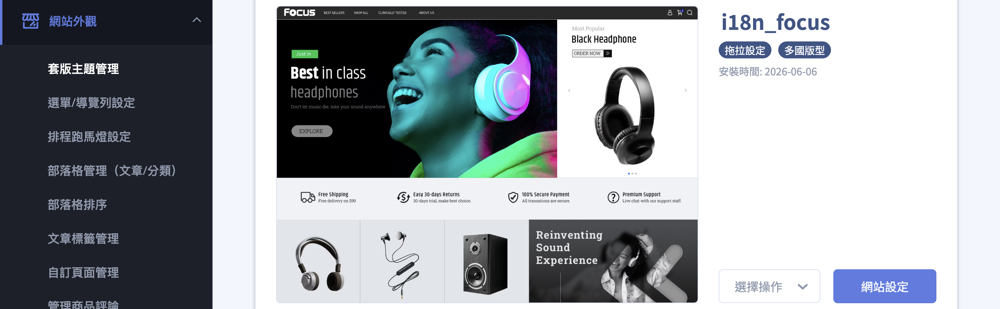

[^default-theme]: 若版型未標示「拖拉設定」(即舊的預設版型)，點擊「網站設定」會進入舊版的網站設定頁，而非本文說明的拖拉編輯器。

---

### 新增區塊 { #operate-theme-editor-add-section }

1. **點擊新增：** 在左側區塊列表下方，點擊 **「新增區塊」**。
2. **選擇區塊類型：** 在彈出的清單中選擇想要的區塊樣式[^section-names]，例如輪播圖、圖文、商品列表等。
3. **確定新增：** 點擊 **「確定新增」**，新區塊會加入頁面，並出現在左側列表中，接著即可點選它進行內容編輯。

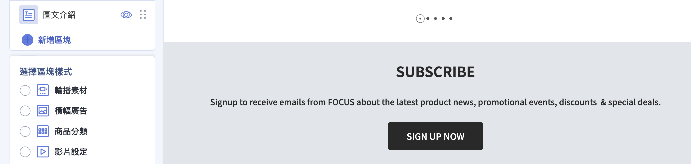

!!! note "註釋"
    「新增區塊」只會出現在支援拖拉的頁面(首頁、商品頁面、自訂頁面等)。若您切換到不支援拖拉的頁面，就不會看到新增區塊的選項。

[^section-names]: 清單中實際可選的區塊與其名稱，會依您所安裝的拖拉版型而有所不同，請以編輯器內顯示的為準。

---

### 編輯區塊內容 { #operate-theme-editor-edit-settings }

1. **點選區塊：** 在左側列表點擊任一區塊，面板會展開該區塊的設定選項。
2. **填寫內容：** 依區塊類型填入對應內容，常見的設定包含：
    * **文字：** 直接輸入標題、說明文字，輸入後請按 ++enter++ 套用變更。
    * **圖片：** 點擊 **「選擇圖片」** 或 **「上傳圖片」** 上傳檔案，也可選擇 **「貼上圖片URL」** 填入外部圖片網址。
    * **連結：** 設定點擊區塊後要前往的頁面或網址。
    * **商品：** 透過 **「選擇商品」** 挑選要呈現在區塊中的商品。
3. **編輯內含小區塊：** 部分區塊(如輪播圖)底下還有多個小區塊，可逐一點入分別設定。

!!! tip "技巧"
    修改後請留意中間的即時預覽畫面，確認內容呈現符合預期。文字類欄位記得按下 ++enter++ 或 ++tab++ 才會套用變更。

---

### 調整區塊順序 { #operate-theme-editor-reorder }

1. **找到拖曳把手：** 在左側區塊列表中，每個可調整的區塊都有一個拖曳圖示 :lucide-grip-vertical: (移動把手)。
2. **上下拖動：** 按住拖曳把手，將區塊往上或往下拖動到想要的位置後放開，前台頁面的呈現順序就會跟著改變。

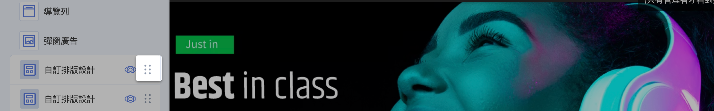

!!! note "註釋"
    部分固定區塊(例如頁首選單、頁尾)無法拖曳調整位置，這類區塊不會顯示拖曳把手。

---

### 顯示或隱藏區塊 { #operate-theme-editor-visibility }

每個區塊都可以暫時隱藏，而不必刪除：

1. **點擊眼睛圖示：** 在左側列表中，點擊區塊上的眼睛圖示 :lucide-eye: 即可切換 **顯示** 或 **隱藏**。
2. **確認效果：** 被隱藏的區塊不會出現在前台，但您先前的設定內容會完整保留，日後重新顯示即可恢復。

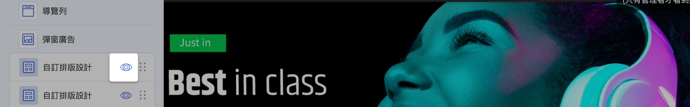

---

### 移除區塊 { #operate-theme-editor-remove }

1. **進入區塊設定：** 點選欲刪除的區塊，展開設定面板。
2. **點擊移除：** 點擊 **「移除」:lucide-trash-2:**，該區塊即會從頁面中刪除。

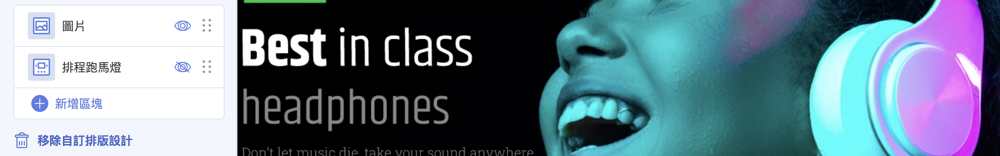

!!! info "提示"
    移除是直接刪除整個區塊與其內容，若只是暫時不想顯示，建議改用 [顯示或隱藏區塊](#operate-theme-editor-visibility) 較為保險。

---

### 切換編輯頁面與預覽 { #operate-theme-editor-preview }

1. **切換編輯頁面：** 透過上方工具列的頁面下拉選單，切換目前要編輯與預覽的頁面(例如首頁、商品頁面)。

    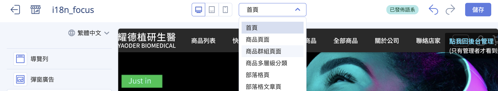

2. **切換預覽裝置：** 點擊上方的 **電腦 / 平板 / 手機** 圖示，預覽畫面會依該裝置寬度調整，方便檢查 RWD 呈現。

    === "電腦"
        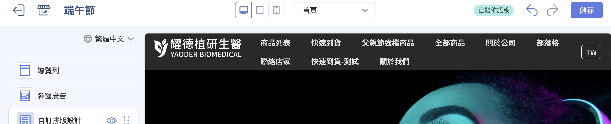

    === "平板"
        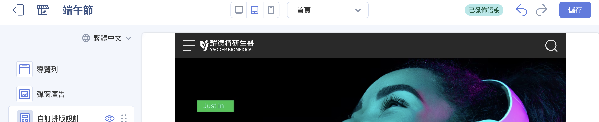

    === "手機"
        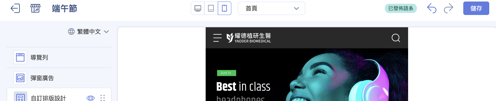

3. **預覽前台實際效果：** 點擊 **「預覽」** 會另開新分頁，以前台實際樣貌呈現目前的編輯結果。

    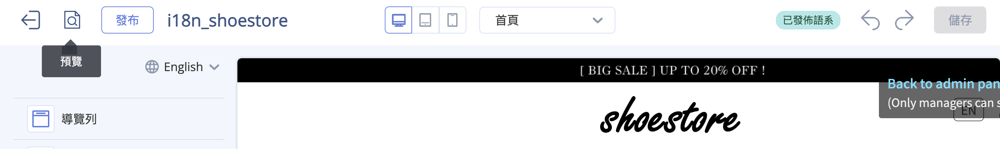

- :lucide-panel-top:{ .lg }
  __[各頁面設定指南](setup-theme-page-settings.md){ title="各頁面設定指南" }__

---

### 切換語系編輯 { #operate-theme-editor-language }

若您的商店已開通多國語系(語系數量大於 1)，上方工具列會出現 **語系切換**：

1. **選擇語系：** 在工具列點選要編輯的語系。
2. **分別設定內容：** 切換後，編輯與預覽的是該語系版本的版型，您可為每個語系分別設定文字與圖片。

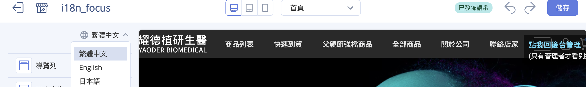

!!! note "註釋"
    只有當商店啟用多種語系時才會看到語系切換；單一語系的商店不會顯示此選項。詳見 [設定前台多國語言與多幣別](../../website-management/setup-multi-language-and-multi-currency.md)。

---

### 復原、重做與儲存 { #operate-theme-editor-save }

1. **復原 / 重做：** 編輯過程中若要回到上一步，點上方的 **「上一動作」** :lucide-undo-2: 圖示；要還原則點 **「下一動作」** :lucide-redo-2:。
2. **儲存變更：** 完成編輯後，點擊右上角的 **「儲存」** 保存。

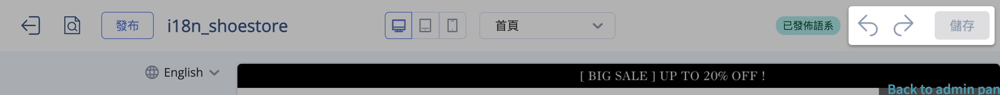

!!! info "儲存後會不會立刻生效？"
    這取決於您正在編輯的是哪一個版型：

    * **編輯「已發布」的版型：** 儲存後修改會 **立即反映在前台官網**。
    * **編輯「未發布」的版型：** 儲存只會保存草稿，不會影響前台，需完成下一步的 **發布** 才會套用上線。

---

### 發布主題 { #operate-theme-editor-publish }

當您編輯的是未發布的版型，完成後需發布才會套用到前台：

1. **點擊發布：** 在編輯器上方點擊 **「發布」**。
2. **確認替換：** 系統會跳出提示「此操作將替換您當前主題，並將它移至未發佈的主題中⋯」，確認後點擊 **「確認並發布」**。
3. **完成上線：** 此版型即成為前台正式版型，顧客造訪商店時就會看到新的版面。

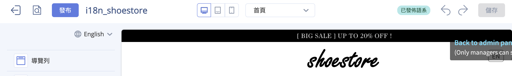

!!! note "註釋"
    同一時間只會有一個「已發布」版型。發布新版型後，原本的版型會自動移到「未發布主題」中保留，您隨時可以再切換回去。

---

### 全站共用設定與各頁面設定

除了上述的區塊操作外，拖拉版型還有以下延伸設定，請前往對應的指南查看：

- :lucide-settings-2:{ .lg }  
  [__全站共用設定__](setup-global-theme-settings.md){ title="全站共用設定" }  
  設定彈窗廣告、顏色、品牌識別、SEO、商品顯示行為與動態標籤。

- :lucide-panel-top:{ .lg }  
  [__各頁面設定__](setup-theme-page-settings.md){ title="各頁面設定指南" }  
  依頁面類型進行細部設定，包含首頁區塊、商品頁面、部落格、客服頁等。

---

## 重要規範與限制 { #specs-theme-editor }

- **拖拉版型才能拖拉編輯：** 只有標示「拖拉設定」的版型適用本文的編輯器，預設版型請改用舊版網站設定。
- **可編輯頁面有限：** 僅首頁、商品頁面、自訂頁面等支援拖拉，商品群組頁、部落格頁、搜尋頁等不可拖拉編輯，完整清單見 [可拖拉編輯的頁面](../references/theme-editor-pages.md){ title="可拖拉編輯的頁面對照表" }。
- **部分區塊需開通功能：** 少數區塊需開通對應功能才會出現在新增清單中，詳見 [可新增區塊類型](../references/theme-editor-sections.md){ title="可新增區塊類型對照表" }。
- **部分區塊有數量上限：** 某些區塊或其內含的小區塊有數量上限，達到上限後就無法再新增。
- **檔期設定(選配)：** 部分版型支援為區塊設定上架與下架時間，讓區塊只在指定期間顯示於前台，此功能需另外開通。

---

## 後續操作 { #next-steps-theme-editor }

- :lucide-package:{ .lg }  
  [__新增商品__](../../products/create-and-manage/create-update-products.md){ title="新增與更新商品" }  
  先建立好商品，首頁的商品列表、主打商品等區塊才有商品可呈現。

- :lucide-layout-list:{ .lg }  
  [__可新增區塊類型__](../references/theme-editor-sections.md)  
  查看各種區塊的用途與開通條件，規劃頁面內容。

- :lucide-file-text:{ .lg }  
  [__可拖拉編輯的頁面__](../references/theme-editor-pages.md)  
  了解哪些頁面支援拖拉編輯。

---

## 常見問題 { #faq-theme-editor }

??? quote "找不到「新增區塊」按鈕，或無法拖曳區塊"
    { #faq-theme-editor-no-drag }
    可能原因有兩個：

    - 您使用的版型不是「拖拉版型」。請回到主題版型頁，確認版型卡片上有標示 **「拖拉設定」**。
    - 目前所在的頁面不支援拖拉。只有首頁、商品頁面、自訂頁面等可拖拉，請見 [可拖拉編輯的頁面](../references/theme-editor-pages.md){ title="可拖拉編輯的頁面對照表" data-preview }。

??? quote "修改並儲存後，前台看起來沒有變化"
    { #faq-theme-editor-no-effect }
    請依序確認：

    - 您編輯的若是 **未發布** 的版型，需完成 **「發布」** 才會套用到前台。
    - 您編輯的若是 **已發布** 的版型，請確認已點擊 **「儲存」**。
    - 仍未更新時，可嘗試清除瀏覽器快取或重新整理前台頁面。

??? quote "想要的區塊在新增清單中找不到"
    { #faq-theme-editor-missing-section }
    可新增的區塊會依您安裝的版型而不同，且少數區塊(如商品評論、門市據點列表)需啟用對應功能才會出現。詳見 [可新增區塊類型](../references/theme-editor-sections.md){ title="可新增區塊類型對照表" data-preview }。

??? quote "隱藏區塊和移除區塊有什麼差別？"
    { #faq-theme-editor-hide-vs-remove }
    兩者結果在前台都是不顯示該區塊，差別在於：

    - **隱藏：** 區塊與其設定內容都會保留，日後可隨時重新顯示。
    - **移除：** 直接刪除整個區塊，內容不會保留。

    若只是暫時不想顯示，建議用隱藏。

??? quote "更換或發布版型，會影響我的商品或訂單資料嗎？"
    { #faq-theme-editor-data-safe }
    不會。版型只影響前台官網的 **外觀與版面**，不會更動商品、訂單、會員等營運資料。發布新版型後，舊版型也會保留在「未發布主題」中，可隨時切換回去。
