---
notes:
  - check 商品標籤 適用方案
---

# 拖拉版型網站設定

[:lucide-toggle-right:{ title="適用功能" }](../../resources/conventions#適用功能) | 拖拉版型
{ .doc-badge }

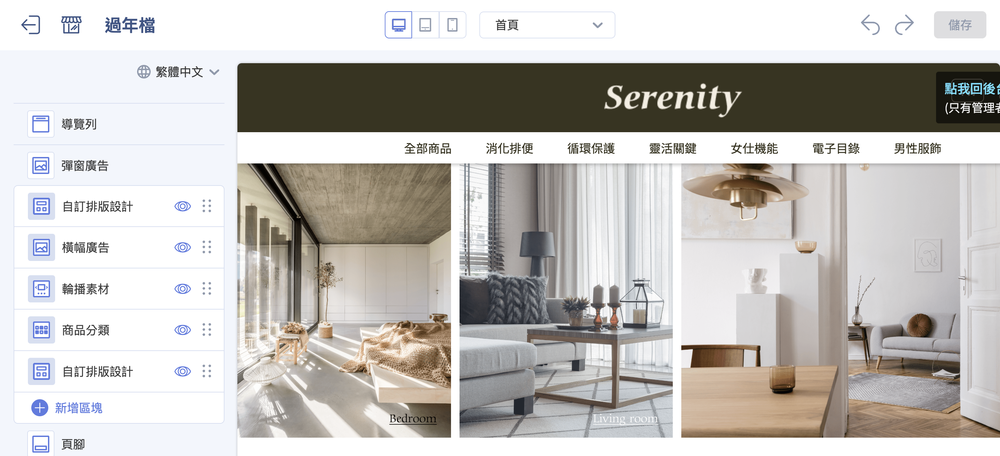{ .hero-page }

## 拖拉版型功能說明

**拖拉版型（Drag-and-Drop）** 讓商家無需撰寫程式碼，即可透過圖形化介面直覺地建立與調整官網外觀。

## 拖拉版型編輯器介面總覽

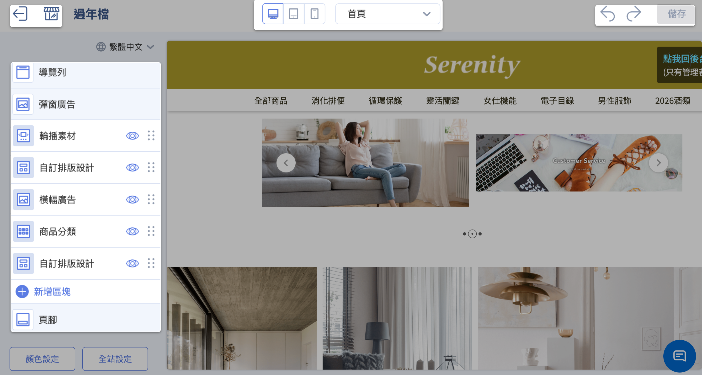

=== ":lucide-arrow-left-from-line: 離開編輯器 "

	點擊離開拖拉版型編輯器頁面，回到主題版型頁面。

=== ":lucide-store: 前往商店 "
	點擊可快速前往前台網站頁面。

=== ":lucide-monitor: :lucide-tablet: :lucide-smartphone: 切換裝置"

	點擊可以切換預覽不同裝置的網頁顯示效果：
	
	- :lucide-monitor:： 桌上型電腦螢幕的顯示畫面。
	- :lucide-tablet:： 平板電腦的顯示畫面。
	- :lucide-smartphone:：手機的顯示畫面。

=== ":lucide-chevron-down: 選擇頁面 "

	點擊上方的 **首頁**，可以展開頁面選單，選擇不同頁面進行編輯：
	
	- [首頁](#首頁與頁面內容編輯)
	- [商品頁面](#商品頁面)
	- 商品群組頁面
	- 商品多層級分類
	- 部落格頁
	- 部落格文章頁
	- 客服
	- 404頁
	- 快速到貨
	- 搜尋頁
	
    > :lucide-info: 實際選項依照方案跟功能設定可能有所不同。

=== ":lucide-undo-2: :lucide-redo-2: 復原/重做"

	- :lucide-undo-2:：取消上一個動作效果。
	- :lucide-redo-2:：重現上一個動作效果。
	
=== ":lucide-panel-left: 左側選單"

	不同頁面的頁面內容編輯區域。

	- :lucide-eye:：點擊可以開啟或關閉區塊功能。
	- :lucide-grip-vertical:：點擊可拖拉改變區塊的排序。
	- :lucide-circle-plus:：點擊新增區塊。

=== ":lucide-panel-left-open: 預覽區"

	依照左側頁面內容編輯的設定，右側會顯示前台的預覽樣式。
	

## 進入與基本設定

- **進入路徑**：前往後台 **網站外觀 > 套版主題管理**，確認使用拖拉版型（拖拉版型標籤）後點選 **網站設定**。

- **全站共用設定**：

	- **導覽列**：可設定選單排列樣式（預設/併排置左/併排置右）、背景是否透明，以及次選單是否同步展開。瞭解 [如何設定選單與導覽列](設定選單與導覽列)。
	- **彈窗廣告**：可設定圖片、影片、互動遊戲或排程跑馬燈廣告。
	- **頁腳**：提供「上下」或「左右」排序樣式，並可開啟 **社群媒體圖示** 的顯示與連結。瞭解 [如何設定頁腳](設定選單與導覽列#設定頁腳內容)。
	- **顏色設定**：可一鍵變更全站的主色調、強調色（如標籤顏色）及字體顏色。
	- **全站設定**：可設定 favicon、網站 Logo、字型、網站 SEO、商品相關設定及商品標籤。

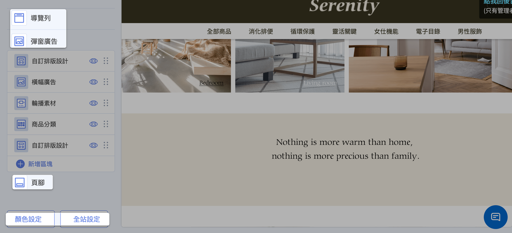

### 彈窗廣告

商家可以根據行銷目的，選擇以下幾種內容形式：

- **圖片彈窗**：商家可分別上傳電腦版、平板版與手機版圖片（電腦版為必填），並設定圖片點擊後導向的網址。

- **影片彈窗**：目前支援嵌入 **YouTube 影片** 連結進行展示。

- **互動遊戲**：可將後台設定好的「輪盤遊戲」或「紅包抽獎」放入彈窗中，增加趣味性並發放紅利或優惠券（此功能為官網會員專屬，需登入才可參與）。

- **排程跑馬燈**：可在彈窗內載入預先製作好的跑馬燈內容，達成自動化更新廣告圖的需求。

### 顏色設定

商家可以針對全站的基礎視覺元素進行定義：

- **主色調與文字顏色**：可一鍵變更全站的主色調顏色及全站字體顏色。

- **強調色**：這是最重要的設定之一，會自動套用於系統多個動態 UI 元素。

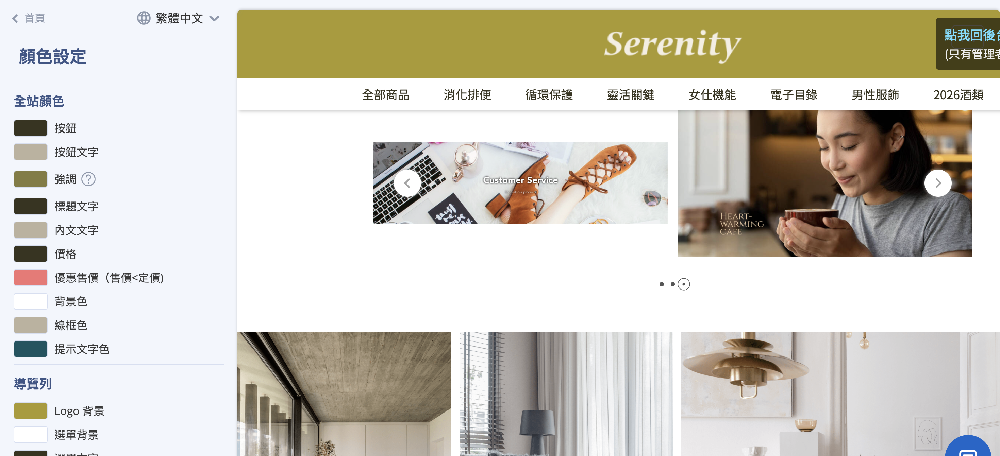

??? note "強調色的應用範圍"
	
	當商家在顏色設定中選定「強調色」後，系統會自動將該顏色應用於：

	- **商品標籤（Labels）**：包含系統自動顯示的 **定期定額**、**特價**、**缺貨** 標籤，以及商家自定義的  **5 組標籤**。
	
	- **開賣時間倒數**：若商品設定為尚未上架，前台商品頁或群組列表顯示的 **倒數時間底色**，會自動套用強調色。
	
	- **排序邏輯**：標籤顏色會依據特定順序（定期定額 → 特價 → 缺貨 → 自定義標籤）由左至右排列，並統一套用該色系。

??? note "特定區塊的個別顏色設定"

	除了全站統一的顏色設定外，某些功能區塊允許更細緻的顏色自訂：

	- **置頂公告**：商家可以分別設定置頂公告欄位的 **圖片連結底色** 以及 **時間倒數的文字與背景顏色**。
	
	- **折疊內容**：用於 FAQ 或購物須知的區塊，可以個別設定該區塊的顯示顏色。
	
	- **圖文介紹**：此區塊內的 **按鈕顏色** 可依照需求自訂。

---

### 全站設定

提供商家集中控管官網的基礎視覺識別、搜尋引擎優化（SEO）、全域商品顯示行為以及網站安全防護等核心設定。

#### 視覺識別與品牌資產

- **網站圖示設定：**

	- **Favicon：** 設定顯示於瀏覽器分頁標籤上的小圖示。
	- **OG Image (轉貼連結預設圖片)：** 設定網站連結分享至 Facebook 或 LINE 時顯示的預設縮圖。

- **導覽列圖示：** 系統預設 3 種樣式，商家亦可上傳自定義圖示檔案。

- **字型設定：** 調整全站網頁所套用的字體樣式。

---

#### 網站 SEO 與安全保護

- **SEO 設定：** 可定義網站的 **標題**、**簡述** 與 **關鍵字**，優化搜尋引擎對網站的收錄與排名。若標題欄位留空，系統會預設以商店名稱作為標題。

- **網頁鎖右鍵：** 勾選可禁止使用者透過點擊滑鼠右鍵，自行下載圖片或複製文字，保護原創內容。

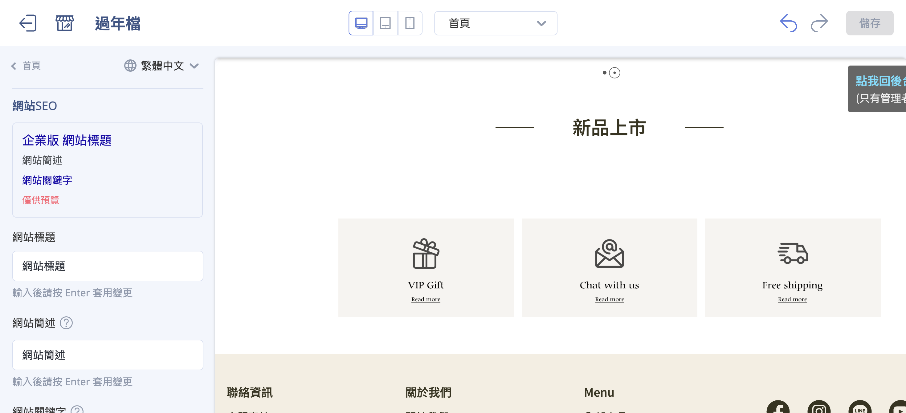

---

#### 全域商品顯示行為

商家可統一設定商品在各列表頁與詳細頁的呈現方式：

- **商品標語：** 商品特色或促銷標語。

- **商品色票小圖*：** 可開啟在官網前台顯示商品顏色款式小圖。

- **銷售數量：** 可開啟顯示商品的 **已銷售數量**。

- **開賣時間*：** 針對設定為尚未上架的商品，可開啟顯示商品的 **開賣倒數時間**。

- **價格區間：** 可勾選顯示商品 **價格區間**，開啟後前台會自動隱藏原有的 **定價** 標籤。

- **商品款式選單：** 可設定前台商品款式顯示方式為下拉選單或是按鈕。

- **商品影片設定*：** 若商品有設定影片，可指定影片顯示在圖片彈窗的第一格或最後一格。

- **商品購買數量上限：** 設定每個款式商品可以被加入到購物車中的上限。

- **折扣貼紙*：** 當任一款式售價金額低於定價時會顯示此折扣貼紙於商品圖片左上方位置。

!!! info "適用方案限制"
	
	- 商品色票小圖與開賣時間為 企業 方案專屬功能。
	- 商品影片僅適用 PLUS / 企業 方案。
	- 折扣貼紙僅適用非 PLUS / 企業 方案。

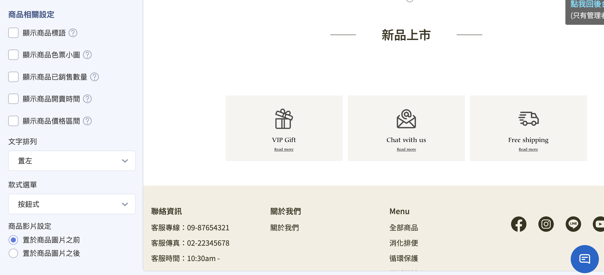

---

#### 動態標籤設定 (商品標籤)

!!! info "適用方案限制"

	- 商品標籤功能僅適用 高手PLUS 與 企業 方案。
	- 自定義標籤僅適用 企業 方案。

系統會根據特定條件自動為商品附上標籤，並依據固定的優先順序由左至右排列：

- **定期定額標籤：** 商品綁定定期定額活動時顯示。

- **特價標籤：** 當商品售價低於定價時顯示。

- **缺貨標籤：** 商品庫存為 0 且設定為停止銷售時顯示。

- **自定義標籤*：** 商家可設定最多 **5 組** 自定義標籤（支援文字或圖片類型），並透過與後台商品標籤關聯來觸發顯示。

- _備註：這些標籤的底色通常套用「顏色設定」中的「強調色」。_

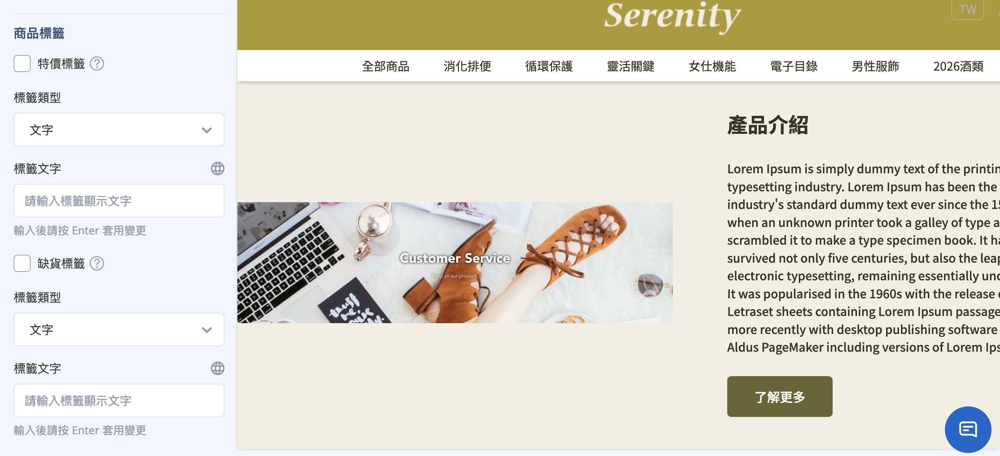

---

## 首頁與頁面內容編輯

商家可點選 **新增區塊** 來組合多種功能模組，並透過滑鼠拖拉調整順序。點擊 區塊名稱可進入相關編輯頁面。

> :lucide-info: 實際選項依照方案跟功能設定可能有所不同。

### 輪播素材

透過多張圖片輪替展示，吸引消費者注意力並推廣重要活動。

點擊「素材」文字即可進入編輯頁面。

- **圖片上傳**：支援分別上傳 **電腦版、平板版與手機版** 的圖片素材。

- **圖片連結**：點開下拉選單可選擇要連結的項目，支援官網內部的商品頁、分類頁、行銷活動頁，或自行輸入 **外部連結**。

- **圖片替代文字 (ALT)**：商家應務必填寫圖片替代文字，此舉有助於 **優化 SEO** 搜尋引擎排名。

- **刪除素材**：若不再需要該張圖片，可點擊「移除素材」將其刪除。

#### 版面細節設定 (其他版面設計)

除了圖片本身，商家可以微調輪播的呈現方式：

- **圖片停留秒數**：設定每張圖片在自動跳至下一輪之前所停留的時間（秒）。

- **圖片切換速度**：設定圖片切換的速度，數值越大代表切換速度越慢（秒）。

- **圖片數量與間距**：可設定每一輪顯示的圖片張數；若設定多張（2張以上），可調整圖片之間的間距。

	

- **版面邊距**：可分別設定電腦版與手機版的 **左右外邊距** 及 **底部外邊距**，確保圖片在不同裝置上比例適中。

### 橫幅廣告 

- **圖片上傳**：可分別上傳電腦版、平板版與手機版的圖片，確保在不同裝置上都能完美呈現。

- **圖片連結**：點開選單可選擇連結至特定商品、分類群組、行銷活動頁，或設定 **外部連結**。

- **按鈕設定**：可選擇是否開啟按鈕，並自訂按鈕文字與位置（中上、置中、中下）。

- **版面邊距**：可針對電腦版與手機版分別設定左右外邊距及底部外邊距，調整與其他區塊的距離。

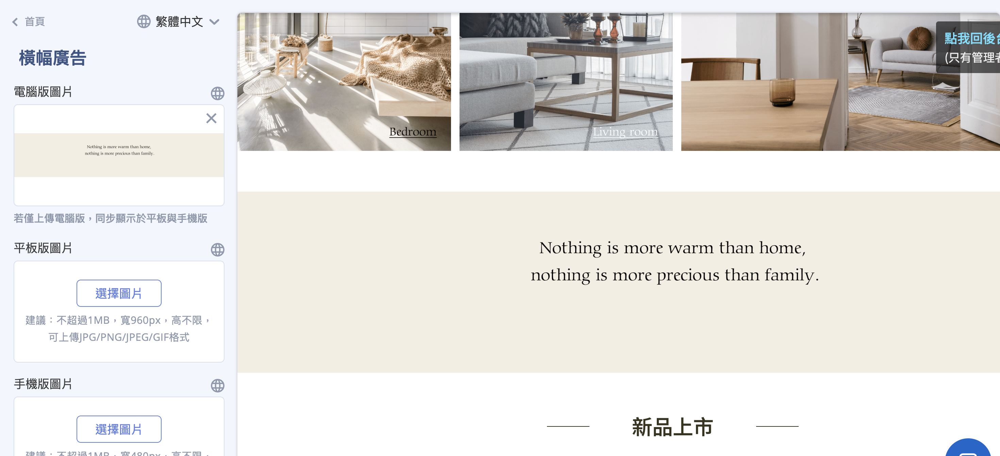

### 商品分類

商品分類可讓商家設計商品櫥窗，展示特定分類商品群。

- **標題**：輸入商品櫥窗區塊的名稱。

- **選擇商品分類**：可選「展示全部商品」、「指定自訂分類」或「指定條件分類」。

- **配置展示規則**：

	- **商品數量上限**：建議設在 **36 個以內** 以維持網站載入速度。
	- **商品展開**：可選擇「往下展開」或「左右滑動」。
	- **商品欄數**：電腦版可設每排 2~6 個；手機版（含平板）為 1~3 個。
	- **商品排列**：可選擇「置左」、「置中」、「置右」排列。
	- **文字排列**：可選擇「置左」、「置中」、「置右」排列。
	- **版面外邊距**：可設定左右外邊距、底部外邊距。電腦版與手機版(手機版包含平板版)可分開設定。
	- **電腦版分類樣式**：提供「預設」、「顯示部分內容」、「全顯示」三種呈現風格。
	- **商品圖游標懸停效果**：設定滑鼠移動到商品圖片上顯示的效果，提供 「快速加入購物車按鈕」、「圖片切換」、「陰影/邊框強調」、「放大效果」。

### 影片設定

- **標題：** 輸入影片標題。

- **影片連結**：僅支援 YouTube 影片連結格式。

- **版面外邊距**：可設定左右外邊距、底部外邊距。電腦版與手機版(手機版包含平板版)可分開設定。

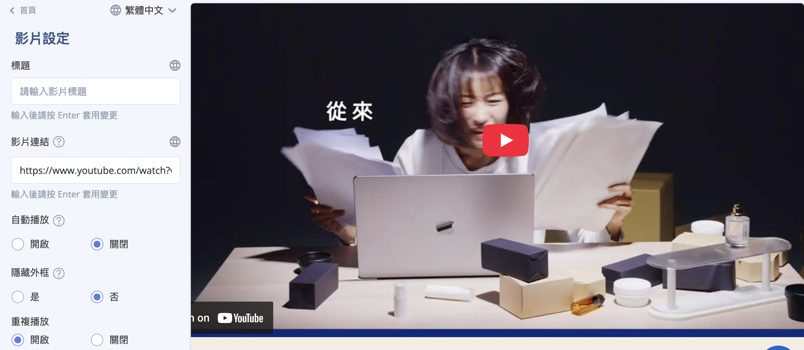

### 分頁頁籤

在首頁展示多個部落格群組，讓消費者能透過頁籤切換快速瀏覽不同主題的文章。

- **新增區塊：** 點擊「新增部落格群組」，商家可以挑選預先在「部落格管理」中建立好的主題分類放入頁籤中。

- **即時預覽：** 在設定過程中，商家可以透過編輯器右方的畫面 **即時查看** 頁籤的呈現樣式與切換效果。

- **版面設計：** 在「其他版面設計」選項中，商家可以針對該區塊的間距、外邊距、欄數等視覺細節進行微調。

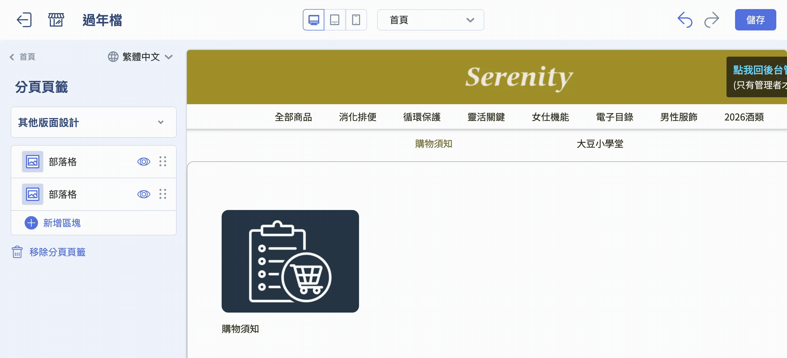

### 自訂排版設計

商家可在同一個橫列中新增多個不同類型的素材元件，並設定各元件的顯示比例與排列順序，以調整該橫列的版型配置。

- **圖片：** 可分別上傳 **電腦版、平板版與手機版** 圖片，並設定圖片連結、替代文字 (ALT) 及版面螢幕占比。

- **影片：** 僅支援 **YouTube 影片** 連結。商家需將影片上傳至 YouTube 後，在此貼上網址並設定顯示比例。

- **排程跑馬燈：** 商家可從預先建立好的「跑馬燈進階設定」群組中選擇欲展示的跑馬燈，並設定其螢幕占比。

- **自訂 HTML：** 支援輸入自定義代碼。
> 注意：若代碼與網站語法不相容可能導致畫面異常，建議謹慎使用。

- **商品：** 商家可挑選 **單個商品** 展示，並設定「電腦版商品分類樣式」。
> **限制：** 此區塊僅適用於 **2025 年 9 月 4 日後建立的一頁式商店**；若商店在此日期前建立，請勿使用此商品區塊，以免產生前台顯示錯誤。

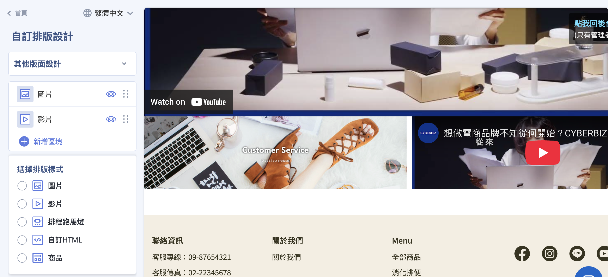

**其他排版細節設定**

在「其他版面設計」選項中，商家可以進行以下微調：

- **邊距設定：** 分別設定電腦版與手機版（含平板）的 **左右外邊距** 與 **底部外邊距**。

- **區塊間距：** 調整電腦版中並排素材之間的間隔距離。

- **行動裝置排版：** 針對平板與手機，可設定排版方式為「**單個一列**」或「**兩個一列**」。

### 圖文介紹

**區塊與圖片設計**

商家可在此設定圖片的呈現方式與位置：

- 圖片素材：至少需上傳電腦版圖片，系統亦支援分別上傳平板與手機版圖片以達到最佳顯示效果。

- 圖片位置：可設定圖片位於文字的「左側」或「右側」。

- 電腦版占比：商家可自行設定圖片在電腦版畫面中的占比比例，藉此微調圖文之間的平衡。

- SEO 優化：設定圖片時應填寫「圖片替代文字 (ALT)」，這能讓搜尋引擎更準確定義圖片內容，有助於優化網站排名。

**文字素材與內容編輯**

「圖文介紹」區塊支援多組文字內容組合：

- 素材上限：文字素材（包含標題、內文、按鈕）最多可設定 3 組，且可重複使用相同類型的素材。

- 標題與內文：可自訂文字內容、設定字級（文字大小），內文部分提供簡易文字編輯器供商家輸入。

- 按鈕設定：

    - 可自訂按鈕文字與按鈕顏色。
    - 按鈕連結：可點開下拉選單選擇導向站內商品、分類、行銷活動頁，或自行設定外部連結。
    
- 顯示排序：在「區塊設定」中，商家可以透過拖拉方式自由調整標題、內文與按鈕的顯示順序。

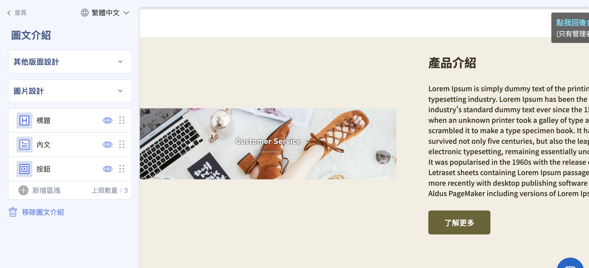

**版面細節與樣式設定**

在「其他版面設計」選項中，商家可以進行細部美化：

- **文字排版**：可統一設定文字排版為「**靠左**」、「**置中**」或「**靠右**」。

- **色彩設定**：可分別調整區塊的 **文字顏色** 與 **背景顏色**。

- **邊距調整**：可針對電腦、平板與手機版分別設定 **左右外邊距** 與 **底部外邊距**，調整與其他區塊的間距。

### 自訂 HTML

商家自行編輯 HTML 內容或嵌入 CSS 語法，用以添加官網預設功能之外的自定義素材或第三方服務工具（如：IG 動態牆）。

- **自訂 HTML 內容**：點選 **編輯** 按鈕可開啟編輯器。商家可在此直接 **輸入 HTML 語法**，且該區塊同時 **支援 CSS 語法**。

- **其他版面設計（邊距設定）**：可針對 **電腦版** 與 **手機版（含平板）** **左右外邊距** 及 **底部外邊距**。

- **嵌入第三方外掛（如 Elfsight IG 牆）**：在 elfsight 取得追蹤碼後，新增「自訂 HTML」區塊，點擊編輯並貼上語法即可在官網顯示 IG 動態牆。

!!! warning "注意事項"

	- 語法相容性：新增程式碼後，若發現與網站語法不相容導致 **前台畫面顯示異常（如跑版、破版）**，建議先移除該自定義語法，並改用其他語法或替代方案。
	- 版型更換重置：若商家 **更換新的主題套版（Theme）**，原先在舊版型中設定的自訂 HTML 內容、區塊順序以及客製化 CSS 語法將 **不會被保留**，會恢復為新版型的系統預設值。

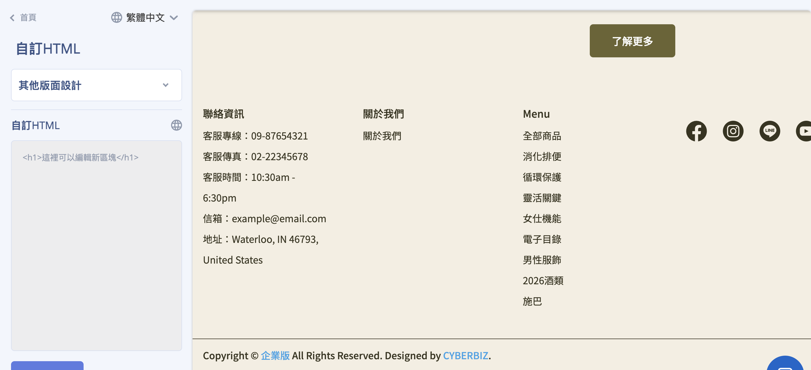

<!---
### 應用程式
-->

### 文字編輯

建立結構化內文、展示品牌資訊。進入該區塊後，商家可以針對以下維度進行調整：

- **內文編輯：** 在文字編輯器進行內容撰寫。

- **字級設定：** 商家可以自由調整內文的 **文字大小（字級）**，以符合視覺美感。

- **邊距調整：** 可針對 **電腦版、平板與手機版** 分別設定 **左右外邊距** 與 **底部外邊距** ，用以控制區塊與網頁邊界或其他區塊的間距。

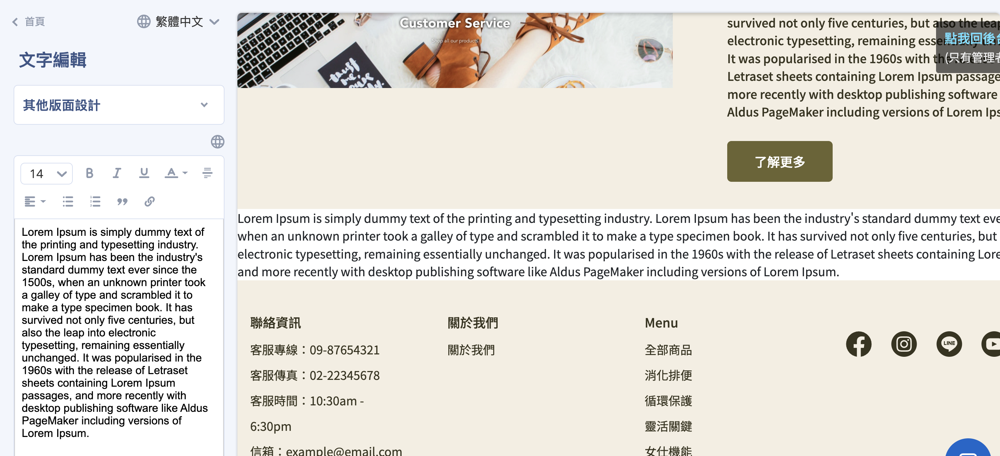

### 主打商品

在區塊設定中點擊 **商品設定** 來綁定欲展示的商品，請留意以下規範：

- **綁定數量：** 此區塊僅限綁定 **1 件** 商品。

- **適用狀態：** 商品必須為 **已上架** 狀態。系統不支援顯示「未上架」、「已下架」、「未公開」或「已刪除」的商品。

- **不支援類型：** 此區塊 **不支援**「組合商品」與「電子票券」。

**區塊內容自訂與排序**

您可以依據行銷需求，自由選擇要在區塊中顯示的資訊，並透過拖拉調整其 **顯示順序**：

- **可顯示項目：** 包含「商品標題」、「價格」、「款式選單」、「數量選擇器」、「購買按鈕」以及自定義的「文字」。

- **彈性調整：** 若不希望消費者直接在該區塊選擇數量，可將「數量選擇器」關閉；若想加強導購語氣，可善用「文字」欄位進行補充說明。

**版面設計與同步規則**

- **邊距設定：** 點擊「**其他版面設計**」，可設定此區域與網站邊界（左右與底部）的距離，確保視覺平衡。

- **樣式同步：** 為了維持網站視覺的一致性，以下資訊會直接 **與該商品在商品頁的設定保持同步**，無法在此區塊單獨更改：

	- 商品圖片比例。
	- 款式選單樣式（如色票小圖或下拉選單）。
	- 預設款式設定。
	- 商品售完後的按鈕文字（如：補貨中、聯絡店家）。

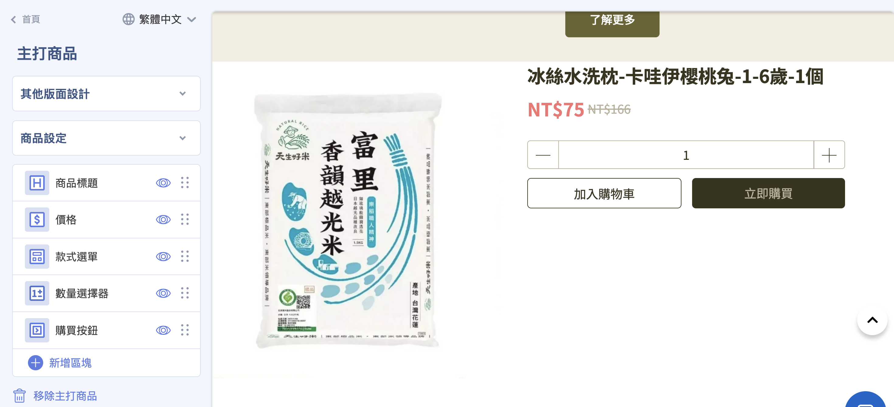

### 折疊內容

展示資訊量較大但非即時需要全數閱讀的內容，如官網的 **FAQ（常見問題）**、**購物須知**、**配送政策** 或 **售後服務** 說明。

點擊該區塊的 **其他版面設計** 分頁，可調整以下視覺細節：

- **區塊標題：** 設定整個折疊區域的總體標題（例如：常見問題 QA）。

- **顏色設定：** 可自訂區塊的文字與背景色彩，以符合品牌視覺。

- **邊距調整：** 設定此區域與網站邊界（左右及底部）的距離。

**折疊項目內容編輯**

商家可以依據需求逐一新增具體的內容條目：

- **內容輸入：** 每個項目皆可分別輸入 **項目標題** 與 **詳細內文**。

- **圖示設定：** 可為每個折疊項目設定對應的 **Icon（圖示）**，增加視覺辨識度。

- **項目數量限制：** 單一個「折疊內容」區塊內，**最多可設定 10 個** 折疊項目。

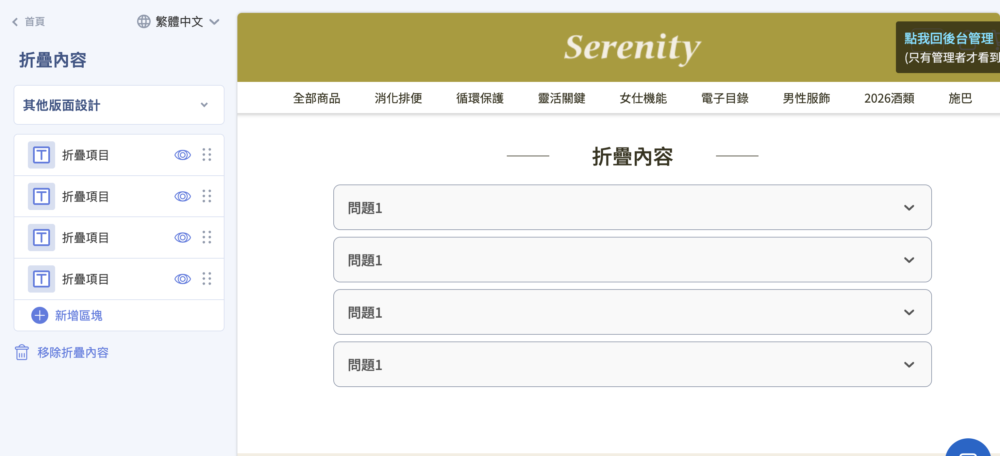

## 商品頁面

商品頁面主要由四個功能區塊組成，可依需求開啟或調整排序：

=== "基本設定"

	控管價格顯示邏輯與庫存狀態顯示。

	- **顯示商品價格(SKU)**：選擇要不要顯示商品編號 SKU。

	- **會員專屬價格標籤：** 。

	- **商品價格標籤：** 可勾選顯示「優惠售價」或「建議售價」。若勾選顯示優惠售價，當定價大於售價時會顯示優惠售價文字。
	
	- **多款式價格：** 當商品款式售價不同時，會顯示價格區間（如 NT40 NT100）。
	
	- **無庫存狀態：** 可設定當商品缺貨時，款式按鈕為「不可點選」或「可點選（顯示聯絡店家）」。

	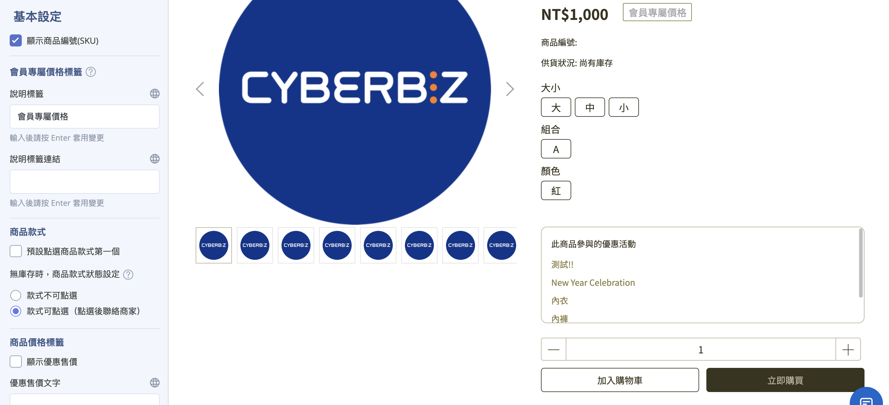

=== "商品介紹"

	設定商品介紹區塊的標題名稱，並決定是否在前台顯示該欄位。

	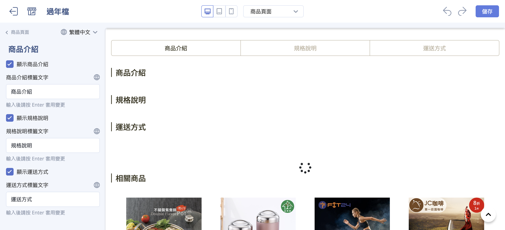

=== "商品評論"

	此功能需先洽客服申請開通。開通後可設定是否需審核留言、隱藏部分姓名，並可搭配 Google reCAPTCHA 防止機器人攻擊。  

	- [如何管理商品評論](../products/管理商品評論)。
	- [如何啟用 reCAPTCHA](../products/啟用留言區 reCAPTCHA)
	
	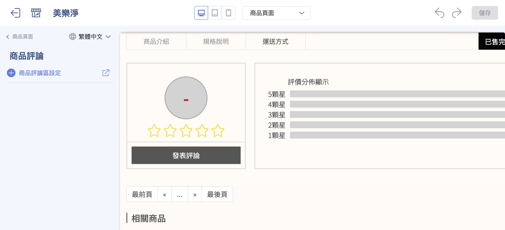

=== "相關商品"

	可選擇顯示「商品群組其他商品」（同分類隨機顯示）或「自訂關聯群組商品」。
	
	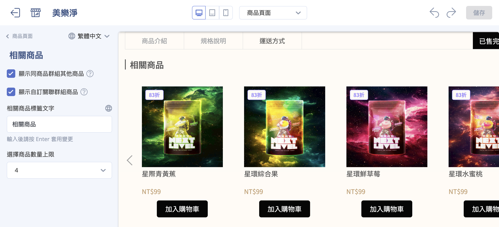

---

- **基本設定：** 控管價格顯示邏輯與庫存狀態顯示。

	- **商品價格標籤：** 可勾選顯示「優惠售價」或「建議售價」。若勾選顯示優惠售價，當定價大於售價時會顯示優惠售價文字。
	
	- **多款式價格：** 當商品款式售價不同時，會顯示價格區間（如 NT40 NT100）。
	
	- **無庫存狀態：** 可設定當商品缺貨時，款式按鈕為「不可點選」或「可點選（顯示聯絡店家）」。

- **商品介紹：** 設定商品介紹區塊的標題名稱，並決定是否在前台顯示該欄位。

- **商品評論：** 此功能需先洽客服申請開通。開通後可設定是否需審核留言、隱藏部分姓名，並可搭配 **Google reCAPTCHA** 防止機器人攻擊。

- **相關商品：** 可選擇顯示「商品群組其他商品」（同分類隨機顯示）或「自訂關聯群組商品」。

**三、 進階視覺功能**

- **色票功能 (Color Swatch)：**

    - 商家可在商品編輯頁的「款式管理」中，為不同顏色款式上傳對應圖片。

    - 在前台商品頁選擇特定顏色時，主圖會自動切換為該款式的圖片，提升顧客的購買參考準確度。

- **商品影片：**

    - 支援上傳 **mp4** 格式影片（解析度不超過 1280x1280，長度 60 秒內，大小 30MB 內）。

    - 影片會顯示在商品頁主圖位置或彈窗中，但目前不會顯示在群組列表頁。

- **商品標籤 (Labels)：**

    - 可於「全站設定」中開啟，包含**定期定額標籤、特價標籤（折扣貼紙）、缺貨標籤**以及最多 5 組**自定義標籤**。

    - 標籤底色會統一套用「顏色設定」中的「強調色」。

**四、 商品描述與排版技巧**

- **文字編輯器 (CKEditor)：** 在撰寫商品介紹、規格說明、運送方式時，請務必使用「**純文字貼上**」（Ctrl+Shift+V）功能，避免帶入外部網頁格式導致商品頁跑版。

- **影片嵌入：** 若在描述中嵌入 YouTube 影片，如遇到手機版無法縮放（爆版）的情況，需進入「原始碼」模式，將語法中的 `
` 修改為具有響應式功能的 `div` 標籤。

- **文字呈現修改：** 商品標語或簡述的文字顏色、大小，可透過編輯器內的「原始碼」直接撰寫 HTML，其優先權高於全站樣版設定。

- 商品群組頁面
- 商品多層級分類
- 部落格頁
- 部落格文章頁
- 客服
- 404頁
- 快速到貨
- 搜尋頁

## 商品群組頁面

在拖拉編輯器中，您可以針對群組頁面進行以下細節設定：

- **商品分類設定**：

	- **左側選單連結**：可指定該群組頁面要套用哪一組導覽選單（需先在[「選單/導覽列設定」](設定選單與導覽列.md){ data-preview }  完成設置）。

	- **商品欄數**：商品每排顯示的數量。

	- **商品數量上限**：設定每頁顯示的商品數量。
	
	- **更多商品顯示方式**：設定顯示更多商品的呈現方式，分頁跳轉或是向下無限滾動顯示。

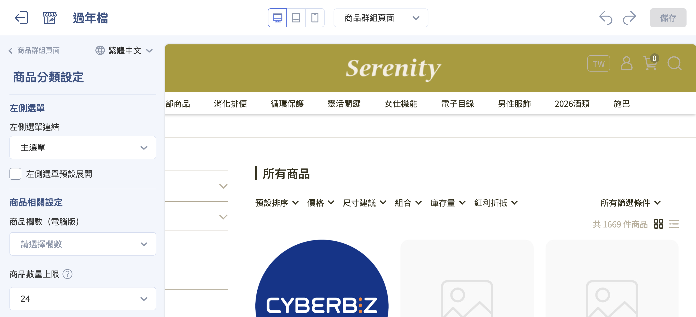

## 商品多層級分類

> :lucide-info: 需先[建立商品多層級分類架構](../products/設定商品多層級分類.md){ data-preview }  。

完成結構後，商家可針對多層級分類頁面的呈現方式進行微調。

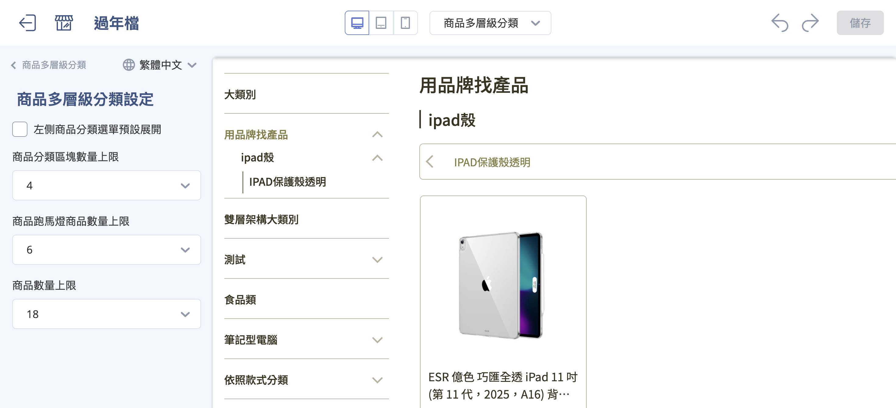

## 部落格頁

此頁面主要用於呈現多篇文章的摘要列表。

- **每頁文章數量**：商家可以自訂每頁要顯示的文章總數。

- **顯示精選文章**：勾選此功能後，系統會在部落格列表頁的底部顯示特定的「精選文章」，適合用來增加熱門文章的曝光。

- **精選文章群組**：在開啟精選文章後，可以進一步選擇要顯示哪一個部落格群組內的文章作為精選內容。

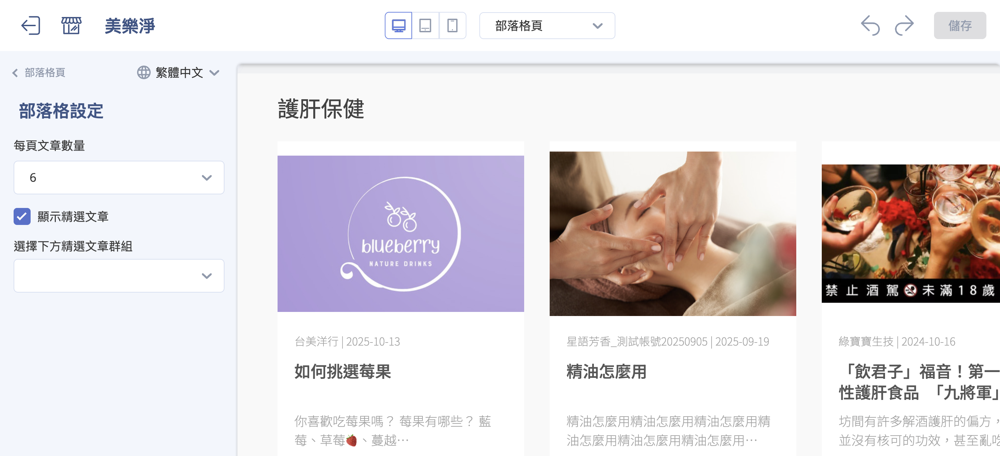

## 部落格文章頁

此頁面用於顯示單篇完整文章的詳細內容。

- **文章標籤區標題**：系統會自動抓取該文章所屬群組內的所有「文章標籤」並在此區塊呈現。

## 客服

客服頁面在前台主要以「聯絡我們」表單的形式呈現，供訪客留言諮詢。

- **問題類型設定**：商家可自訂「聯絡我們」表單中的下拉式問題選單。設定路徑為後台 **會員 > 客服問題分類**。

- **聯絡資訊設置**：除了表單外，建議在 **頁腳**（Footer）區塊同步設定完整的公司電話、地址與 Email，增加品牌信任感。

> :lucide-flame: 針對顧客留言的客服頁面，拖拉版型支援[建立 **Google reCAPTCHA 安全驗證**](../products/啟用留言區 reCAPTCHA.md){ data-preview }  ，以防止機器人攻擊或垃圾訊息。

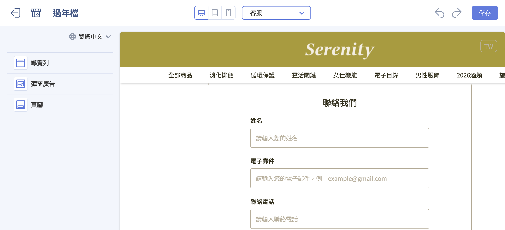

## 404 頁

引導當消費者訪問到失效連結（如活動結束、商品下架或網址錯誤）時的顯示畫面。商家可以透過簡單的設定，自訂該頁面的視覺。

- **更換圖片**：商家可以 **自行上傳並更換 404 頁面的圖片**。建議設計符合品牌風格或有趣的引導圖案，以緩解負面體驗。例如：提示網頁已走失，並提供回到首頁的按鈕提示。

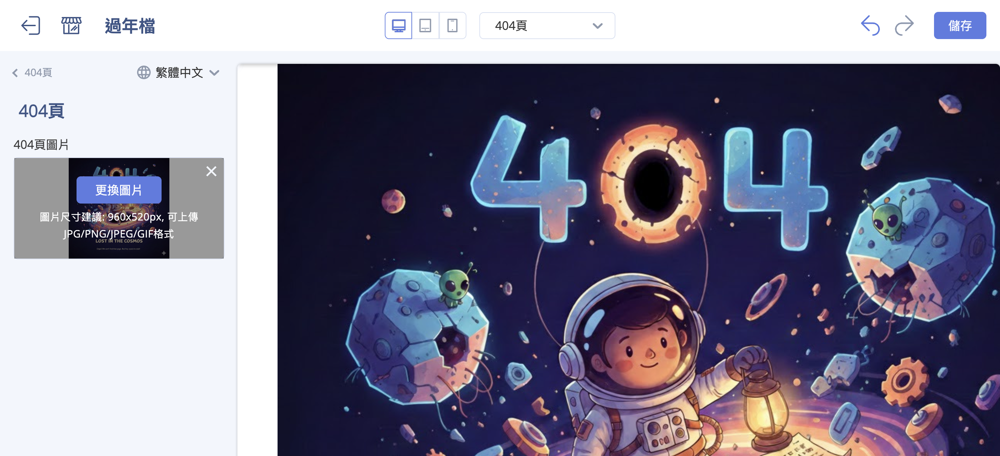

## 快速到貨

用於自訂快速到貨專區的視覺與醒目入口。

- **自訂色彩**：商家可在此設定**導覽列顏色（Logo 背景）**與右上 **Icon 的線條顏色**，以幫助消費者區分一般專區與快速到貨專區。

- **開啟入口按鈕**：勾選「**顯示快速到貨按鈕**」，系統會在官網全站導覽列上方顯示明顯的專區入口，引導消費者點擊。

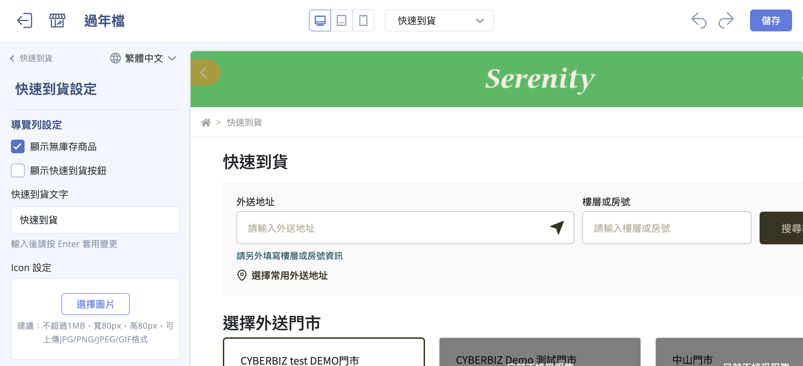

## 搜尋頁

## 後續步驟

- :lucide-menu:{ .lg }   
  [__選單與導覽列__](設定選單與導覽列)     
  設定網站前台的選單與導覽列內容跟呈現。

- :lucide-image:{ .lg }     
  [__連結預設圖片__](設定轉貼連結預設圖片)  
  設定轉貼網站連結的預設顯示圖片。

## 常見問題

