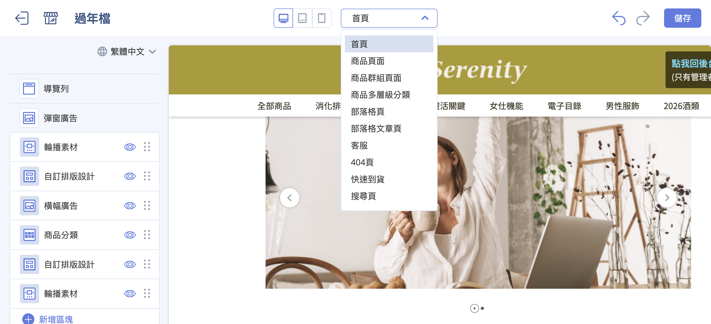

---
notes:
  - check 商品標籤 適用方案
---

# 拖拉版型網站設定

[:lucide-toggle-right:{ title="適用功能" }](../../resources/conventions#適用功能) | 拖拉版型
{ .doc-badge }

{ .hero-page }

## 拖拉版型功能說明

**拖拉版型（Drag-and-Drop）** 讓商家無需撰寫程式碼，即可透過圖形化介面直覺地建立與調整官網外觀。

### 切換裝置及頁面

點擊拖拉版型編輯器上方不同裝置圖示，可以切換預覽不同裝置的網頁顯示效果：

- :lucide-monitor: 桌上型電腦螢幕的顯示畫面。
- :lucide-tablet: 平板電腦的顯示畫面。
- :lucide-smartphone: 手機的顯示畫面。

點擊上方的 **首頁**，可以展開頁面選單，選擇不同頁面進行編輯。  
> :lucide-info: 實際選項依照方案跟功能設定可能有所不同。

## 進入與基本設定

- **進入路徑**：前往後台 **網站外觀 > 套版主題管理**，確認使用拖拉版型（拖拉版型標籤）後點選 **網站設定**。

- **全站共用設定**：

	- **導覽列**：可設定選單排列樣式（預設/併排置左/併排置右）、背景是否透明，以及次選單是否同步展開。瞭解 [如何設定選單與導覽列](設定選單與導覽列)。
	- **彈窗廣告**：可設定圖片、影片、互動遊戲或排程跑馬燈廣告。
	- **頁腳**：提供「上下」或「左右」排序樣式，並可開啟 **社群媒體圖示** 的顯示與連結。瞭解 [如何設定頁腳](設定選單與導覽列#設定頁腳內容)。
	- **顏色設定**：可一鍵變更全站的主色調、強調色（如標籤顏色）及字體顏色。
	- **全站設定**：可設定 favicon、網站 Logo、字型、網站 SEO、商品相關設定及商品標籤。

### 彈窗廣告

商家可以根據行銷目的，選擇以下幾種內容形式：

- **圖片彈窗**：商家可分別上傳電腦版、平板版與手機版圖片（電腦版為必填），並設定圖片點擊後導向的網址。

- **影片彈窗**：目前支援嵌入 **YouTube 影片** 連結進行展示。

- **互動遊戲**：可將後台設定好的「輪盤遊戲」或「紅包抽獎」放入彈窗中，增加趣味性並發放紅利或優惠券（此功能為官網會員專屬，需登入才可參與）。

- **排程跑馬燈**：可在彈窗內載入預先製作好的跑馬燈內容，達成自動化更新廣告圖的需求。

### 顏色設定

商家可以針對全站的基礎視覺元素進行定義：

- **主色調與文字顏色**：可一鍵變更全站的主色調顏色及全站字體顏色。

- **強調色**：這是最重要的設定之一，會自動套用於系統多個動態 UI 元素。

??? note "強調色的應用範圍"
	
	當商家在顏色設定中選定「強調色」後，系統會自動將該顏色應用於：

	- **商品標籤（Labels）**：包含系統自動顯示的 **定期定額**、**特價**、**缺貨** 標籤，以及商家自定義的  **5 組標籤**。
	
	- **開賣時間倒數**：若商品設定為尚未上架，前台商品頁或群組列表顯示的 **倒數時間底色**，會自動套用強調色。
	
	- **排序邏輯**：標籤顏色會依據特定順序（定期定額 → 特價 → 缺貨 → 自定義標籤）由左至右排列，並統一套用該色系。

??? note "特定區塊的個別顏色設定"

	除了全站統一的顏色設定外，某些功能區塊允許更細緻的顏色自訂：

	- **置頂公告**：商家可以分別設定置頂公告欄位的 **圖片連結底色** 以及 **時間倒數的文字與背景顏色**。
	
	- **折疊內容**：用於 FAQ 或購物須知的區塊，可以個別設定該區塊的顯示顏色。
	
	- **圖文介紹**：此區塊內的 **按鈕顏色** 可依照需求自訂。

---

### 全站設定

提供商家集中控管官網的基礎視覺識別、搜尋引擎優化（SEO）、全域商品顯示行為以及網站安全防護等核心設定。

#### 視覺識別與品牌資產

- **網站圖示設定：**

	- **Favicon：** 設定顯示於瀏覽器分頁標籤上的小圖示。
	- **OG Image (轉貼連結預設圖片)：** 設定網站連結分享至 Facebook 或 LINE 時顯示的預設縮圖。

- **導覽列圖示：** 系統預設 3 種樣式，商家亦可上傳自定義圖示檔案。

- **字型設定：** 調整全站網頁所套用的字體樣式。

---

#### 網站 SEO 與安全保護

- **SEO 設定：** 可定義網站的 **標題**、**簡述** 與 **關鍵字**，優化搜尋引擎對網站的收錄與排名。若標題欄位留空，系統會預設以商店名稱作為標題。

- **網頁鎖右鍵：** 勾選可禁止使用者透過點擊滑鼠右鍵，自行下載圖片或複製文字，保護原創內容。

---

#### 全域商品顯示行為

商家可統一設定商品在各列表頁與詳細頁的呈現方式：

- **商品標語：** 商品特色或促銷標語。

- **商品色票小圖*：** 可開啟在官網前台顯示商品顏色款式小圖。

- **銷售數量：** 可開啟顯示商品的 **已銷售數量**。

- **開賣時間*：** 針對設定為尚未上架的商品，可開啟顯示商品的 **開賣倒數時間**。

- **價格區間：** 可勾選顯示商品 **價格區間**，開啟後前台會自動隱藏原有的 **定價** 標籤。

- **商品款式選單：** 可設定前台商品款式顯示方式為下拉選單或是按鈕。

- **商品影片設定*：** 若商品有設定影片，可指定影片顯示在圖片彈窗的第一格或最後一格。

- **商品購買數量上限：** 設定每個款式商品可以被加入到購物車中的上限。

- **折扣貼紙*：** 當任一款式售價金額低於定價時會顯示此折扣貼紙於商品圖片左上方位置。

!!! info "適用方案限制"
	
	- 商品色票小圖與開賣時間為 企業 方案專屬功能。
	- 商品影片僅適用 PLUS / 企業 方案。
	- 折扣貼紙僅適用非 PLUS / 企業 方案。

---

#### 動態標籤設定 (商品標籤)

!!! info "適用方案限制"

	- 商品標籤功能僅適用 高手PLUS 與 企業 方案。
	- 自定義標籤僅適用 企業 方案。

系統會根據特定條件自動為商品附上標籤，並依據固定的優先順序由左至右排列：

- **定期定額標籤：** 商品綁定定期定額活動時顯示。

- **特價標籤：** 當商品售價低於定價時顯示。

- **缺貨標籤：** 商品庫存為 0 且設定為停止銷售時顯示。

- **自定義標籤*：** 商家可設定最多 **5 組** 自定義標籤（支援文字或圖片類型），並透過與後台商品標籤關聯來觸發顯示。

- _備註：這些標籤的底色通常套用「顏色設定」中的「強調色」。_

---

## 首頁與頁面內容編輯

商家可點選 **新增區塊** 來組合多種功能模組，並透過滑鼠拖拉調整順序。點擊 區塊名稱可進入相關編輯頁面。

> :lucide-info: 實際選項依照方案跟功能設定可能有所不同。

- **商品分類**：可指定顯示「全部商品」或特定「自訂/條件分類」，並設定欄數與展開方式（往下展開或左右滑動）。

- **自訂排版設計（分欄功能）**：支援在同一橫列中並排多個區塊（如圖片、影片、HTML），可設定「版面螢幕占比」達成 50/50 或 33/33/33 等多欄結構。

- **其他區塊**：包含 YouTube 影片嵌入、圖文介紹、文字編輯器、折疊內容（常用於 FAQ）、主打商品及排程跑馬燈。

點擊區塊名稱可以進入編輯頁面。

### 輪播素材

透過多張圖片輪替展示，吸引消費者注意力並推廣重要活動。

點擊「素材」文字即可進入編輯頁面。

- **圖片上傳**：支援分別上傳 **電腦版、平板版與手機版** 的圖片素材。

- **圖片連結**：點開下拉選單可選擇要連結的項目，支援官網內部的商品頁、分類頁、行銷活動頁，或自行輸入 **外部連結**。

- **圖片替代文字 (ALT)**：商家應務必填寫圖片替代文字，此舉有助於 **優化 SEO** 搜尋引擎排名。

- **刪除素材**：若不再需要該張圖片，可點擊「移除素材」將其刪除。

#### 版面細節設定 (其他版面設計)

除了圖片本身，商家可以微調輪播的呈現方式：

- **圖片停留秒數**：設定每張圖片在自動跳至下一輪之前所停留的時間（秒）。

- **圖片切換速度**：設定圖片切換的速度，數值越大代表切換速度越慢（秒）。

- **圖片數量與間距**：可設定每一輪顯示的圖片張數；若設定多張（2張以上），可調整圖片之間的間距。

	

- **版面邊距**：可分別設定電腦版與手機版的 **左右外邊距** 及 **底部外邊距**，確保圖片在不同裝置上比例適中。

### 商品分類

商品分類可讓商家設計商品櫥窗，展示特定分類商品群。

### 分頁頁籤

新增部落格群組，可透過右方畫面即時查看設定。

## 後續步驟

- :lucide-menu:{ .lg }   
  [__選單與導覽列__](設定選單與導覽列)     
  設定網站前台的選單與導覽列內容跟呈現。

- :lucide-image:{ .lg }     
  [__連結預設圖片__](設定轉貼連結預設圖片)  
  設定轉貼網站連結的預設顯示圖片。

## 常見問題

