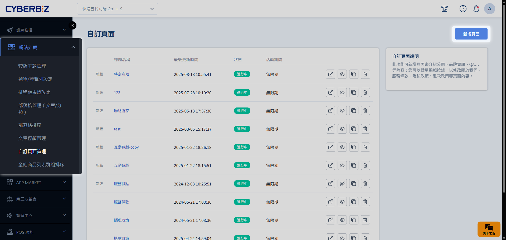
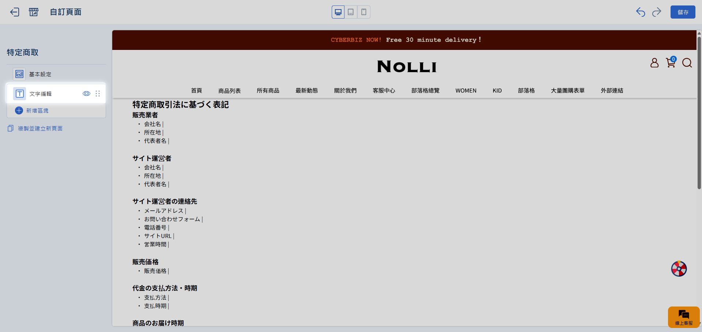
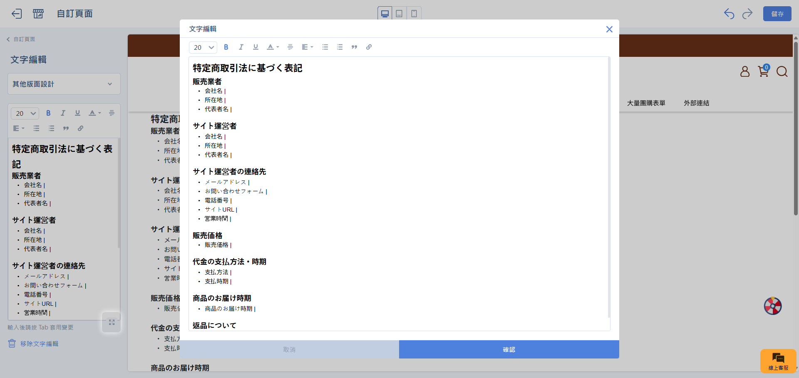
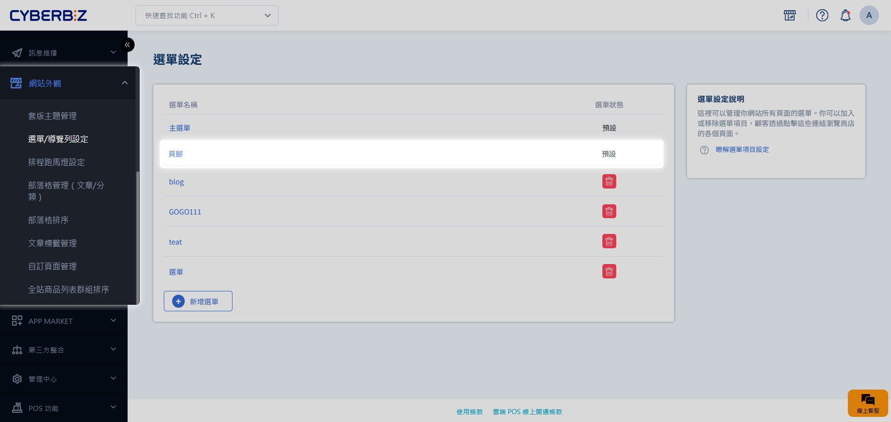
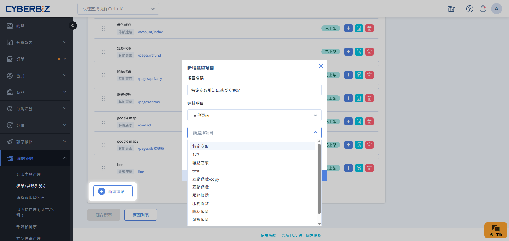

# 日本站官網需建立特定商取引法頁面

根據日本《特定商取引法》，日本站商家需建立法定公開頁面，涵蓋必要商家資訊，確保網站合法營運。
{ .subtitle }

## 使用須知

### 核心合規要求

- **法律強制性**：依據日本《特定商取引法》（特定商取引に関する法律）規定，**所有網路商店均強制要求公開商家資訊**。若未設置或資訊不實，可能面臨行政罰則，或導致金流服務遭到終止。
- **消費者保障**：此頁面旨在透明化交易流程，保障消費者在遠距購物時的知情權，建立安全的交易環境。

### 執行維護要點

- **語言統一**：全頁內容必須使用 **日文** 填寫。
- **資訊即時性**：若公司地址、客服電話或退貨規則異動，必須立即同步更新此頁面。

## 步驟 1：準備必要資訊

請預先準備以下日文資訊。部分固定資訊（如銷售業者）需填寫 CYBERBIZ JAPAN 日本分公司之資料。

| 類型 | 日文欄位 | 中文說明 | 填寫規範 |
| :--- | :--- | :--- | :--- |
| **販売業者 （經銷商）** | **会社名** | 銷售業者名稱 | 填寫 `CYBERBIZ JAPAN株式会社` |
| | **所在地** | 公司所在地 | 填寫 `東京都港区三田1丁目2番18号TTDビル` |
| | **代表者名** | 負責人 | 填寫 `Su, Ji-Ming` |
| **サイト運営者 （網站運營商）** | **会社名** | 網站營運公司 | 填寫您的公司名稱 |
| | **所在地** | 營運地址 | 填寫您的公司地址與郵遞區號 |
| | **運営責任者** | 營運負責人 | 填寫您的網站營運負責人姓名 |
| **サイト運営者の連絡先 （網站運營商聯絡資訊）** | **メールアドレス** | 電子郵件 | 填寫官方客服信箱 |
| | **お問い合わせフォーム** | 客服聯絡表單 | 填寫 **聯絡我們** 頁面連結 |
| | **電話番号** | 聯絡電話 | 填寫包含國碼之電話（例：`886-2-8751-8588`） |
| | **サイトURL** | 主頁網址 | 填寫網站連結 |
| | **営業時間** | 營業時間 | 填寫營業時間（例：`10:00～19:00(週一至週五，週六、週日及台灣假日除外)`） |
| **販売価格** | **販売価格** | 銷售價格 | 註明價格標示方式（含稅/未稅） |
| 代金の支払方法・時期 | **支払方法** | 付款方式 | 填寫可接受的付款方式（例：`信用卡`） |
| | **支払時期** | 付款時間點 | 填寫扣款時點（例： `下單時即扣款`） |
| 商品のお届け時期 | **商品のお届け時期**| 交貨時間 | 說明下單後的出貨時程（例：`◯〜◯個工作天`） |
| 返品について | **返品について** | 退貨政策 | 詳述退貨期限、限制與運費承擔方（例：`商品到貨後◯日內可申請退貨，開封商品或特定商品除外；退貨運費由◯方承擔`） |

## 步驟 2：建立自訂頁面

將上述資訊整合至官網專屬頁面。

1. 前往 **網站外觀 > 自訂頁面管理**。
2. 點擊 **新增自訂頁面**。
    { .screenshot }
3. **頁面標題**：命名為 `特定商取引法に基づく表記`。
4. **新增內容**：
    - 新增 **文字編輯** 區塊。
        { .screenshot }
    - 以表格或結構化條列方式填入先前準備的資訊。
        { .screenshot }
5. 點擊 **儲存** 完成建立。

## 步驟 3：將連結新增至頁腳

確保消費者能在網站任何分頁快速找到此法規頁面。

1. 前往 **網站外觀 > 選單/導覽列設定**。
2. 點擊 **頁腳** 進入編輯模式。
    { .screenshot }
3. 點擊 **新增連結**：
    - **項目名稱**：輸入 `特定商取引法に基づく表記`。
    - **連結項目**：選擇 **其他頁面**，並選取剛建立的法規頁面。
    - **排程時間**：選擇 **不指定排程時間**。
    { .screenshot }
4. 點擊 **儲存選單**。

