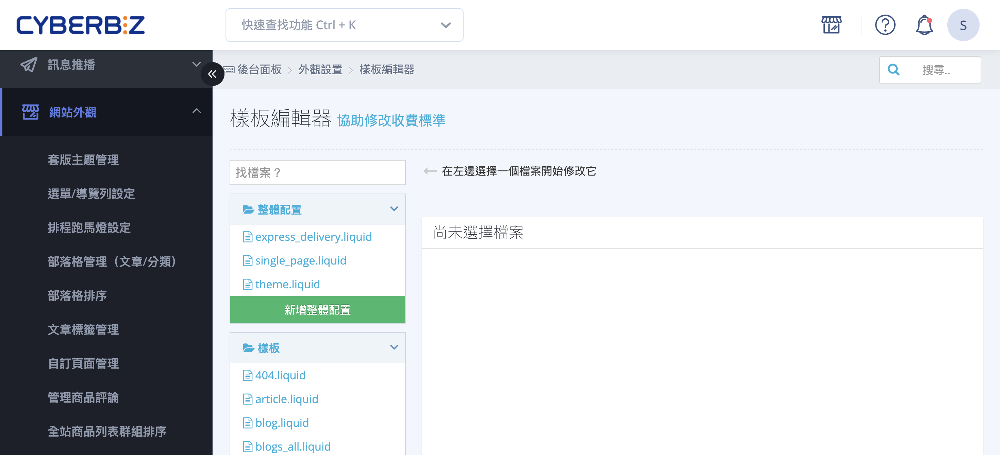

{ .subtitle }

{ .hero-page }

## 樣板編輯器說明
**樣版編輯器**（或稱程式碼編輯器、CSS/HTML 編輯器）提供商家自行修改 HTML、CSS 與 JavaScript 的權限，以達成高度客製化的視覺與功能需求。

以下整理樣版編輯器的操作說明、常見特殊語法應用及重要注意事項：

## 樣版編輯器基礎操作

1. **進入路徑**：前往後台「**網站外觀**」>「**套版主題管理**」> 針對欲編輯的主題點選「**選擇操作**」>「**CSS/HTML 編輯器**」（或程式碼編輯器）。
2. **檔案搜尋**：進入編輯器後，可於搜尋欄輸入關鍵字（如 `theme`、`product`、`index`）快速查找對應的 `.liquid`、`.css` 或 `.js` 檔案。
3. **恢復機制**：編輯器內建 **查看之前版本** 功能，可回溯至先前版 本。
    - 建議每次大規模更動前先記錄當下的時間點以便日後對照。

##  通用與首頁特殊語法應用

透過簡單的代碼片段，即可調整網站的保護機制與互動行為。

- :lucide-shield-check:{ .lg }   
  [__內容保護（鎖右鍵）__](設定網頁鎖右鍵保護圖文版權.md){ data-preview }       
  在 `theme.liquid` 的 `<body>` 加入 `onContextMenu="return false"`，防止內容被輕易複製。

- :lucide-search:{ .lg }     
  [__SEO 標題自訂__]()  
  搜尋 `{{ shop.name }} | {{ page_title }}` 並移除或修改後方變數，避免搜尋結果統一顯示「歡迎光臨」。

- :lucide-timer:{ .lg }  
  [__輪播圖轉場控制__]()  
  於 `_main_slider.liquid` 修改 `delay:` 數值（如 `5000` = 5秒），精確掌控首頁視覺節奏。

- :lucide-mouse-pointer-2:{ .lg } [__選單自動展開__]()  
  在 `main_nav.liquid` 加入 CSS 語法，讓滑鼠移至主選單時，子選單能自動流暢下拉。

- :lucide-filter-x:{ .lg }  
  [__搜尋排除特定關鍵字__](設定搜尋結果中排除特定關鍵字商品.md){ data-preview }    
  透過修改 `search.liquid` 中的 Liquid 變數，利用關鍵字過濾器（`without`）精準隱藏特定商品（如：加價購、秘密賣場），優化前台搜尋結果。

- :lucide-globe:{ .lg }  
  [__前台語系與文字呈現__](設定前台語系與文字自定義.md){ data-preview }  
  自定義全站顯示文字與多國語系字典檔 (i18n)，調整按鈕名稱與系統預設語法。

- **網頁鎖右鍵功能**：為保護原創內容，可於 `theme.liquid` 檔案中的 `<body ...>` 標籤後方加入 `ondragstart="return false" onselectstart="return false" onContextMenu="return false"`。
- **網站標題 (TITLE) 修改**：若不希望搜尋引擎顯示預設的「歡迎光臨」，可於 `theme.liquid` 搜尋 `{{ shop.name }} | {{ page_title }}`，將 `| {{ page_title }}` 刪除或替換為自訂文字。
- **首頁輪播圖轉場速度**：於 `_main_slider.liquid` 搜尋 `delay:`，修改後方的數字（單位為毫秒，例如 `3000` 代表 3 秒）即可調整更換圖片的時間。
- **選單自動下拉**：若希望滑鼠移至選單時自動展開次選單，可於 `main_nav.liquid` 加入 `.dropdown:hover .dropdown-menu { display:block; }`。

## 商品頁進階修改

針對商品呈現與媒體播放進行微調，優化消費者的購物導引。

- :lucide-image-off:{ .lg }  
  [__關閉圖片放大鏡__]()  
  若商品圖解析度不足，可於 `product.liquid` 搜尋放大鏡代碼並加上 `//` 註解，避免模糊預覽。
    
- :lucide-play-circle:{ .lg }  
  [__影音自動播放__]()   
  在 YouTube 網址後方加上 `&autoplay=1&mute=1` 參數，實現商品影音的沉浸式體驗。
    
- :lucide-type:{ .lg }  
  [__標語樣式客製__](../products/creation/編輯商品簡述與商品標語.md){ data-preview }     
  利用 `css/theme_main.css` 定義特定類別，或直接在文字編輯器原始碼模式中嵌入 HTML 樣式代碼。
    

- **鎖定圖片放大功能**：若商品圖規格不符導致預覽模糊，可於 `product.liquid` 搜尋「圖片放大」相關代碼，並在該段程式碼前加上雙斜線 `//` 使其變為註解（即失效）。
- **影片自動播放設定**：
    - 在 YouTube 連結後方加上 `?rel=0&playlist=影片ID&loop=1&autoplay=1&mute=1` 可達成自動播放（依平台規範，自動播放必須設為靜音）。
    - 若需指定播放起始點，可使用 `?start=秒數` 參數。
- **商品標語與簡述樣式**：
    - 可透過 CSS 檔案（如 `css/theme_main.css`）針對特定類名（class）修改文字顏色、大小。
    - 若不具程式背景，可利用商品描述中的 CKEditor 切換至「原始碼」模式，產生 HTML 代碼後再貼回標語欄位。

## 結帳與售後頁面優化

優化跨境購物體驗並強化訂單完成後的行銷導流。

- :lucide-user-check:{ .lg }   
  [__優化跨境收件流程__]()     
  透過修改 `js/main.js` 的 `v3` 參數，將「收件人」欄位調至「購買人」之前，提升代購或跨境訂單的填寫效率。

- :lucide-layout-template:{ .lg }     
  [__客製化訂單成功頁面__](../integrations/line/設定訂單成立頁與付款完成頁顯示 LINE 加入好友連結.md){ data-preview }    
  申請開通 `order_done_extra_content.liquid` 權限後，可利用 Liquid 邏輯判斷式在訂單成立或付款完成頁加入專屬行銷內容（如加入 LINE 群組連結或圖片）。

- :lucide-file-edit:{ .lg }  
  [__調整訂單改價標籤__]()  
  於 `customers/order.liquid` 進行邏輯替換，將系統預設的「店長改價」字樣優化為「商品改價」或其他更具專業感的術語。

- **優先填寫收件人**：針對跨境或代購需求，可於 `js/main.js` 結帳頁 v3 區塊貼入 `config.exchangeShippingAndPurchaserLocation=true;`，使收件人欄位優先於購買人出現。
- **訂單成立/付款完成頁客製化**：
    - 需先向客服申請開通 `order_done_extra_content.liquid` 權限。
    - 可使用邏輯判斷式 ` ...  ... ` 來區分這兩個頁面顯示的不同內容（如加入 LINE 群組連結或圖片）。
- **隱藏「店長改價」字樣**：為避免爭議，可於 `customers/order.liquid` 搜尋 `type.name`，並利用 ` 商品改價  {{type.name}} ` 將其顯示名稱更換。

## 重要注意事項

1. **版型限制**：
    - **預設版型**：開放完整 HTML/CSS/JS 語法客製。
    - **拖拉版型**：僅支援 **少數** 後台 CSS/HTML 編輯器功能，部分程式碼修改可能不生效。
2. **責任歸屬**：CYBERBIZ 提供開放的程式碼編輯權限，但 **官方不提供現有文件外的修改指導、語法教學或代碼撰寫服務**。
3. **風險自負**：商家自行修改程式碼若導致版面跑版或功能異常，需自行承擔後果；發生異常時應優先使用恢復機制還原檔案。
4. **變數保護**：修改 Email 或簡訊樣板時，切勿更改 `{{ }}` 或 `%{ }}` 內的系統參數（如 `{{shop_name}}`），以免導致系統無法抓取資料而發信失敗。

## 後續操作

- :lucide-import:{ .lg }   
  [____]()     
  。

- :lucide-ban:{ .lg }     
  [____]()  
  。

## 常見問題

??? quote ""