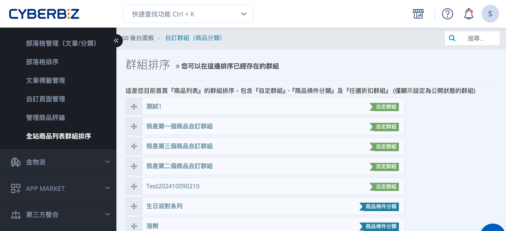
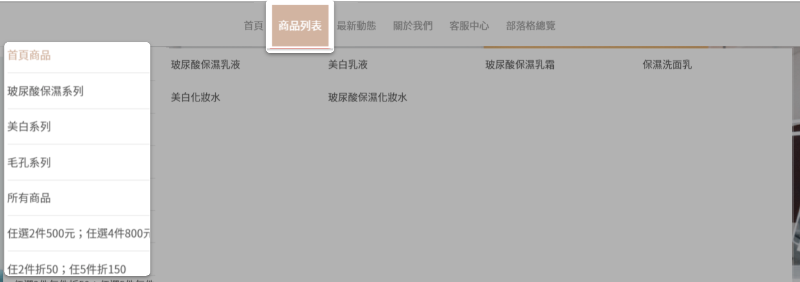

# 設定前台商品群組排序

調整首頁「商品列表」中各類商品群組（包含自訂分類群組、條件分類群組與任選折扣群組）的顯示順序，並設定首頁可顯示的群組數量。
{ .subtitle }

{ .hero-page }

## 調整首頁商品列表的群組排序

商家可透過拖曳方式，調整首頁「商品列表」中商品群組的顯示順序。

#### 操作步驟

1. 登入 CYBERBIZ 管理後台，前往  **網站外觀 > 全站商品列表群組排序**。
2. 在群組列表中，點擊並拖曳 **移動圖示** :lucide-move:，上下調整群組顯示順序。
> 僅顯示狀態為 **公開** 的群組，才會出現在此列表中。

### 前台顯示說明

前台首頁的「商品列表」將依照群組列表頁面設定的排序順序，依序顯示商品群組。

## 設定首頁商品列表顯示群組數量

您可設定首頁「商品列表」中，最多顯示幾個商品群組。

#### 操作步驟

1. 登入 CYBERBIZ 管理後台，前往  **網站外觀 > 套版主題管理 > 導覽列 Navbar > 導覽列選單**。
    
2. 調整 **群組數量** 欄位。
    
    - **範例**：若群組數量設定為 `4`，即使目前有 `8` 個群組設為公開，首頁仍僅顯示前 `4` 個群組。

 { .screenshot }

## 常見問題

??? quote "為什麼我調整了群組排序，但前台沒有生效？"
	請確認以下項目：
	- 群組狀態是否已設定為 **公開**。
	- 「導覽列選單」中的 **群組數量** 設定，是否足夠顯示您調整的群組。

??? quote "自訂群組、智慧群組與任選折扣群組有什麼差別？"  
	- **自訂分類群組**：由商家手動選擇商品加入的群組。  
	- **條件分類群組（智慧群組）**：依設定條件自動篩選商品加入的群組。  
	- **任選折扣群組**：用於設定任選折扣活動的商品群組。

