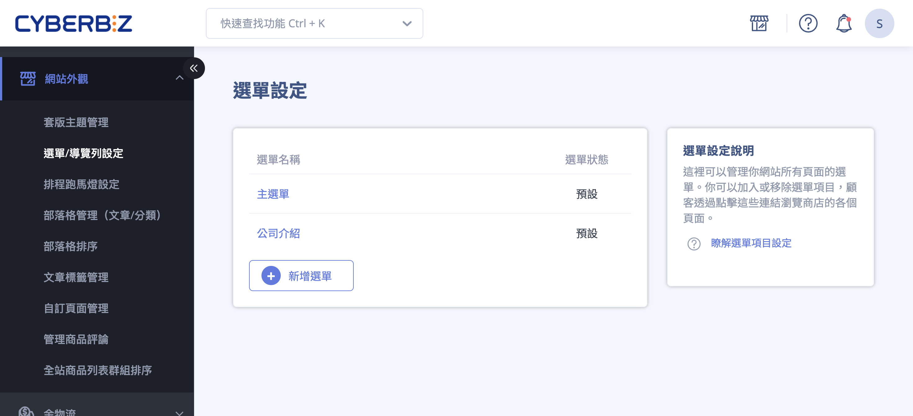
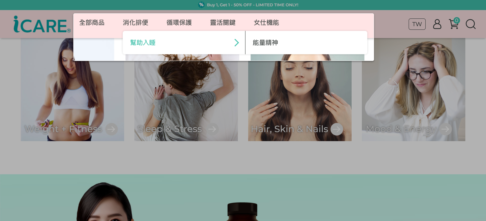
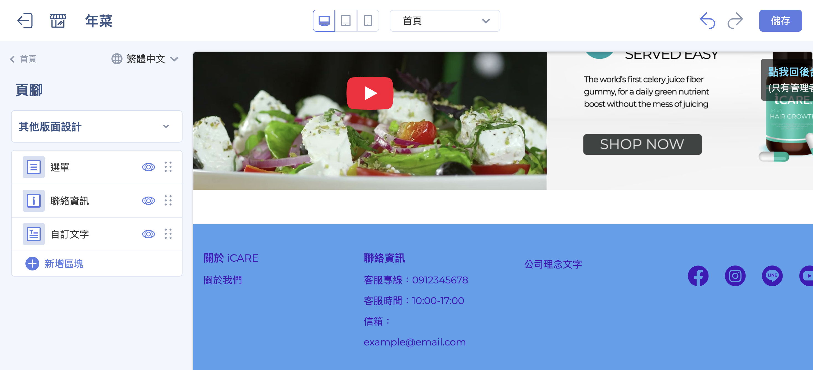
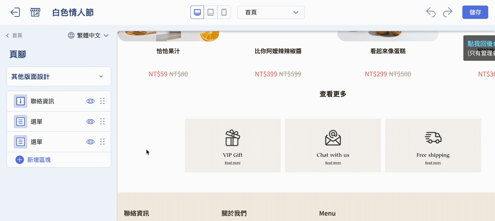

# 設定選單與導覽列

設定網站的選單、導覽列與頁腳。
{ .subtitle }

{ .hero-page }

## 選單與導覽列說明

**選單與導覽列設定** 可分為兩大部分：

1. [**選單內容設定**](#選單內容設定-連結列表)：管理網站的選單項目與層級結構。
    
2. [**選單外觀呈現**](#導覽列外觀設定-navbar)：控制選單在網站前台的顯示方式與風格。
    
此設定可協助商家建立清晰、直觀的網站導航，提升使用者操作體驗。

!!! tip "設定建議：先完成 **選單內容設定**，再調整 **外觀呈現**，可確保導航結構與顯示效果一致。"
	

## 選單內容設定 (連結列表)

商家需先在後台設定選單包含哪些項目及層級，設定完成後才能套用至網站外觀。

1. **設定路徑：** 前往 **網站外觀 > 選單/導覽列設定 > 選單設定**。

2. **編輯選單：** 系統預設有「主選單」與「頁腳」兩組選單，商家可點選名稱進入編輯。

	!!! info "若開通多國語系功能，需點選 :lucide-globe: 圖示切換語系，**分別編輯各選單項目的名稱**，否則系統會預設顯示繁體中文內容。[瞭解更多](#)。"
	
3. **新增項目：** 進入選單編輯頁面後，點擊「新增連結」可加入多種導覽項目，包括：

	- **商品分類：** 包含自訂分類、條件分類及多層級分類。
	
	- **行銷活動：** 如紅配綠組合優惠、任選折扣、紅利商城等。

	- **內容頁面：** 指定單一商品、自訂頁面、部落格主題或文章。

	- **功能連結：** 查詢頁面、聯絡店家、首頁或外部連結。

	

4. **層級與排序：** 項目建立後，可透過 **滑鼠拖拉** 調整順序，將項目向右縮排即可建立次級選單，**最多支援三層結構**。

	
	
5. **前台畫面：** 點擊右上角 **前往商店** 圖示可以前往前台檢視設定成果。

	

## 導覽列外觀設定 (Navbar)

根據商家使用的版型（拖拉版型或預設版型），外觀設定路徑與功能略有不同。

=== "拖拉版型設定"

	- **路徑：** **網站外觀 > 套版主題管理 > 網站設定 > 導覽列**。
	
	- **網站 Logo 設定：** 可分別上傳電腦、平板及手機版的 Logo，並設定圖片替代文字以優化 SEO。商家亦調整 **電腦版 Logo 顯示高度**。
	
	- **樣式選擇：** 可選擇「預設」、「併排置左」或「併排置右」的呈現方式，並設定背景是否 **透明呈現**。
	
	- **行為設定：** 可設定次選單是否同步展開，以及非電腦版選單是否預設展開。

	

=== "預設版型設定"

	 - **路徑：** **網站外觀 > 套版主題管理 > 網站設定 > 導覽列**。
	
	- **Logo 設定：** 上傳一般 Logo 與手機側邊選單專用的 Logo。
	
	- **選單模式：** 可根據需求選擇**「二維選單」或「三維選單」**模式。
	
	- **其他設定：** 可控制是否顯示搜尋欄位及 collections/all 頁面的商品列表樣式。

## 頁腳選單與外觀設定 (Footer)

設定網站頁腳顯示內容與版面配置，包含選單、聯絡資訊、自訂文字與社群媒體圖示。

> 在設定頁腳前，請先完成 [**選單內容設定**](#選單內容設定-連結列表)，否則頁腳中的選單將無法正常顯示。

### 設定頁腳內容

1. 登入 CYBERBIZ 管理後台，前往 **網站外觀 > 套版主題管理 > 網站設定**。
2. 在左側選單中，點擊 **頁腳** 進入編輯頁面。

3. 設定頁腳顯示內容：於頁腳設定區塊中，可新增 （點擊 **新增區塊**）以下內容類型：

	- **選單**：顯示已建立的導覽選單
    
	- **聯絡資訊**：顯示電話、地址、Email 等資訊
    
	- **自訂文字**：輸入自訂說明文字或版權資訊

4. 點擊區塊名稱可進入對應編輯頁面。

### 調整頁腳版面配置

點選展開 **其他版面設定** 可以進一步設定選單排列樣式以及社群媒體圖示連結。

- **設定排列樣式：** 可選擇頁腳內容以 **上下排列** 或 **左右排列** 方式呈現。
    
- **設定社群媒體圖示：** 可於頁腳中加入社群媒體連結圖示，點選對應欄位輸入連結即可顯示。

	- Facebook
	- Instagram
	- LINE
	- YouTube

## 後續步驟

- :lucide-chevron-down:{ .lg }     
  [__連結列表自動下拉__](設定超商配送限制與物流排除.md)  
  設定商品的配送物流條件，限制特定物流方式於結帳流程中的顯示與使用。

- :simple-line:{ .lg }  
  [__LINE 好友按鈕__](#)   
  可至 LINE OAM 複製「增加好友工具」的程式代碼，並以「外部連結」方式加入選單項目，讓前台直接顯示加入好友按鈕。

- :lucide-list-ordered:{ .lg }  
  [__商品群組列表排序__](設定前台商品群組排序.md)  
  「全站商品列表群組排序」設定會影響首頁及全店商品頁側邊欄中群組的排列順序。

- :lucide-shopping-bag:{ .lg }  
  [__一頁式商店__](#)  
  新增一頁式商店時會套用當時的語言與選單設定，若後續官網選單有異動，已建立的一頁式商店需視情況重新調整。

## 常見問題

??? quote "為什麼我新增的選單項目沒有顯示在前台？"
    通常是因為該選單尚未套用至網站外觀，或尚未儲存設定。請確認：
    
    - 已在「選單設定」中儲存變更  
    - 該選單已於「導覽列」或「頁腳」外觀設定中被選取使用  
    - 已清除瀏覽器快取或重新整理前台頁面  

??? quote "選單最多可以建立幾層？"
    目前系統最多支援 **三層選單結構**（主選單 → 次選單 → 第三層選單），超過第三層的項目將無法正確顯示於前台。

??? quote "可以針對不同語系設定不同的選單內容嗎？"
    可以。若有開啟多國語系功能，需點選語系切換圖示，分別編輯各語系的選單名稱與連結內容，系統不會自動同步翻譯。

??? quote "為什麼手機版 Logo 顯示比例怪怪的？"
    通常是因為上傳圖片尺寸比例不一致。建議：
    
    - 桌機、平板、手機分別上傳對應比例的圖片  
    - 使用透明背景 PNG 或 SVG 格式，避免被裁切  

??? quote "為什麼頁腳選單是空的？"
    頁腳中的「選單區塊」本身不包含內容，必須先在「選單設定」中建立選單，再於頁腳區塊中指定要顯示哪一組選單。

??? quote "可以在頁腳放外部連結或社群按鈕嗎？"
    可以。可透過 **網站外觀 > 套版主題管理 > 網站設定 > 頁腳 > 其他版面設定 > 社群媒體設定** 進行相關設定。 

??? quote "調整選單順序會影響 SEO 嗎？"
    會間接影響。選單結構會影響：
    
    - 內部連結層級（Internal Linking）  
    - 搜尋引擎對網站結構的理解  
    - 使用者行為路徑（點擊深度）  
    
    建議將高價值頁面（主分類、活動頁）放在第一層選單。

??? quote "修改選單後，一頁式商店會自動更新嗎？"
    不會。一頁式商店會套用建立當下的選單狀態，後續官網選單異動需手動回到該一頁式商店重新調整。
