# 部落格管理與文章發佈指南

{ .subtitle }

{ .doc-badge }

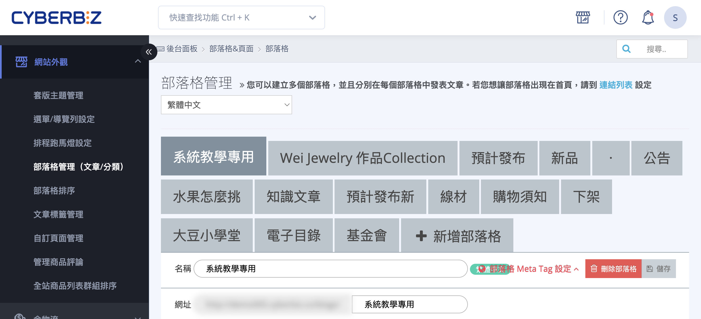{ .hero-page }

## 部落格管理功能說明

**部落格管理** 功能不僅能協助您撰寫品牌文章，更能透過分類主題、文章標籤以及完善的 SEO 設定，建立內容行銷的基礎，提升官網的搜尋曝光率。

## 新增部落格主題 (分類)

部落格主題可視為文章的大分類（例如：品牌新訊、產品開箱）。

*   **後台路徑**：網站外觀 > 部落格管理(文章/分類)。
*   **操作步驟**：點擊「新增部落格」按鈕，輸入主題名稱（如：品牌新訊）並點選「新增」即可。

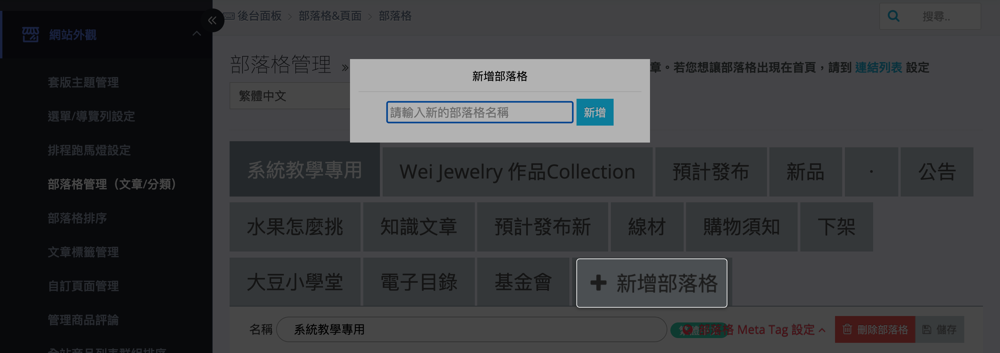
## 撰寫與管理文章

1.  **新增文章**：進入指定主題後，點擊右上方「新增文章」。

    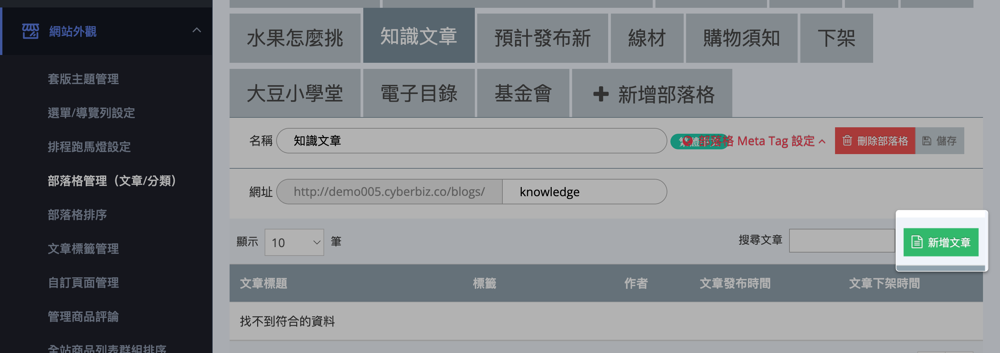

2.  **基本設定**：
    *   **內容編輯**：使用 [**文字編輯器**](使用文字編輯器編輯內容.md){ data-preview }，支援上傳圖片、嵌入影片與表格等影音功能。
    *   **前台顯示欄位**：上傳代表圖片、輸入文章標題並設定標籤。

        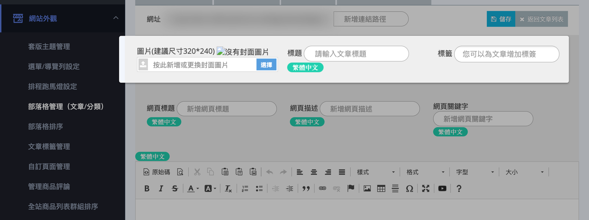

    *   **字數限制**：每篇文章字元上限為 **65,535 字元**（以「原始碼」顯示之字數為準）。
3.  **列表操作**：建立完成的文章會出現在列表中，您可以點選圖示執行「**編輯、置頂、公開/不公開、刪除**」等動作，或點擊「作者」與「文章時間」進行修改。

        - :lucide-pencil:：點擊進入文章編輯頁面進行文章內容編輯設定。
        - :lucide-bookmark:：點擊將文章至頂 (前台顯示為第一篇文張)。
        - :lucide-eye:：公開(前台顯示)/不公開(前台不顯示)文章。
        - :lucide-x:：刪除文章。

        !!! tip "點擊列表中的文章標題可直接前往該文章的前台顯示頁面。"

        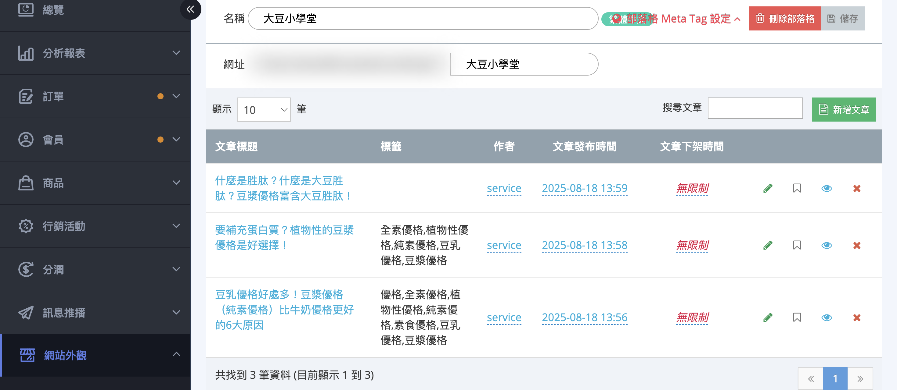

## 文章標籤管理

[:lucide-tag:{ title="適用方案" }](../../../resources/conventions#適用方案) | 企業

透過標籤（Tags）可以讓讀者更快速分類查找相關主題。

*   **後台路徑**：網站外觀 > 文章標籤管理。
*   **操作方式**：您可以新增文章標籤群組，並透過此功能 **個別或批次** 將文章加入特定標籤，或是將文章移出標籤群組。

    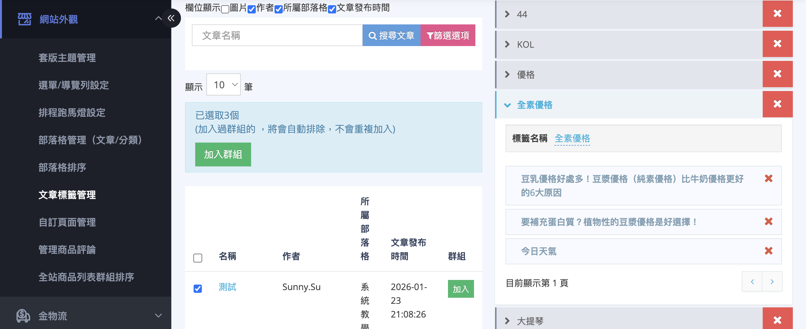

    !!! info "標籤群組詳細操作說明，可參考 [商品自訂分類群組](../products/categorization/設定商品自訂分類群組.md){ data-preview }。"

- **前台呈現位置**：

    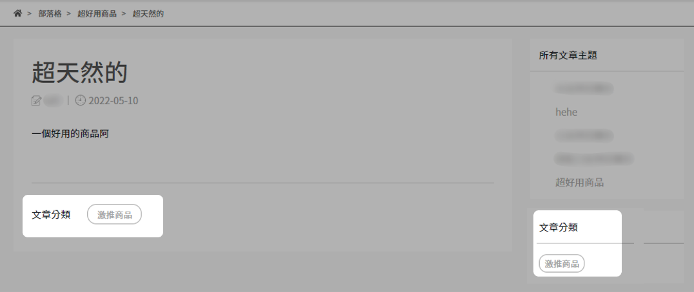

## 前台呈現與頁面設定

### 部落格頁（摘要頁）

部落格頁會呈現多篇文章摘要。

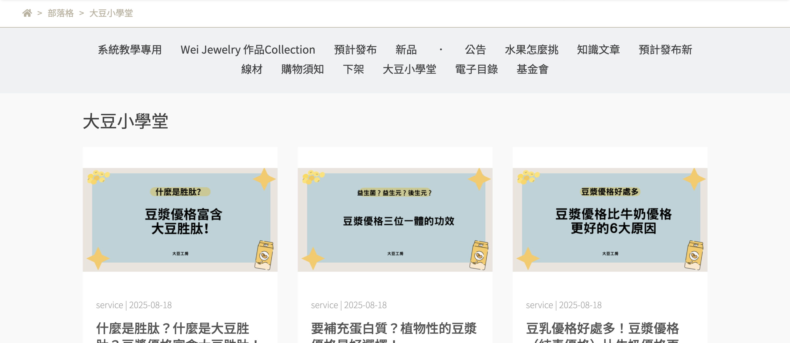

您可以根據所使用的版型（拖拉版型或預設版型）來調整部落格的顯示樣式：

=== ":lucide-layout-dashboard: 拖拉版型"

    - **後台路徑** :「網站外觀」>「套版主題管理」>「網站設定」。 
    - **操作步驟**：選擇 **部落格頁** > 左側選單點擊 **部落格設定**。
    - **顯示設定**：
        - **每頁文章數項**：可自訂每頁要顯示的文章數，讓頁面長度更符合閱讀習慣。
        - **顯示精選文章**：勾選後，會在部落格頁底部顯示特定精選文章，便於曝光熱門或重要內容。
        - **精選文章群組**：選擇想呈現的精選文章來源群組，對應顯示內容。

    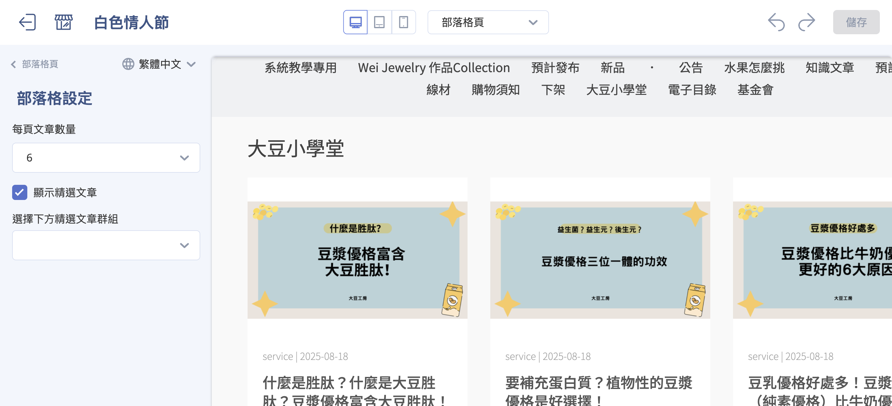  

=== ":lucide-layout-grid: 預設版型"

    - **後台路徑** :「網站外觀」>「套版主題管理」>「網站設定」。 
    - **操作步驟**：點擊展開 **部落格Blog** 設定選項。
    - **顯示設定**：
        - **顯示精選文章**：勾選後，會在部落格頁底部顯示特定精選文章，便於曝光熱門或重要內容。
        - **精選文章群組**：選擇想呈現的精選文章來源群組，對應顯示內容。

    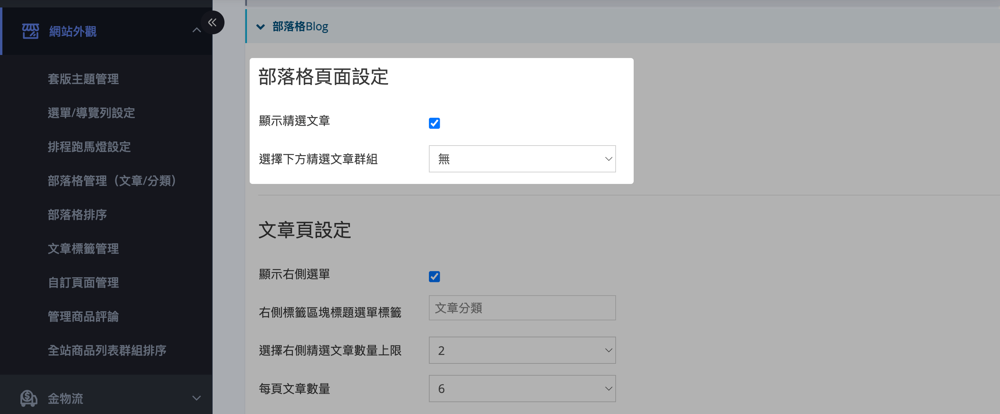

---

### 部落格文章頁（單篇文章）

可設定版面內容資訊，並決定是否要 **顯示右側選單**，打造適合閱讀的版面。

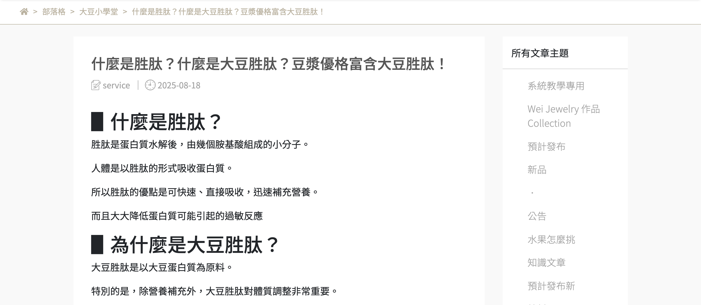

您可以根據所使用的版型（拖拉版型或預設版型）來調整顯示樣式：

=== ":lucide-layout-dashboard: 拖拉版型"

    - **後台路徑** :「網站外觀」>「套版主題管理」>「網站設定」。 
    - **操作步驟**：選擇 **部落格文章頁** > 左側選單點擊 **部落格文章設定**。
    - **顯示設定**：
        - **顯示右側選單**：勾選後，會在文章右側顯示選單區塊，包括 **所有文章(部落格)主題**、**文章標籤區** 和 **最新文章**。
        - **文章標籤區標題**：可以設定文章標籤區塊的顯示標題文字。
        - **精選文章數量上限**：點擊展開選單設定精選文章顯示數量上限。

    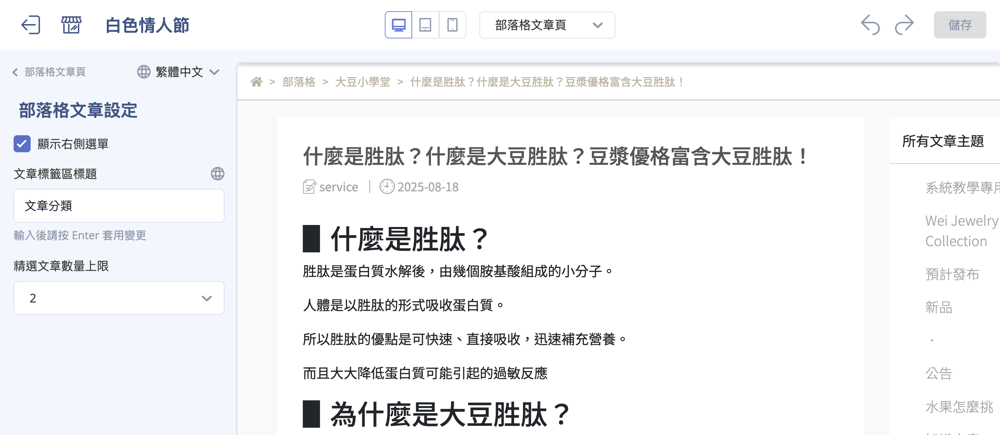  

=== ":lucide-layout-grid: 預設版型"

    - **後台路徑** :「網站外觀」>「套版主題管理」>「網站設定」。 
    - **操作步驟**：點擊展開 **部落格Blog** 設定選項。
    - **顯示設定**：
        - **顯示右側選單**：勾選後，會在文章右側顯示選單區塊，包括 **所有文章(部落格)主題**、**文章標籤區** 和 **最新文章**。
        - **文章標籤區標題**：可以設定文章標籤區塊的顯示標題文字。
        - **精選文章數量上限**：點擊展開選單設定精選文章顯示數量上限。
        - **每頁文章數量**：點擊展開選單設定每頁顯示文章數量。

    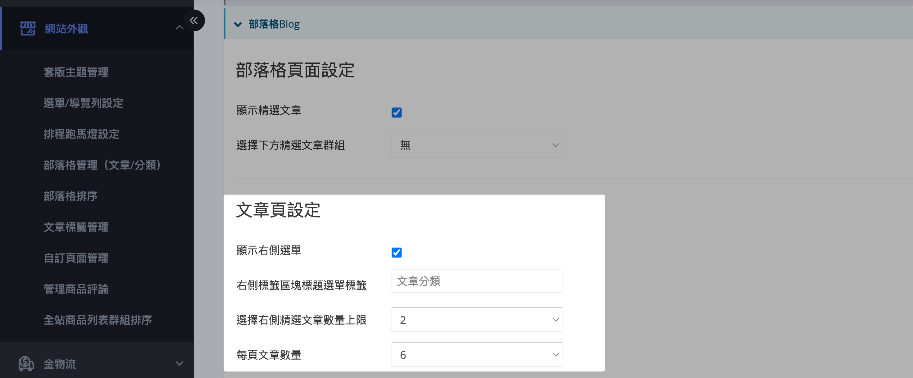

## SEO 與轉貼圖片設定

### Meta Tags

您可以針對「部落格主題」或「單篇文章」分別設定 **網頁標題、描述及關鍵字**，關鍵字之間請以逗號分隔，這有助於提高搜尋引擎曝光度。

- **部落格主題**：登入後台，前往 **網站外觀** > **部落格管理** > 選擇 **部落格主題** > **部落格 Meta Tags 設定**。

    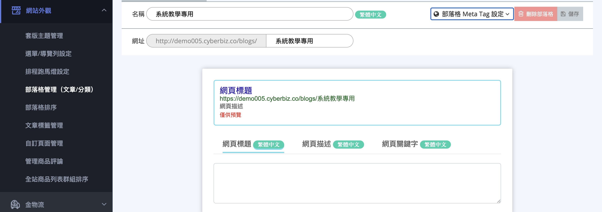

- **單篇文章**：登入後台，前往 **網站外觀** > **部落格管理** > 選擇 **部落格主題** > **新增文章** 或點擊文章列表中的編輯按鈕 :lucide-pencil: 進入編輯頁面。

    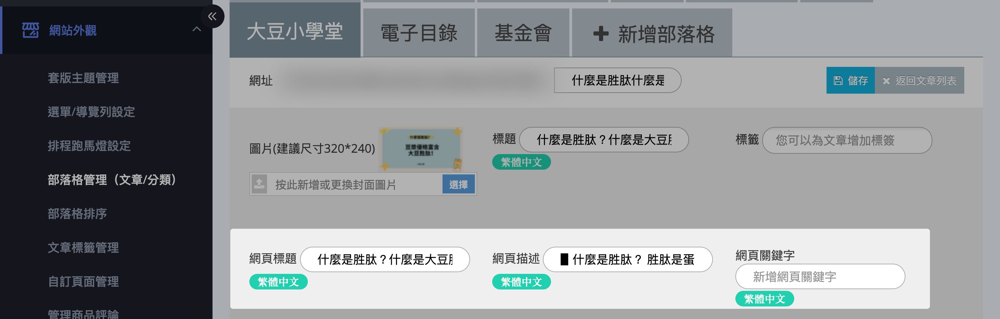

- 「網頁標題」：輸入該部落格頁面在網路搜尋顯示的標題。
- 「網頁描述」：輸入與該部落格相關的描述。  
- 「網頁關鍵字」：輸入與該部落格相關的關鍵字，可增加網站被搜尋到的機會。

### 轉貼連結圖片 (OG Image)

在部落格主題或文章中設定的圖片，會同時影響前台主題封面以及分享連結至 Facebook、LINE 時出現的縮圖，讓分享內容更顯專業。

(設定轉貼連結縮圖 OG Image.md){ data-preview }：

*   **SEO Meta Tag**：您可以針對「部落格主題」或「單篇文章」分別設定 **網頁標題、描述及關鍵字**，關鍵字之間請以逗號分隔，這有助於提高搜尋引擎曝光度。
*   [**轉貼連結圖片 (OG Image)**](設定轉貼連結縮圖 OG Image.md){ data-preview }：在部落格主題或文章中設定的圖片，會同時影響前台主題封面以及分享連結至 Facebook、LINE 時出現的縮圖，讓分享內容更顯專業。

!!! tip "操作小撇步"

    *   **文字編輯器使用建議**：請勿直接複製其他網頁或檔案內容貼上編輯器，建議使用「**純文字貼上**」按鈕（Ctrl+Shift+V）後再行上圖，以免帶入錯誤語法導致版面跑版。
    *   **圖片規格**：單次上傳圖片總量不得超過 **2MB**，寬度超過 1110px 時系統會自動壓縮至 1110px 以確保載入速度。

## 後續操作

- :lucide-import:{ .lg }   
  [____]()     
  。

- :lucide-ban:{ .lg }     
  [____]()  
  。

## 常見問題

??? quote ""

