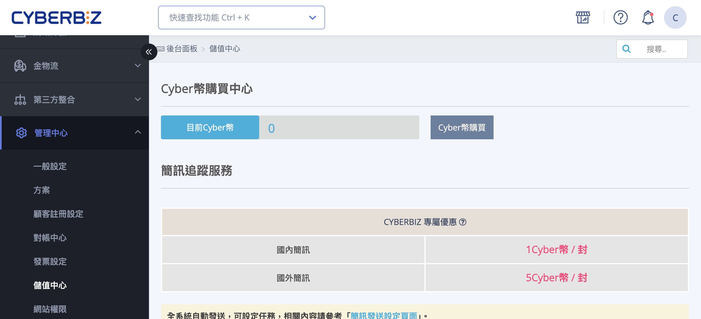
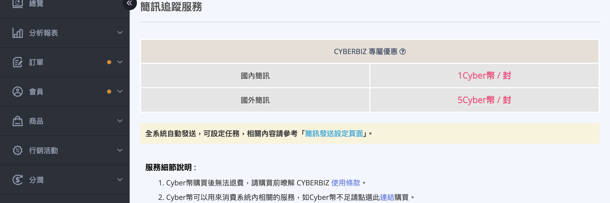
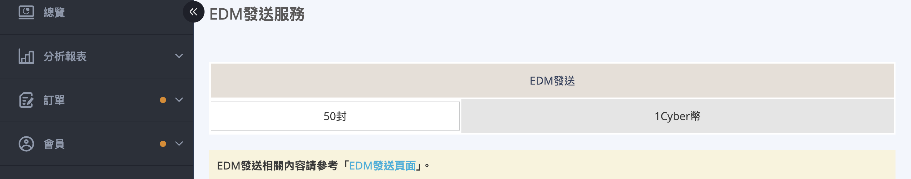
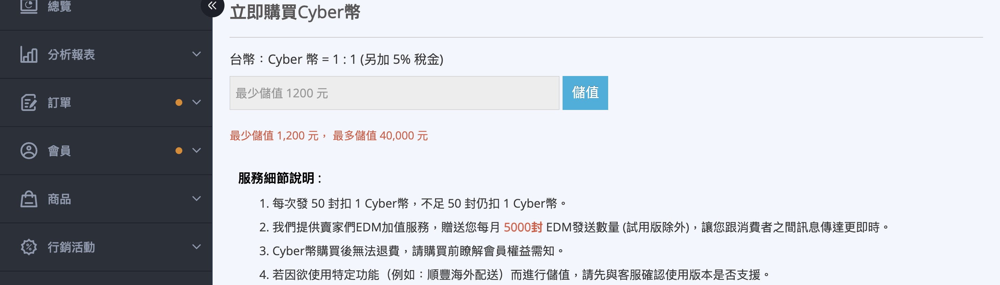
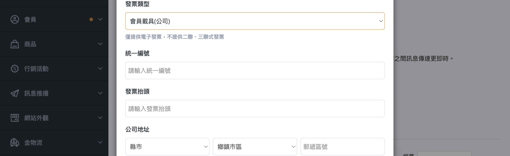
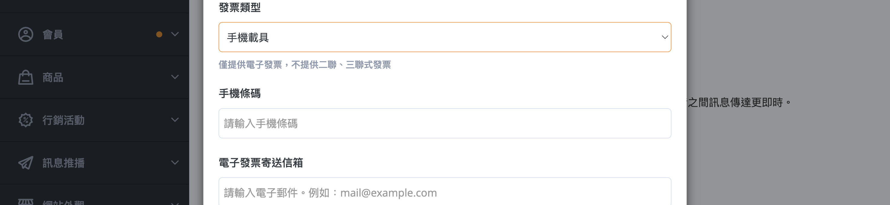
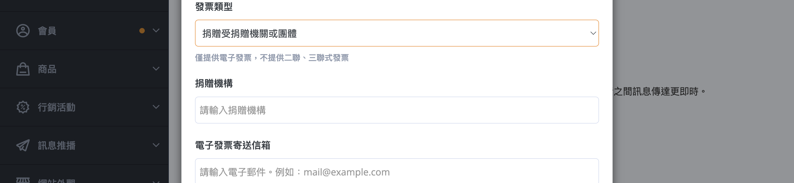
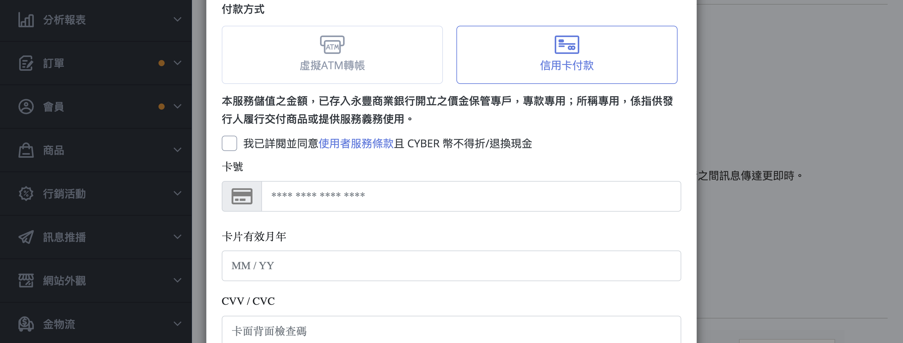
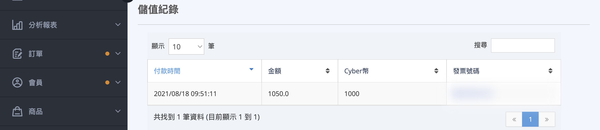
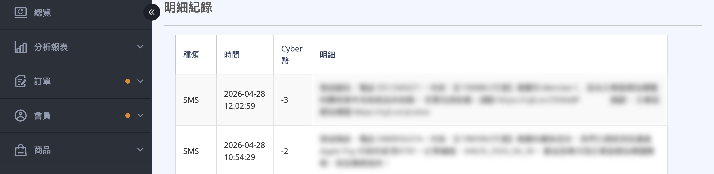

CYBER 幣儲值中心使用指南，包含儲值步驟、發票資訊填寫、付款方式與使用明細查詢。
{ .subtitle }

{ .hero-page }

## 什麼是 CYBER 幣

CYBER 幣是 CYBERBIZ 平台的專屬點數，用於支付平台內各項加值服務，包含：

- 發送簡訊通知（SMS）
- 發送電子報（EDM）
- 其他平台付費功能

**匯率：** 台幣 1 元 = 1 CYBER 幣（另加 5% 稅金）

!!! warning "CYBER 幣購買後 *無法退費*，購買前請確認需求並詳閱 [CYBERBIZ 使用條款](https://www.cyberbiz.io/terms-of-service/)。"

## 頁面功能總覽

!!! path "後台路徑：管理中心 > 儲值中心。"

- :lucide-wallet:
  [__CYBER 幣購買中心__](#查詢-cyber-幣餘額)  
  顯示目前餘額，提供儲值入口

- :lucide-message-square:
  [__簡訊追蹤服務__](#簡訊sms)   
  說明簡訊計費方式

- :lucide-mail:
  [__EDM 發送服務__](#電子報edm)   
  說明電子報計費方式

- :lucide-credit-card:
  [__立即購買 CYBER 幣__](#如何儲值-cyber-幣)   
  輸入儲值金額、選擇付款方式

- :lucide-receipt:
  [__儲值紀錄__](#查詢儲值紀錄)   
  查詢歷次儲值交易明細

- :lucide-file-text:
  [__明細紀錄__](#查詢-cyber-幣使用明細)   
  查詢 CYBER 幣消費使用明細

- :lucide-download:
  [__明細匯出__](#匯出-cyber-幣使用明細)   
  依日期範圍匯出 Excel 報表

## 查詢 CYBER 幣餘額

顯示目前餘額，提供儲值入口

!!! plan "方案差異"
    若您的帳號為 PLUS 版 / 企業版，系統將顯示「無需儲值」提示。相關費用將自動列入對帳單，不需手動操作儲值流程。 

## 服務計費說明

### 簡訊（SMS）

| 類型 | 費用 |
|------|------|
| 國內簡訊 | 1 CYBER 幣 / 則 |
| 國外簡訊 | 5 CYBER 幣 / 則 |

!!! info "每則簡訊最多 70 個中文字（或 160 個英文字元）。自動發送相關設定請參閱「[簡訊樣板設定](../notifications/設定與管理簡訊通知樣板.md){ data-preview }」。"

---

### 電子報（EDM）

| 數量 | 費用 |
|------|------|
| 50 封 | 1 CYBER 幣 |

!!! info "EDM 發送相關設定請參閱「[如何發送 EDM 電子報](../notifications/設定與發送 EDM 電子報.md){ data-preview }」。"

## 如何儲值 CYBER 幣

!!! plan "方案差異"
    若您的帳號為 PLUS 版 / 企業版，系統將顯示「無需儲值」提示。相關費用將自動列入對帳單，不需手動操作儲值流程。 

### 步驟一：輸入儲值金額

1. 登入 CYBERBIZ 後台，前往 **訊息推播 > 儲值中心**，往下捲動至「**立即購買 CYBER 幣**」區塊。
2. 在輸入框填入欲儲值的金額（台幣）。
    - **最低儲值金額：** 1,200 元
    - **最高儲值金額：** 40,000 元
    - 若單次需要購買超過 10,000 點，請聯繫右下角技術客服，將依預算開立報價單。
3. 點擊「**儲值**」按鈕，開啟購買確認視窗。

---

### 步驟二：確認儲值明細

購買視窗中會顯示：

- **儲值金額：** 您輸入的金額
- **稅金：** 儲值金額 × 5%
- **總計：** 儲值金額 + 稅金

---

### 步驟三：填寫發票資訊

請選擇發票類型並填寫對應欄位：

| 發票類型 | 必填欄位 |
|----------|----------|
| 會員載具（個人） | 電子郵件 |
| 會員載具（公司） | 電子郵件、發票抬頭、統一編號、公司地址、郵遞區號 |
| 手機載具 | 電子郵件、手機條碼 |
| 自然人憑證 | 電子郵件、自然人憑證號碼 |
| 捐贈 | 電子郵件、捐贈機構代碼 |

=== "會員載具（個人）"

    

=== "會員載具（公司）"

    

=== "手機載具"

    

=== "自然人憑證"

    

=== "捐贈"

    

!!! info "電子發票將寄送至您填寫的電子郵件信箱。本系統 **僅提供電子發票**，不提供二聯式或三聯式紙本發票。"

---

### 步驟四：選擇付款方式

=== ":lucide-credit-card: 信用卡付款"

    1. 選擇「**信用卡付款**」。
    2. 在信用卡輸入框填寫卡號、有效期限、CVV。
    3. 勾選同意服務條款後，點擊「**確認**」。
    4. 系統將導向 3D 驗證頁面，完成銀行身份驗證。
    5. 驗證成功後，CYBER 幣將 **立即入帳** 至您的帳戶。

    

=== ":material-atm: 虛擬 ATM 轉帳"

    1. 選擇「**虛擬 ATM 轉帳**」。
    2. 勾選同意服務條款後，點擊「**確認**」。
    3. 系統會顯示專屬虛擬帳號頁面，包含：
        - **銀行代碼**
        - **轉帳帳號**（紅字顯示）
        - **轉帳金額**
        - **繳款期限**

    !!! warning "ATM 轉帳注意事項"

        - 請於繳款期限前完成轉帳（預設為下單後 **29 天**）。逾期需重新下單。
        - 請 **單次轉帳全數金額**，請勿分次轉帳。
        - 請勿設定由收款人承擔匯費。
        - 可透過網路銀行、網路 ATM 或實體 ATM 進行轉帳。
        - 轉帳完成後，系統確認款項後 CYBER 幣將自動入帳。

## 查詢儲值紀錄

頁面下方「**儲值紀錄**」表格顯示所有歷次儲值交易：

| 欄位 | 說明 |
|------|------|
| 付款時間 | 交易完成的日期與時間 |
| 金額 | 實際付款金額（含稅） |
| CYBER 幣 | 本次儲值取得的點數 |
| 發票號碼 | 電子發票號碼（點擊可開啟發票連結） |

!!! note "搜尋"
   
    表格右上角搜尋框支援對 **當前頁** 所有欄位做 **部分比對**（不分大小寫）。例如輸入 `AB12` 可比對到發票號碼含此字串的列。                   
    *搜尋僅作用於已載入的當前頁資料，不支援跨頁搜尋。*

## 查詢 CYBER 幣使用明細

頁面下方「**明細紀錄**」表格顯示 CYBER 幣的消費記錄：

| 欄位 | 說明 |
|------|------|
| 種類 | 使用服務的類型（如：簡訊、EDM） |
| 時間 | 消費發生的時間 |
| CYBER 幣 | 本次消費的點數數量 |
| 明細 | 消費項目的詳細說明 |

可使用下方分頁按鈕瀏覽更多紀錄。

## 匯出 CYBER 幣使用明細

如需下載報表進行對帳或分析，可使用「**明細匯出**」功能：

1. 選擇日期區間（可點選快捷按鈕：最近 7 天 / 最近 30 天 / 本月 / 上個月）或手動選擇起訖日期。
2. 點擊「**匯出**」按鈕。
3. 系統將排程處理，**完成後會寄送 Excel（.xlsx）檔案至當前登入帳號的電子信箱**。

!!! info "同一時間僅能有一筆匯出排程進行中。若顯示「已有匯出排程進行中」，請等待前一筆完成後再操作。"

## 後續操作

- :lucide-message-square-text:{ .lg }   
  [__設定簡訊通知樣板__](../notifications/設定與管理簡訊通知樣板.md){ data-preview }       
  設定自動發送的簡訊內容與樣板，並了解簡訊計費方式。

- :lucide-mail:{ .lg }   
  [__EDM 發送設定__](../notifications/設定與發送 EDM 電子報.md){ data-preview }       
  設定電子報發送內容，並查看 EDM 計費方式。

## 常見問題

??? quote "儲值後 CYBER 幣多久會入帳？"

    信用卡付款驗證完成後 **立即入帳**；ATM 轉帳於系統確認款項後入帳（通常為轉帳後數小時內）。

??? quote "我是試用方案，可以儲值嗎？"

    試用方案 **無法使用儲值功能**，請先升級至正式方案。

??? quote "CYBER 幣可以退費嗎？"

    CYBER 幣購買後 **不提供退費**，購買前請確認需求。

??? quote "發票可以更改嗎？"

    發票資訊在確認付款後即無法更改，請在購買前確認填寫正確。

??? quote "需要單次儲值超過 40,000 元怎麼辦？"

    請聯繫後台右下角技術客服，客服將依照您的預算開立專屬報價單。

??? quote "PLUS 版 / 企業版為什麼顯示「無需儲值」？"

    若您的帳號為 PLUS 版或企業版，相關費用將自動列入對帳單，不需手動操作儲值流程。系統會在「CYBER 幣購買中心」區塊顯示「無需儲值」提示。

??? quote "簡訊內容超過 70 個字會如何計費？"

    簡訊計費以 70 個字為單位。若內容超過 70 字（含空白與網址），系統將自動拆分為多封發送，並按封數累計扣費（國內簡訊每封扣除 1 點 CYBER 幣）。

??? quote "匯出時顯示「已有匯出排程進行中」怎麼辦？"

    同一時間僅能有一筆匯出排程進行中。請等待前一筆匯出完成後再操作，系統完成後會寄送 Excel 檔案至您的電子信箱。

