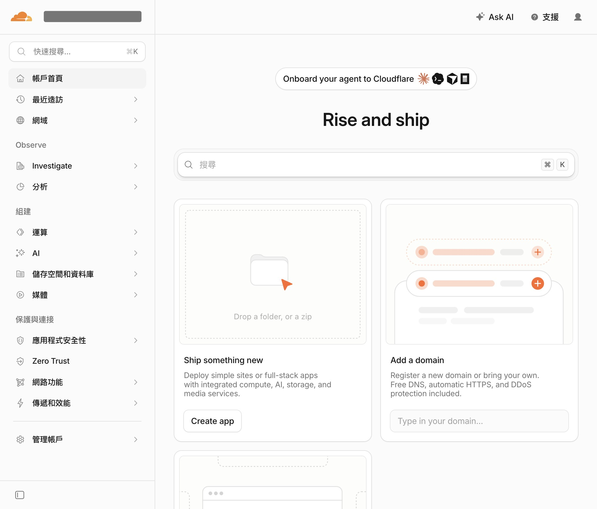
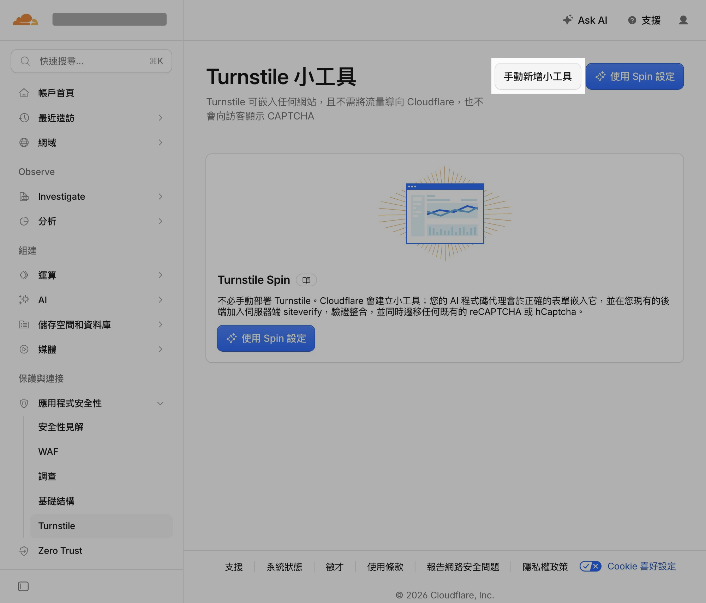
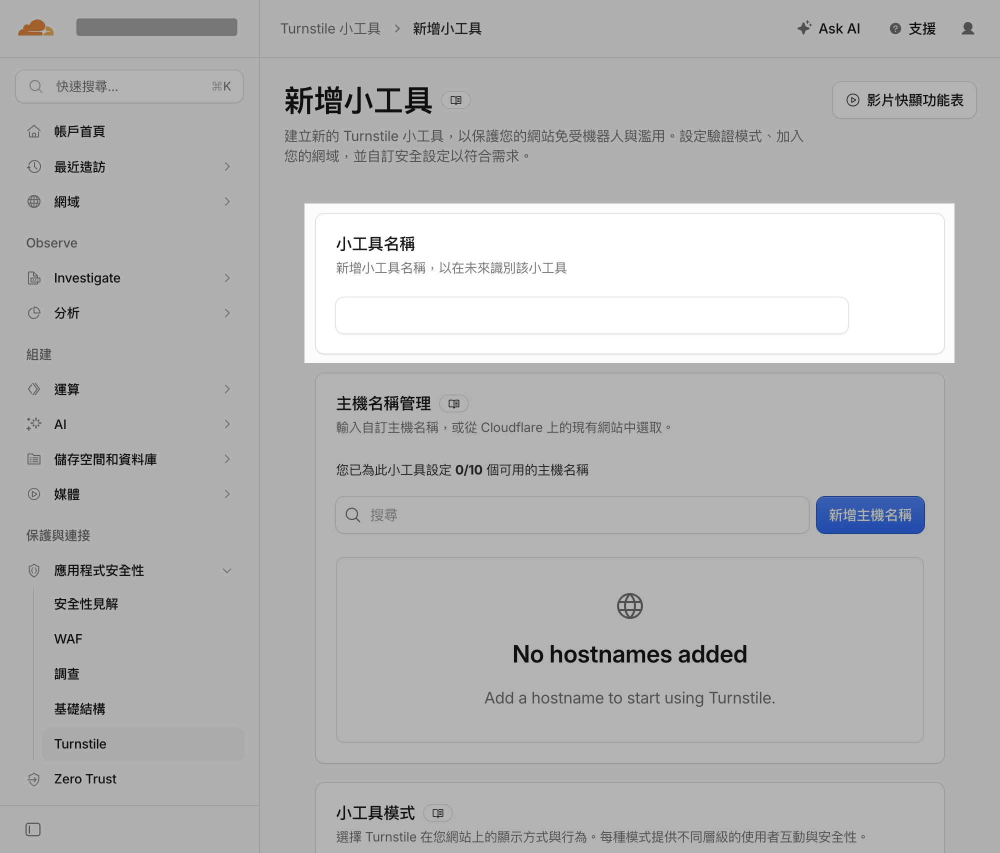
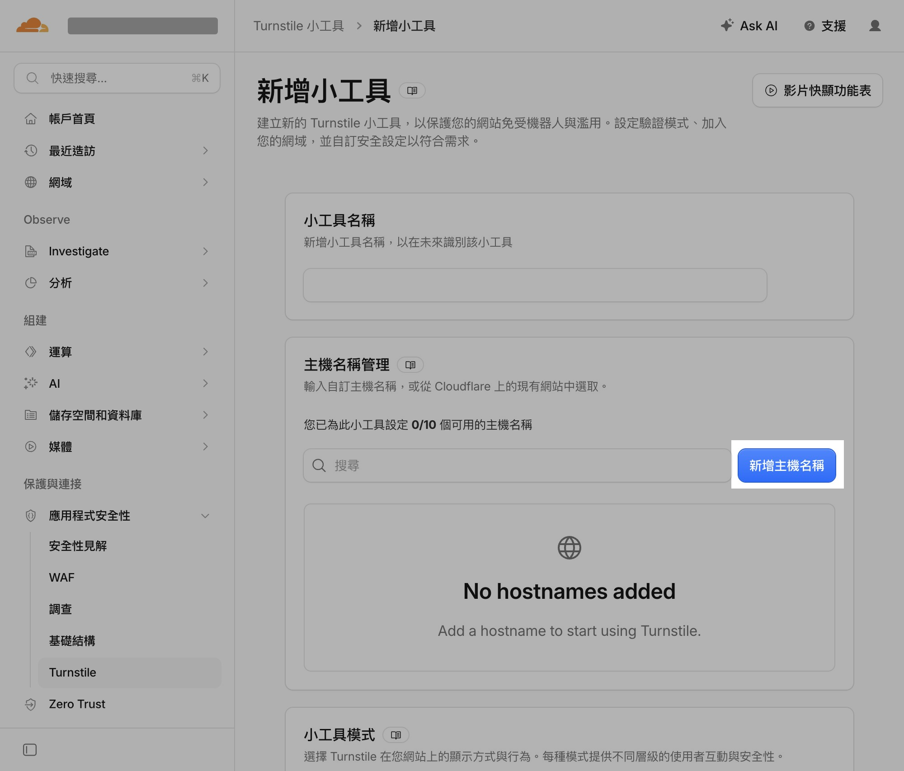
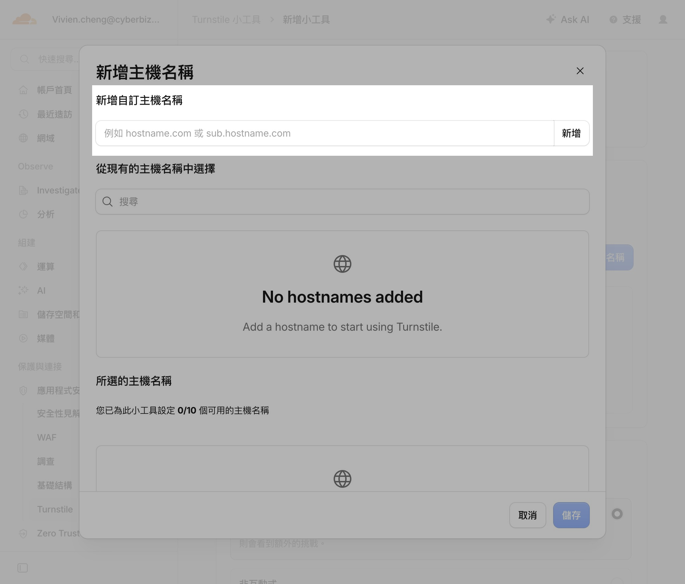
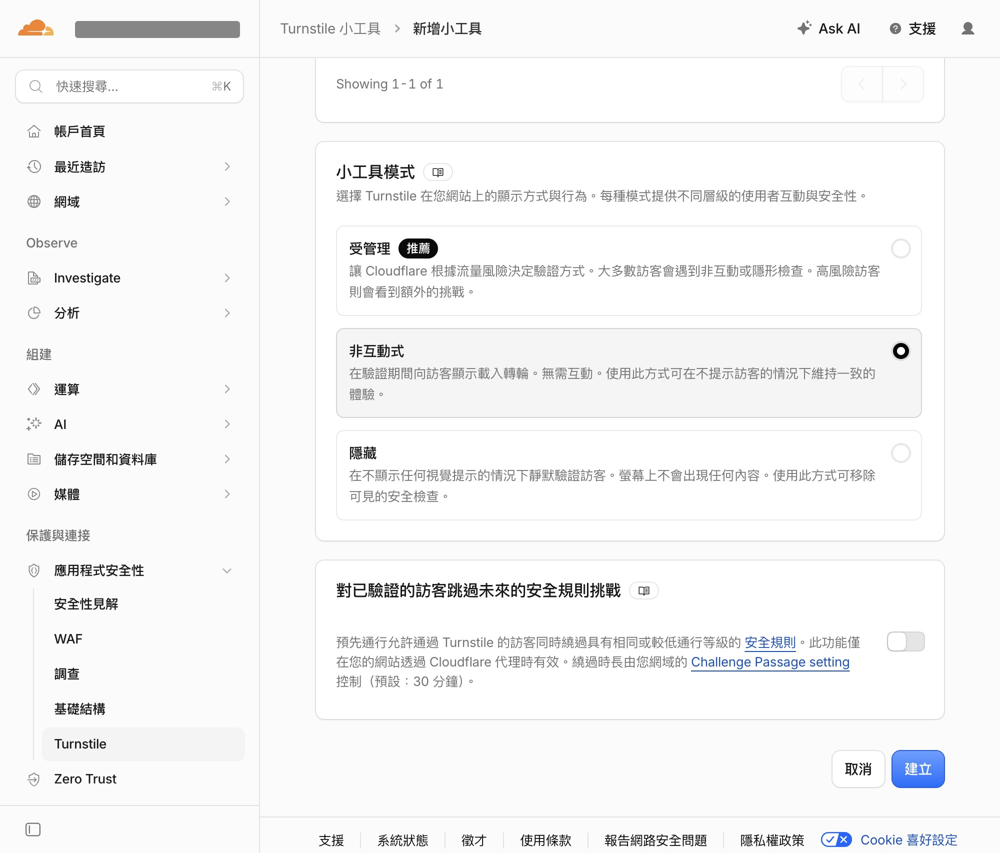
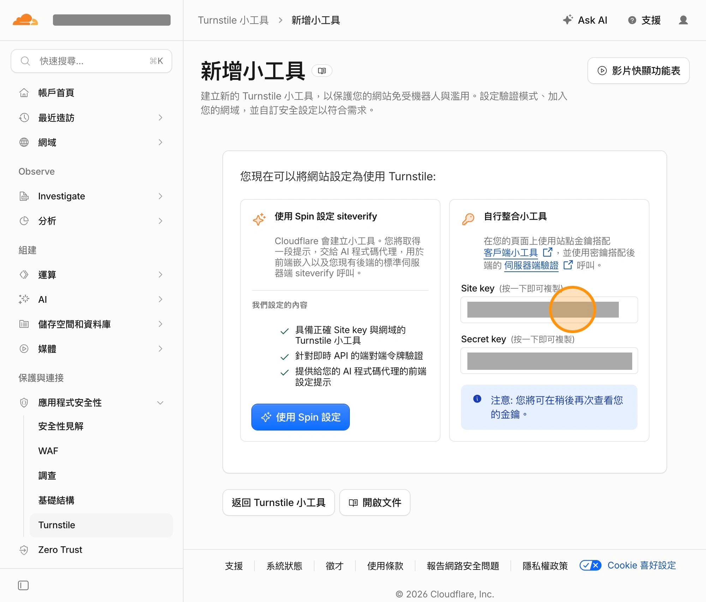
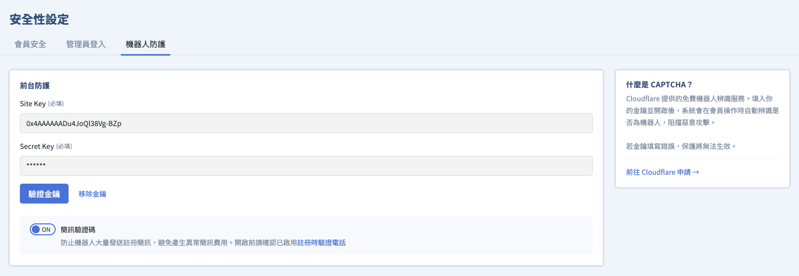
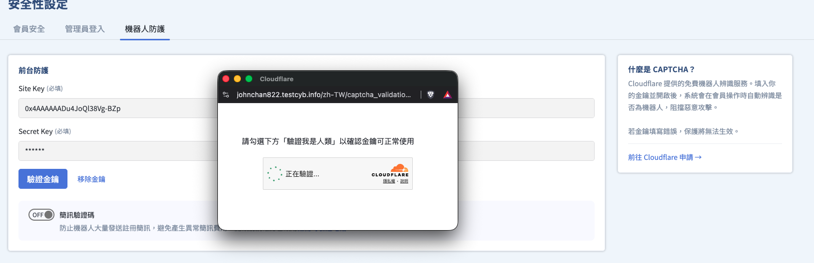
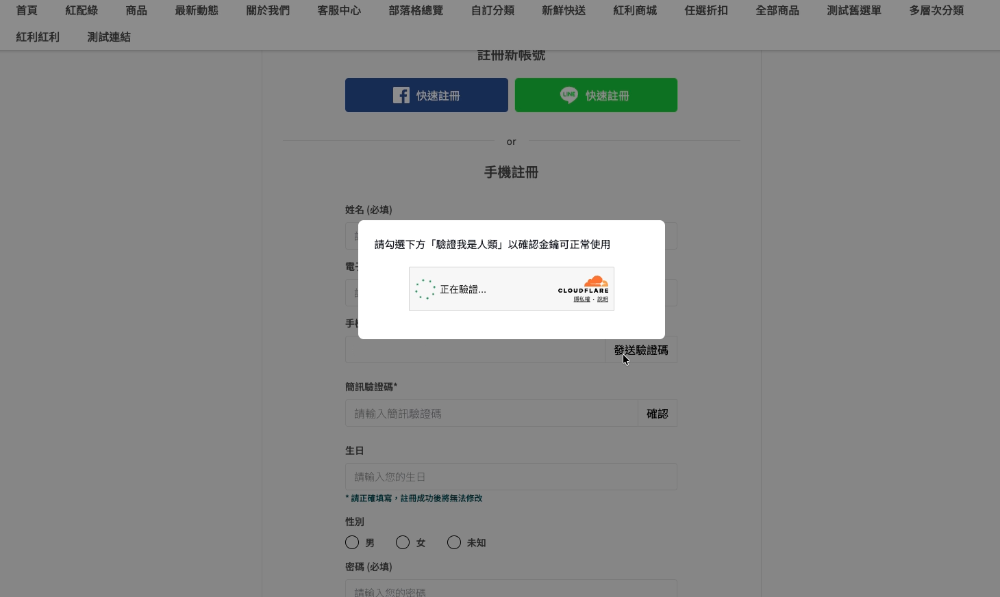

# 設定機器人防護與簡訊驗證

啟用 Cloudflare Turnstile 技術防止惡意程式大量發送簡訊，並針對後台登入提供機器人驗證，降低營運成本損失並提升網站安全性。
{ .subtitle }

[:lucide-tag:{ title="適用方案" }](../../resources/conventions#適用方案) | 全方案
{ .doc-badge }

## 安全性設定說明 { #intro-security }

「安全性設定」是 CYBERBIZ 後台的資安控制中心，協助你降低帳號被盜用、顧客個資外洩與惡意造訪的風險。頁面位於後台「管理中心」>「安全性設定」，並分為三個主要防護領域：

- **[會員安全](member-protection-settings/)**：負責保護網站與顧客資料。
- **[管理員登入](admin-security-settings/)**：負責保護你與員工登入後台的安全。
- **機器人防護**：負責過濾惡意訪客，在簡訊發送前建立第一道防線。

## 使用前提與限制 { #prerequisites-security }

開始設定前，請先確認下列條件：

- [x] **「設置」權限**：本分頁區塊需要您的帳號在 **網站權限** 中具備 **設置** 權限，才能檢視與編輯。您可[修改管理員權限](add-admin-set-permissions/#管理者權限設定與修改)。

## 會員註冊簡訊驗證 { #operate-security-sms-bot-protection }

在會員註冊 **發送驗證碼** 前加入 Cloudflare Turnstile 機器人驗證，降低惡意腳本大量觸發簡訊（尤其是海外簡訊）所造成的費用損失。

### 步驟 1：取得驗證金鑰

1. **前往 Cloudflare 後台**：[註冊或登入 Cloudflare 帳號](https://dash.cloudflare.com/login)，於 Cloudflare 後台搜尋 **Turnstile**。

    { .screenshot }

2. **建立 Turnstile 工具**：點擊 **手動新增小工具**。

    { .screenshot }

    - **小工具名稱**：輸入可以識別這組小工具的名稱。

        { .screenshot }

    - **主題名稱管理**：點擊 **新增主機名稱**，將您的商店站台 **所有網域** 加入。

        { .screenshot }

        在 **新增自訂主機名稱** 欄位，輸入您的您的商店站台網域；例如：`www.xxx.com`、`xxx.cyberbiz.co`。

        { .screenshot }

    - **小工具模式**：依需求選擇即可。

        { .screenshot }

3. **取得驗證金鑰**：點擊 **建立**，取得 **Site key** 與 **Secret key**。

    { .screenshot }

### 步驟 2：後台綁定金鑰

1. **進入設定頁：** 前往 **管理中心 > 安全性設定 > 機器人防護**。
2. **填入金鑰：** 分別輸入 **Site key** 與 **Secret key**。

    

3. **測試金鑰：** 點擊 **驗證金鑰**，確認顯示 `驗證成功`；若顯示 `驗證失敗：無效金鑰`，請重新核對後再儲存。

    

4. **啟用防護：** 開啟 **簡訊驗證碼** 開關後儲存。
    

啟用後，顧客於註冊頁點擊 **發送驗證碼** 時，會先出現機器人驗證小彈窗；驗證成功後彈窗自動關閉，系統才會發送簡訊驗證碼。

!!! note "清除金鑰"
    若清除已儲存的金鑰，**啟用驗證** 開關會同步關閉，前台將不再顯示機器人驗證。