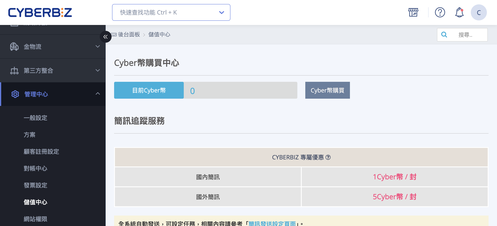
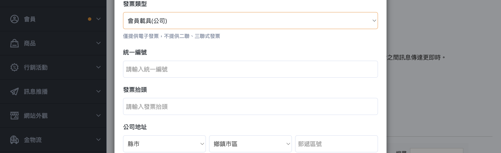
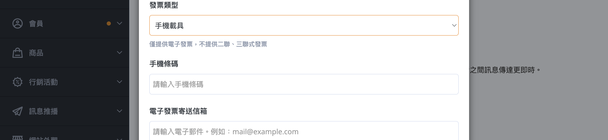
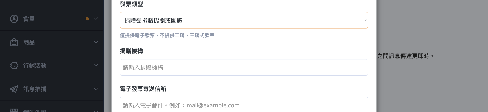
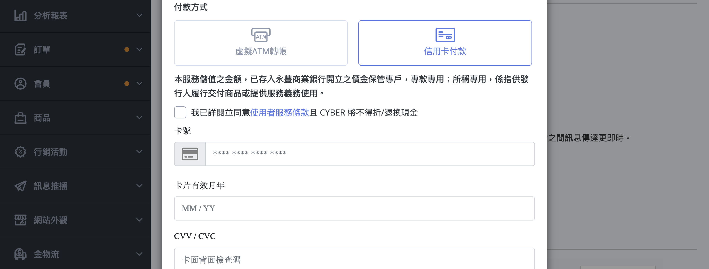
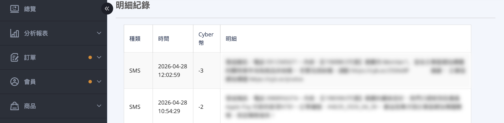
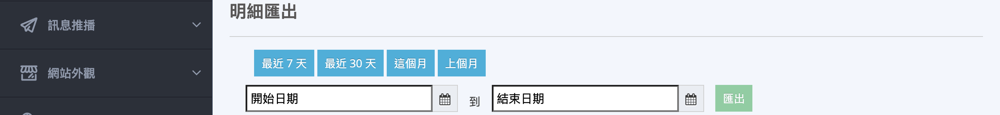

{ .hero-page }

## Cyber幣說明

Cyber幣是 CYBERBIZ 平台的專屬點數，用於支付平台內各項服務，包含：

- 發送簡訊通知（SMS）
- 發送電子報（EDM）
- 其他平台付費功能

!!! warning "Cyber 幣購買後 *無法退費*，購買前請確認需求並詳閱 [CYBERBIZ 使用條款](https://www.cyberbiz.io/terms-of-service/)。"

## 頁面功能總覽

!!! path "後台路徑：管理中心 > 儲值中心。"

- :lucide-wallet:
  [__Cyber 幣購買中心__](#cyber-coin-balance)  

- :lucide-message-square:
  [__簡訊追蹤服務__](#sms)   

- :lucide-mail:
  [__EDM 發送服務__](#edm)   

- :lucide-credit-card:
  [__立即購買 Cyber 幣__](#operate-cyber-coin-deposit)  

- :lucide-receipt:
  [__儲值紀錄__](#cyber-coin-deposit-history)   

- :lucide-file-text:
  [__明細紀錄__](#cyber-coin-transaction-history)   

- :lucide-download:
  [__明細匯出__](#cyber-coin-transactions-export)   

## 查詢 Cyber 幣餘額 { #cyber-coin-balance }

顯示目前餘額，提供儲值入口

??? plan "方案差異"
    若您的帳號為 PLUS版  / 企業版，系統將顯示「無需儲值」提示。相關費用將自動列入對帳單，不需手動操作儲值流程。 

## 服務計費說明

### 簡訊 <small>SMS</small> { #sms }

簡訊依發送對象分為國內簡訊與國外簡訊，分別以不同的 Cyber 幣計費。

!!! info "簡訊發送相關設定請參閱「[如何管理簡訊樣板](../notifications/manage-sms-templates-v2.md){ title="簡訊樣板管理" }」。"

---

### 電子報 <small>EDM</small> { #edm }

!!! info "EDM 發送相關設定請參閱「[如何發送 EDM 電子報](../notifications/send-edm-newsletters-v2.md){ title="設定與發送 EDM 電子報" }」。"

## 如何儲值 Cyber 幣 { #operate-cyber-coin-deposit }

!!! plan "方案差異"
    若您的帳號為 PLUS版  / 企業版，系統將顯示「無需儲值」提示。相關費用將自動列入對帳單，不需手動操作儲值流程。 

### 步驟一：輸入儲值金額

1. 登入 CYBERBIZ 後台，前往 **訊息推播 > 儲值中心**，往下捲動至「**立即購買 Cyber 幣**」區塊。
2. 在輸入框填入欲儲值的金額（台幣）。
    - **最低儲值金額：** 1,200 元
    - **最高儲值金額：** 40,000 元
    - 若單次需要購買超過 10,000 點，請聯繫右下角技術客服，將依預算開立報價單。
3. 點擊「**儲值**」按鈕，開啟購買確認視窗。

---

### 步驟二：確認儲值明細

購買視窗中會顯示：

- **儲值金額：** 您輸入的金額
- **稅金：** 
- **總計：** 儲值金額 + 稅金

---

### 步驟三：填寫發票資訊

請選擇發票類型並填寫對應欄位：

=== "會員載具（個人）"

    

=== "會員載具（公司）"

    

=== "手機載具"

    

=== "自然人憑證"

    

=== "捐贈"

    

??? info "必填欄位說明"

    | 發票類型 | 必填欄位 |
    |----------|----------|
    | 會員載具（個人） | 電子郵件 |
    | 會員載具（公司） | 電子郵件、發票抬頭、統一編號、公司地址、郵遞區號 |
    | 手機載具 | 電子郵件、手機條碼 |
    | 自然人憑證 | 電子郵件、自然人憑證號碼 |
    | 捐贈 | 電子郵件、捐贈機構代碼 |

!!! note "電子發票將寄送至您填寫的電子郵件信箱。本系統 **僅提供電子發票**，不提供二聯式或三聯式紙本發票。"

---

### 步驟四：選擇付款方式

=== ":lucide-credit-card: 信用卡付款"

    1. 選擇「**信用卡付款**」。
    2. 在信用卡輸入框填寫卡號、有效期限、CVV。
    3. 勾選同意服務條款後，點擊「**確認**」。
    4. 系統將導向 3D 驗證頁面，完成銀行身份驗證。
    5. 驗證成功後，Cyber 幣將 **立即入帳** 至您的帳戶。

    

=== ":material-atm: 虛擬 ATM 轉帳"

    1. 選擇「**虛擬 ATM 轉帳**」。
    2. 勾選同意服務條款後，點擊「**確認**」。
    3. 系統會顯示專屬虛擬帳號頁面，包含：
        - **銀行代碼**
        - **轉帳帳號**（紅字顯示）
        - **轉帳金額**
        - **繳款期限**

    !!! warning "ATM 轉帳注意事項"

        - 請於繳款期限前完成轉帳（預設為下單後 **29 天**）。逾期需重新下單。
        - 請 **單次轉帳全數金額**，請勿分次轉帳。
        - 請勿設定由收款人承擔匯費。
        - 可透過網路銀行、網路 ATM 或實體 ATM 進行轉帳。
        - 轉帳完成後，系統確認款項後 Cyber 幣將自動入帳。

## 查詢儲值紀錄 { #cyber-coin-deposit-history }

頁面下方「**儲值紀錄**」表格顯示所有歷次儲值交易：

| 欄位 | 說明 |
|------|------|
| 付款時間 | 交易完成的日期與時間 |
| 金額 | 實際付款金額（含稅） |
| Cyber 幣 | 本次儲值取得的點數 |
| 發票號碼 | 電子發票號碼（點擊可開啟發票連結） |

!!! note "搜尋"
   
    表格右上角搜尋框支援對 **當前頁** 所有欄位做 **部分比對**（不分大小寫）。例如輸入 `AB12` 可比對到發票號碼含此字串的列。                   
    *搜尋僅作用於已載入的當前頁資料，不支援跨頁搜尋。*

## 查詢 Cyber 幣使用明細 { #cyber-coin-transaction-history }

頁面下方「**明細紀錄**」表格顯示 Cyber 幣的消費記錄：

| 欄位 | 說明 |
|------|------|
| 種類 | 使用服務的類型（如：簡訊、EDM） |
| 時間 | 消費發生的時間 |
| Cyber 幣 | 本次消費的點數數量 |
| 明細 | 消費項目的詳細說明 |

可使用下方分頁按鈕瀏覽更多紀錄。

## 匯出 Cyber 幣使用明細 { #cyber-coin-transactions-export }

如需下載報表進行對帳或分析，可使用「**明細匯出**」功能：

1. 選擇日期區間（可點選快捷按鈕：最近 7 天 / 最近 30 天 / 本月 / 上個月）或手動選擇起訖日期。
2. 點擊「**匯出**」按鈕。
3. 系統將排程處理，**完成後會寄送 Excel（.xlsx）檔案至當前登入帳號的電子信箱**。

!!! info "同一時間僅能有一筆匯出排程進行中。若顯示「已有匯出排程進行中」，請等待前一筆完成後再操作。"

## 後續操作

- :lucide-message-square-text:{ .lg }   
  [__簡訊樣板設定__](../notifications/manage-sms-templates-v2.md){ title="簡訊樣板設定" }   
   設定自動發送的簡訊內容與樣板。

- :lucide-mail:{ .lg }   
  [__EDM 電子報設定__](../notifications/send-edm-newsletters-v2.md){ title="EDM 電子報設定" }   
  設定電子報發送內容，並查看 EDM 計費方式。

## 常見問題

??? quote "儲值後 Cyber 幣多久會入帳？"

    信用卡付款驗證完成後 **立即入帳**；ATM 轉帳於系統確認款項後入帳（通常為轉帳後數小時內）。

??? quote "Cyber 幣可以退費嗎？"

    Cyber 幣購買後 **不提供退費**，購買前請確認需求。

??? quote "發票可以更改嗎？"

    發票資訊在確認付款後即無法更改，請在購買前確認填寫正確。

??? quote "PLUS版  / 企業版為什麼顯示「無需儲值」？"

    若您的帳號為 PLUS版 或企業版，相關費用將自動列入對帳單，不需手動操作儲值流程。系統會在「Cyber 幣購買中心」區塊顯示「無需儲值」提示。

??? quote "匯出時顯示「已有匯出排程進行中」怎麼辦？"

    同一時間僅能有一筆匯出排程進行中。請等待前一筆匯出完成後再操作，系統完成後會寄送 Excel 檔案至您的電子信箱。

