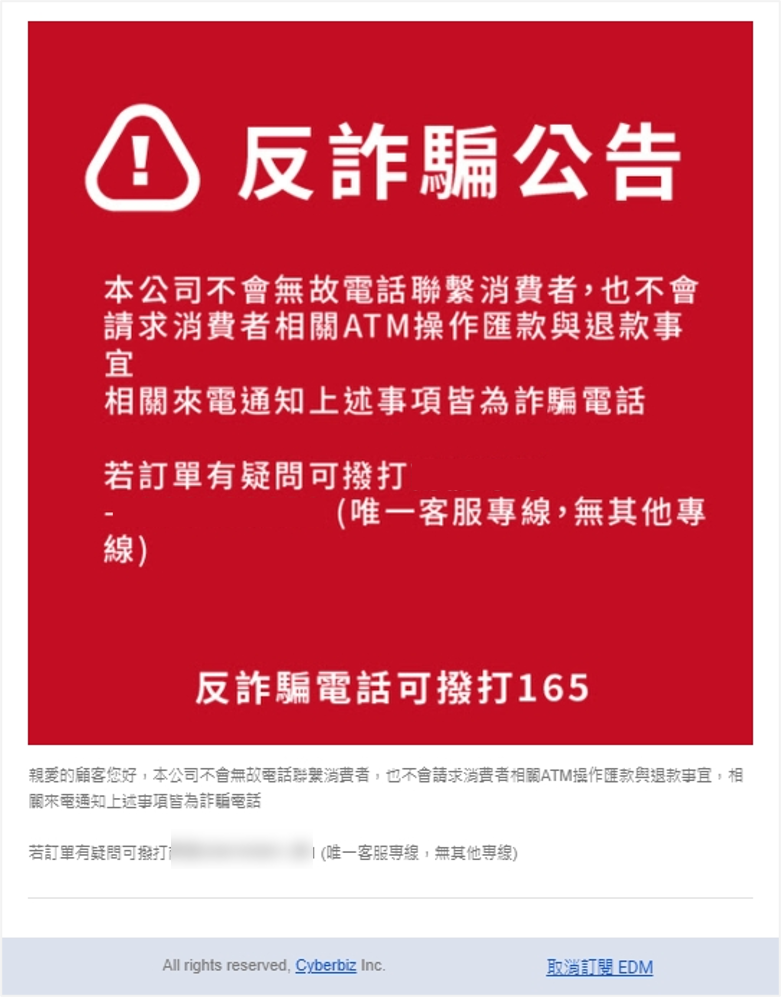
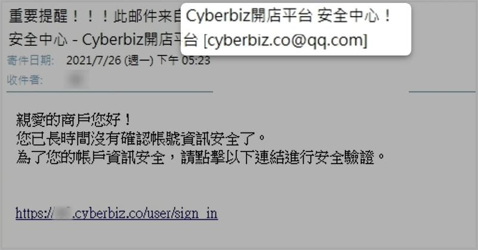
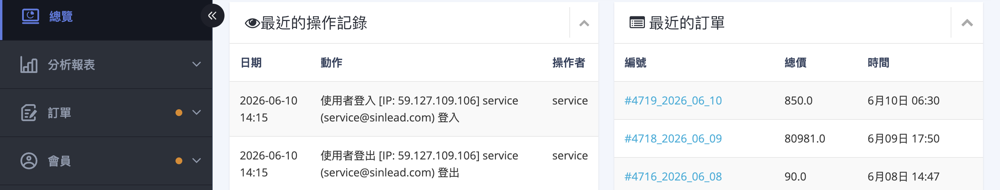

## 資安防護說明 { #intro-security-guide }

資訊安全需要商家一起配合執行各項設定，才能有效降低風險。本頁屬「總覽與最佳實務」，協助你一次掌握該做哪些防護。各功能的詳細操作步驟，請點對應連結前往教學。多數功能集中在後台「管理中心」>「安全性設定」，部分則位於「網站權限」、付款或網域相關設定。

!!! tip "建議優先順序"
    若你剛開始盤點資安，建議先完成三件事：開啟 **二階段驗證**、設定 **IP 白名單**、開啟 **後台登入 reCAPTCHA**，這三項對防止帳號被盜用最有效。

## 資安防護總覽 { #overview-security-guide }

| 防護措施 | 用途 | 設定位置 |
| :-- | :-- | :-- |
| [二階段驗證（2FA）](security-settings.md#operate-security-2fa) | 登入時加上動態驗證碼，防止帳號被盜用 | 管理中心/安全性設定 > 管理員登入 |
| [IP 白名單](security-settings.md#operate-security-ip-whitelist) | 只允許名單內 IP 登入後台 | 管理中心/安全性設定 > 管理員登入 |
| [後台登入 reCAPTCHA](security-settings.md#operate-security-recaptcha) | 後台登入加上機器人驗證 | 管理中心/安全性設定 > 管理員登入 |
| [瀏覽器 Cookie 驗證 IP 白名單](security-settings.md#operate-security-cookie-whitelist) | 避免同瀏覽器 IP 跳動被強制登出 | 管理中心/安全性設定 > 管理員登入 |
| [自動登出時間](security-settings.md#operate-security-logout-timer) | 後台閒置自動登出 | 管理中心/安全性設定 > 管理員登入 |
| [會員個資部分隱碼](security-settings.md#operate-security-pdpa) | 遮蔽顧客姓名、手機、地址等個資 | 管理中心/安全性設定 > 會員安全 |
| [訪問限制地區黑名單](security-settings.md#operate-security-restricted-locations) | 封鎖特定地區顧客造訪前台 | 管理中心/安全性設定 > 會員安全 |
| [網站密碼](security-settings.md#operate-security-website-password) | 顧客需輸入密碼才能瀏覽網站 | 管理中心/安全性設定 > 會員安全 |
| [匯出權限控管](新增網站管理員並設定權限.md#管理者權限設定與修改) | 將顧客匯出、訂單匯出權限縮到最小 | 管理中心/網站權限 > 帳戶權限設定 |
| [信用卡 3D 驗證](../payments-and-logistics/設定信用卡-3D-驗證門檻.md) | 消費者需簡訊驗證，降低盜刷 | 付款設定（加值） |
| SSL 安全性憑證 | 加密網站與顧客間的資料傳輸 | 隨方案提供或於網域設定 |

## 核心登入防護 { #operate-security-guide-core }

這三項是防止帳號被盜用與惡意攻擊最有效的防線，建議優先全部開啟。

-   :lucide-shield-check:{ .lg .middle } __二階段驗證（2FA）__

    ---

    輸入帳密後，還需手機驗證器產生的動態驗證碼才能登入。即使密碼外洩，駭客也無法突破第二層驗證。

    [:lucide-arrow-right: 設定步驟](security-settings.md#operate-security-2fa)

-   :lucide-network:{ .lg .middle } __IP 白名單__

    ---

    限制只有名單內的 IP 位址才能登入後台。請勿使用手機 WiFi 分享等浮動 IP，否則可能導致無法登入。

    [:lucide-arrow-right: 設定步驟](security-settings.md#operate-security-ip-whitelist)

-   :lucide-bot:{ .lg .middle } __後台登入 reCAPTCHA__

    ---

    在後台登入頁加上機器人驗證，減少自動化腳本攻擊。

    [:lucide-arrow-right: 設定步驟](security-settings.md#operate-security-recaptcha)

---

## 進階存取控管 { #operate-security-guide-access-control }

當核心防護完成後，可再依需求加強登入與存取控管。

-   :lucide-cookie:{ .lg .middle } __瀏覽器 Cookie 驗證 IP 白名單__

    ---

    當同一瀏覽器操作時 IP 變動，系統會要求重新登入，防止他人盜取 Cookie 偽裝身分；若你的網路 IP 頻繁跳動造成困擾，可把可信任 IP 加入此名單。

    [:lucide-arrow-right: 設定步驟](security-settings.md#operate-security-cookie-whitelist)

-   :lucide-clock:{ .lg .middle } __自動登出時間__

    ---

    設定後台閒置多久自動登出（可選 4 小時至 7 天），降低電腦遭他人誤用的風險。

    [:lucide-arrow-right: 設定步驟](security-settings.md#operate-security-logout-timer)

-   :lucide-globe-off:{ .lg .middle } __境外 IP 登入限制__

    ---

    若你有跨境經營或海外登入需求，可評估限制境外登入。此項涉及帳號授權，建議直接聯繫 CYBERBIZ 客服確認開通方式。

---

## 資料安全與權限管理 { #operate-security-guide-data }

保護顧客個資、收斂高風險權限，並養成稽核習慣。

-   :lucide-download:{ .lg .middle } __匯出權限最小化__

    ---

    建議將「顧客匯出」與「訂單匯出」權限縮到最小，僅開放給必要人員。

    [:lucide-arrow-right: 設定步驟](新增網站管理員並設定權限.md#管理者權限設定與修改)

-   :lucide-eye-off:{ .lg .middle } __會員個資部分隱碼__

    ---

    在網站前台、後台或訂單明細列印時，將會員姓名、手機、地址等以隱碼遮蔽。

    [:lucide-arrow-right: 設定步驟](security-settings.md#operate-security-pdpa)

-   :lucide-search:{ .lg .middle } __定期稽核登入者__

    ---

    定期檢查「網站權限」中的管理員名單，並留意是否有異常操作或不明 IP 登入。

---

## 交易與網域安全 { #operate-security-guide-transaction }

保護交易過程與網站傳輸安全。

-   :lucide-credit-card:{ .lg .middle } __信用卡 3D 驗證__

    ---

    消費者需輸入簡訊驗證碼才能完成付款，可降低盜刷風險。是否開通與適用的金流，建議向 CYBERBIZ 客服確認。

    [:lucide-arrow-right: 設定教學](../payments-and-logistics/設定信用卡%203D%20驗證門檻.md)

-   :lucide-lock:{ .lg .middle } __SSL 安全性憑證__

    ---

    保護網站與顧客間的資料傳輸安全。使用 CYBERBIZ 網域已包含 SSL；若使用自有網域，SSL 通常隨方案提供或需另行續購。

-   :lucide-copyright:{ .lg .middle } __網頁防複製保護__

    ---

    部分佈景／前台設定可限制顧客複製文字或下載圖片，保護原創內容。實際是否提供，依你的佈景設定為準。

    [:lucide-arrow-right: 設定教學](../website-appearance/site-settings/設定網頁鎖右鍵保護圖文版權.md)

---

## 事故發生時的應變 { #operate-security-guide-incident }

若發現網站疑似被盜用或發生資安事故，建議同時從「品牌端」與「自身帳號」兩方面處理。

### 品牌端應對 { #operate-incident-brand }

確認發生資安事件時，請依以下流程處理，以降低法律風險：

1. **頁面標示防詐騙提醒**：務必於官網重要頁面（Banner、結帳頁等）新增預防性提醒字樣。若未標示，消費者提告時恐有較高訴訟風險。
2. **記錄受害顧客資訊**：記錄反應筆數、發生時間、訂單編號、詐騙話術內容、來電顯示號碼等。
3. **確認金錢損失**：確認顧客是否有實際金錢損失。
4. **通報 165 與警方**：主動告知顧客品牌將通報 165 反詐騙專線與報警處理，表明公司正視詐騙狀況。
5. **主動警示顧客**：可斟酌是否額外寄送電子郵件或簡訊，主動警示所有顧客留意詐騙。

??? example "詐騙提醒公告範例"
    

---

### 自身帳號措施 { #operate-incident-account }

請依序完成以下復原步驟：

1. **檢視操作紀錄**：至後台 **總覽** 檢查是否有異常 IP 登入，並保留相關紀錄。詳見[檢查方法](#faq-security-guide-check)。
2. **變更密碼**：立即更改所有後台帳號密碼。
3. **清除瀏覽器資料**：清除 Cookie 與暫存，避免 Session 遭盜用。
4. **確認防護已開啟**：確認[二階段驗證](security-settings.md#operate-security-2fa)與 [IP 白名單](security-settings.md#operate-security-ip-whitelist)皆已啟用。
5. **移除不明管理員**：至 **管理中心 > 網站權限** 檢視並移除非授權帳號。

??? example "案例說明：釣魚信件導致的資料外洩風險"
    { #case-phishing-co-admin }

    本案例為實際發生的事件，說明駭客如何利用釣魚信件逐步突破。

    

    **事件經過**

    1. **釣魚信件**：商家收到偽造寄件者的釣魚信件，點擊後登入憑證遭竊。
    2. **取得擁有者權限**：詐騙者登入商家「網站擁有者」帳號。
    3. **創建協同管理者**：詐騙者利用擁有者權限新增一組「協同管理者」帳號，並設定自己的信箱。
    4. **繞過保護匯出資料**：使用該協同管理者帳號匯出顧客或訂單資料，**資料直接送至詐騙者設定的信箱**，造成資料外洩。

    **關鍵教訓**

    - 開啟 **二階段驗證（2FA）** 可完全阻止第 2 步（即使密碼被釣魚，第二層驗證擋住登入）。
    - 設定 **IP 白名單** 進一步縮小可登入來源。
    - **協同管理者權限應定期稽核**，若發現不明管理員應立即移除。
    - 僅依賴「擁有者才能接收匯出信」不足以防護，協同管理者可設定自己的信箱接收匯出檔。

## 常見問題 { #faq-security-guide }

??? quote "我只有時間做一件事，先做哪個最有效？"
    { #faq-security-guide-priority }
    優先開啟 **二階段驗證**。即使密碼外洩，沒有手機驗證器的動態驗證碼也無法登入，是 CP 值最高的防線。行有餘力再加上 IP 白名單與後台登入 reCAPTCHA。

??? quote "這些防護會影響顧客購物或我自己操作後台嗎？"
    { #faq-security-guide-impact }
    視功能而定：

    - 影響「你與員工登入後台」：二階段驗證、IP 白名單、自動登出、後台登入 reCAPTCHA。
    - 影響「顧客瀏覽前台」：網站密碼、訪問限制地區黑名單、會員個資部分隱碼。
    - 設定前請先確認影響範圍，例如啟用 IP 白名單前務必先把自己的 IP 加入名單。

??? quote "如何簡單檢查帳號是否被盜用？"
    { #faq-security-guide-check }

    可透過以下三步驟快速判斷：

    1. **檢查管理者名單**：前往 **管理中心 > 網站權限**，確認所有管理員皆為公司認可人員。若發現不明帳號，立即移除。  
    2. **檢查總覽操作紀錄**：前往後台 **總覽**，檢視近期是否有非授權人員登入或異常匯出紀錄。  
    3. **檢查操作紀錄細節**：在操作紀錄中檢視登入 IP、登入信箱與匯出紀錄，判斷是否有可疑 IP 或未經授權的資料匯出。

    

??? quote "發現可疑登入或疑似被盜用，第一時間該做什麼？"
    { #faq-security-guide-incident-first }
    建議立即：

    - 更改所有後台帳號密碼，並確認已開啟二階段驗證與 IP 白名單。
    - 保留異常登入紀錄，於官網張貼防詐騙提醒，通報 165 並報警。
    - 聯繫 CYBERBIZ 客服協助確認帳號狀態。

## 參考資料 { #reference-security-guide }

- [安全性設定：保護後台帳號與顧客資料](security-settings.md)
- [二階段驗證設定教學](https://www.cyberbiz.io/support/?p=12650)

