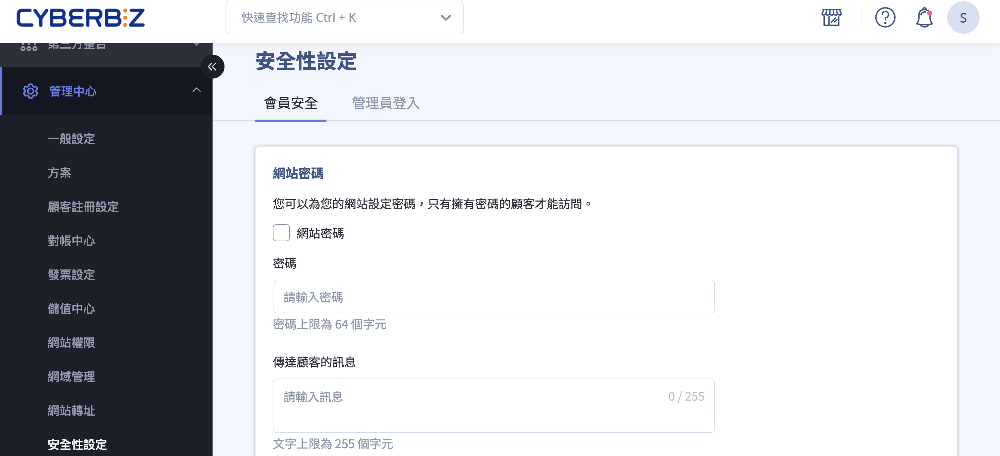
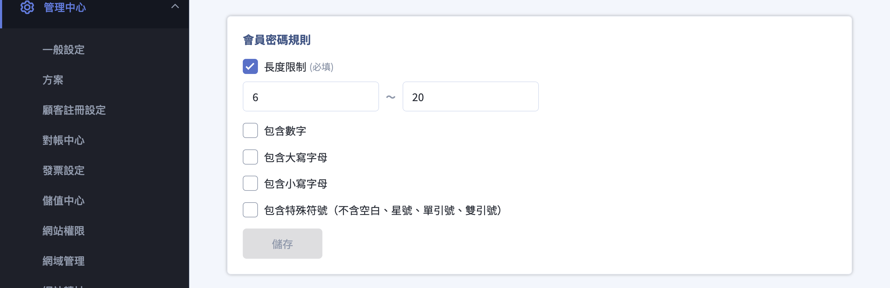
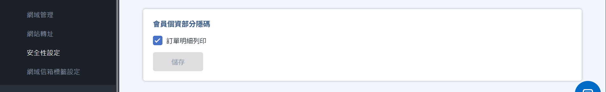
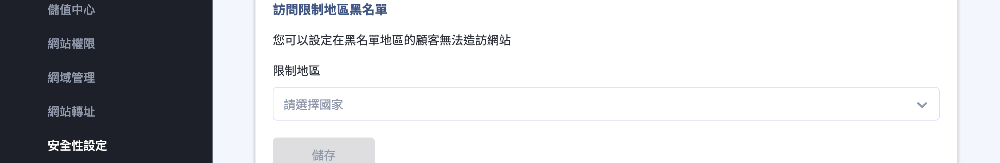
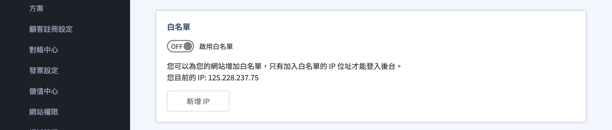
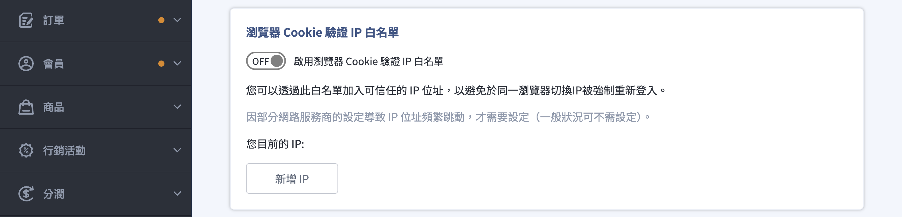
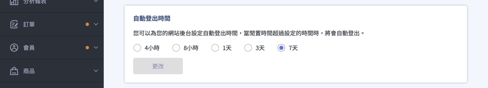
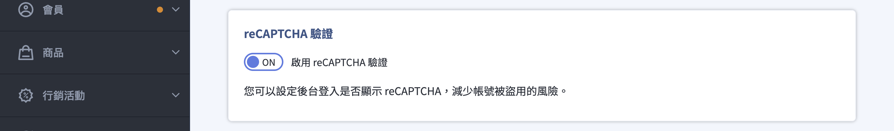
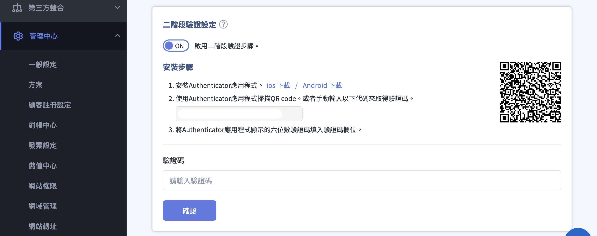
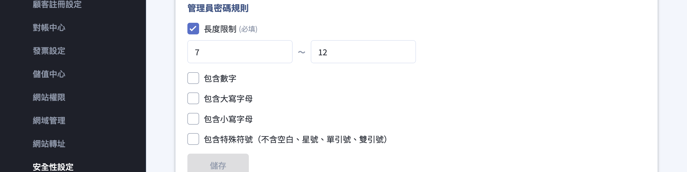

{ .hero-page }

## 安全性設定說明 { #intro-security }

「安全性設定」是 CYBERBIZ 後台的資安控制中心，協助你降低帳號被盜用、顧客個資外洩與惡意造訪的風險。頁面位於後台「管理中心」>「安全性設定」，並分為兩個分頁：

- 「會員安全」負責保護網站與顧客資料
- 「管理員登入」負責保護你與員工登入後台的安全

!!! info "提示"
    多數區塊需要你的後台帳號具備「設置」權限才會顯示；若你看不到某個區塊，通常是權限或方案的關係，詳見[使用前提與限制](#prerequisites-security){ title="使用前提與限制" }。

## 頁面功能總覽 { #overview-security }

下表整理兩個分頁中的所有資安功能，方便你一眼掌握各功能用途與開通條件：

=== "會員安全"

    | 功能 | 用途 | 開通條件 |
    | :-- | :-- | :-- |
    | 網站密碼 | 顧客需輸入密碼才能瀏覽網站 | 所有方案 |
    | 會員密碼規則 | 規範會員密碼的長度與組成 | 加值功能（需聯繫客服開通） |
    | 會員個資部分隱碼 | 將顧客姓名、手機、地址等以隱碼遮蔽 | 加值功能（需聯繫客服開通） |
    | 訪問限制地區黑名單 | 封鎖特定地區顧客造訪前台 | 企業版／跨境電商方案 |

=== "管理員登入"

    | 功能 | 用途 | 開通條件 |
    | :-- | :-- | :-- |
    | IP 白名單 | 只允許名單內的 IP 位址登入後台 | 多數方案皆內建 |
    | 瀏覽器 Cookie 驗證 IP 白名單 | 避免同一瀏覽器 IP 跳動時被強制重新登入 | 所有方案 |
    | 自動登出時間 | 後台閒置超過設定時間自動登出 | 所有方案 |
    | reCAPTCHA 驗證 | 後台登入加上機器人驗證 | 所有方案 |
    | 二階段驗證 | 登入時搭配驗證器動態驗證碼 | 所有方案 |
    | 管理員密碼規則 | 規範管理員密碼的長度與組成 | 加值功能（需聯繫客服開通） |

!!! note "註釋"
    「分店人員」帳號登入時只會看到「管理員登入」分頁，不會顯示「會員安全」分頁。

## 使用前提與限制 { #prerequisites-security }

開始設定前，請先確認下列條件：

- [x] **「設置」權限**：除了二階段驗證（每位管理員都能為自己設定）之外，其餘區塊都需要你的帳號在「網站權限」中具備「設置」權限才能檢視與編輯。
- [x] **方案／加值開通**：部分區塊需對應方案或加值功能才會出現，詳見下方折疊對照。
- [x] **先確認自己的 IP**：要使用 IP 白名單前，建議先在區塊上方查看「您目前的 IP」，避免把自己擋在門外。

??? plan "各功能的方案與開通條件"
    | 功能 | 開通條件 |
    | :-- | :-- |
    | IP 白名單 | 多數方案皆內建 |
    | 瀏覽器 Cookie 驗證 IP 白名單 | 所有方案 |
    | 自動登出時間 | 所有方案 |
    | reCAPTCHA 驗證 | 所有方案 |
    | 二階段驗證 | 所有方案 |
    | 網站密碼 | 所有方案 |
    | 管理員／會員密碼規則 | 加值功能，需聯繫 CYBERBIZ 客服開通 |
    | 會員個資部分隱碼 | 加值功能，需聯繫 CYBERBIZ 客服開通 |
    | 訪問限制地區黑名單 | 企業版，或跨境電商相關方案 |

## 操作步驟 { #operate-security }

以下依「會員安全」與「管理員登入」兩個分頁，分別說明各區塊的操作方式。前往後台「管理中心」>「安全性設定」後，點選上方分頁即可切換。

### 會員安全｜設定網站密碼 { #operate-security-website-password }

為整個網站前台加上密碼，只有知道密碼的顧客才能瀏覽，適合尚未公開上線、或僅對特定客群開放的網站。

1. **進入分頁：** 在「安全性設定」頁面點選「會員安全」分頁，找到「網站密碼」區塊。
2. **啟用密碼保護：** 勾選 **「網站密碼」**。
3. **設定密碼：** 在「密碼」欄位輸入密碼（上限 64 個字元）。
4. **（選填）留言給顧客：** 在「傳達顧客的訊息」輸入提示文字（上限 255 個字元），顧客在輸入密碼的頁面會看到這段訊息。
5. **儲存設定：** 點擊 **「儲存」** 套用。

!!! note "註釋"
    啟用後，系統會提示「您的網站目前使用密碼才能被訪問，若要所有顧客可瀏覽，請移除勾選『網站密碼』。」。要重新對外公開時，取消勾選「網站密碼」並儲存即可。

---

### 會員安全｜會員密碼規則 { #operate-security-customer-password-rule }

[:lucide-tag:{ title="適用方案" }](../../../resources/conventions#適用方案) | 企業

規範顧客註冊或設定會員密碼時的強度，操作方式與管理員密碼規則相同。此區塊需加值開通後才會顯示。

1. **進入分頁：** 在「會員安全」分頁找到「會員密碼規則」區塊。
2. **設定長度限制：** 「長度限制」為必填，輸入會員密碼的最小與最大字元數。
3. **加上組成要求：** 視需要勾選 **包含數字**、**包含大寫字母**、**包含小寫字母**、**包含特殊符號**。
4. **儲存設定：** 點擊 **「儲存」** 套用。

---
### 會員安全｜會員個資部分隱碼 { #operate-security-pdpa }

[:lucide-tag:{ title="適用方案" }](../../../resources/conventions#適用方案) | 專業PLUS / 進階PLUS / 高手PLUS / 企業

將顧客的姓名、手機、地址等個資以隱碼（如星號）遮蔽，可分別套用在不同位置。此功能需加值開通後才會顯示。

1. **進入分頁：** 在「安全性設定」頁面點選「會員安全」分頁，找到「會員個資部分隱碼」區塊。
2. **選擇隱碼範圍：** 勾選要套用隱碼的位置 — **網站前台個資部份隱碼**、**網站後台個資部份隱碼**、**訂單明細列印**[^pdpa-scope]。
3. **儲存設定：** 點擊 **「儲存」** 套用。

[^pdpa-scope]: 三個範圍各自對應不同的加值項目，只有已開通的範圍才會顯示對應勾選項。

!!! plan "適用方案"
    網站前台個資部分隱碼 / 網站後台個資部分隱碼 僅適用 **企業版** 方案。

- :lucide-eye-off:{ .lg } [__訂單明細個資隱碼設定__](../orders/order-settings/order-detail-print.md#orders-print-pii-masking)

---

### 會員安全｜訪問限制地區黑名單 { #operate-security-restricted-locations }

封鎖特定地區的顧客造訪網站前台，常用於跨境經營時排除特定市場。此功能為企業版／跨境電商方案專屬。

1. **進入分頁：** 在「會員安全」分頁找到「訪問限制地區黑名單」區塊。
2. **選擇限制地區：** 點擊「限制地區」欄位，於選單中勾選要封鎖的國家或地區。
3. **儲存設定：** 點擊 **「儲存」** 套用。設定後，名單中地區的顧客將無法造訪你的網站前台。

---

### 管理員登入｜設定 IP 白名單 { #operate-security-ip-whitelist }

啟用後，只有名單內的 IP 位址能登入後台，適合在固定辦公室或固定網路環境營運的商家。

1. **進入分頁：** 在「安全性設定」頁面點選「管理員登入」分頁，找到「白名單」區塊。
2. **確認目前 IP：** 區塊會顯示「您目前的 IP」，請先記下，稍後務必把它加入名單。
3. **新增信任 IP：** 點擊 **「新增 IP」** ，在「增加 IP 位址」視窗輸入要放行的位址，按 **「增加」** 完成。[^ip-format]
4. **啟用白名單：** 開啟「啟用白名單」開關。若你目前的 IP 不在名單內，系統會跳出提醒[^whitelist-lockout]，確認後才會生效。
5. **管理名單：** 名單以表格列出（每頁 5 筆），點擊每列的刪除圖示可移除位址。

[^ip-format]: 支援 IPv4、IPv6 與 CIDR 網段格式；格式錯誤時欄位會顯示「IP 位址格式錯誤」。
[^whitelist-lockout]: 啟用提醒文字為「您目前的IP位址不在白名單內，啟用後將立即被登出無法登入後台，確認要啟用？」。若你刪除的是目前所在的 IP，系統同樣會再次確認，避免把自己鎖在門外。

---

### 管理員登入｜瀏覽器 Cookie 驗證 IP 白名單 { #operate-security-cookie-whitelist }

這項功能與上方的 IP 白名單不同：它不是限制誰能登入，而是讓你把「會頻繁變動的可信任 IP」加入名單，避免在同一瀏覽器操作時因 IP 跳動而被強制重新登入。一般狀況不需設定。

1. **進入分頁：** 在「管理員登入」分頁找到「瀏覽器 Cookie 驗證 IP 白名單」區塊。
2. **判斷是否需要：** 只有在你的網路服務商導致 IP 位址頻繁跳動、造成反覆被登出時才需設定；一般情況可略過。
3. **新增可信任 IP：** 點擊 **「新增 IP」** ，於「增加 IP 位址」視窗輸入位址，按 **「增加」** 完成。
4. **啟用功能：** 開啟「啟用瀏覽器 Cookie 驗證 IP 白名單」開關即可。

---

### 管理員登入｜設定自動登出時間 { #operate-security-logout-timer }

設定後台閒置多久就自動登出，降低電腦無人看管時被他人誤用的風險。

1. **進入分頁：** 在「管理員登入」分頁找到「自動登出時間」區塊。
2. **選擇時間：** 從五個選項中擇一：**4小時**、**8小時**、**1天**、**3天**、**7天**。
3. **儲存設定：** 點擊 **「更改」** 套用。

!!! tip "技巧"
    若多人共用電腦或在公共空間操作後台，建議選擇較短的閒置時間（如 4 小時），安全性較高。

---

### 管理員登入｜後台登入 reCAPTCHA 驗證 { #operate-security-recaptcha }

在後台登入頁加上 Google reCAPTCHA 機器人驗證，減少自動化腳本嘗試破解帳號的風險。

1. **進入分頁：** 在「管理員登入」分頁找到「reCAPTCHA 驗證」區塊。
2. **開啟驗證：** 開啟「啟用 reCAPTCHA 驗證」開關，設定即時生效。下次登入後台時就會出現 reCAPTCHA 驗證。

- :lucide-shield-check:{ .lg } [__啟用留言區 reCAPTCHA 設定教學__](../website-appearance/customer-interaction/enable-comment-recaptcha.md)

---

### 管理員登入｜二階段驗證 { #operate-security-2fa }

二階段驗證（2FA）是防止帳號被盜用最有效的防線：即使密碼外洩，沒有手機驗證器產生的動態驗證碼也無法登入。

1. **進入分頁：** 在「管理員登入」分頁找到「二階段驗證設定」區塊。
2. **開啟功能：** 開啟「啟用二階段驗證步驟。」開關，畫面會展開「安裝步驟」。
3. **安裝驗證器：** 在手機安裝 Authenticator 應用程式（提供 iOS 與 Android 下載）。
4. **綁定帳號：** 用 Authenticator 掃描畫面上的 QR code，或手動輸入畫面提供的代碼。
5. **完成驗證：** 將 Authenticator 顯示的六位數驗證碼填入「驗證碼」欄位，即完成啟用。
6. **保存備用碼：** 啟用後系統會產生「驗證備用碼」，請妥善保存[^backup-code]，當無法使用驗證器時可用來登入。

[^backup-code]: 為了安全，備用碼只會顯示這一次、每組僅能使用一次；遺失時可在區塊內「重新產生備用碼」。停用二階段驗證時，需先輸入使用者密碼確認。

- :lucide-shield-check:{ .lg } [__二階段驗證設定教學__](setup-manage-two-factor-auth.md)

---

### 管理員登入｜管理員密碼規則 { #operate-security-admin-password-rule }

規範所有管理員帳號的密碼強度。此區塊需加值開通後才會顯示.

1. **進入分頁：** 在「管理員登入」分頁找到「管理員密碼規則」區塊。
2. **設定長度限制：** 「長度限制」為必填，輸入密碼的最小與最大字元數（系統預設為 6 至 20）。
3. **加上組成要求：** 視需要勾選 **包含數字**、**包含大寫字母**、**包含小寫字母**、**包含特殊符號**[^special-char]。
4. **儲存設定：** 點擊 **「儲存」** 套用。

[^special-char]: 特殊符號不含空白、星號、單引號與雙引號。

## 重要規範與限制 { #specs-security }

- IP 白名單與瀏覽器 Cookie 驗證 IP 白名單皆支援 IPv4、IPv6 與 CIDR 網段格式。
- 啟用 IP 白名單前，務必先把目前所在的 IP 加入名單，否則啟用後會立即被登出且無法登入。
- 「瀏覽器 Cookie 驗證 IP 白名單」僅在同一瀏覽器 IP 頻繁跳動時才需設定，一般情況不需開啟。
- 自動登出時間最短為 4 小時，最長為 7 天。
- 啟用「網站密碼」後，整個前台都需要輸入密碼才能瀏覽；要對外公開時記得取消勾選。
- 二階段驗證備用碼只會顯示一次，請在啟用當下立即保存。

## 常見問題 { #faq-security }

??? quote "啟用白名單後把自己鎖在後台外面了，怎麼辦？"
    { #faq-security-whitelist-lockout }
    啟用白名單或刪除目前 IP 前，系統都會跳出提醒，請務必先確認自己目前的 IP 已在名單中。

    - 啟用前：先在「白名單」區塊查看「您目前的 IP」，並用 **「新增 IP」** 把它加入名單，再開啟開關。
    - 若已被鎖在外面無法登入，請聯繫 CYBERBIZ 客服協助處理。

??? quote "「白名單」和「瀏覽器 Cookie 驗證 IP 白名單」有什麼不同？"
    { #faq-security-two-whitelists }
    兩者用途完全不同：

    - **白名單**：限制「誰能登入後台」，只有名單內的 IP 才能登入，是主動的存取控管。
    - **瀏覽器 Cookie 驗證 IP 白名單**：解決「同一瀏覽器 IP 跳動時被強制重新登入」的困擾，屬於便利性設定，一般狀況不需開啟。

??? quote "為什麼我在安全性設定看不到某些區塊？"
    { #faq-security-missing-blocks }
    區塊是否顯示取決於你的權限與方案：

    - 多數區塊需要你的帳號具備「設置」權限，請至「網站權限」確認。
    - 管理員／會員密碼規則、會員個資部分隱碼為加值功能，需聯繫客服開通。
    - 訪問限制地區黑名單為企業版／跨境電商方案專屬。

??? quote "設定了自動登出時間，多久會被登出？"
    { #faq-security-logout-timing }
    當後台閒置（無操作）超過你設定的時間就會自動登出，可選 4小時、8小時、1天、3天或 7天。若希望安全性更高，建議選擇較短的時間。

??? quote "啟用網站密碼後，顧客會看到什麼？"
    { #faq-security-website-password-view }
    顧客造訪網站時會被要求輸入密碼，只有輸入正確密碼才能瀏覽。若你有在「傳達顧客的訊息」填寫文字，顧客也會在輸入密碼的頁面看到這段說明。要重新對外公開時，取消勾選「網站密碼」並儲存即可。

??? quote "更換手機後收不到二階段驗證碼怎麼辦？"
    { #faq-security-2fa-lost-phone }
    若你已更換手機或遺失原本的驗證裝置，將無法自行產生 2FA 驗證碼。請聯繫網站擁有者或具備權限的管理員，至「管理中心 > 安全性設定 > 二階段驗證」協助關閉該帳號的 2FA，關閉後再重新綁定新裝置即可。

??? quote "為什麼登入時一直出現機器人驗證？"
    { #faq-security-recaptcha-frequency }
    當系統偵測到可疑行為（如短時間內多次登入失敗、使用 VPN 或異常 IP）時，會要求進行 reCAPTCHA 人機驗證。若驗證持續出現，請檢查瀏覽器是否安裝了阻擋腳本的外掛，或嘗試改用正常的網路環境登入。

