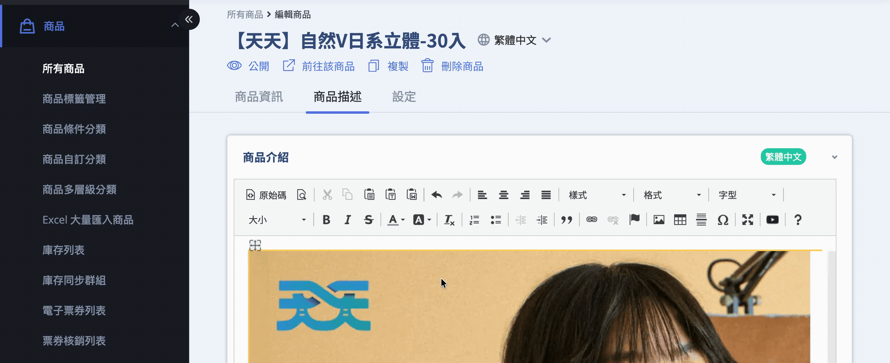
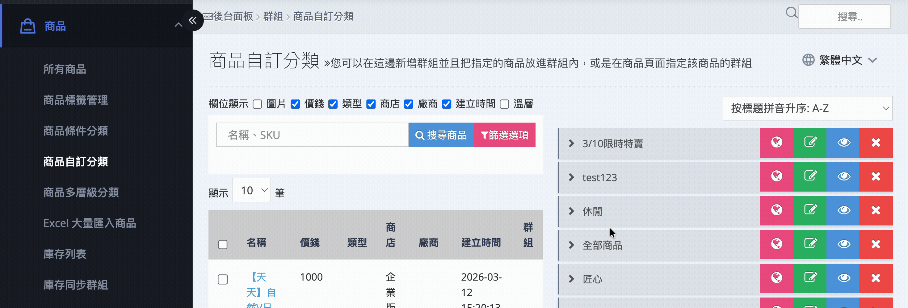
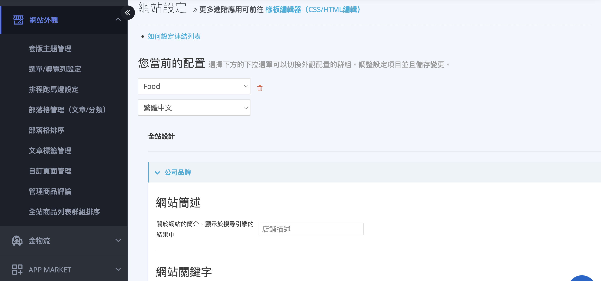

# SEO 設定與優化指南

完整說明 SEO 設定功能，包含圖片 ALT 屬性、商品頁與分類頁 SEO、全站 Meta Tag 設定以及 Sitemap 提交與 301 轉址教學。
{ .subtitle }

{ .doc-badge }

{ .hero-page }

## SEO 說明

SEO (搜尋引擎優化，Search Engine Optimization) 是改善網站自然排名（非付費廣告）的過程，旨在讓搜尋引擎更容易找到您的網站並給予較高的排名，進而提升網頁能見度與流量轉換。

CYBERBIZ 系統提供的 SEO 優化範圍涵蓋了 **首頁、商品頁、商品群組、圖片、部落格以及自訂頁面** 等。以下為詳細的操作說明：

## 圖片 SEO 設定 (ALT 屬性)

為圖片加入 ALT 文字能提升訪問體驗，當圖片無法顯示時會以文字取代，並協助搜尋引擎準確定義圖片內容。

*   **操作路徑**：登入 CYBERBIZ 管理後台，前往「商品」>「所有商品」> 點選商品 >「商品描述」。
- **設定方法**：在 **商品介紹** / **規格說明** / **運送方式** 的編輯器中對圖片點擊右鍵選擇 **「影像屬性」**，在「替代文字」欄位輸入一段描述圖片意思的話。

## 商品頁 SEO 設定

*   **操作路徑**：登入管理後台，前往「商品」>「所有商品」> 點選商品 >「設定」，往下滑找到 **「SEO設定」**。
*   **設定內容**：可編輯網頁標題與描述，長度建議不超過 **225 個字元**。

## 商品群組 (分類頁) SEO 設定

這能讓特定的商品分類（如自訂分類或條件分類）更容易在搜尋結果中被找到。

*   **操作路徑**：前往「商品」>「商品自訂分類」(或條件分類) > 選擇群組點選「編輯群組」。
*   **設定方法**：點選 **「Meta Tag 設定」** 並完成標題、簡述與關鍵字設定。

## 官網全站 SEO 設定

包含整體網站的標題與全站關鍵字。

- **網站名**：前往「管理中心」>「一般設定」[設定網站名稱](../website-management/設定網站基本資訊.md#關於您的網站){ data-preview }（中文字 15 字/英文字 30 字以內）。
- **Meta Tag 設定**：包含 **標題**、**簡述** 跟 **關鍵字**。
    *   **一般版型**：前往「網站外觀」>「套版主題管理」>「網站設定」>「公司品牌」。瞭解[一般版型如何設定網站標題](../website-appearance/設定網站標題與 SEO.md#預設版型一般版型){ data-preview }。

        

    *   [**拖拉版型**](../website-appearance/設定網站標題與 SEO.md#拖拉版型){ data-preview }：前往「網站外觀」>「套版主題管理」>「網站設定」>「全站設定」。

!!! note "延伸閱讀"
    關於網站標題與 SEO 的詳細設定，請參閱 [設定網站標題與 SEO](../website-appearance/設定網站標題與 SEO.md){ data-preview }，或查看其在 [搜尋結果頁 (SERP) 的顯示位置](../website-appearance/設定網站標題與 SEO.md#搜尋引擎結果頁-SERP){ data-preview }。

## 部落格與其他自訂頁面 SEO

- :lucide-newspaper:{ .lg }  
  [__部落格__](../website-appearance/部落格管理與文章發佈指南.md#Meta-Tags){ data-preview }  
  可為部落格主題及單篇章設定 Meta Tag。

- :lucide-files:{ .lg }     
  [__其他頁面__](../website-appearance/設定與管理自訂頁面.md#設定路徑與新增頁面){ data-preview }  
  如「關於我們」或自訂活動頁，可於「自訂頁面管理」中編輯網頁描述與標題。

## Sitemap 提交與轉址維護

- :lucide-map:{ .lg }   
  [__Sitemap (網站地圖)__](將 Sitemap 提交至 Google Search Console.md){ data-preview }     
  系統會自動產生 Sitemap，您只需將網址提交至 GSC，即可加快網頁收錄速度。

- :lucide-signpost:{ .lg }     
  [__301 重定向__](設定 301 重定向網站轉址.md){ data-preview }  
  當原本熱門的頁面網址失效或變更時，應設定 301 轉址將流量導向新網址，以防止 SEO 排名下滑。

## 重要注意事項

*   SEO 設定後需要一定的**等待期**（依 Google 排程而定），建議儘早完成設定。
*   針對多國語系店家，系統支援針對不同語系設定各自獨立的 SEO 內容。

## 常見問題

??? quote "SEO 設定後多久會看到效果？"

    SEO 效果的呈現需要時間，通常需要 **2-4 週** 才能在搜尋結果中看到變化。Google 需要時間重新爬取並索引您的網頁。

??? quote "可以針對每個商品設定不同的 Meta Tag 嗎？"

    可以。您可以在商品編輯頁面的「SEO設定」區塊中，為每個商品設定專屬的標題、描述與關鍵字。

??? quote "什麼情況下需要使用 301 轉址？"

    當您刪除或變更商品頁、分類頁的網址時，建議設定 301 轉址將舊網址導向新網址，以保留原有的 SEO 排名權重。
