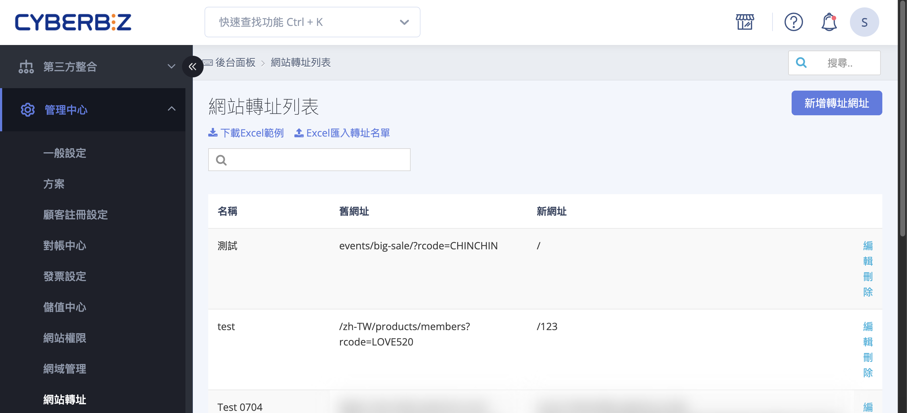
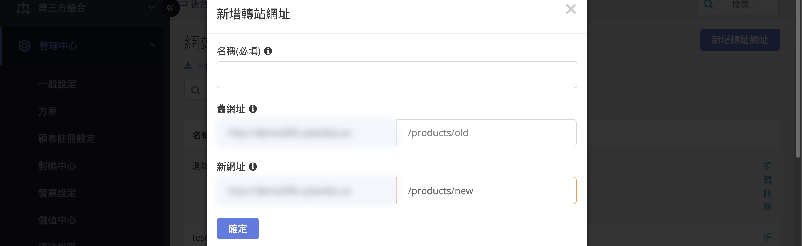
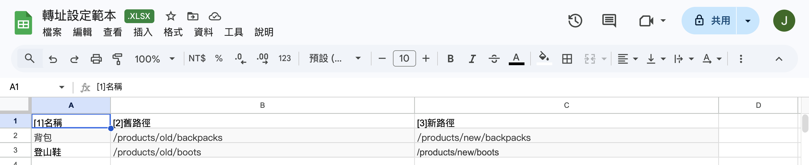

# 設定 301 重定向網站轉址

設定 301 轉址，當網頁網址失效或變更時將流量導向新網址，以維護 SEO 排名。
{ .subtitle }

{ .hero-page }

##  301 重定向說明

**「301 重定向（301 Redirect）」** 是一種將網址重新定向的機制。當您的網址已失效或不再更新時，執行此動作可有效減少轉換系統或網站搬家後，因原網址失效導致搜尋引擎爬蟲找不到內容，進而引發 **SEO 排名下滑** 的風險。

## 應用情境

此功能特別適用於 **「網站搬家」** 或 **「活動頁面失效」** 時，將舊有的熱門文章或商品流量引導至新的對應頁面，是維護網站自然搜尋排名的最佳解決方案。

## 設定前的注意事項

*   **網域限制**：設定 301 轉址時，您的網域必須是 **「自有網域」**。
*   **生效條件**：系統邏輯規定，**當舊網址呈現為「404 頁面」時，轉址功能才會啟動並導向新網址**。
*   **轉換建議**：建議以「有價值」的熱門頁面進行轉換為主，不一定要針對所有頁面執行。
*   **中文網址**：若網頁為中文網址，請特別注意轉址設定時 **請勿使用亂碼** 進行操作。

## 操作步驟教學

### 方法 1：個別新增轉址

1.  **進入路徑**：登入 CYBERBIZ 管理後台，前往 **「管理中心」** > **「網站轉址」**。
2.  **填入資訊**：點選「新增轉址網址」後輸入以下欄位：
    *   **名稱（必填）**：為此轉址項目命名，方便後續管理辨識。
    *   **舊網址**：左側預設為您的主網域，右側請填入原網頁的路徑（例如：`/products/old`）。
    *   **新網址**：左側同樣為主網域，右側請填入已建立好的新網頁路徑（例如：`/products/new`）。
3.  **儲存設定**：確認無誤後儲存即可完成。

---

### 方法 2：批量新增（Excel 匯入）

1.  **進入路徑**：登入 CYBERBIZ 管理後台，前往 **「管理中心」** > **「網站轉址」**。
2.  **下載範本**：點選 **「下載 Excel 範例」**。
3.  **填寫資料**：開啟檔案後，在各欄位填入資訊：
    *   **A 欄位**：為此轉址項目命名，方便後續管理辨識。
    *   **B 欄位**：舊網址路徑。
    *   **C 欄位**：新網址路徑。
4.  **執行匯入**：點選 **「匯入 Excel 轉址名單」** 上傳檔案，系統將自動完成批量設定。

## 後續操作

- :lucide-map:{ .lg }   
  [__提交 Sitemap__](將 Sitemap 提交至 Google Search Console.md){ data-preview }     
  將系統自動產生的 Sitemap 提交至 Google Search Console。

- :lucide-search:{ .lg }     
  [__SEO 設定與優化__](SEO 設定與優化指南.md){ data-preview }  
  全面了解 CYBERBIZ 系統的 SEO 設定功能。

## 常見問題

??? quote "設定 301 轉址後需要多久時間生效？"

    301 轉址設定後，通常需要 **數小時至 24 小時** 才會生效。Google 爬蟲下次造訪您的網站時會偵測到轉址設定並更新索引。

??? quote "可以將多個舊網址轉址到同一個新網址嗎？"

    可以。您可以設定多個來源網址（舊網址）指向同一個目標網址（新網址），這在網站搬家或商品下架時特別實用。

??? quote "如果我不想設定轉址，直接刪除頁面可以嗎？"

    建議不要直接刪除頁面。若該頁面已有一定的 SEO 排名權重，直接刪除會導致 404 錯誤並流失這些權重。建議設定 301 轉址至相關頁面，以保留 SEO 價值。
