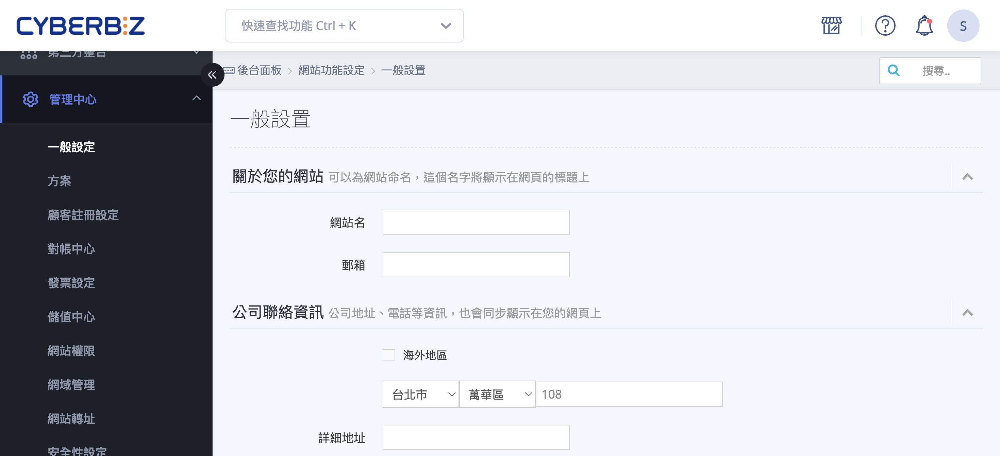
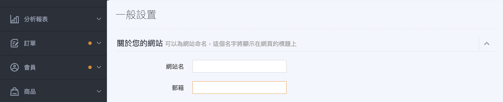
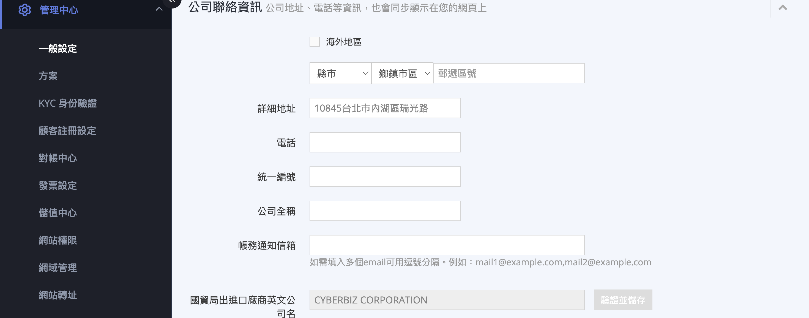
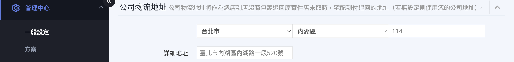
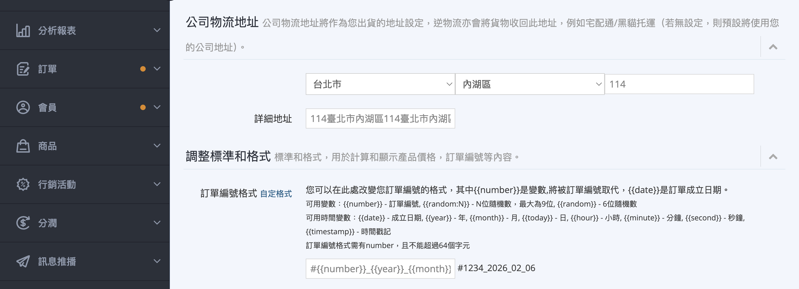
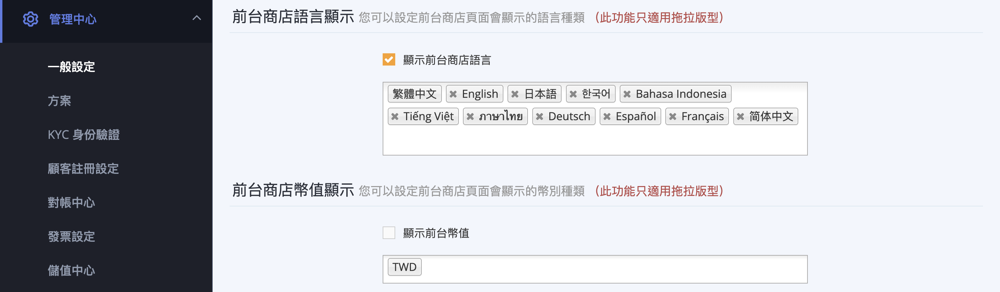

---

title: 設定網站基本資訊
description: 進行網站基本資訊、公司聯繫方式、物流地址及後台語系等核心設置。
created:
last_modified: 2026-06-30 08:02
lang: zh-TW
permalink: https://help.cyberbiz.io/ec/website-management/setup-store-basic-info
type: tutorial
status:
version:
author: Jase
reviewers: []
notes:
  - verify feature validity 註冊跳轉頁面
ga_views: 0
feedback: 0
products:
  - EC
modules:
  - 管理中心
sites:
  - TW
audiences:
  - admin
difficulty: beginner
tnb: trunk
plans:
  - 企業
  - 專業
  - 專業PLUS
  - 進階
  - 進階PLUS
  - 高手
  - 高手PLUS
cyb_extensions: []
intents:
  - 設定網站名稱
  - 設定退貨通知信箱
  - 填寫公司聯絡資訊
  - 設定帳務通知信箱
  - 填寫公司物流地址
  - 自訂訂單編號格式
  - 設定後台貨幣
  - 設定後台語言
  - 設定前台商店語言
  - 設定前台商店幣值
features:
  - 網站基本資訊
  - 公司聯絡資訊
  - 公司物流地址
  - 訂單編號格式自訂
  - 後台顯示貨幣設定
  - 後台語言顯示設定
  - 前台商店語言顯示
  - 前台商店幣值顯示
prerequisites:
  - 後台管理員權限
related: []
tags:
  - 網站基本資訊
  - 網站設定
  - 公司資訊
  - 物流地址
  - 訂單編號
  - 語系設定
  - 貨幣設定
  - 後台管理
acoiv:
apis: []
devices:
  - desktop
  - mobile
ui_components: []
paths:
  - 管理中心 > 一般設定
layouts: []
wp_url:
  - https://www.cyberbiz.io/helpcenter/?p=8314
  - https://www.cyberbiz.io/support/?p=33987
  - https://www.cyberbiz.io/support/?p=5598
comments: false
search:
  exclude: false
icon: lucide/store
hide:
---

# 設定網站基本資訊

集中設定網站名稱、公司聯絡與發票資訊、訂單編號格式，以及後台與前台的語言、幣別顯示方式。
{ .subtitle }

{ title="一般設定頁面" .hero-page }

## 一般設定說明 { #intro-general-preferences }

「一般設定」（後台路徑「管理中心」>「一般設定」）是商店的基礎資料設定頁。在這裡填寫的網站名稱、公司聯絡與發票資訊，會同步顯示在您的官網與發票上；您也可以在此自訂訂單編號格式，並調整後台與前台的語言與幣別顯示方式。

整個頁面是一張表單，分成多個可折疊區塊，所有設定共用頁面最下方的「儲存所有設定」按鈕——填寫完任何區塊後，都要按下這顆按鈕才會生效。

!!! info "提示"
    不同方案與加值功能，看到的區塊會不一樣。若您找不到本文提到的某個區塊，請參考 [使用前提與限制](#prerequisites-general-preferences) 確認開通條件。

---

## 頁面功能總覽 { #overview-general-preferences }

| 區塊 | 設定內容 | 開通條件 |
| :-- | :-- | :-- |
| [關於您的網站](#operate-general-preferences-company-info) | 網站名、聯絡 Email | 所有方案 |
| [公司聯絡資訊](#operate-general-preferences-company-info) | 地址、電話、統一編號、公司全稱、帳務通知信箱 | 所有方案 |
| [公司物流地址](#operate-general-preferences-return-address) | 超商包裹退回的宅配到付退件地址 | 所有方案（使用電商倉儲服務時不顯示） |
| [調整標準和格式](#operate-general-preferences-order-format) | 訂單編號格式；幣別顯示格式 | 訂單編號格式為所有方案；幣別顯示格式需加值功能 |
| 後台顯示貨幣 | 顯示目前後台結算的幣別（唯讀，無法修改） | 所有方案 |
| [後台語言顯示](#operate-general-preferences-admin-language) | 切換後台介面顯示的語言 | 所有方案 |
| [前台商店語言顯示](#operate-general-preferences-frontend-locale) | 設定官網前台可切換的語言 | 加值功能，且需使用拖拉版型 |
| [前台商店幣值顯示](#operate-general-preferences-frontend-locale) | 設定官網前台可切換的幣別 | 加值功能，且需使用拖拉版型 |

---

## 使用前提與限制 { #prerequisites-general-preferences }

開始設定前，請先確認下列項目：

- [x] **後台管理權限**：需具備「管理中心」的後台操作權限。
- [x] **發票相關欄位**：若您已開立電子發票，「公司全稱」「電話」「詳細地址」「統一編號」為必填，刪除後系統會自動將發票轉為會員載具（個人）。

部分區塊需搭配方案或加值功能才會出現：

??? plan "方案 / 加值功能對照"
    - **訂單編號格式、公司聯絡資訊、後台語言與後台顯示貨幣**：所有方案皆可使用，無需額外開通。
    - **幣別顯示格式**（調整網頁與郵件上金額的呈現格式）：需開通對應加值功能後，才會在「調整標準和格式」區塊出現。
    - **前台商店語言顯示 / 前台商店幣值顯示**：需開通對應加值功能，且官網需使用「拖拉版型」，這兩個區塊才會出現。
    - **公司英文名稱**：供跨境或出口商家填寫，僅特定方案與跨境商店會看到此欄位。
    - 若需開通上述加值功能，請聯絡您的開店顧問或客服。

---

## 操作步驟 { #operate-general-preferences }

以下依常見情境分段說明。所有區塊都共用頁面最下方的「儲存所有設定」按鈕，可一次填好多個區塊再一起儲存。

### 設定網站名稱與公司聯絡資訊 { #operate-general-preferences-company-info }

填寫顯示在官網與發票上的基本資料。

1. **進入一般設定：** 前往後台路徑「管理中心」>「一般設定」。
2. **填寫網站名稱：** 在「關於您的網站」區塊，於「網站名」填入品牌或商店名稱（中文字請勿超過 15 字，英文字請勿超過 30 字）[^e]；並填入聯絡用的「Email」[^f]。

    { title="關於您的網站" }

3. **填寫公司聯絡資訊：** 在「公司聯絡資訊」區塊，依序填入「詳細地址」「電話」「統一編號」「公司全稱」與「帳務通知信箱」[^a]。

    { title="公司聯絡資訊" }

    !!! info "跨境物流設定"

        - **海外托運單：** 經營跨境或出口業務的商家，部分方案還會看到「公司英文名稱」欄位，填寫後可一併開通海外托運單功能。
        - **順豐海外物流：** 需在「國貿局出進口廠商英文公司名」欄位輸入公司於商工登記上的正式英文名稱。
        - **DHL 物流驗證：** 需填寫正確的 **統一編號** 與 **國貿局登記之英文公司名** 並點擊驗證，才能成功開通該功能。

4. **儲存設定：** 確認資料無誤後，點選頁面最下方的 **「儲存所有設定」** 按鈕。

[^a]: 「帳務通知信箱」可填多個信箱，以半形逗號分隔，例如 `mail1@example.com,mail2@example.com`。「統一編號」須為 8 位數字。

[^e]: 此名稱會顯示在網頁標題上，並同步用於搜尋引擎優化 (SEO) 及金流風控單位的店家身分審核。部分設定涉及法律合規性（如 **營業人資訊揭露**），建議確實填寫正確的品牌名稱與統編。
[^f]: 此信箱也會作為登入 CYBERBIZ 線上課程平台的帳號。

---

### 設定退貨退件地址 { #operate-general-preferences-return-address }

「公司物流地址」用於當您的店到店超商包裹退回原寄件門市卻未取件時，系統將以宅配到付退回的收件地址。此地址也會作為 [黑貓宅急便](../orders/home-delivery/tcat-home-delivery.md){ title="使用黑貓宅配出貨" } 或宅配通配送時的預設寄件地址。若未設定，則會使用您的公司地址[^b]。

1. **進入一般設定：** 前往「管理中心」>「一般設定」，找到「公司物流地址」區塊。
2. **填寫退件地址：** 於地址欄位選擇縣市、區域並填入詳細地址，作為包裹退回的收件處。

    { title="公司物流地址" }

3. **儲存設定：** 點選頁面最下方的 **「儲存所有設定」** 按鈕完成設定。

[^b]: 若您使用 CYBERBIZ 電商倉儲服務，退貨會直接送回倉庫，此區塊不會出現，無須設定。

---

### 自訂訂單編號格式 { #operate-general-preferences-order-format }

訂單編號預設為 `#{{ "{{number}}" }}`（顯示效果例如 `#1234`），您可以加入日期、隨機數等變數，組成符合自己作業習慣的編號規則。完整變數整理於 [訂單編號格式變數對照表](references/general-preferences-order-format-variables.md){ title="訂單編號格式變數對照表" }。

1. **進入一般設定：** 前往「管理中心」>「一般設定」，展開「調整標準和格式」區塊。
2. **展開格式說明：** 點選「訂單編號格式」旁的「自定格式」，即可看到可用變數的說明。
3. **輸入新格式：** 在欄位中輸入您要的格式，例如 `CB{{ "{{year}}" }}{{ "{{month}}" }}-{{ "{{number}}" }}`（或 `CYBERBIZ{{ "{{number}}" }}`），系統會即時顯示套用後的範例[^c]。

    { title="物流地址與訂單格式" }

4. **儲存設定：** 點選頁面最下方的 **「儲存所有設定」** 按鈕完成設定。

[^c]: 格式中 **必須包含** `{{ "{{number}}" }}`，且不可超過 64 個字元，否則儲存時會出現「訂單編號格式需有 number，且不能超過 64 個字元」的提醒。變更格式只會影響日後新成立的訂單，已成立訂單的編號不會改變。

---

### 切換後台介面語言 { #operate-general-preferences-admin-language }

調整您登入後台時，管理介面顯示的語言。

1. **進入一般設定：** 前往「管理中心」>「一般設定」，找到「後台語言顯示」區塊。
2. **選擇語言：** 於下拉選單選擇要使用的後台語言（繁體中文、English、日本語、한국어）。
3. **儲存設定：** 點選頁面最下方的 **「儲存所有設定」** 按鈕，介面即會切換為所選語言。

{ title="後台語言顯示" }

!!! note "註釋"
    後台語言只影響「您登入後台時看到的管理介面」，不會改變顧客在官網前台看到的語言。前台語言請於「前台商店語言顯示」區塊設定（見 [設定前台多語言與多幣別顯示](#operate-general-preferences-frontend-locale)）。

---

### 設定前台多語言與多幣別顯示 { #operate-general-preferences-frontend-locale }

讓顧客可以在官網前台自行切換語言或幣別。此功能需開通對應加值功能，且官網需使用拖拉版型，頁面才會出現「前台商店語言顯示」與「前台商店幣值顯示」兩個區塊。

1. **進入一般設定：** 前往「管理中心」>「一般設定」，找到「前台商店語言顯示」或「前台商店幣值顯示」區塊。
2. **開啟顯示開關：** 勾選「顯示前台商店語言」或「顯示前台幣值」。
3. **選擇要開放的語言或幣別：** 在下方選單中，加入要在前台提供給顧客切換的語言或幣別（預設語言與本店幣別為固定項目，無法移除）。

    { title="貨幣與語言顯示" }

4. **確認提示視窗：** 開啟或關閉前台語言時，系統會跳出確認視窗說明影響範圍[^d]，確認後再繼續。
5. **儲存設定：** 點選頁面最下方的 **「儲存所有設定」** 按鈕完成設定。

[^d]: 開啟前台語言後，網址會自動加入語言子目錄（例如 `/zh-TW`、`/en`），可能影響 SEO 設定，開啟前請先確認已備妥各語言的頁面內容；關閉時則會移除語言子目錄。

---

## 重要規範與限制 { #specs-general-preferences }

- **所有設定共用一顆儲存按鈕：** 頁面最下方只有「儲存所有設定」一顆按鈕，任何區塊改完都要按它才會生效，離開頁面前請務必儲存。
- **訂單編號格式規則：** 格式必須包含 `{{ "{{number}}" }}`，且不可超過 64 個字元；變更後僅影響之後新成立的訂單。
- **統一編號與發票連動：** 若您已開立電子發票，刪除「詳細地址」或「統一編號」會使發票自動轉為會員載具（個人），請留意。
- **後台顯示貨幣無法在此修改：** 「後台顯示貨幣」僅顯示目前的結算幣別，為唯讀資訊，如需調整請聯絡客服。
- **後台語言與前台語言各自獨立：** 「後台語言顯示」只改後台介面；顧客在前台看到的語言由「前台商店語言顯示」決定。
- **前台多語言 / 多幣別僅適用拖拉版型：** 這兩項設定需使用拖拉版型才會出現並生效。

## 後續操作 { #next-steps-general-preferences }

- :lucide-receipt-text:{ .lg }  
  [__揭露營業人名稱與統一編號__](../website-appearance/site-settings/business-disclosure.md){ title="揭露營業人名稱與統一編號" }  
  將公司名稱與統一編號揭露於官網明顯處，符合法規要求。

- :lucide-palette:{ .lg }  
  [__套用與更換網站主題__](../website-appearance/theme-and-layout/apply-and-switch-theme.md){ title="套用與更換網站主題" }  
  切換官網版型，拖拉版型才能使用前台多語言與多幣別顯示。

## 常見問題 { #faq-general-preferences }

??? quote "改了訂單編號格式，之前的訂單編號會跟著變嗎？"
    { #faq-general-preferences-order-format-existing }
    不會。訂單編號格式只會套用在「日後新成立」的訂單，已經成立的訂單編號維持不變。

    - 若儲存時出現格式錯誤提醒，請確認格式中包含 `{{ "{{number}}" }}`，且總長度未超過 64 個字元。

??? quote "為什麼我的頁面沒有「公司物流地址」區塊？"
    { #faq-general-preferences-no-logistics-address }
    若您使用 CYBERBIZ 的電商倉儲服務，退貨會直接送回倉庫，因此頁面不會顯示「公司物流地址」區塊，屬於正常情況。一般商家則會看到此區塊，用來設定超商包裹退回的宅配到付退件地址。

??? quote "找不到「前台商店語言顯示」或「前台商店幣值顯示」？"
    { #faq-general-preferences-no-frontend-locale }
    這兩個區塊需要同時符合兩個條件才會出現：

    - 已開通對應的加值功能。
    - 官網使用「拖拉版型」。

    若有需求，請聯絡您的開店顧問或客服協助開通。

??? quote "把統一編號或地址刪掉會有什麼影響？"
    { #faq-general-preferences-delete-vat }
    若您已開立電子發票，刪除「統一編號」或「詳細地址」後，系統會自動把發票轉為會員載具（個人）。若仍需開立公司發票，請保留這些欄位。

??? quote "後台語言改成英文後，顧客看到的官網也會變英文嗎？"
    { #faq-general-preferences-admin-vs-frontend-language }
    不會。「後台語言顯示」只會改變您登入後台時的管理介面語言，不影響顧客在前台看到的語言。前台語言請於「前台商店語言顯示」區塊另行設定。

??? quote "網站基本資訊設定後，為什麼前台沒有顯示更新內容？"
    { #faq-general-preferences-frontend-not-updated }
    請確認已將頁面最下方的 **儲存設定** 按鈕點選完成，部分變更需重新整理前台頁面或清除瀏覽器快取才會生效。

??? quote "公司統編與英文名稱驗證失敗，該怎麼辦？"
    { #faq-general-preferences-verification-failed }
    請確認填寫的統編及英文公司名稱與國貿局登記資訊一致，並確保無空格或特殊符號，填寫完成後再點擊 **驗證**。

??? quote "訂單編號自訂格式如何設定？"
    { #faq-general-preferences-order-format-setup }
    點擊 **自訂格式** 後可輸入自訂文字與變數，但格式中必須包含 `{{ "{{number}}" }}` 變數，例如 `EC{{ "{{number}}" }}`，才能正常生成訂單號碼。

??? quote "可以同時設定多個帳務通知信箱嗎？"
    { #faq-general-preferences-multiple-emails }
    可以，請用 **半型逗號 (,)** 將多個 Email 分隔開，例如 `finance1@company.com,finance2@company.com`。

??? quote "前台商店語言與幣值顯示在哪些版本可用？"
    { #faq-general-preferences-frontend-locale-version }
    此功能僅適用 **拖拉版型**，其他版型將不會顯示此選項。

??? quote "網站名稱有字數限制嗎？"
    { #faq-general-preferences-site-name-limit }
    有， **中文字限制 15 字以內**， **英文字限制 30 字以內**，超過將無法儲存。

---

## 參考資料 { #reference-general-preferences }

- [訂單編號格式變數對照表](references/general-preferences-order-format-variables.md)

