本文件教您如何在 CYBERBIZ 後台完成星益欣電子發票設定，涵蓋購買方案、串接啟用、多站台共用、對帳發票設定及帳戶續購。

!!! quote "「美麗科技」已與「星益欣」合併"
	美麗科技已與星益欣合併，本文後續以星益欣指稱相關服務。星益欣相關設定，請依[星益欣官網公告 :lucide-external-link:](https://www.wixtar.com/product/e-invoice)為準，電話: 02-2711-9528 #240。若需將字軌匯入星益欣後台，請參考[匯入字軌教學文件](https://www.cyberbiz.io/helpcenter/wp-content/uploads/美麗科技-增加字軌數量_匯入教學使用手冊-20230511.pdf)。

## 使用須知

### 適用範圍

購買方案後，系統會依統一編號自動建立星益欣帳戶，**帳戶綁定統編，開立同統編發票**。此帳戶可支援以下開立發票情境：

- [x] 多個 EC 官網發票開立
- [x] 線下 POS 系統發票開立
- [x] 企業版 EC 官網請款發票開立
- [x] 其他通路（第三方平台）發票開立

??? note "詳細開立情境說明"	
	|開立情境|開立發票位置|注意事項|
	|---|---|---|
	|**多個 EC 官網**|CYBERBIZ EC 後台|可參考 多站台共用帳戶 章節了解串接現有星益欣帳戶方法。|
	|**線下 POS 系統**|CYBERBIZ EC 後台|購買帳戶後，支援 2 台 POS 機開立發票。多台 POS 可參考 [POS 教學文件](../../pos/third-party/wixtar-e-invoice.md){ title="設定 POS 星益欣電子發票" } 了解子機計價方式與申請流程。|
	|**企業版 EC 官網請款發票**|CYBERBIZ EC 後台|企業版商家若由 CYBERBIZ 代開消費者發票，可開立對帳作業所需請款發票。可參考 串接啟用對帳發票。|
	|**其他通路（第三方平台）**|星益欣後台|商家可進入星益欣後台操作，CYBERBIZ 不支援該操作流程教學。|

!!! warning "以上情境皆以相同統編開立，若需開立不同統編發票，請分別購買方案。"

### 費用
教學僅提供操作流程說明，實際費用請依後台顯示為準。

## 購買星益欣方案

1. 在 CYBERBIZ 電商後台，前往 **管理中心 > 發票設定**。

2. 輸入統一編號 ，進行帳號驗證。

	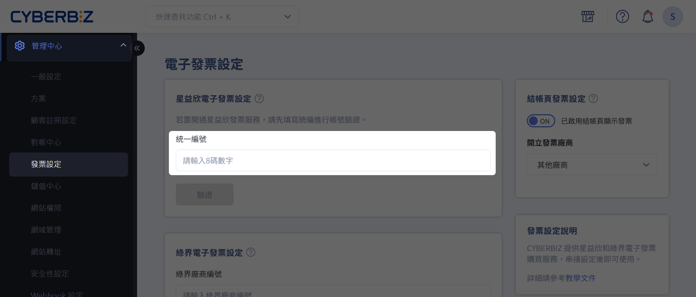{ title="輸入統一編號" }

3. 選擇方案並填寫購買資訊（方案、聯絡人、公司發票資訊）。  

	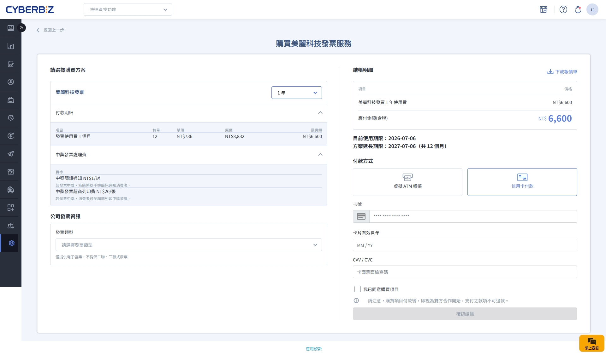{ title="選擇方案與購買" .screenshot }
	
4. 完成付款後，CYBERBIZ 將聯絡資料傳送給星益欣專員，協助開通帳號。 

    

    
    - 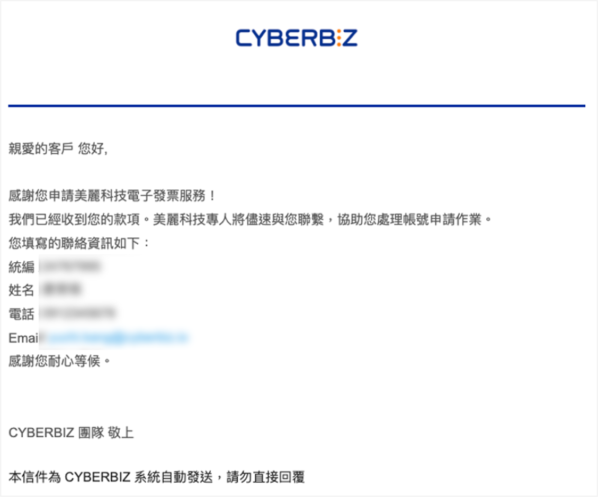{ title="系統通知信" }
    - 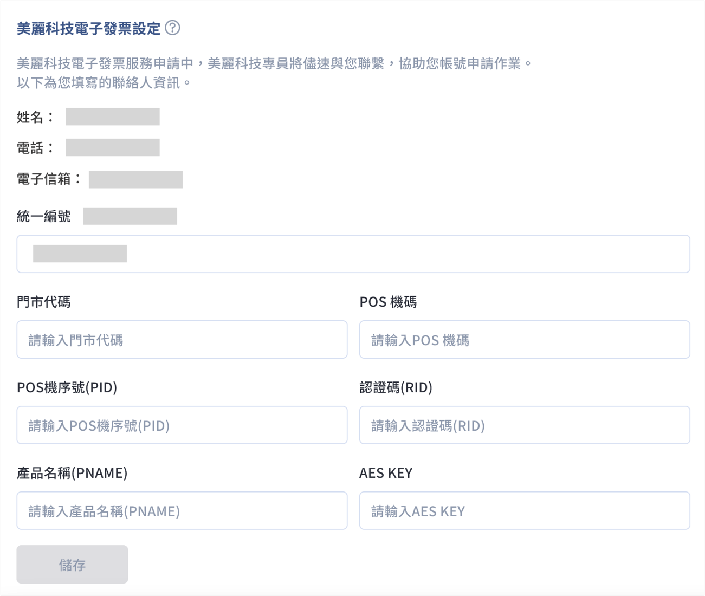{ title="後台顯示資訊" }
    
    

    !!! note "系統會發信通知，並呈現聯絡資訊；後台會顯示相關資訊。"

5. 帳號開通後，即可填寫串接資訊啟用服務。

## 串接並啟用服務

1. 登入星益欣後台，前往 **營業人資訊 > 選擇 POS 機 > 下載**。  

    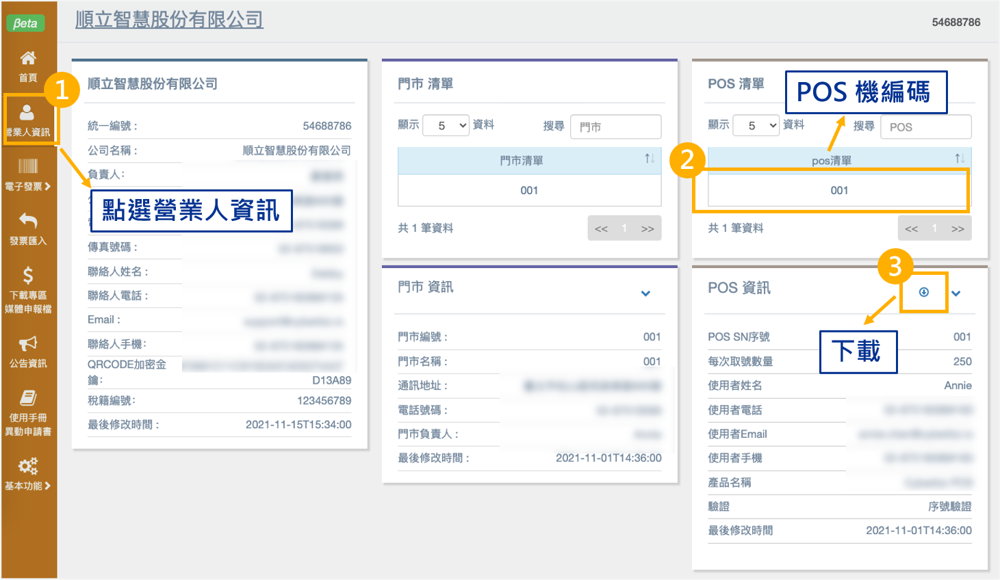{ title="下載 POS 機資訊" .screenshot }
    
2. 複製以下資訊：

    - 門市店碼    
    - POS機碼    
    - POS機序號(PID)    
    - 認證碼(RID)    
    - 產品名稱(PNAME)    
    - AES KEY    

    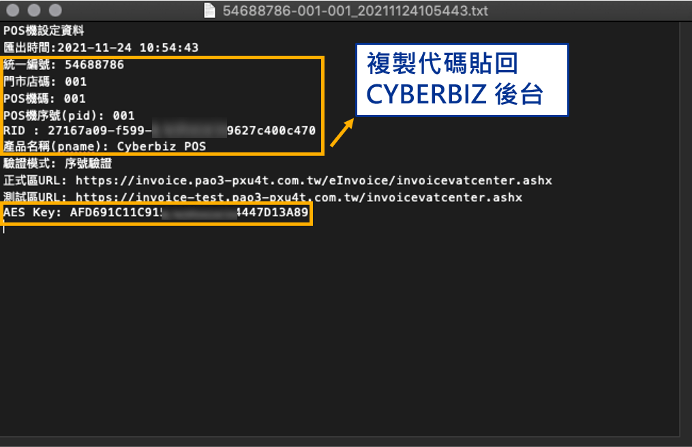{ title="複製串接資訊" .screenshot }
    
3. 貼入 CYBERBIZ 後台對應欄位：**管理中心 > 發票設定 > 星益欣電子發票設定**。

    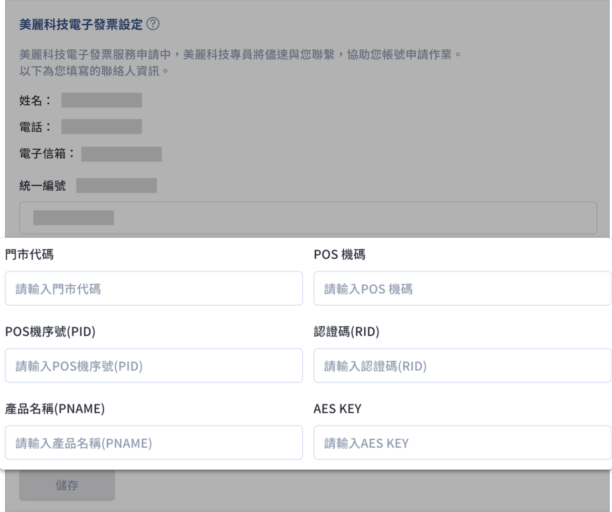{ title="貼入串接資訊" .screenshot }
    
4. 在 **結帳頁發票設定** 區塊，啟用 **結帳頁顯示發票功能** :lucide-toggle-right:；**開立發票廠商**，選擇 **星益欣電子發票**。  

    { title="啟用結帳頁發票" .screenshot }
    
5. 選擇發票開立時間（可複選）：

    - **付款時**：訂單付款狀態為「已收到款項」時，自動開立發票。  
    - **出貨時（建議）**：訂單配送狀態為「已出貨」時，自動開立發票。  
    - **取貨時**：訂單配送狀態為「已收貨」時，自動開立發票。  

	!!! tip "建議勾選 *出貨時* 開立發票"  
		建議選擇 *出貨時* 作為發票開立時間，避免客戶在出貨前取消訂單而導致發票作廢。
	
	!!! note " *取貨時* 限制"  
		- 僅適用於 CYBERBIZ 已串接貨態的運送方式，例如：黑貓、宅配通、順豐、綠界/EZShip 超取。  
		- 若使用自訂物流，系統無法串接貨態，配送狀態會停留在 *已出貨*。若發票開立時間僅勾選 *取貨時* 將無法自動開立發票，建議同時勾選 *出貨時* 開立發票。

6. 前往星益欣後台設定公司發票章圖片，開立發票將自動帶入發票章  

    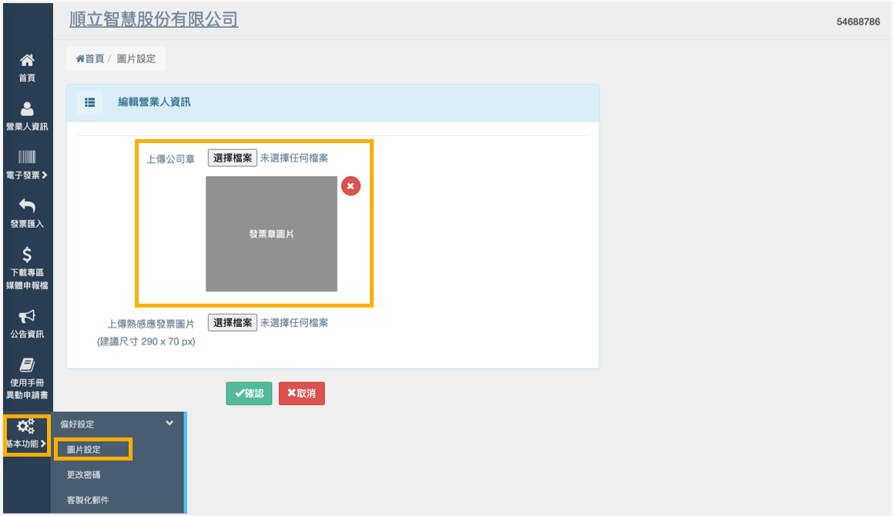{ title="設定公司發票章" .screenshot }

## 多 EC 站台共用帳戶

!!! warning "使用同一星益欣帳戶時，所有站台的發票將以該帳戶的 **同一統一編號開立**。"

若您有多個 EC 站台並希望以同一組星益欣帳戶開立發票，請先選擇其中一個站台購買方案並完成串接啟用流程。

1. 在指定站台完成[購買方案](#購買星益欣方案)與[串接啟用](#串接並啟用服務)。  
2. 前往其他 EC 站台，輸入與主站台相同的統一編號與串接資訊，並啟用結帳頁發票設定。

    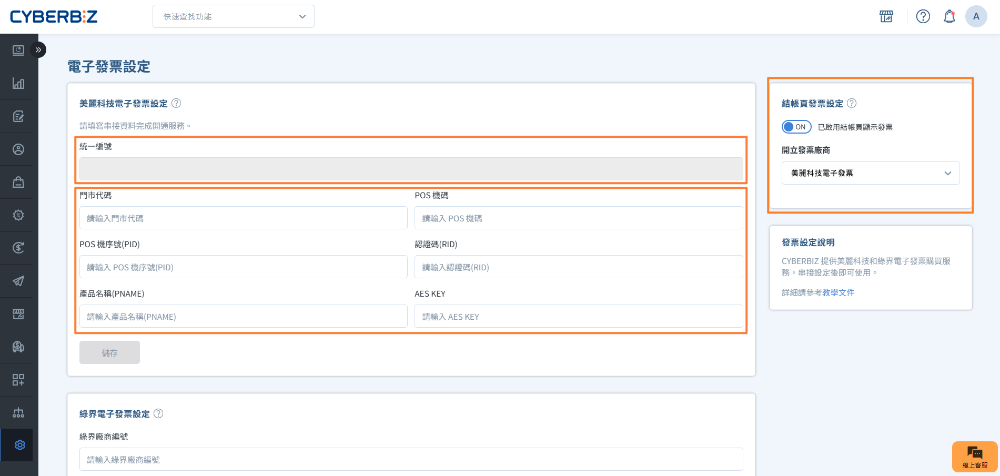{ title="多站台共用設定" .screenshot }

3. 完成結帳頁發票設定後即可開立發票。 

## 開立不同統編發票

若各站台需使用不同統一編號開立發票，請依照以下方式操作：

1. 每個站台輸入不同的對應統一編號，並 *分別購買方案*  及完成 *獨立串接*。
2. 系統將自動建立與各統編對應的星益欣帳戶。

!!! example "情境範例"
    - 多個 EC 站台各自開立不同統編發票 → 各站台需分別購買方案並完成串接。  
    - 同時營運 EC 與 POS → 每個通路需設定不同統編，分開購買方案並完成串接。

## 串接啟用對帳發票

[:lucide-tag:{ title="適用方案" }](../../resources/conventions#適用方案){ title="圖示慣例" } | 企業

若由 CYBERBIZ 代開消費者發票的企業版用戶，系統可串接您的星益欣帳戶，並於對帳流程中一鍵開立對帳發票。詳細操作可參考[一鍵開立請款發票](one-click-invoice-issuance.md){ title="一鍵開立請款發票" }。

1. 在 CYBERBIZ 電商後台，前往 **管理中心 > 對帳中心**。
2. 在 **對帳發票設定** 分頁，輸入統一編號。  

    !!! info "若尚未購買方案，請先完成[購買方案](#購買星益欣方案)。操作步驟與購買星益欣方案相似，但設定位置在對帳發票設定頁面。"

	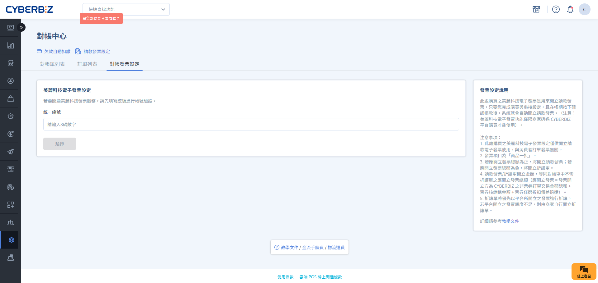{ title="對帳發票設定" .screenshot }

3. 串接並啟用帳戶。 

    !!! info "步驟與[串接並啟用服務](#串接並啟用服務)相同，僅設定位置不同，可搭配輔助操作。"

	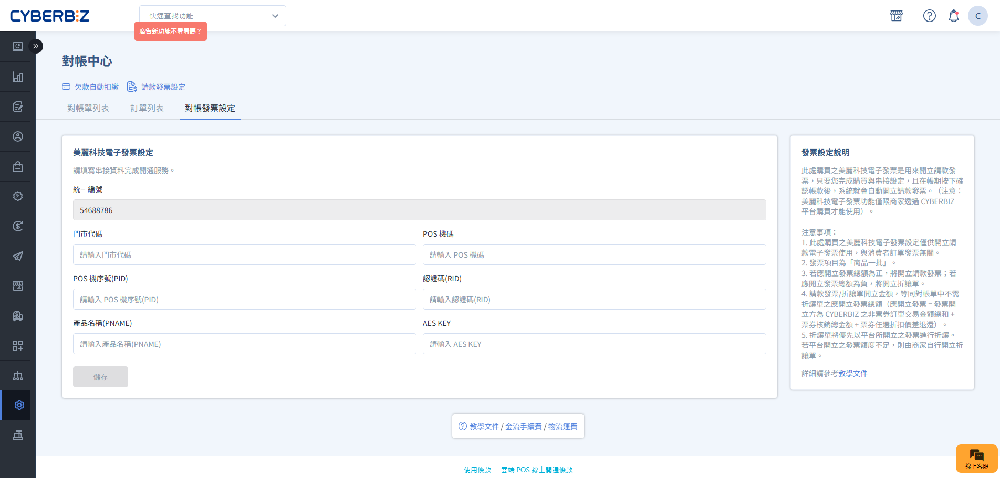{ title="對帳啟用串接" .screenshot }

## 續購方案

1. 在 CYBERBIZ 電商後台，前往 **管理中心 > 發票設定**。
2. 點選「續購」，填寫結帳資訊延長使用期限。

    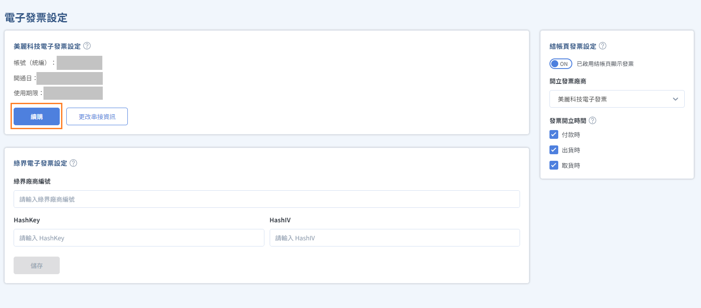{ title="續購方案" .screenshot }
    
3. 選擇付款方式：虛擬 ATM 或信用卡付款  

    { title="選擇方案與購買" .screenshot }

## 常見問題

??? quote "一組星益欣帳號可以開立不同統編的發票嗎？"
    不行，每個帳號僅綁定一個統編。需分別購買方案。

## 後續操作

-   :lucide-file-check:{ .lg .middle }  
    [__一鍵開立請款發票__](one-click-invoice-issuance.md)  
    企業版商家透過串接星益欣帳戶，在對帳中心一鍵完成發票開立。

-   :lucide-store:{ .lg .middle }  
    [__POS 教學文件__](../../pos/third-party/wixtar-e-invoice.md)  
    了解 POS 星益欣電子發票的子機計價方式與申請流程。

-   :lucide-file-input:{ .lg .middle }  
    [__匯入字軌教學文件__](https://www.cyberbiz.io/helpcenter/wp-content/uploads/美麗科技-增加字軌數量_匯入教學使用手冊-20230511.pdf)  
    將字軌匯入星益欣後台的操作手冊。

## 參考資料

- [星益欣官網](https://www.wixtar.com/product/e-invoice)
