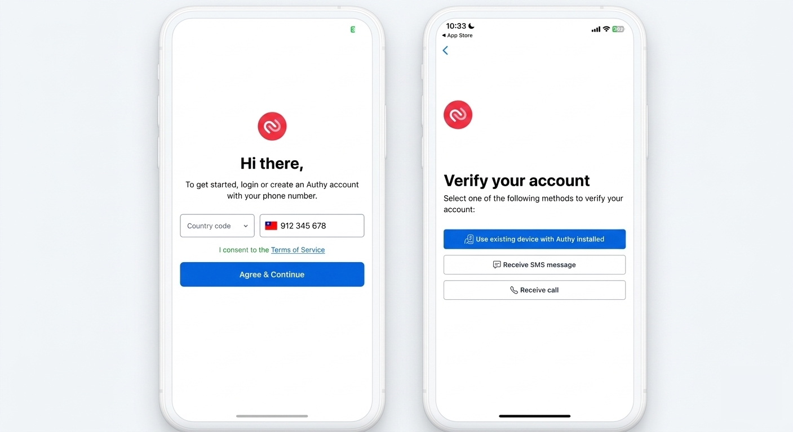
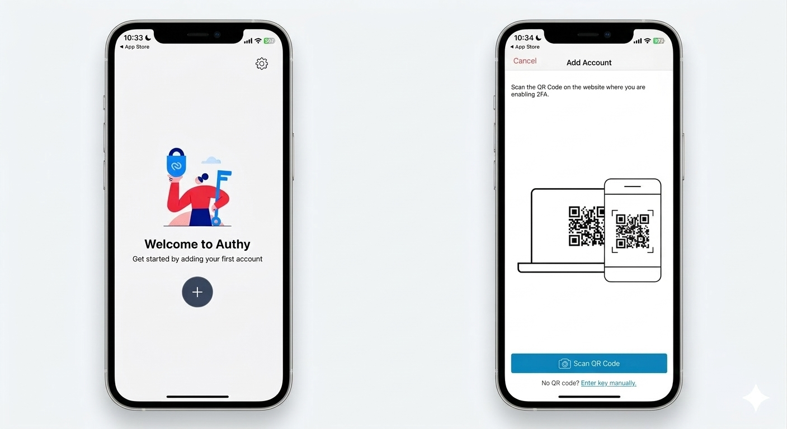
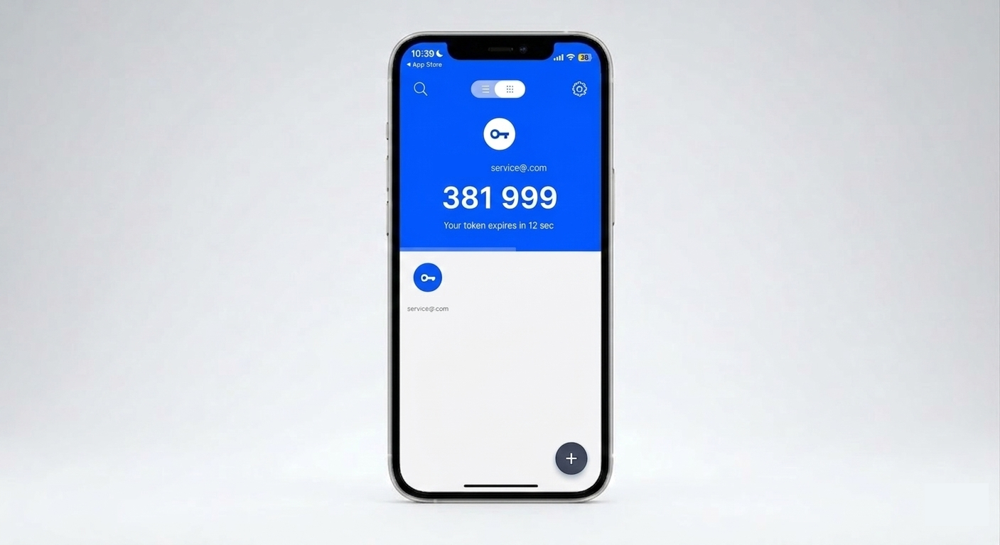

# 使用 Authy 啟用二階段驗證設定

使用 Authy App 設定 CYBERBIZ 帳號的二階段驗證 (2FA)，提升帳號安全性。
{ .subtitle }

{ .hero-page }

## 為什麼推薦使用 Authy

雖然市場上有許多驗證器（如 Google Authenticator），但 Authy 具備以下優勢：

- **多裝置同步**：支援 iOS、Android、Windows、macOS 及 Chrome 擴充功能，可在多台裝置上存取同一組驗證碼。
- **備份與還原**：提供加密備份機制，即使手機遺失也能快速恢復紀錄。
- **高度相容**：可完全相容所有支援 Google Authenticator 的網站。

---

## 操作步驟教學

### 步驟一：下載與註冊

1.  至[官網 :lucide-external-link:](https://authy.com/download/) 或應用程式商店下載 **Authy App**。
2.  **手機號碼註冊**：開啟 App 後，選擇國碼（台灣為 +886）並輸入您的手機號碼。
3.  **驗證身分**：選擇透過簡訊（SMS）或電話（Phone Call）接收驗證碼，輸入後即可完成帳戶建立。

### 步驟二：新增 CYBERBIZ 驗證帳戶

1.  進入 Authy App，點選「**+ Add Account**」。
2.  **掃描連結**：使用手機鏡頭掃描 CYBERBIZ 後台「[安全性設定](設定與管理二階段驗證.md){ data-preview }」頁面顯示的 **QR Code**。
3.  **手動輸入**：若無法掃描，可點選「Enter key manually」手動輸入後台提供的金鑰。
4.  **儲存帳戶**：設定完成後，App 下方會出現該網站專屬的驗證帳戶。

### 步驟三：取得動態驗證碼

1.  點擊 App 內的帳戶圖示，畫面會顯示一組 **6 位數驗證碼**。
2.  **時效限制**：驗證碼每 **30 秒** 會自動更新一次，請在倒數結束前將號碼輸入至登入頁面。

### 步驟四：開啟備份功能（強烈建議）

1.  進入帳戶設定，找到「**Authenticator Backups**」並開啟。
2.  **設定備份密碼**：這組密碼將用於加密您的備份資料。
3.  **重要警告**：備份密碼 **不會** 儲存在 Authy 伺服器，若遺失將無法取回或重設，請務必妥善紀錄保存。

---

## 注意事項
*   **備用碼保存**：在 CYBERBIZ 後台啟用 2FA 後，系統會提供 **10 組備用碼**，請務必下載並抄寫，以備手機遺失時緊急登入使用。
*   **時區同步**：若驗證碼輸入正確卻無法登入，請檢查手機的「日期與時間」是否設定為「自動同步」，時間偏差會導致代碼失效。

## 常見問題

??? quote "Authy 支援哪些裝置？"

    Authy 支援 iOS、Android、Windows、macOS 及 Chrome 擴充功能，可在多台裝置上同步存取驗證碼。

??? quote "若手機遺失該怎麼登入？"

    在啟用 2FA 時，系統會提供 10 組備用碼，請使用備用碼進行緊急登入。建議平時就將備用碼妥善保存。

??? quote "驗證碼有效期是多久？"

    驗證碼每 30 秒會自動更新一次，請在倒數結束前將號碼輸入至登入頁面。

