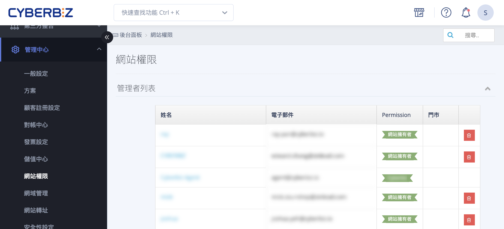
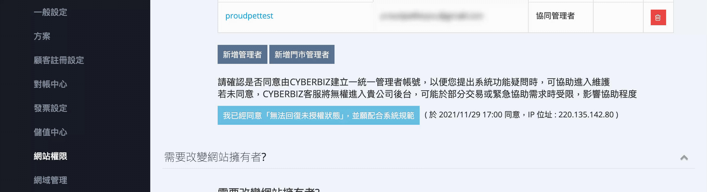

# 新增網站管理員並設定權限

新增網站管理員、設定管理者權限，並管理帳號安全與二階段驗證。
{ .subtitle }

{ .hero-page }

## 網站管理員與權限說明

新增網站管理者與權限設定功能可以讓商家有效分配後台管理工作，並根據員工職責嚴格限制其可查看或操作的範圍。

## 新增網站管理員步驟

1.  **進入路徑**：登入 CYBERBIZ 管理後台，前往 **管理中心 > 網站權限 > 管理者列表**。
2.  **執行新增**：點選頁面中的「**新增管理員**」按鈕。
3. **選擇權限**：勾選新增的使用者所[擁有的權限](#權限分類與細節說明){ data-preview }。
4.  **填寫資料**：填入新管理者的姓名、電子郵件、密碼等必要資訊，完成後按下「新增」即可儲存。

## 管理者權限設定與修改

若需調整已存在人員的權限，請依照以下流程：

1.  **開啟編輯**：在「管理者列表」中，**點擊欲編輯的管理員姓名**，即可進入權限設定頁面。
2.  **調整範圍**：根據商家內部規範，勾選或取消勾選該帳號可使用的功能。設定權限涵蓋範圍包含前台顯示與後台操作。
3.  **儲存設定**：修改完畢後點選 **儲存** 以套用變更。

## 權限分類與細節說明

系統權限主要分為以下幾大核心類別，每個類別下可更細分具體功能：

*   **總覽**：是否能查看後台儀表板數據總覽。
*   **顧客**：包含所有會員資料查看、VIP 設定及新會員匯入權限。
*   **訂單**：可細分一般訂單、定期定額訂單、電子票券訂單，以及各類物流託運單的管理權限。
*   **商品與商品群組**：決定管理者是否能編輯所有商品、標籤、庫存，或是特定促銷活動群組（如單品限時折扣、任選折扣）。
*   **資料匯出（安全重點）**：建議將 **「顧客匯出」與「訂單匯出」** 的權限縮到最小，僅開放給必要人員，以降低資安風險。
*   **網站設定**：包含一般設定、網域管理、Email/簡訊通知樣板等核心系統設置。

!!! note "詳細設定請參閱 [管理者權限與後台選單對應表](references/管理者權限與後台選單對應表.md){ data-preview }。"

## 重要權限規則與資安提醒

1.  **身分層級差異**：
    *   **網站擁有者 (Owner)**：擁有最大權限，可管理所有人員，且庫存管理不受限制。
    *   **協同管理者**：可使用多數 EC 功能，但 POS 店後台功能通常受限，且無法登入 POS 前台。
2.  **二階段驗證 (2FA)**：網站擁有者可於「管理人員安全驗證」中查看員工的開啟進度，並具備 **強制所有員工開啟二階段驗證** 的權限，以保護帳號安全。
3.  **人員刪除與停權**：若員工離職，可透過停權功能關閉其帳號，一經停權該員將無法登入系統。

## 常見問題

??? quote "為什麼新增的管理員無法登入後台？"
    可能原因如下：

    - **帳號尚未建立完成**：請確認新增管理員時已正確填寫電子郵件與密碼並成功儲存。
    - **帳號已被停權**：若帳號被設定為停權狀態，該使用者將無法登入。
    - **未完成二階段驗證**：若網站已強制啟用 **二階段驗證（2FA）**，管理員必須先完成設定才能登入。

    建議由 **網站擁有者（Owner）** 或具備管理權限的人員檢查帳號狀態。

??? quote "如何修改既有管理員的權限？"
    請依照以下方式操作：

    1. 前往 **管理中心 > 網站權限 > 管理者列表**。
    2. 點擊欲修改的 **管理員姓名**。
    3. 勾選或取消勾選需要的功能權限。
    4. 點擊 **儲存** 完成更新。

    修改後，權限會立即生效。

??? quote "可以限制管理員只查看部分功能嗎？"
    可以。在新增或編輯管理員時，您可以依照實際需求 **勾選特定功能權限**，例如：

    - 只允許查看 **訂單**
    - 只允許管理 **商品**
    - 不開放 **資料匯出**

    透過細緻的權限設定，可以確保每位員工只接觸與其工作相關的系統功能。

??? quote "哪些權限屬於高風險權限？"
    以下權限涉及 **大量資料存取或系統核心設定**，建議僅開放給必要人員：

    - **顧客資料匯出**
    - **訂單資料匯出**
    - **網站設定**
    - **管理員管理**

    適當限制高敏感權限，可降低資料外洩或誤操作風險。

??? quote "網站擁有者（Owner）與一般管理員有什麼差異？"
    **網站擁有者（Owner）** 為最高權限角色，具備以下能力：

    - 管理所有管理員帳號
    - 設定所有系統權限
    - 強制啟用 **二階段驗證（2FA）**
    - 存取所有後台功能

    一般管理員則只能使用被授權的功能，無法修改系統最高權限設定。
