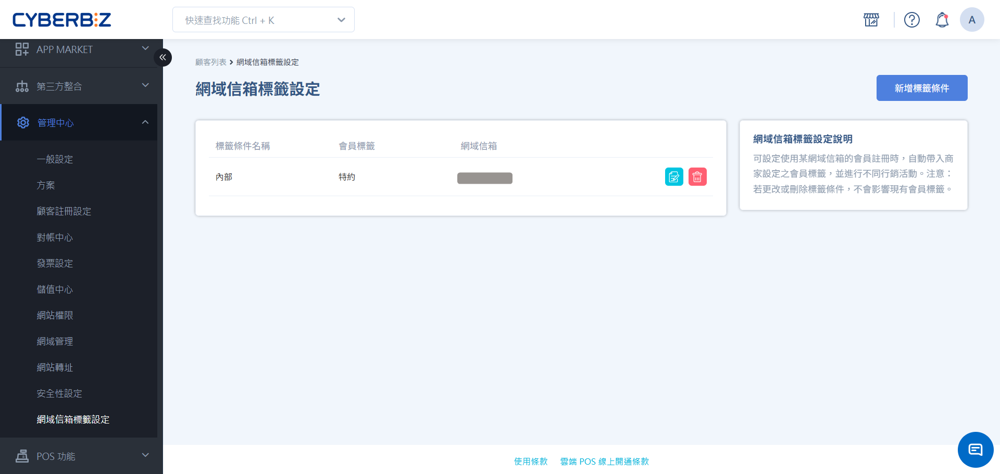
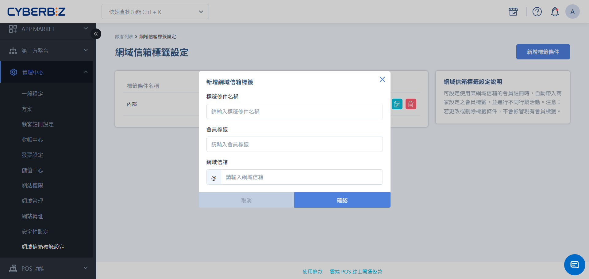

# 為特定網域信箱套用指定會員標籤

透過網域信箱設定，您可以讓特定組織（如：企業員工、學校機構成員）在註冊完成後，由系統自動為該會員貼上指定的標籤，以便後續提供專屬的行銷優惠或分眾服務。
{ .subtitle }

[:lucide-tag:{ title="適用方案" }](../../resources/conventions#適用方案) | 企業
{ .doc-badge }

{ .hero-page }

!!! tip "應用情境"
    - **企業員購活動**：設定公司網域（如 `@cyberbiz.at`），員工註冊後自動貼上 **員購** 標籤，享有專屬折扣。
    - **特約組織管理**：針對合作夥伴或特定教育單位網域，自動標記以便進行分眾推播。
    - **品牌大使追蹤**：為特定合作網域的成員註冊時自動分類，簡化名單整理流程。

## 使用須知

在設定網域標籤規則前，請留意以下限制：

- **生效對象**：僅適用於規則設定後 **新註冊** 的會員。設定前已存在的會員，系統不會溯及既往自動補標。
- **匯入限制**：透過 **Excel 大量匯入** 的顧客資料，**不支援** 此自動貼標功能。

     > 使用 [Excel 大量匯入會員](../members/匯入與批次編輯會員/#excel-核心欄位說明)，您只需在範本中填寫標籤欄位，匯入時即可自動完成標籤套用。

- **連動影響**：修改或刪除現有的網域標籤設定，不會影響已獲得該標籤的會員。
- **格式規範**：請務必輸入正確的信箱網域（@之後的字串），空白或拼法錯誤將導致自動貼標失敗。

## 操作流程

### 步驟 1：建立標籤條件

1. 登入 CYBERBIZ 管理後台，前往 **管理中心 > 網域信箱標籤設定**。
2. 點擊頁面右上方 **新增標籤條件**。

### 步驟 2：填寫設定內容

在彈出視窗或編輯頁面中輸入以下資訊：

1. **標籤條件名稱**：輸入管理用的識別名稱（如：2024企業合作專案）。此欄位僅供後台辨識用。
2. **會員標籤**：輸入系統欲自動貼上的標籤名稱（如：員購、特約夥伴）。
    - 若標籤尚未建立，輸入後即可新增。
3. **網域信箱**：輸入欲過濾的網域字串。
    - **格式需求**：僅需輸入 `@` 之後的內容。
    - **範例**：若為 `name@gmail.com`，請輸入 `gmail.com`。

### 步驟 3：儲存並驗證

1. 確認資料無誤後，點擊 **確認** 儲存設定。
2. **測試建議**：可使用符合該網域的測試信箱實際註冊一筆帳號，隨後前往 **會員 > 所有會員** 確認該筆帳號是否已正確帶入標籤。

## 常見問題

??? quote "如果一個會員符合多個網域條件，會同時貼上標籤嗎？"
    若會員註冊時的 Email 網域同時符合多條規則（例如：一個子網域規則與一個母網域規則），系統將會依據匹配的規則同時貼上所有對應的標籤。

??? quote "修改了網域標籤設定，舊會員的標籤會跟著變嗎？"
    不會。網域標籤設定是一種 **註冊當下** 的觸發機制。一旦會員已註冊並貼標，後續規則的修改或刪除都不會變動該會員已持有的標籤。

## 延伸閱讀

- :lucide-tags:{ .lg }   
  [__管理個別會員標籤__](../members/管理會員檔案/#任務五行銷標籤與分眾管理)       
  了解如何手動為個別會員新增或移除標籤。

