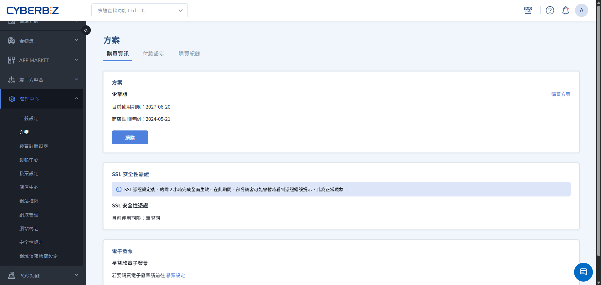
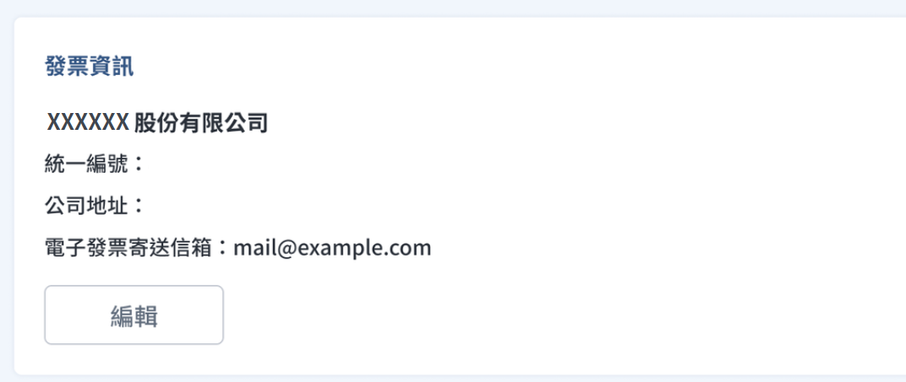
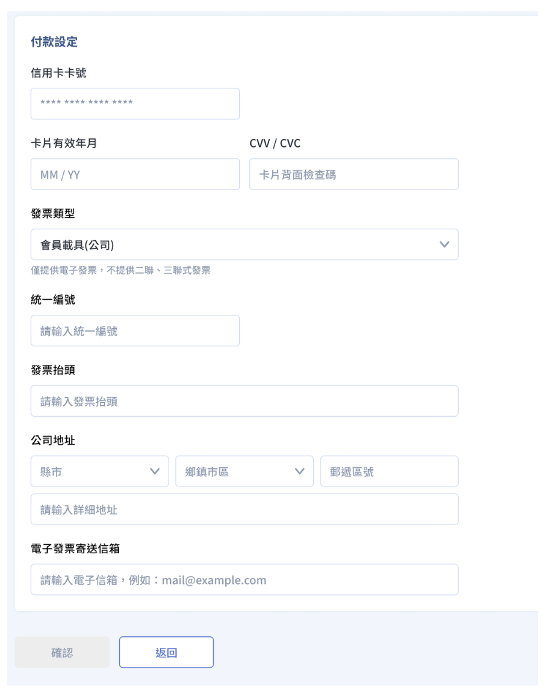
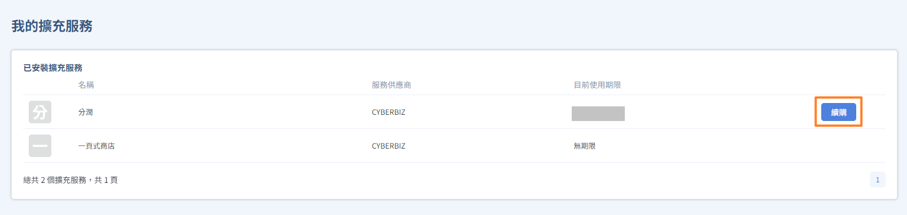

# 管理方案續購與自動續約

為了確保您的商店營運不中斷，您需要定期維護商店方案、SSL 安全性憑證及擴充服務的效期。CYBERBIZ 提供「手動續購」與「自動續約」兩種方式，幫助您彈性管理服務時限。
{ .subtitle }

{ .hero-page }

## 使用須知

- **人員權限**：網站擁有者可視需求控管後台人員對於「續購與自動續約」的操作權限。
    - 請至 **管理中心 > 網站權限**，針對 **方案** 項目進行開啟或關閉設定。
    - 擁有 **方案** 權限的後台人員皆可操作續購與信用卡變更，請商家審慎開放。

## 版本功能對照表

不同版本的商店方案在續購與自動續約的操作範圍上有所差異，請參考下表確認您的權限：

| 服務項目 | 專業版 | 進階/高手版 | PLUS 版 | 企業版 |
| :--- | :--- | :--- | :--- |:--- |
| **站台方案續購** | 僅限方案升級 不支援續購 | 支援 | 支援 （需法務審核） | 支援 （需法務審核）|
| **站台方案自動續約** | 不支援 | 支援 | 不支援 | 不支援 |
| **SSL 憑證續購** | 支援 | 支援進階版 (高手版無須購買)  | 無須購買 | 無須購買 |
| **SSL 憑證自動續約** | 不支援 | 支援 | 無須購買 | 無須購買 |
| **擴充服務續購** | 不支援 | 不支援 | 支援 | 無須購買 |

!!! info "SSL 憑證備註"
    - **使用 CYBERBIZ 子網域**：不限版本皆包含 SSL 憑證，無需自行續購。
    - **高手版及所有 PLUS 版使用自有網域**：SSL 憑證隨方案贈送，效期與方案同步。

## 前置作業：設定付款與發票資訊

若您欲使用「自動續約」功能，或希望在續購時快速結帳，請先完成信用卡與發票資訊的設定。

### 1. 綁定信用卡

1. 前往 **管理中心 > 方案 > 付款設定頁籤**。
2. 點選 **新增付款設定**。
3. 輸入信用卡資訊並點選 **確認**。

    - 系統僅限儲存 **一張** 信用卡號。
    - 綁定後，具備  **方案** 查看權限的後台人員，將收到 Email 通知。

### 2. 設定發票資訊

1. 在同一頁面下方的 **發票資訊** 區塊，點選 **編輯**。
2. 填入您的電子發票收件資訊（如統編、抬頭等）。
3. 點選 **確認**。未來進行續購交易後，系統將依此資訊開立發票。

## 核心任務：手動續購

手動續購適用於所有需要延長服務效期的場景。

### 1. 續購商店方案與 SSL 憑證
1. 前往 **管理中心 > 方案 > 購買資訊**。
2. 找到欲延長的項目，點選 **續購**。
    
3. 填寫結帳資訊，選擇付款方式（虛擬 ATM 轉帳或信用卡）。
    
4. 完成付款後，系統將自動延長使用期限。

!!! info "PLUS 版續約審核規範"
    PLUS 版用戶點選續購後，需勾選同意合約並上傳 **變更登記表**。待 CYBERBIZ 法務審核（約 3-5 個工作天）通過後，方可進行後續付款流程。

### 2. 續購擴充服務

1. 前往 **APP MARKET > 我的擴充服務**。
2. 在額外加價購買的功能旁，點選 **續購**。
3. 輸入訂單資訊並完成付款。
    - 11 選 2 選配功能無使用期限，無需續購。

!!! info "方案續購與增購說明"
    此處僅提供現有方案之續購服務；若有新功能之增購需求，請洽詢 CYBERBIZ 專員。

## 核心任務：設定自動續約

自動續約可避免因疏忽導致方案過期。此功能僅限 **進階版** 與 **高手版** 使用。

### 1. 啟用自動續約

1. 確保已於 **付款設定** 頁籤完成信用卡綁定。
2. 前往 **管理中心 > 方案 > 購買資訊**。
3. 點選 **自動續約**，確認續約週期後點選 **確認**。
    - 系統將於合約到期前 **10 日** 自動進行扣款。

### 2. 調整或更換週期

- 若欲更改自動續約週期，請點選 **更換週期**。
- 務必於 **扣款日前** 完成更改，方能於下個週期生效。

### 3. 取消自動續約

- 若欲升級、手動續購或停止自動扣款，請點選 **停止自動續約**。
- 最遲須於方案到期前 **15 日** 取消，否則系統仍會執行下期扣款。

