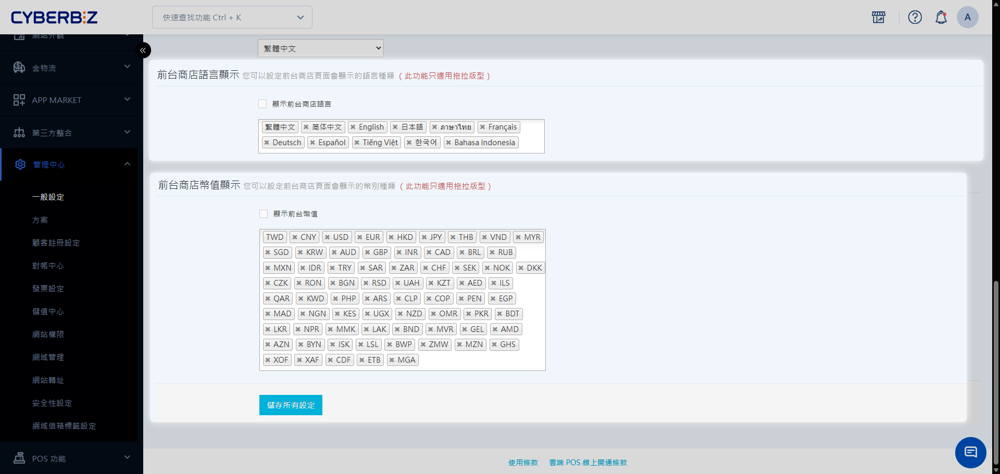

# 設定前台多國語言與多幣別

多國語言與多幣別功能可協助商家建立本地化的官方網站，透過提供母語介面與熟悉幣別，提升品牌國際化形象並優化海外消費者的購物體驗。
{ .subtitle }

[:lucide-tag:{ title="適用方案" }](../../resources/conventions#適用方案) | 所有PLUS / 企業
[:lucide-bolt:{ title="適用功能" }](../../resources/conventions#適用功能) | 拖拉版型
{ .doc-badge }

{ .hero-page }

!!! info "版本差異說明"
    - 「多國語言與多幣別」在 PLUS 方案中屬於選配模組（11 選 2），商家需確認已選配該模組方可使用。企業版則直接內建此功能。


!!! tip "應用情境"
    - **開拓海外市場**：建置英文或日文版站台，吸引海外潛在客戶直接在官網下單。
    - **提升品牌信任感**：透過精確的本地化用語與當地幣別顯示，消除消費者的跨國購物疑慮。
    - **SEO 國際優化**：透過多語系內容建置，提升網站在不同語言搜尋引擎中的曝光度。


## 使用須知

**這份文件是否符合您的需求？**

本文件專門指引如何建置 **官網前台** 的多語系環境，旨在讓 **消費者** 看到翻譯後的商店內容與在地幣別。

- **如果您是要**：為各國消費者建立多語系官網、修改前台翻譯、設定顯示幣別，**請繼續閱讀**。
- **如果您是要**：更改商家自用的 **管理後台介面** 語言（如：將後台選單改為英文），請參考 [設定管理後台顯示語言與幣別](檔案連結)。

**在啟用多國語系功能前，請務必確認以下技術規範與邏輯：**

- **支援語言與幣別**：目前支援繁中、英文、日文、簡中、泰文、法文、德文、西班牙文、越南文、韓文、印尼文。幣別則支持絕大多數主流貨幣。如需開通其他特殊語系與幣別，請洽客服。
- **AI 翻譯說明**：部分語系（如泰、法、德、西、越、韓、印尼文）係透過 AI 翻譯，商家可手動檢查並修正不精確的用詞。
- **自動選擇語言**：系統會根據消費者的瀏覽器語言自動選擇顯示語言。
- **結帳幣別**：系統會根據消費者地區轉換顯示幣別，但 **結帳時仍以商店主要幣別結算**（例如：台灣站以 TWD 結帳）。
- **版型限制**：**僅支援拖拉版型使用**。請選擇帶有 `拖拉設定` 與 `多國版型` 標籤的主題。
- **方案與開通**：
    - **企業版**：系統後台自動開通，請直接至後台新增語言或幣別。
    
        !!! info "了解您的商店預設顯示設定"
            - 若您於 2025 年 8 月 28 日後開站，系統預設 **開啟** `顯示前台商店語言` 與 `顯示前台幣值`，並預設顯示 `中文`、`台幣`。
            - 若您於 2025 年 8 月 28 日前開站，且您先前尚未開通前台多國語言與多幣別功能，則系統預設 **關閉** `顯示前台商店語言` 與 `顯示前台幣值`。
            - 若您於 2025 年 8 月 28 日前開站，且您先前已開通前台多國語言與多幣別功能，則系統會自動套用您設定顯示的語言及幣別。

    - **PLUS版**：為選配功能，需聯絡 CYBERBIZ 客服開通後方可設定。


## 操作流程

### 步驟 1：啟用前台語言與幣別

1. 登入 CYBERBIZ 管理後台，前往 **管理中心 > 一般設定**。
2. 找到 **前台商店語言顯示** 區塊，勾選欲顯示的 **語言**。
3. 找到 **前台商店幣值顯示** 區塊，勾選欲顯示的 **語言**。
4. 點擊 **儲存**。

!!! info "一頁式商店注意事項"
    新增一頁式商店時會套用站台當下的語言與幣別。若日後站台設定變更，已建立的一頁式商店將維持原狀，如需更新請重新建立商店。

### 步驟 2：建置多語系內容文字

前台顯示的文字需在後台各模組分別輸入對應語系：

1. 前往支援多語系的編輯頁面（如：商品編輯、行銷活動設定、選單設定等）。
2. 於頁面中尋找 🌐 **圖示** 或 **語系標籤欄位**。
3. 點選圖示切換至目標語言，並輸入對應的翻譯內容。
4. 儲存變更。

**主要建置範圍：**

- **商品管理**：商品名稱、描述、分類名稱。
- **行銷活動**：優惠活動名稱、期間限定首購禮內容。
- **網站外觀**：選單項目名稱、自訂頁面內容、部落格文章。
- **訊息通知**：Email 通知樣版內容。

!!! tip "文件搜尋技巧"
    若欲查詢多國語系相關的建置設定，可在此網站搜尋列中輸入 **多國** 標籤。系統將篩選出具備多國支援的功能指引，協助您快速完成跨境貿易配置。

### 步驟 3：修改系統預設文字（非必要）

系統內建的按鈕或結帳頁文字（如：Logout、Amount）已透過AI系統翻譯。可依需求編輯字典檔，進行人工修正、新增系統無支援語系：

#### 前台一般文字

1. 前往 **網站外觀 > 套版主題管理 > CSS/HTML 編輯器**。
2. **編輯與擴充字典檔**： 進入語系管理介面後，請依據下列情境執行相對應的操作。
    - **微調AI翻譯文字**： 點擊 **字典檔**，找到目標語系的 `__.yml`（如西班牙語為 `es.yml`）。
    - **新增系統無支援語系**：點擊 **新增字典檔**，輸入目標語系，複製英文字典檔(`en.yml`) 語法，貼至目標語系字典檔。
3. 在對應欄位編輯翻譯文字。

    !!! example "語法填寫範例"
        原始檔案

        ```
          es:
          account:
          account_logout: Logout
          amount: 'Amount: {{ q }}'
          ...下略
        ```

        以西班牙文進行修改為例

        ```
          es:
          account:
          account_logout: cerrar sesión
          amount: 'Cantidad: {{ q }}'
          ...下略
        ```

4. 點擊 **儲存**。

#### 結帳頁文字

1. 前往 **網站外觀 > 套版主題管理 > CSS/HTML 編輯器**。
2. 聯繫 CYBERBIZ 客服取得字典檔，將字典檔名稱改為 `locales/_目標語系_.yml`（如西班牙語為 `locales/es.yml`）。
3. 在對應欄位編輯翻譯文字。

    !!! example "語法填寫範例"
        原始檔案

        ```
          es:
          order:
          about: "(around %{amount, moneyformat})"
          accepts_marketing: I agree to receive merchant's newsletter and marketing messages.
          ...下略
        ```

        以西班牙文進行修改為例

        ```
        es:
        order:
        about: "(alrededor de %{amount, moneyformat})"
        accepts_marketing: Acepto recibir el boletín informativo y los mensajes de marketing del comerciante.
        ...下略
        ```
4. 點擊 **儲存**。


!!! warning "保留系統參數"
    請勿更動 `{{...}}` 或 `%{...}` 等系統預設參數，必須保留其原始格式與拼法，僅修改周邊文字。


## 前台語言與幣別切換

消費者可根據個人需求，隨時於網站前台手動調整顯示語言與幣別，設定位置依裝置類型區分如下：

- **電腦版**：位於頁面右上角的 **頂端導覽列** 區域。
- **手機版**：點擊左上角三條線圖示展開 **側邊選單**，滑動至選單 **最底部** 即可看到切換選項。


## 常見問題

??? quote "第三方區塊或系統固定文字可以修改嗎？"
    - **第三方區塊**：來自外部廠商（如 Line 分享按鈕），無法直接編輯，需視廠商支援程度。
    - **系統固定文字**：如語言選擇框內的文字，屬於系統核心元件，無法進行編輯。


