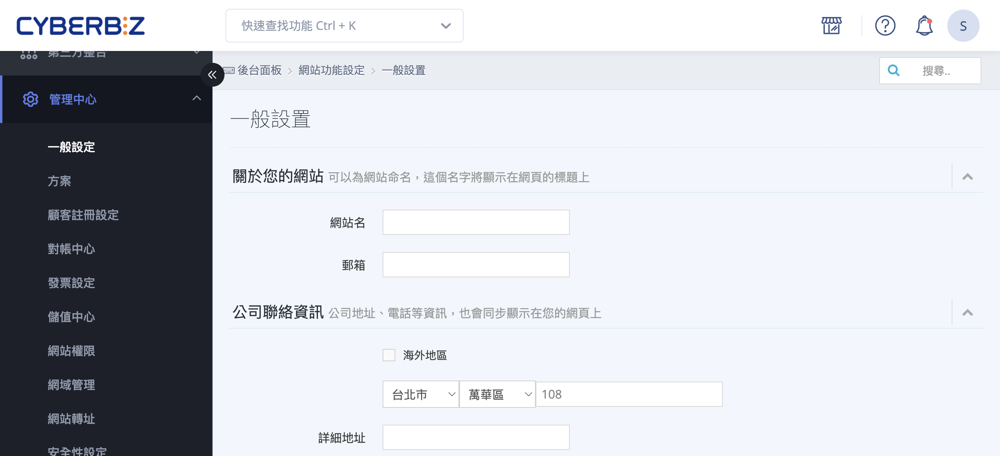
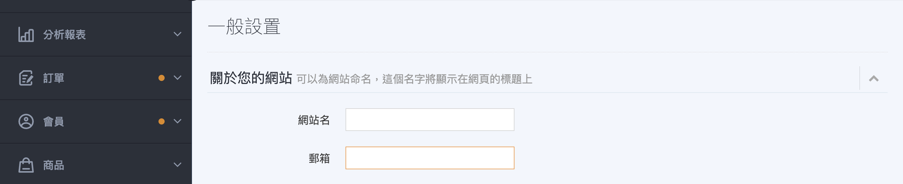
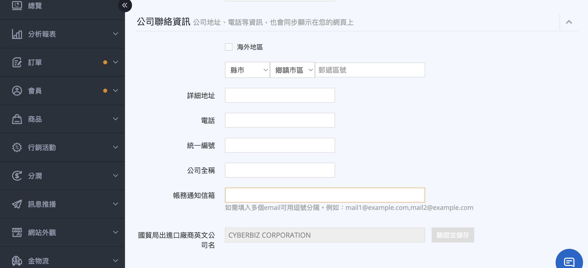
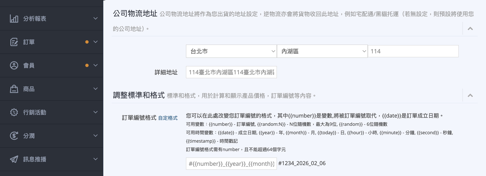
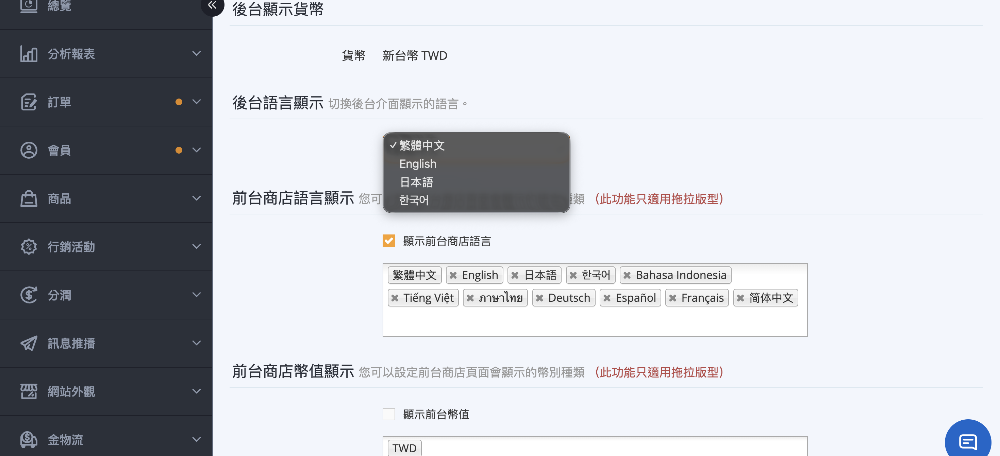

# 設定網站基本資訊

進行網站基本資訊、公司聯繫方式、物流地址及後台語系等核心設置。
{ .subtitle }

{ .hero-page }

## 網站基本資訊設定說明

!!! warning "注意事項"

	- 填寫完成後，務必拉到頁面最下方點選 **儲存設定**，更改才會生效。
	    
	- 部分設定會涉及法律合規性（如 **營業人資訊揭露** ），建議商家應確實填寫正確的品牌名稱與統編。
	    
	- 若您的網站有使用 DHL 物流，必須在一般設定中填寫正確的 **統一編號** 與 **國貿局登記之英文公司名** 並點擊驗證，才能成功開通該功能。

## 網站基本資訊設置路徑

請前往後台：**管理中心 > 一般設定**。

## 詳細設定項目說明

### 關於您的網站

- **網站名：** 用於設定網站名稱，限制為 **中文字 15 字以內**、**英文字 30 字以內**。

- **郵箱：** 此信箱主要用於接收顧客提交的 **退貨申請通知**。

### 公司聯絡資訊

- **公司資訊：** 填寫公司地址、電話等，這些資訊會 **同步顯示在網站前台** 供消費者查看。

- **帳務通知信箱：** 所有的 **帳務通知信件** 將寄至此處，若需設定多個 Email，請使用 **半型逗號 (,)** 分隔。

### 公司物流地址與訂單格式

- **公司物流地址：** 請務必完整填寫，此內容會預設作為黑貓、宅配通等物流的 **寄件人地址**。

- **訂單編號格式：** 點擊 **自訂格式** 可自訂訂單編號格式，但 **必須包含 `{{number}}` 變數**，詳情請參考後台操作提示。

### 貨幣與語言顯示設定

- **後台顯示貨幣：** 設定後台管理介面所使用的幣值。

- **後台語言顯示：** 商家可將管理介面切換為 **繁體中文、English、日本語、한국어**（韓文）。

- **前台商店語言顯示*：** 設定前台商店頁面會顯示的語言種類。

- **前台商店幣值顯示*：** 設定前台商店頁面會顯示的幣別種類

> :lucide-asterisk: 前台商店語言與幣值顯示僅適用 拖拉版型。

<!--
### 註冊跳轉頁面

- **適用版本：** 此為 **企業版 / 高手PLUS版** 專用功能。

- **功能：** 系統預設註冊完會導向「會員專區」，若商家想提高轉換率，可開啟此功能並輸入網址，讓消費者註冊後 **直接跳轉至指定的活動頁面或首頁**。
--> 

## 常見問題

??? quote "網站基本資訊設定後，為什麼前台沒有顯示更新內容？"
    請確認已將頁面最下方的 **儲存設定** 按鈕點選完成，部分變更需重新整理前台頁面或清除瀏覽器快取才會生效。

??? quote "公司統編與英文名稱驗證失敗，該怎麼辦？"
    請確認填寫的統編及英文公司名稱與國貿局登記資訊一致，並確保無空格或特殊符號，填寫完成後再點擊 **驗證**。

??? quote "訂單編號自訂格式如何設定？"
    點擊 **自訂格式** 後可輸入自訂文字與變數，但格式中必須包含 `{{number}}` 變數，例如 `EC{{number}}`，才能正常生成訂單號碼。

??? quote "可以同時設定多個帳務通知信箱嗎？"
    可以，請用 **半型逗號 (,)** 將多個 Email 分隔開，例如 `finance1@company.com,finance2@company.com`。

??? quote "前台商店語言與幣值顯示在哪些版本可用？"
    此功能僅適用 **拖拉版型**，其他版型將不會顯示此選項。

??? quote "網站名稱有字數限制嗎？"
    有，**中文字限制 15 字以內**，**英文字限制 30 字以內**，超過將無法儲存。