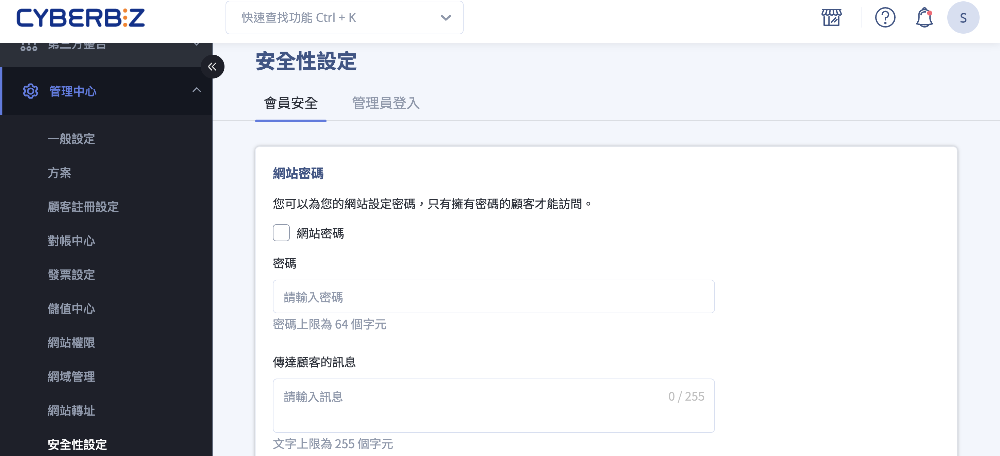
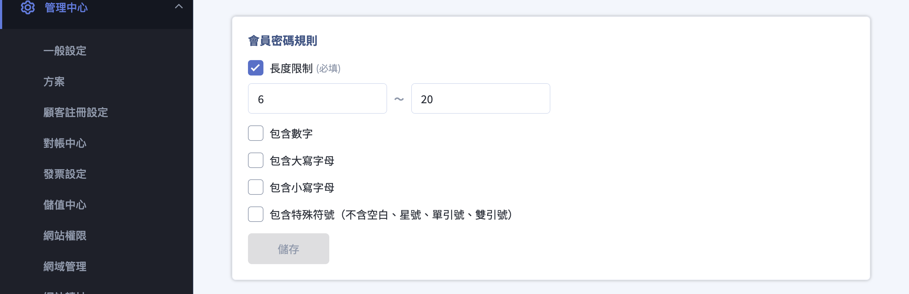
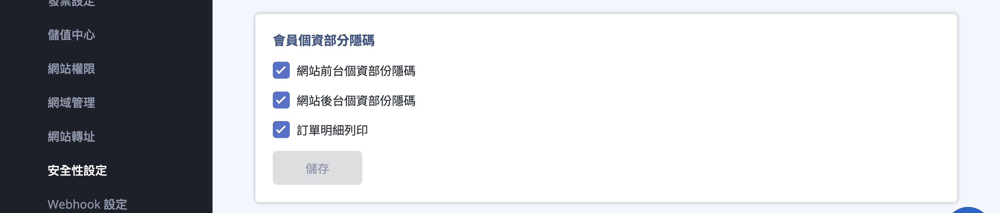
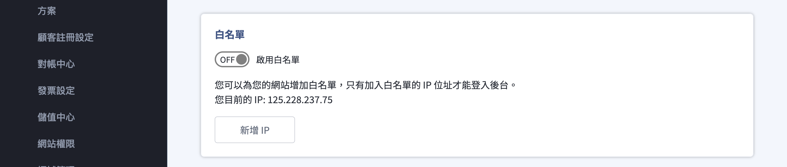
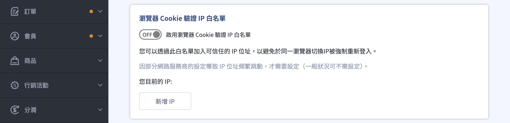
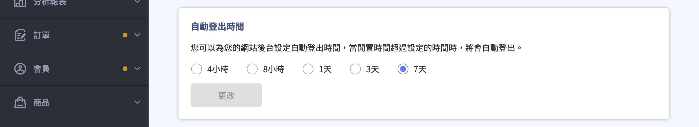
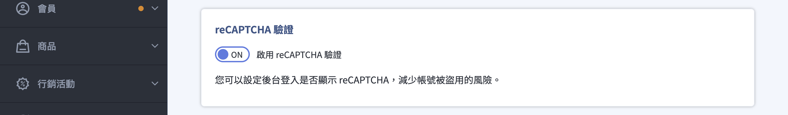
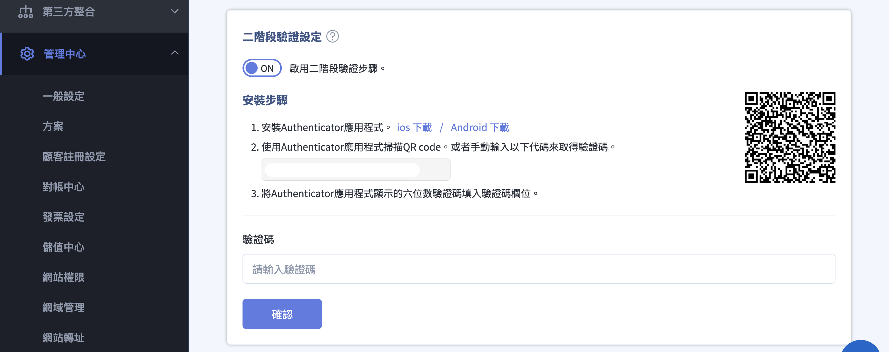

# 設定網站安全性

設定網站及後台登入安全，包含會員密碼規則、個資隱碼、管理員IP白名單與二階段驗證等。
{ .subtitle }

{ .hero-page }

## 安全性設定說明

**安全性設定** 旨在透過多種機制加強系統安全性以及保護顧客隱私安全。設定路徑為：後台 **管理中心 > 安全性設定**。

安全性設定主要分為兩大範疇：

- [會員安全](#會員安全設定)：控管網站前台的訪問權限與資料保護。
- [管理員登入安全](#管理員登入安全)：防範後台帳號遭盜用或非授權存取。

<!--

**功能適用方案對照**

|**功能項目**|**企業版**|**PLUS版**|**一般版**|
|---|---|---|---|
|會員密碼規則設定|:lucide-check:|:lucide-x:|:lucide-x:|
|後台個資隱碼|:lucide-check:|:lucide-check:|:lucide-x:|
|二階段驗證 (2FA)|:lucide-check:|:lucide-check:|:lucide-check:|

-->

## 會員安全設定 

> :lucide-navigation: 路徑：管理中心 > 安全性設定 > **會員安全**。

### 網站密碼

可為整個網站增加訪問密碼。此功能常用於網站 **維護管理階段**，或僅欲針對特定客戶群（如批發商）開放訪問情境。

### 會員密碼規則

> :lucide-lock: 此功能僅適用 **企業版** 方案。

可設定會員密碼的安全規則，如：

- 密碼長度
- 是否必須包含數字
- 是否必須包含大小寫字母
- 是否必須包含特殊符號

### 會員個資部分隱碼

> :lucide-lock: 此功能僅適用 **PLUS 版 / 企業版** 方案。

開啟後，系統會遮蔽指定欄位的會員資訊，以保護個資安全。例如，手機號碼僅顯示前三碼與最後一碼。

- **網站前台個資部分隱碼***：顧客在前台查看會員資料時，部分資訊將自動隱藏。

- **網站後台個資部分隱碼***：後台管理人員查看會員資料時，敏感資訊將部分隱碼。

- **訂單明細列印**：列印訂單時，部分會員個資同樣會被隱碼，避免外泄。

> :lucide-asterisk: 網站前台個資部分隱碼 / 網站後台個資部分隱碼 僅適用 **企業版** 方案。

<!--
- **訪問限制地區黑名單**：商家可以點選特定國家或區域，**限制該地區用戶的訪問權限**。被限制地區的用戶訪問網頁時會看到無權限存取的提示畫面。
-->

## 管理員登入安全 

> :lucide-navigation: 路徑：管理中心 > 安全性設定 > **管理員登入**。

### 白名單

商家可將指定的 IP 地址加入白名單，並點選「啟用白名單」。

!!! warning "注意事項"

	- 啟用後，**僅有在清單內的 IP 位置可以登入後台**，不在名單上的人將會顯示 "403 Forbidden" 訊息而無法進入。
	- 請勿使用 **浮動 IP**（如手機 WiFi 分享）進行設定，否則 IP 異動後將導致無法登入。若因白名單鎖定需由官方工程人員介入處置，將酌收服務工本費。

### 瀏覽器 Cookie 驗證 IP 白名單

- 系統為防止駭客盜取 Cookie 偽裝登入，當偵測到 IP 位址異動時會強制重新登入。  
- 若您的辦公室 IP 屬於固定幾組 IP 跳動，可在此設定白名單以避免頻繁被要求重新登入。

### 自動登出時間

可設定管理員在閒置多久後自動登出後台，系統 **預設為 8 小時**。

### reCAPTCHA 驗證

開啟後提供機器人驗證機制，可有效識別非人類操作，減少帳號遭盜用的風險。

### 二階段驗證設定 (2FA)

開啟後，每次登入皆需輸入由 Authenticator 應用程式產生的動態驗證碼。

- 管理員可於此處查看員工的開啟進度，或協助遺失手機的員工重設（關閉）驗證。

- 網站擁有者具備 **強制所有員工開啟二階段驗證** 的權限，一經開啟，所有相關人員皆須完成設定方可繼續使用系統。

## 後續操作

- **操作紀錄監控**：建議商家定期至「總覽」查看操作紀錄，確認是否有異常 IP 或非認可的管理者執行「顧客匯出」或「訂單匯出」等動作。

- **權限極小化**：建議將「顧客匯出」與「訂單匯出」的權限縮到最小，僅授予必要的人員。

- **Google 安全瀏覽檢查**：建議定期使用 Google 提供的工具檢查網站是否被標示為不安全，以避免影響品牌信任度。

## 常見問題

??? quote "一定要設定白名單嗎"
	若貴公司重視資安問題且願為消費者個資多作一層把關，雖會減少系統操作的便利性，仍建議開啟白名單功能。

??? quote "為什麼我每次登入後台都一直被要求重新登入"

	此狀況通常與 **瀏覽器 Cookie 驗證 IP 白名單** 有關。

	當系統偵測到您的登入 IP 與上次不同時，會基於安全性要求強制重新登入。

	**常見情境：**
	
	- 辦公室網路有多組出口 IP。
	- 使用 VPN 或行動網路。
	- 公司有防火牆或代理伺服器。

	**建議處理方式：**
	
	- 將公司常用的固定 IP 加入 Cookie 驗證白名單。
	- 避免在後台操作時頻繁切換網路來源。

??? quote "為什麼我進不了後台，出現 403 Forbidden"

	此狀況通常表示後台已啟用 **IP 白名單限制**，但您目前的 IP 位址不在允許清單內。

	**可能原因：**
	
	- 您使用的是不同網路（例如在家 / 公司 / 手機熱點切換）。
	
	- 原設定的 IP 為浮動 IP，實際位址已變更。
	
	- 白名單僅設定部分同仁的 IP。

	**建議處理方式：**
	
	1. 請向公司內部管理員確認目前允許的 IP 清單。
	
	2. 若完全無法登入，請聯繫官方客服協助解除白名單限制。

??? quote "更換手機後收不到二階段驗證碼怎麼辦"

	若您已更換手機或遺失原本的驗證裝置，將無法自行產生 2FA 驗證碼。

	**處理方式：**
	
	- 請由網站擁有者或管理員，至「管理中心 > 安全性設定 > 二階段驗證」中，協助關閉該帳號的 2FA。
	- 關閉後，使用者需重新綁定新的驗證裝置。

	> 為避免帳號被冒用，系統不提供使用者自行跳過 2FA 的方式。

??? quote "為什麼後台常常自己登出"

	後台若長時間未操作，系統會依據「自動登出時間」設定自動登出，以降低帳號被他人誤用的風險。

	**檢查方式：** 請至「管理中心 > 安全性設定 > 自動登出時間」確認目前設定值。

	**建議：**
	
	- 共用電腦環境建議縮短時間。
	- 專用辦公設備可視需求調整為較長時間。

??? quote "為什麼登入時一直出現機器人驗證"

	當系統啟用 **reCAPTCHA 驗證** 時，會於可疑行為或高風險情境下要求進行人機驗證。

	**常見觸發原因：**
	
	- 短時間內多次登入失敗。
	- 使用 VPN 或異常 IP。
	- 瀏覽器外掛阻擋驗證腳本。

	**建議處理方式：**
	
	- 關閉瀏覽器阻擋腳本的外掛。
	- 改用正常網路環境登入。
