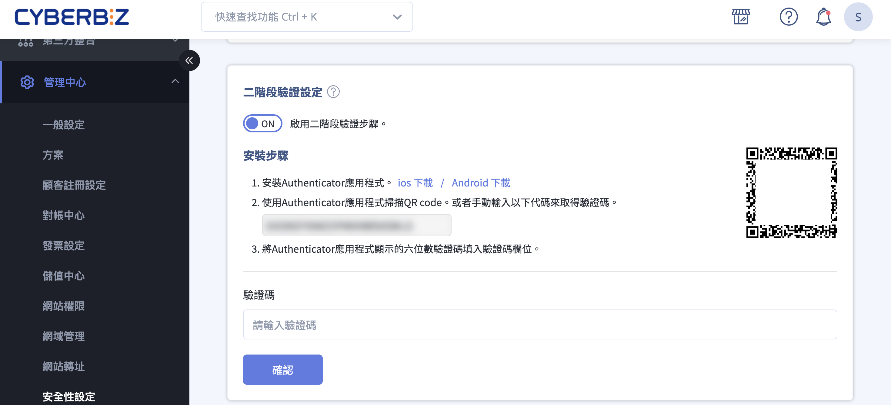
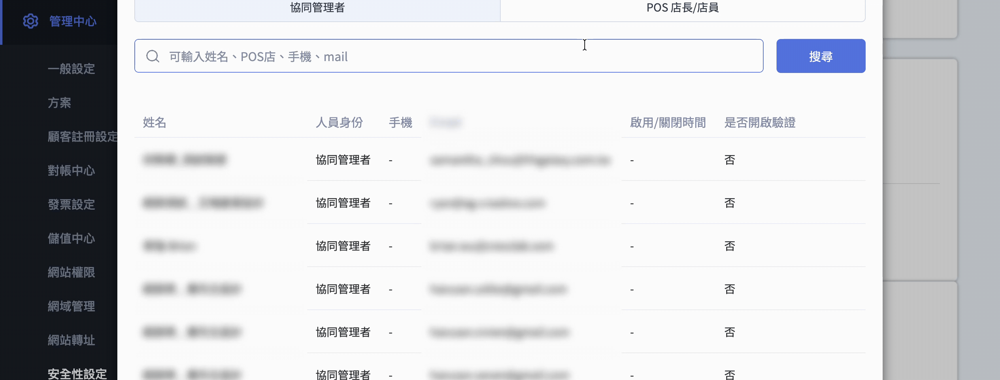
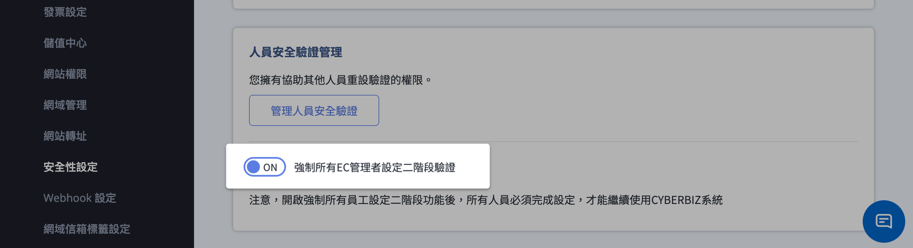
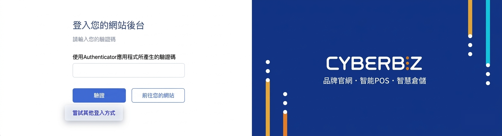

# 設定與管理二階段驗證

啟用與管理二階段驗證（2FA），包含驗證器綁定、備用碼使用，以及員工驗證重設與強制啟用。
{ .subtitle }

{ .hero-page }

## 二階段驗證說明

**二階段驗證（2FA）** 是一項重要的資安功能。啟用後，當您登入後台或 POS 前台時，除了帳號密碼外，還必須輸入由手機驗證器（Authenticator）產生的動態驗證碼，即使密碼遭竊也能為帳戶多添一層保護。

## 預先準備

在開始設定前，請先在手機上安裝驗證器 App。

*   **推薦應用程式**：CYBERBIZ 建議[使用 Authy](使用 Authy 啟用二階段驗證設定.md){ data-preview }，因其具備良好的備份與復原機制。
*   **其他選擇**：亦可使用 [Google Authenticator :lucide-external-link:](https://support.google.com/accounts/topic/2954345?hl=zh-Hant&ref_topic=7667090) 或其他慣用的驗證器 App。

## 如何啟用二階段驗證

1.  **進入路徑**：登入管理後台，前往「**管理中心**」>「**安全性設定**」>「**管理員登入**」。
2.  **開啟功能**：點擊「二階段驗證設定」的開關，開啟安裝步驟。
3.  **掃描綁定**：打開手機的驗證器 App，**掃描畫面上的 QR Code**（或手動輸入金鑰）來新增驗證帳戶。
4.  **輸入驗證碼**：輸入 App 當下顯示的 6 位數動態驗證碼，按下確認。
5.  **下載備用碼（重要）**：系統會產出 **10 組備用碼**，請務必下載並妥善保存。
    *   *注意：備用碼僅會出現這一次，若未來手機遺失無法取得驗證碼時，需[使用備用碼登入](#使用備用碼登入後台){ data-preview }。*

---

## 管理與重設員工驗證

網站擁有者（Owner）具備管理全體員工安全驗證的權限：

*   **查看進度**：可點擊「管理人員安全驗證」按鈕，查看所有管理員是否已開啟驗證及其啟用時間。

    

*   **協助重設**：若員工手機遺失，高權限者可點擊「**重設**」來關閉該員的驗證功能，以便其重新設定。
    *   *權限層級：網站管理員可管理所有人；協同管理者可管理 POS 員工；POS 店長可管理所屬店員。*
*   **強制開啟**：擁有者可開啟「**強制所有員工開啟二階段驗證**」。開啟後，所有相關人員必須完成設定才能繼續使用系統。

    

    !!! warning "強制開啟後的影響"

        - 存取限制： 所有相關人員（包含協同管理者、POS 員工）必須完成 2FA 綁定後，方可繼續操作系統。
        - 無法自行關閉： 啟用後，一般使用者將無法自行關閉 2FA 功能。
        - 重設權限： 若員工因更換手機等因素需重設驗證，必須聯繫具備較高權限的管理員協助處理。

---

## 使用備用碼登入後台

若您無法取得 Authenticator 驗證碼，可以點擊嘗試其他登入方式，使用預先下載和保存的備用碼登入。

## 二階段驗證的使用情境

除了登入時需要驗證外，執行以下涉及敏感資料的操作時，系統也會要求輸入二階段驗證碼：

- **訂單報表匯出**。 
- **會員資料匯出**。
- **管理員新增協同管理者**。

## 常見問題

??? quote "輸入驗證碼後顯示錯誤，無法登入怎麼辦？"
    這通常與「時間不同步」有關。請依照以下步驟檢查：

    * **檢查手機時區**：請確認手機的「日期與時間」設定為 **自動從網路同步**。驗證碼（TOTP）對時間極為敏感，幾秒鐘的偏差就可能導致失效。
    * **檢查帳號對應**：請確認驗證器 App 內顯示的帳號，確實是該官網後台對應的帳號，避免誤用其他網站的驗證碼。

??? quote "手機遺失或無法使用驗證器時該怎麼辦？"

    * **使用備用碼**：若您手邊留有當初設定時下載的 **10 組備用碼**，可以使用其中一組登入。
    * **聯繫管理員重設**：若無備用碼，請聯繫具備較高權限的管理員（如網站擁有者 Owner），請其在「管理人員安全驗證」中為您點擊「**重設**」以解除綁定。

??? quote "更換新手機時，需要重新設定嗎？"
    是的。建議在更換手機前，先在舊手機還能使用的狀態下，進入後台關閉二階段驗證，換新手機後再重新掃描 QR Code 綁定。  
    * *註：若使用 Authy 且有開啟雲端備份，在新手機登入 Authy 帳號後可直接同步使用。*
