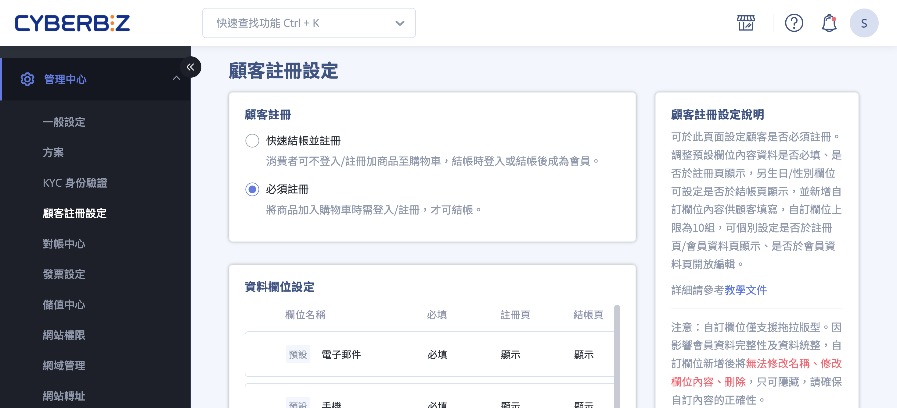
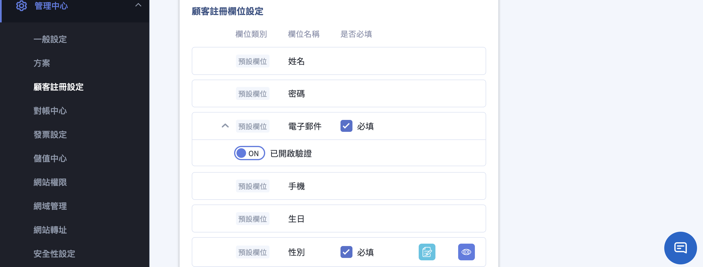
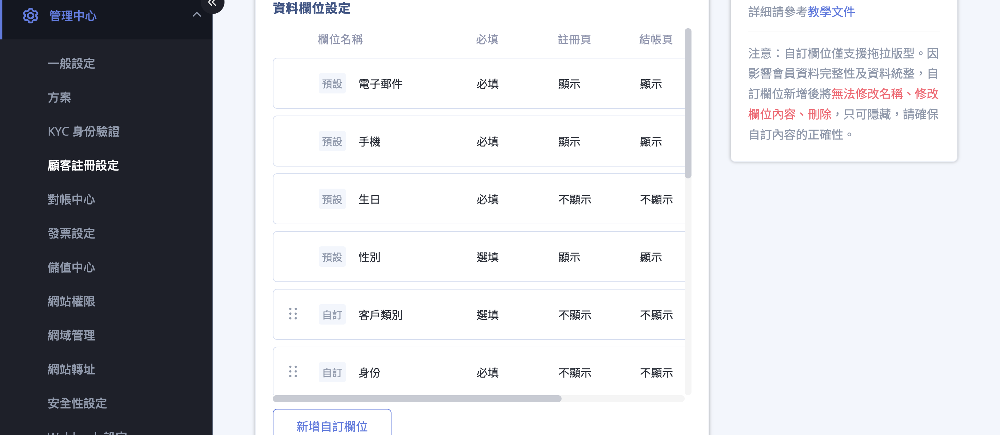
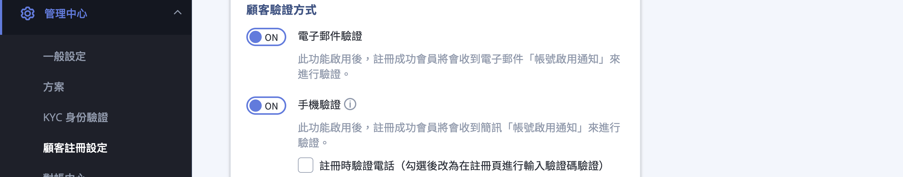
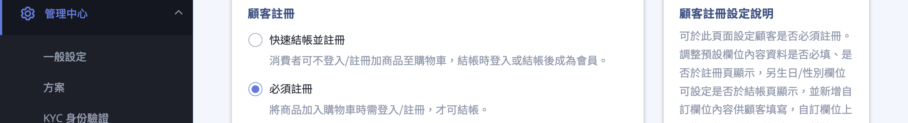

要求新註冊顧客同時通過 Email 與簡訊驗證，確保會員資料真實性，降低空帳號與惡意註冊風險。
{ .subtitle }

{ .hero-page }

## 顧客註冊驗證說明 { #intro-customer-verification }

「顧客驗證方式」設定可決定新顧客在註冊或結帳時，是否需透過 Email 與簡訊完成身份驗證。兩個驗證項目獨立控制，可單獨開啟，也可同時開啟形成雙重驗證：

* **電子郵件驗證**：系統寄送「帳號啟用通知」信件，顧客需點擊信中連結啟用。
* **手機驗證**：系統發送 4 位數簡訊驗證碼，顧客輸入正確才能啟用。

!!! info "提示"
    驗證設定僅對「**新註冊顧客**」生效，既有舊會員不會被強制重新驗證。

## 使用前提與限制 { #prerequisites-customer-verification }

- [x] **欄位需先設定為必填**：若 Email 或手機欄位是「選填」，對應的驗證開關會被鎖定。請先到同頁面的「資料欄位設定」區塊將欄位設為「必填」。
- [x] **手機驗證會產生簡訊費用**：詳見 [計費規則](#pricing-customer-verification)。
- [x] **至少一項欄位必填**：Email 或手機至少一項需設為必填，系統不允許兩者皆為選填。

!!! plan "方案 / 開通條件"
    * **手機驗證(顧客手機驗證)**：多數方案內建，新店家預設開通。
    * **新版欄位設定**：**企業版** 才會顯示新版「資料欄位設定」與「顧客驗證方式」介面。

## 計費規則 { #pricing-customer-verification }

* **電子郵件驗證**：免費。
* **手機驗證**：每次發送簡訊驗證碼會收取 **Cyber幣**，費用依簡訊內容長度計算。
* 簡訊與 Email 樣板內容皆可於 **訊息推播** > **Email / 簡訊通知樣板** > **顧客相關** > **顧客帳號啟用提醒** 自訂。

!!! tip "技巧"
    精簡簡訊樣板的文字長度可有效降低 Cyber幣 消耗，建議僅保留驗證碼與必要說明。

## 操作步驟 { #operate-customer-verification }

### 進入設定頁 { #operate-customer-verification-entry }

進入後台路徑：**管理中心** > **顧客註冊設定**。

整個設定頁由三大區塊組成，以下步驟聚焦於後兩個區塊(資料欄位設定、顧客驗證方式)。

---

### 步驟一：將欄位設定為必填 { #operate-customer-verification-set-required }

1. 在 **「資料欄位設定」** 區塊，找到「電子郵件」與「手機」兩個預設欄位。
2. 將欄位設定為 **「必填」**。
3. 系統會自動儲存。

=== "一般版 / PLUS版"

    在「**顧客註冊欄位設定**」列表中，勾選對應欄位的「**是否必填**」勾選框。

    

    ??? warning "如果「手機」欄位無法勾選必填"
        代表你的店家沒有開通「**顧客手機驗證**」加值功能。此情境下手機欄位只能保持選填，**只能設定 Email 驗證**。請跳過下方與手機相關的步驟，或聯絡客服詢問是否能開通手機驗證加值。

=== "企業版"

    1. 在「**資料欄位設定**」區塊中，點擊欄位列右側的 **編輯圖示**。
    2. 在彈出的「**編輯欄位**」視窗中，將「**必選填設定**」選為「**必填**」。
    3. 點擊「**確認**」儲存。

    

!!! note "註釋"
    若兩個欄位都是「選填」，「顧客驗證方式」區塊上方會顯示提示「電子郵件或手機欄位須設定必填，才能啟用驗證功能。」此時下方驗證開關呈灰色不可點。

---

### 步驟二：開啟驗證開關 { #operate-customer-verification-enable-switch }

[:lucide-tag:{ title="適用方案" }](../../../resources/conventions#適用方案) | 企業
{ doc-badge }

1. 找到 **「顧客驗證方式」** 區塊。
2. 切換對應開關到 **開啟** 狀態：
    * **電子郵件驗證**：啟用後，註冊成功的顧客會收到電子郵件「帳號啟用通知」進行驗證。
    * **手機驗證**：啟用後，註冊成功的顧客會收到簡訊「帳號啟用通知」進行驗證[^1]。
3. (僅手機驗證適用)可勾選 **「註冊時驗證電話」**[^2]。

開關啟用 = 該欄位變為「必填且必須驗證」狀態，參見 [欄位驗證模式對照表](references/顧客欄位驗證模式對照表.md){ title="顧客欄位驗證模式對照表" data-preview }。

[^1]: 開啟手機驗證會同時開啟簡訊樣板的「顧客請求發送驗證碼通知」，發送簡訊會收取 Cyber幣，費用依內容長度計算。
[^2]: 預設情境下，顧客先註冊建立帳號，再到會員頁完成手機驗證。勾選此選項後改為在註冊頁直接輸入驗證碼，通過後才能完成註冊。

---

### 步驟三：確認顧客端體驗 { #operate-customer-verification-frontend }

雙重驗證啟用後，顧客的驗證流程會依「**顧客註冊**」(同一頁面最上方)區塊設定為「快速結帳並註冊」或「必須註冊」而有差異，兩種模式對照詳見 [註冊模式對照表](references/顧客註冊模式對照表.md){ title="顧客註冊模式對照表" data-preview }。

=== "快速結帳並註冊"
    * **未登入顧客**：在 **購物車結帳頁** 進行 Email + 手機驗證，通過後才能送出訂單。
    * **已登入但未完成驗證**：系統會顯示「需先驗證您的帳號才能開始結帳」，並引導至會員頁完成驗證，完成後才能繼續結帳。

=== "必須註冊"
    顧客必須先註冊並完成驗證才能購物。流程如下：

    1. 顧客在註冊頁填寫資料並送出 > 系統建立帳號，狀態為「未啟用」。
    2. 自動跳轉至會員頁面，畫面顯示：
        * 「信箱尚未認證，請收信並啟用帳號」
        * 「手機尚未認證，請收簡訊並啟用帳號」
    3. **執行手機驗證**：
        * 點擊 **「點此發送驗證簡訊」**。
        * 輸入收到的 4 位數簡訊驗證碼，點 **「提交」**。
        * 系統顯示「**恭喜，您已成功驗證您的手機!**」。
    4. **執行 Email 驗證**：
        * 至信箱收取「帳號啟用通知」信件。
        * 點擊信中的「**啟用帳號**」連結。
        * 系統引導回會員頁，該欄位轉為已驗證狀態。
    5. 兩項驗證皆完成後才能購物結帳。若未完成即進入結帳，會被擋下並提示「**需先驗證您的帳號才能開始結帳**」。

    !!! tip "技巧"
        若已勾選「註冊時驗證電話」，顧客會在註冊頁直接輸入手機驗證碼，可省略第 3 步驟在會員頁手機驗證的動作。

## 重要規範與限制 { #specs-customer-verification }

### 既有會員不受影響 { #specs-customer-verification-existing-members }

驗證開關只影響「**新註冊**」的顧客。既有會員無論驗證狀態如何，都不會被強制重新驗證，登入購物流程不受影響。

---

### Excel 匯入會員的特殊處理 { #specs-customer-verification-import }

當「電子郵件驗證」與「手機驗證」皆開啟時，透過 Excel 匯入的新顧客行為：

* **只會寄送 Email 啟用信**，系統不會自動發送簡訊驗證碼。
* 顧客點擊 Email 啟用連結後完成 Email 驗證，但 **手機仍為未驗證狀態**。
* 該顧客首次登入後，需自行至會員頁點擊「點此發送驗證簡訊」完成手機驗證。

!!! info "設計理由"
    避免匯入大量會員時意外觸發大量簡訊費用。

---

### 第三方登入(FB / LINE / Google)的處理 { #specs-customer-verification-sso }

| 登入平台 | Email 驗證 | 手機驗證 |
|:--|:--|:--|
| LINE | 自動視為已驗證 | **自動視為已驗證**(不需 OTP) |
| Facebook | 自動視為已驗證 | 仍需另外驗證 |
| Google | 自動視為已驗證 | 仍需另外驗證 |

LINE 登入因帳號本身已綁定手機，系統會自動跳過 OTP 簡訊驗證流程。Facebook 與 Google 註冊後，系統會引導顧客補填手機並點選「發送驗證簡訊」完成驗證。

## 後續操作 { #next-steps-customer-verification }

- :lucide-mail:{ .lg }  
  [__自訂啟用信內容__](../notifications/設定與管理 Email 通知樣板.md){ title="設定與管理 Email 通知樣板" } ·[__自訂簡訊內容__](../notifications/設定與管理簡訊通知樣板.md){ title="設定與管理簡訊通知樣板" }  
  到「訊息推播 > Email / 簡訊通知樣板 > 顧客相關 > 顧客帳號啟用提醒」編輯。

- :lucide-user-cog:{ .lg }  
  [__管理顧客註冊欄位__](設定顧客註冊流程與欄位.md){ title="設定顧客註冊流程與欄位" }  
  新增自訂欄位、調整必填項目、設定欄位是否顯示於註冊頁與會員頁。

- :lucide-shield-check:{ .lg }  
  [__查看會員驗證狀態__](../members/管理會員檔案.md){ title="管理會員檔案" }  
  在顧客列表查看每位會員的 Email / 手機驗證狀態。

## 常見問題 { #faq-customer-verification }

??? quote "顧客說沒收到驗證簡訊怎麼辦?"
    { #faq-customer-verification-sms-not-received }
    可能原因：

    * 手機門號設定拒收企業簡訊
    * 手機號碼輸入錯誤
    * 該地區簡訊服務未開通(部分海外國碼可能不支援)

    建議顧客確認門號正確後，至會員頁重新點擊「點此發送驗證簡訊」。

??? quote "為什麼開啟手機驗證會被收 Cyber幣?"
    { #faq-customer-verification-cyber-coin }
    手機驗證透過簡訊發送驗證碼，屬於電信費用，每封簡訊依內容長度收取 Cyber幣。建議：

    * 在簡訊樣板中精簡訊息內容，降低費用
    * 若僅需 Email 驗證即可，可只開啟「電子郵件驗證」單項

??? quote "可以只要求新顧客驗證 Email，不驗證手機嗎?"
    { #faq-customer-verification-email-only }
    可以。「電子郵件驗證」與「手機驗證」兩個開關是 **獨立** 的，可任意組合：

    * 僅 Email 驗證(免費，適合不需手機資料的店家)
    * 僅手機驗證(需 Cyber幣)
    * Email + 手機雙重驗證(最嚴格)

??? quote "Excel 匯入大量會員時會發大量簡訊嗎?"
    { #faq-customer-verification-bulk-import-sms }
    不會。系統設計上，Excel 匯入新顧客時即使手機驗證開啟，**只會寄送 Email 啟用信**，不會自動發送簡訊驗證碼。手機驗證會在顧客首次登入後，由顧客自行至會員頁觸發。

??? quote "顧客已用 LINE 登入，還需要再驗證手機嗎?"
    { #faq-customer-verification-line-login }
    不需要。透過 LINE 登入的顧客，系統會自動視其手機為已驗證，跳過 OTP 流程。其他第三方登入(Facebook / Google)註冊後仍需補填手機並驗證。

??? quote "為什麼驗證開關呈灰色按不動?"
    { #faq-customer-verification-disabled-switch }
    驗證開關只能在欄位設定為「必填」時開啟。請先到「資料欄位設定」區塊將 Email 或手機的「必選填設定」改為「必填」，驗證開關才會解鎖。

??? quote "一般版和企業版的設定步驟有什麼不同？"
    { #faq-customer-verification-edition-diff }

    主要差異在於「資料欄位設定」的操作介面：

    - **一般版 / PLUS版**：在「顧客註冊欄位設定」列表中直接勾選「是否必填」勾選框。
    - **企業版**：需點擊欄位的編輯圖示，在彈出視窗中將「必選填設定」改為「必填」後點擊確認。

    兩者最終設定邏輯相同，都需先將 Email 或手機設為必填，才能啟用驗證開關。

??? quote "「註冊時驗證電話」勾不勾有什麼差別？"
    { #faq-customer-verification-verify-at-registration }

    此選項控制顧客在何時完成手機驗證：

    - **未勾選（預設）**：顧客先註冊建立帳號，再到會員頁點擊「點此發送驗證簡訊」完成驗證。
    - **有勾選**：顧客在註冊頁直接輸入簡訊驗證碼，通過後才能完成註冊。

    勾選後可減少顧客的操作步驟，但註冊流程會多一道驗證關卡。

## 參考資料 { #reference-customer-verification }

* [顧客註冊模式對照表](references/顧客註冊模式對照表.md)
* [顧客欄位驗證模式對照表](references/顧客欄位驗證模式對照表.md)

