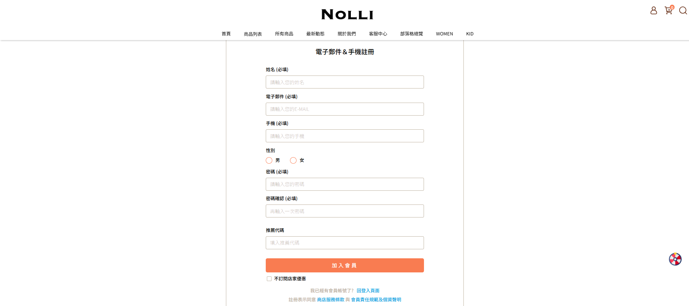
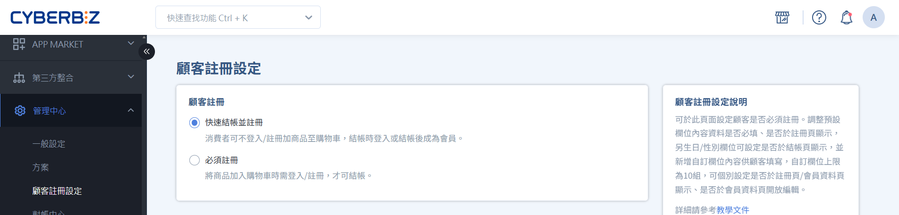
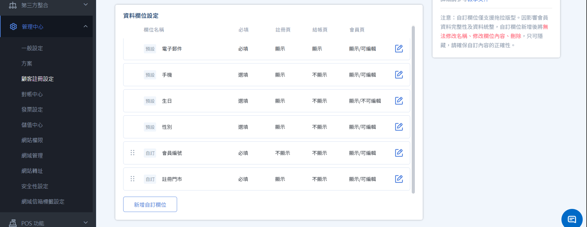
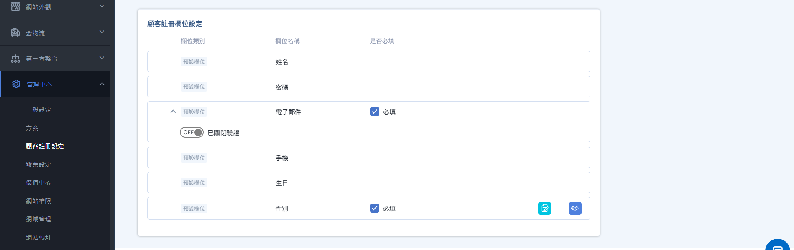
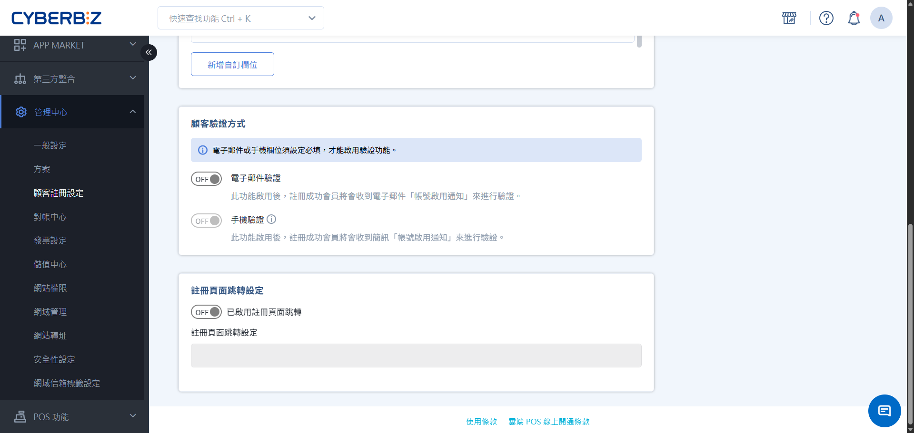
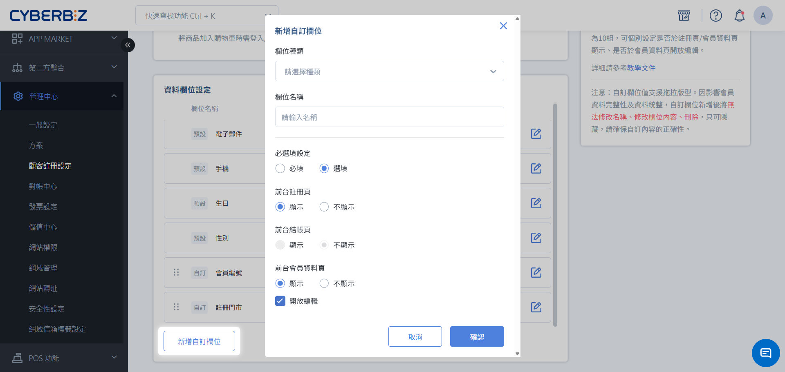
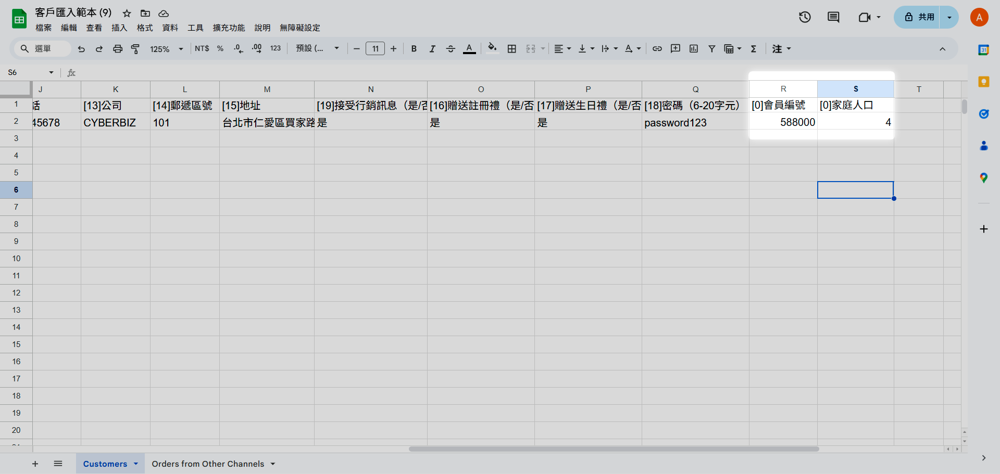

# 設定顧客註冊流程與欄位

良好的註冊流程能大幅提升新客轉換率。您可以依據營運策略決定「必須註冊」或「快速結帳」模式，並透過自訂欄位蒐集更細緻的會員特徵。
{ .subtitle }

{ .hero-page }

!!! tip "應用情境"
    - **優化結帳體驗**：開啟「快速結帳並註冊」，降低消費者首購門檻，縮短購買決策路徑。
    - **完善會員畫像**：針對美容、寵物等特定產業，透過自訂欄位蒐集膚質或寵物類別，進行精準行銷。
    - **強化資安防護**：啟用電子郵件或手機驗證，確保會員資料的真實性，減少幽靈帳號。

## 使用須知

在修改註冊設定前，請留意不同版本的規格差異與限制：

- **欄位必填規範**：系統規定 **電子郵件** 或 **手機** 必須 **至少有一項** 設為必填。

## 步驟 1：選擇顧客註冊結帳模式

根據您的商業模式選擇最適合的結帳流程。

1. 登入後台，前往 **管理中心 > 顧客註冊設定**。
2. 於 **顧客註冊** 區塊選擇模式：
    - **快速結帳並註冊**：顧客可先進入結帳頁，於結帳時登入，或成立訂單時同步完成註冊。
    - **必須註冊**：顧客必須先完成註冊並登入後，方可前往結帳。
3. 點擊 **儲存**。

## 步驟 2：設定預設欄位屬性

依據您的產品版本，可設定的欄位深度有所不同：

=== "企業版"

    企業版提供高度彈性的欄位管理介面：

    - **預設欄位控制**：可個別設定姓名、Email、手機、生日、性別之 **必填/選填** 與 **前台顯示/隱藏**。
    - **屬性進階設定**：可細向設定欄位是否顯示於 **註冊頁**、**結帳頁** 或 **會員資料頁**，並可限制會員註冊後是否允許自行修改。

    !!! warning "系統限制提醒"
        預設欄位部分可設定內容已由系統定義，恕無法另行調整。

    

=== "其餘版本"

    提供基礎的標準化註冊環境：

    - **預設欄位屬性**：支援姓名、電子郵件、手機、生日、性別等基本欄位。
    - **必填**：支援開啟 Email 或 手機帳號欄位必填。

    

## 步驟 3：設定帳號驗證與跳轉

### 1. 開啟顧客驗證

為了提高名單品質，建議開啟驗證機制。

1. 開啟 **電子郵件驗證** 或 **手機驗證**。
    - 若兩者皆開啟，系統預設將優先發送電子郵件驗證信。
2. 若啟用驗證，會員會於註冊時收到 **帳號啟用通知** 電子郵件/簡訊，需開啟並點擊連結以完成驗證。

    > **樣板路徑**：可前往 **訊息推播 > 通知樣板 > 顧客相關** 編輯 **顧客帳號啟用提醒** 樣板內容。

### 2. 註冊完成跳轉

1. 找到 **註冊頁面跳轉設定** 區塊並開啟開關。
2. 輸入欲引導的指定連結。

!!! info "版本適用說明"
    註冊跳轉功能僅限 **高手 PLUS與企業版** 專用。

## 步驟 4： 建立與管理自訂欄位

### 功能限制須知

- **版本適用範圍**：本功能僅支援 **高手 PLUS版 與企業版** 客戶使用。
- **版型與主題限制**：自訂欄位僅適用於 **拖拉版型** 主題。
- **建立數量與編輯限制**：自訂欄位數量 **上限為 10 個**。欄位一旦建立後，恕不開放刪除或編輯內容，如不欲顯示僅能將其設定為 **隱藏**。
- **資安與個資保護**：若透過自訂欄位收集敏感個資（如身分證字號、醫療資訊等），請確保已於官網之 **隱私權政策** 中明確說明收集用途。

### 新增自訂欄位

1. 點擊 **新增自訂欄位** 按鈕。
2. 選擇欄位種類：系統支援以下五種形式。
    - **上傳圖片**：適用於保固卡、證照或收據上傳。
    - **文字輸入框**：供會員自由填寫短文。
    - **勾選方塊**：支援多選操作。
    - **下拉選單**：預設選項供會員單選。
    - **選擇日期**：標準的年/月/日選擇器。
3. 輸入 **欄位名稱** 並點擊 **確認**。

{ .hero-page }

### 批次匯入自訂資料

若需在大量導入會員時一併帶入自訂欄位資訊，請遵循以下規範：

- **支援匯入類型**：文字輸入框、下拉選單、選擇日期。
- **不支援匯入類型**：上傳圖片、勾選方塊。

編輯 Excel 範本步驟：

1. 在會員匯入範本中，手動新增一欄標題，格式為 `[0]自訂欄位名稱`（例如：`[0]會員編號`）。
2. 請依欄位種類，填寫對應資訊。
  - 日期格式：務必填寫為 YYYY/MM/DD。
  - 下拉選單：填寫內容必須與後台設定的選項文字完全一致。
3. 下載會員範本與上傳檔案方式可參考 [大量匯入新會員]()。

!!! warning "批次操作限制"
    系統僅支援在 **新增會員** 匯入時同步寫入自訂欄位，目前 **不支援** 針對既有會員進行自訂欄位的批次覆蓋或修改。

## 延伸閱讀

- :lucide-user-plus:{ .lg }   
  [__大量匯入新會員__](../members/匯入與批次編輯會員/#任務一大量匯入新會員)       
  了解如何下載 Excel 範本並批次上傳會員名單。

- :lucide-mail:{ .lg }     
  [__設定 Email 通知樣板__](../../notifications/Email通知樣版)  
  自訂「帳號啟用通知信」，優化會員註冊後的首封溝通。

