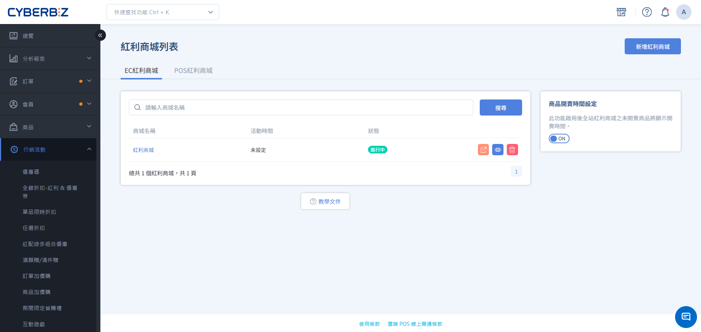
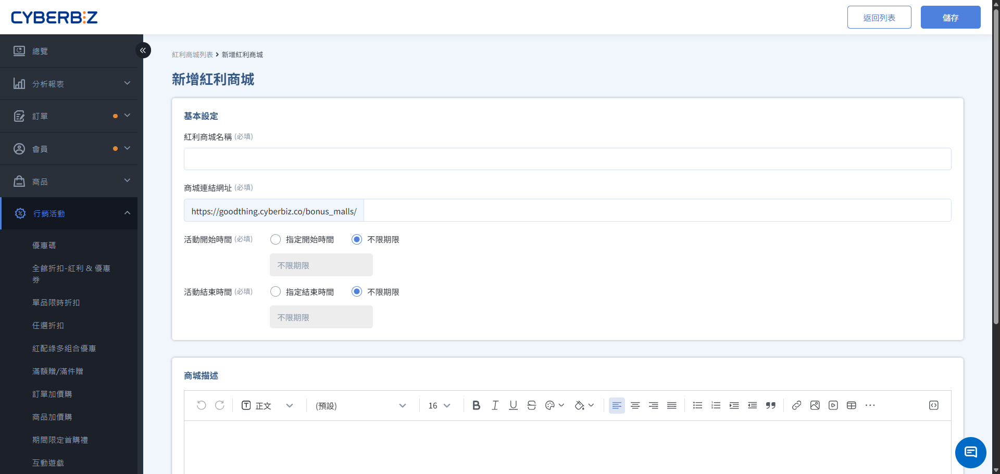
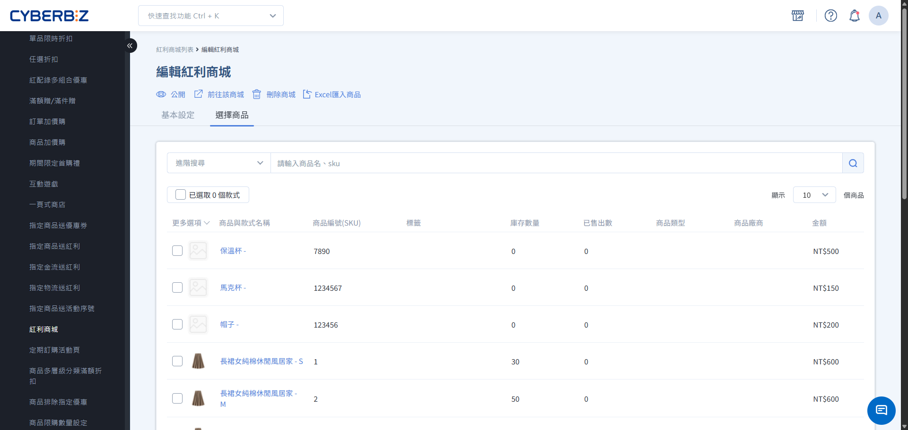
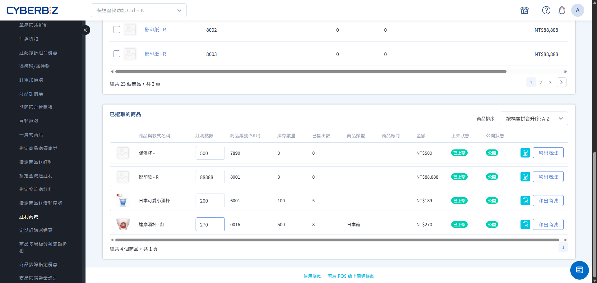

#  Bonus Mall (EC)

Establish a dedicated online bonus redemption mall, setting the points required for product redemption, and improving member return visits and brand loyalty through a bonus accumulation mechanism.
{ .subtitle }

[:lucide-tag:{ title="適用方案" }](../../../resources/conventions#適用方案) | All PLUS / Enterprise
{ .doc-badge }

!!! info " Version Differences "
    -  Both **E-commerce Website (EC)** and **Physical Store (POS)** support the Bonus Mall function. This document only applies to the setup method of the **E-commerce Website (EC) Bonus Mall. The
    -  Bonus Mall is an optional module in the "Marketing A" package (choose 2 out of 11) in the PLUS plan. Merchants must confirm that they have selected this module to use it. The Enterprise version has this function built-in.

{ .hero-page }

## Bonus Mall Description
The
"Bonus Mall" provides a separate space for product display and redemption, allowing members to convert their accumulated bonus points into tangible goods. This "redemption-only" or "points-only purchase" mechanism effectively activates the points balance in members' accounts and builds long-term brand loyalty. The same product is purchased with cash in regular stores, but redeemed with points in the Bonus Mall; both share inventory. Application Scenarios: **Member Rewards Program**: Offers high-value products exclusively for bonus redemption, incentivizing members to continue accumulating points. **Point Consumption Strategy**: Launches limited-time Bonus Mall events for points nearing expiration, driving members to redeem them.
    - **New Product Trial**: Place trial products in the Bonus Mall, allowing loyal members to use points to experience them first and collect product feedback.

## Instructions for Use
-  **Front-end Display**: Products must be in the "Listed" and "Public" state to be displayed in the Bonus Mall.
-  **Multi-Style Product Display Restriction**: If a product added to the Bonus Mall has multiple styles (e.g., different colors, sizes), only the "first main image" of that product will be displayed on the front end, and consumers cannot switch to view corresponding images of other styles on the mall page. Merchants are advised to choose a single style or ensure the main image is representative.
-  **Appearance Color Scheme**: The Bonus Mall page does not support color swatches.
-  **Order Returns**: The system will automatically return bonus points.

     Applicable to the following scenarios:

    -  Returns of pure bonus product orders.
    -  Mixed orders of general and bonus products (applicable to both full and partial returns).

## Operating procedures

### Step 1: Establish basic information for the bonus mall

1. Log in to the CYBERBIZ management backend and go to **Marketing Activities > Bonus Mall**.
2. Click **New Bonus Mall** in the upper right corner.
3. Fill in the following fields:
    - **Bonus Mall Name**: The mall title displayed in the backend and on the frontend.
    - **Bonus Mall Link**: Customize the URL path (e.g., `vip-rewards`).
    - **Activity Start/End Time**: Select and set the effective period.
4. **Bonus Mall Description**: Use the editor to write the mall rules or copy; this content will be displayed above the product list.
  > Upload Size Limit: The total space of images (styles and descriptions) uploaded within a single mall cannot exceed **10MB**.
5. **SEO Setting**: Flexible settings as needed.
6. Click **Save**.

### Step 2: Add redeemable items

=== " Manually select to add "

    1. In the mall editing page, switch to the **Select Products** tab.
    2. Search for the products you want to add by name, SKU, or product tag.
    3. Click the **Not Added to Store** button on the right side of the product (the text will change to "Added" after adding).
    4. If you need to add multiple products at once, check the checkbox on the left and then click **Add to Store**.

        
    
    5. On the **Select Products** tab, scroll to the **Selected Products** section below.
    6. In the **Bonus** field, enter the number of points required to redeem the product (the system will default to including the original price of the product).
    7. Press **Enter** or click on a blank area to automatically save the settings.

        

=== " EXCEL Batch Import "

    1. To add a large number of products, edit or remove batches, click the **Import Products By Excel** option in the upper right corner menu:

        
        
    2. Select the operation and fill in the product **SKU** and corresponding **bonus redemption amount** according to the format.
        - File format is limited to **.xlsx**.
        - The size of a single file must not exceed **2MB**.
        - has a maximum upload limit of **200 lines** (please upload in batches if exceeding this limit).
    3. will run in the background and will send an email notification upon completion.

### Step 3: Test and launch the online store

1. Confirm all product and point settings are correct.
2. Click the **Not Public** button in the upper right corner of the page to switch to **Published** status.
3. Click **Go To This Mall** in the drop-down menu to view the actual display on the new page.

## Front desk redemption process

understands the consumer's browsing, selection, and checkout path in the Bonus Mall to ensure marketing campaigns meet expectations.

### 1.  Login and Balance Check
After entering the Bonus Mall page, consumers must log in to their member account.

- **Bonus Information Display**: The page will display the member's total bonus points and used points.
- **Automatic Login Redirection:** If a consumer attempts to add an item to their cart without being logged in, the system will redirect them to the login page. Upon successful login, they will automatically be redirected back to the Bonus Mall page.

### 2.  Product Browsing and Selection
-  **Bonus Price**: Only the "Points Required for Redemption" is displayed for items in the store; the original price is not shown.

    { .screenshot }

-  **Source Tracking**: If a consumer selects items from multiple bonus store groups simultaneously, the shopping cart will record the group name to which the item belongs and provide a link to return to that group's page.

    { .screenshot }

### 3.  Checkout and Points Deduction
-  **Insufficient Bonus Points Warning**: If the total points required for items in the shopping cart exceed your member balance, the checkout button will be unclickable, and the message "Your bonus points are insufficient" will be displayed.

    { .screenshot }

-  **Points Deduction Priority**: When the shopping cart contains both bonus items and regular items, the system will deduct the points required for bonus items first. Any remaining points can then be used to offset the cost of regular items.

    { .screenshot }

-  **Full Amount Offset**: Bonus Mall items can only be redeemed using bonus points at full amount; cash payments cannot be combined with the redemption.

## Advanced Management

### Will bonus points be refunded if an order is cancelled?
> Merchants can decide whether to automatically refund points after order cancellation: Go to **Jin Logistics Checkout & Logistics Settings > Order Settings**. Find **Order Cancellation and Return Bonus Settings** and enable or disable them according to operational needs.### Countdown to product launch
> In **Marketing Activities Bonus Mall**, you can enable **Product Launch Time Setting**. Once enabled, if a product has a future start time set, a countdown timer will automatically appear on the front end.

!!! info " Product Launch Time Countdown Function Applicable Versions "
     This function is only available for the Enterprise Edition.

{ .screenshot }

-  **Product launch time setting**: Requires a **drag-and-drop layout**.
-  **Applicable Scope**: All products in the Bonus Mall that are **not yet listed**. The countdown display will be applied to both public and private products.
-  **Color Setting**: The background color of the countdown time will use the **emphasis color** set in the drag-and-drop layout.

    >  Setting Path: Website Appearance > Theme Management > Website Settings > Color Settings

-  **Display Location**:

    -  **Product List Page of Bonus Mall**

          { .screenshot }

    -  **Product Pop-up Page of Bonus Mall**

          { .screenshot }

## Multilingual settings

sets the multilingual names for the Bonus Mall, allowing the front-end to display the correct text based on the language.

!!! warning " Notes "
	-  To change the language to English, you must first **switch to English** before making the changes.
	-  The field must display a **language label** for the front-end to switch text accordingly. For example: **Group Name** Bonus Mall `繁體中文`.
	-  If other language fields are not filled in, the front-end will automatically use **Traditional Chinese** as the default display when displaying that language.

### Operating steps

1. Log in to the CYBERBIZ management backend and go to **Marketing Activities > Bonus Mall**.
2. In the language selection menu, switch to the desired language (e.g., Traditional Chinese, English).
3. Expand the add-to-cart group you want to edit, then click the group name field to modify it. Press Enter to save the changes.

## Frequently Asked Questions
Why is there a 404 error on the front-end store page? Please check: 1. Is the store status changed to "Public"? 2. Is the current date within the set "Activity Time" range? 3. Is the store URL correct? Please check: 1. Is the store status changed to "Public"? 2. Is the current date within the set "Activity Time" range? 3. Is the store URL correct? Please check: 1. Is the product added to the store but not showing up on the front end? Please check: Is the product itself set to "Listed" and "Public" in **Product Management**? If a product is removed from the store, the bonus store will automatically hide it. Please check: What happens if bonus points are set to 0 or left blank? If the points are 0 or blank, consumers will not be able to click the redemption button on the front end. Please ensure that all items have the correct positive integer points entered. "
    ## More operations

- :lucide-hash:{ .lg }
    [__POS Bonus Mall__](../../../pos/check/bonus-point-mall.en.md)
     This document describes how to create a dedicated bonus mall for POS stores and understand the front-end checkout process.

