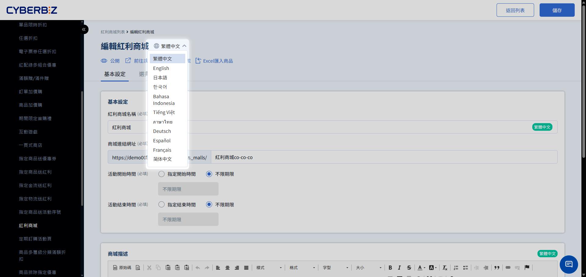

# Bonus Mall (EC)

Create a dedicated online points-redemption mall. Set the points required to redeem products. Use the points program to increase member return visits and brand loyalty.
{ .subtitle }

[:lucide-tag:{ title="適用方案" }](../../../resources/conventions#適用方案) | All PLUS / Enterprise
{ .doc-badge }

!!! info "Version differences"
    - Both **online store (EC)** and **physical store (POS)** support the Bonus Mall feature. This document covers setup for the **online store (EC)** Bonus Mall only.
    - Bonus Mall is an optional Marketing A module in PLUS plans (choose 2 of 11). Confirm you have selected this module before use. Enterprise includes this feature by default.

{ .hero-page }

## Bonus Mall overview

"Bonus Mall" provides a dedicated product display and redemption space. Members can convert Bonus earned from everyday purchases into physical products. This redeem-only or points-only purchase model activates unused points balances and builds long-term brand loyalty.

The same product stays available for cash purchase in the regular store and for points redemption in Bonus Mall. Both share the same inventory.

!!! tip "Use cases"
    - **Member rewards program**: Offer high-value products redeemable with points only, so members keep spending to earn points.
    - **Points burn strategy**: Run a limited-time Bonus Mall campaign for points that are about to expire, to drive members to the site to redeem.
    - **New product trials**: Put samples in Bonus Mall so loyal members can try them first with points and you can collect product feedback.

## Notes 
- **Storefront Display**: A product must be in "Listed" and "Published" Status to Display in the Bonus Mall.
- **Multi-variant product Display limit**: If a product added to Bonus Mall has multiple variants (such as color or size), the storefront can only Display the product's "first main image". Shoppers cannot switch variant images on the mall page. Use a single variant or make sure the main image is representative.
- **Appearance colors**: The Bonus Mall page does not support color swatches.
- **Order returns**: The system automatically refunds Bonus.

    Applies to the following cases:

    - Returns of bonus-product-only orders.
    - Mixed orders with regular products and bonus products (full and partial returns).

## Setup

### Step 1: Create Bonus Mall basic info

1. Log in to the CYBERBIZ admin, then go to **Marketing Bonus Mall**.
2. Click **New Bonus Mall** in the top-right corner.
3. Fill in the following fields:
    - **Bonus Mall Name**: The mall title for the admin and the storefront Display.
    - **Bonus Mall Link**: Custom URL path (example: `vip-rewards`).
    - **Campaign start/end time**: Select the checkbox and set the active period.
4. **Bonus Mall Description**: Use the editor to write mall rules or copy. This content will Display above the product list.
  > Upload size limit: Total uploaded Image space (styles and descriptions) in one mall cannot exceed **10MB**.
5. **SEO Setting**: Set as needed.
6. Click **Save**.

### Step 2: Add redemption products

=== "Add by checkbox"

    1. On the mall edit page, switch to the **Select Products** tab.
    2. Use the name, SKU, or product Tags to Search the products to add.
    3. Click **Not in mall** on the right of the product. After you add it, the label changes to Added.
    4. To add multiple products at once, select the checkboxes on the left, then click **Add to mall**.

        

    5. On the **Select Products** tab, scroll down to the **Selected Products** section.
    6. In the **Bonus** field, enter the points required to redeem the product. The system prefills the product list price.
    7. Press **Enter** or click a blank area. The system automatically Save the settings.

        

=== "Excel batch import"

    1. To add, edit, or remove many products, click **Import Products By Excel** in the top-right menu:

        

    2. Select the action, then enter each product **SKU** and the matching **bonus redemption Price**.
        - File format must be **.xlsx**.
        - Each file must be **2MB** or smaller.
        - Each upload is limited to **200 rows**. Split the file if you have more.
    3. The system runs in the background and emails you when it finishes.

### Step 3: Test the mall and set it to Published

1. Confirm all products and points settings are correct.
2. Click **Not Published** in the top-right corner to switch to **Published** Status.
3. Click **Go To This Mall** in the dropdown to preview the live Display in a new tab.

## Storefront redemption flow

See how shoppers browse, pick, and check out in Bonus Mall so the campaign works as intended.

### 1. Log in and view balance
After a shopper opens the Bonus Mall page, they must log in to their member account.

- **Bonus info Display**: The page will Display the member's current bonus points total and points already used.
- **Auto login prompt**: If a shopper tries to "Add to cart" in a logged-out Status, the system sends them to the login page. After they log in, they return to the Bonus Mall page.

{ .screenshot }

### 2. Browse and pick products
- **Bonus price**: Mall products only Display "points required to redeem". They do not Display the product list price.

    { .screenshot }

- **Source tracking**: If a shopper picks products from more than one Bonus Mall group, the cart records the group name and provides a Link back to that group page.

    { .screenshot }

### 3. Checkout and deduct points
- **Insufficient bonus warning**: If the cart's total points exceed the member balance, the checkout button is disabled and shows "Your Bonus is insufficient".

    { .screenshot }

- **Points deduction order**: When the cart has both bonus products and regular products, the system deducts points for bonus products first. Remaining points can then offset regular products.

    { .screenshot }

- **Full redemption**: Bonus Mall products can only use Bonus for "full redemption". Shoppers cannot pay the remainder in cash at checkout.

## Advanced management

### Refund Bonus when an order is canceled
You can choose whether canceled bonus orders automatically refund points:

1. Go to **Payments & logistics Checkout & shipping settings > Order settings**.
2.  Find **Bonus settings for canceled and returned orders**, then turn it on or off for your operations.

### Product launch countdown
> In **Marketing Bonus Mall**, turn on **Product launch time setting**. After you turn it on, if a product has a future start time, the storefront automatically Display a countdown timer.

!!! info "Plans that include product launch countdown"
    This feature is Enterprise only.

{ .screenshot }

- **Prerequisite**: Requires the **drag-and-drop theme**.
- **Scope**: All **not yet listed** products in Bonus Mall. Published and unpublished Status products both use the countdown Display.
- **Color**: The countdown background uses the **accent color** from the drag-and-drop theme.

    > Path: Website appearance > Theme management > Site settings > Color settings

- **Display location**:

    - Bonus Mall **product list page**

        { .screenshot }

    - Bonus Mall **product pop-up page**

        { .screenshot }

## Multilingual settings

Set multilingual names for Bonus Mall so the storefront can Display the correct text by language.

!!! warning "Notes"
	- To edit English copy, **switch to English** first, then make the changes.
	- The field must Display a **language Tags** before the storefront Display can switch text by language. Example: **Group name** Bonus Mall `繁體中文`.
	- If other language fields are empty, when the storefront Display that language, it uses **繁體中文** as the default Display.

### Steps

1. Log in to the CYBERBIZ admin, then go to **Marketing Bonus Mall**
2. In the language menu, switch to the language you want to edit (for example: Traditional Chinese, English).
3. Expand the add-on group you want to edit, click the group name field, then press ++enter++ to Save the change.

## FAQ

??? quote "Why does the storefront mall page show a 404 error?"
    Check: 1. Whether mall Status is switched to "Published". 2. Whether the current date is inside the set "Period". 3. Whether the mall URL Link is wrong.

??? quote "The product is in the mall but missing on the storefront?"
    Confirm the product is set to listed and "Published" in **Products**. If the product is unlisted, Bonus Mall hides it automatically.

??? quote "What happens if Bonus is set to 0 or left blank?"
    If points are 0 or blank, shoppers cannot click the redeem button on the storefront. Enter a positive integer for every product.

## More actions

- :lucide-hash:{ .lg }
    [__POS Bonus Mall__](../../../pos/check/bonus-point-mall.en.md)
    Create a dedicated Bonus Mall for POS stores, and learn the storefront checkout flow.

