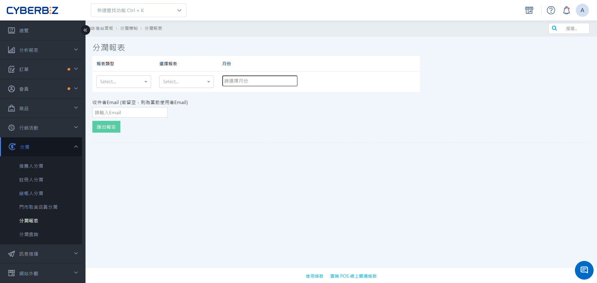

#  Export Profit Sharing Report

allows you to accurately calculate the performance and profit sharing amount for various promotional targets. The system provides a formal report "after project closure" and a real-time order overview "before project closure".
{ .subtitle }

[:lucide-layers:{ title="適用產品" }](../../resources/conventions#適用產品) | Brand Official Website / Smart POS
[:lucide-tag:{ title="適用方案" }](../../resources/conventions#適用方案) | Advanced / Expert / All PLUS / Enterprise
{ .doc-badge }

!!! tip " Application Scenarios "
	-  **Monthly Reconciliation and Settlement**: At the beginning of each month, a summary of the **closed cases** from the previous month is remitted for bonus distribution.
	-  **Third-Party Performance Tracking**: Provides a dedicated link to influencers or group leaders, allowing them to instantly view promotional order details.
	- **Real-time Performance Monitoring**: Before order completion, use order reports to anticipate potential profit-sharing expenses.

## Instructions For Use
**Permission Differences:** **Website Owner:** Can query profit-sharing data for all users on the site. **Collaborative Manager (Employee):** Can only query their own profit-sharing performance. **

**## Operating Procedures

### Task 1: Export The Official Profit Sharing Report

is applicable to the settlement of all profit-sharing schemes, including "referral, registration, checkout, and pickup".

1.  Log in to the CYBERBIZ management backend and go to **Profit Sharing > Referral Reports**.
2.  Select the desired report type from the **Report Type** dropdown menu.
3.  Select the specific report name:
    -  **Referral Profit Sharing**: You can choose **Referral Profit Sharing Summary Report** or **Individual Referral Profit Sharing Report**.
    -  **Registration Profit Sharing**: You can choose **Registration Profit Sharing Summary Report** or **Employee Registration Profit Sharing Report**.

    !!! note " Report Content Analysis "
        -  **Profit Sharing Summary Report**: Presents the total referral profit sharing amount for each of **all partners** within a specific month. Suitable for monthly financial settlement and large-scale data verification.
        -  **Individual Referral Profit Sharing Report/Employee Registration Profit Sharing Report**: Presents a list of all referral order details and profit sharing amounts for a **single partner** within a specific month. Suitable for providing partners with details of their earnings for each order.

    -  **Settlement Person/Pickup Profit Sharing**: Directly select the corresponding summary report or individual report.

4.  Select the **month** to be remitted.
5.  Set the **recipient's Email** and select **Remit Report**. The

    >  system will process the background and send a download link to your email address.

!!! note " Settlement and Output Specifications "
    -  **Settlement Criteria**: Formal profit-sharing reports only include **closed** orders. If an order is placed at the end of December but closed in January, the data will appear in the January report.
    -  **Data Scope**: Reports are exported in **single month** units and cannot be exported across months.

{ .screenshot }

### Task 2: Export Real-time Profit Sharing Information
To preview the **Referrer Revenue Sharing** status before order closure, you can use the order report function. Go to **Orders > Order Data Export**. In the **Available Report Fields**, check the following revenue sharing related fields: **Use Referrer Revenue Sharing**, **Revenue Sharing Name**, **Revenue Sharing Percentage**, **Revenue Sharing Amount**, **Referrer Code**, and filter the order status you want to query. After setting the time range and email, click **Export**.## Frequently Asked Questions

??? quote " The referrer reports that a certain order cannot be found. What should be done? "
    1.  Confirm whether the customer actually entered the referral code or clicked the referral link when placing the order.
    2.  Check whether the order was placed within the **effective period** of the plan.
    3.  If it is a third-party query link, please confirm whether the order has appeared in the **revenue sharing query** in the backend.

